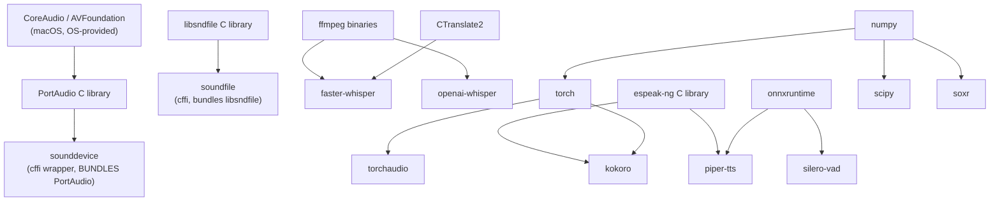

# Environment

**What you'll be able to do after this:** provision the bench in one command and verify it
with a script rather than hope; explain the dependency graph behind every audio package well
enough to debug an install failure; know the real reason this curriculum pins Python 3.12
(it is not the one usually given); and recognise the ten first-run errors from their messages.

---

## 1. Intuition

Audio environments break differently from ordinary Python environments, for one reason:
**most audio packages are thin wrappers over C libraries, and the failure surfaces at import
time or at device-open time rather than at install time.** `pip install` succeeds, then
`import` fails, or `import` succeeds and opening the microphone fails, or the microphone
opens and returns silence because the OS denied permission without telling anyone.

So the strategy is not "install carefully". It is **verify explicitly**. §3 is a doctor
script that checks every contract this curriculum depends on and prints pass, warn or fail
with a reason. Measured on the reference machine: 18 checks, 15 pass, 3 warn, 0 fail — and
the three warnings are exactly the things that would have failed silently three chapters
later.

Two findings from building it are worth stating up front, because both contradict standard
setup advice.

**You do not need to `brew install portaudio`.** `sounddevice` 0.5.6 ships PortAudio in the
wheel — verified: `PortAudio V19.7.0-devel`. Every guide that tells you to install it
separately is describing an older world.

**The reason to pin Python 3.12 is `audioop`, not kokoro.** The usual explanation is that
`kokoro` 0.9.4 declares `Requires-Python: <3.13,>=3.10`. It does — and `uv run --with kokoro`
installs and imports it on Python 3.13.13 anyway, so the declared bound does not protect you.
What *does* break is `audioop`, removed in 3.13 under PEP 594, which is the stdlib µ-law codec
every telephony example reaches for.

---

## 2. Rigour

### 2.1 The toolchain, and why uv

`uv` replaces `pip`, `virtualenv`, `pyenv` and `pipx` with one binary, and for this
curriculum three of its properties matter more than speed.

**Ephemeral environments.** `uv run --python 3.12 --with numpy --with torch script.py`
creates a throwaway environment, runs the script, and leaves nothing behind. Every listing in
this curriculum is standalone, so this is the natural way to run them — no project, no
activation, no drift between chapters.

**Interpreter management.** `--python 3.12` downloads and uses a 3.12 interpreter regardless
of what the system has. This matters here because **the system Python on the reference machine
is 3.9.6**, which is below every relevant floor, and you must never fight the system Python
on macOS.

**Lockable when you want it.** A `pyproject.toml` plus `uv.lock` reproduces exactly; the
ephemeral mode does not. Use ephemeral for chapters, locked for anything you keep.

| Tool | Verdict for this curriculum |
|---|---|
| **uv** | Yes. Ephemeral runs, interpreter management, fast enough that reinstalling is free |
| `venv` + `pip` | Works. You will manage interpreters yourself and wait longer |
| `conda` / `mamba` | **Avoid.** See §2.2 |
| `poetry` / `pdm` | Fine for a project, awkward for one-file listings |
| Docker | Right for deployment, wrong for the audio device on macOS |

### 2.2 Why not conda

Conda is genuinely good at shipping compiled scientific stacks, and it is the wrong choice
here for reasons specific to audio on Apple Silicon.

- **Two package universes, one process.** Conda ships its own `libsndfile`, `ffmpeg`,
  `portaudio` and BLAS. Mix in a wheel from PyPI that bundles its own copy and you get two
  versions of the same C library in one address space. The symptom is a crash or silence, not
  an error message.
- **Apple Silicon wheels are now excellent on PyPI.** The historical argument for conda —
  prebuilt native extensions — has largely evaporated for `numpy`, `torch`, `scipy` and
  friends.
- **The device layer is the OS's, not the package manager's.** Conda cannot help with
  CoreAudio, TCC permissions, or a Bluetooth headset forcing a sample rate.
- **`uv` is faster by a margin that changes behaviour.** When creating an environment takes
  300 ms you throw them away freely, which is what makes standalone listings practical.

If you already live in conda, install `uv` inside it and use `uv run` for the listings.

### 2.3 The dependency graph behind audio packages

Every install failure in this space is a node in this graph. Knowing it turns a wall of
compiler output into a diagnosis.



Four properties of that graph decide your debugging:

| Package | Native dependency | Bundled in the wheel? | Failure mode if missing |
|---|---|---|---|
| `sounddevice` | PortAudio | **yes** (verified V19.7.0-devel) | n/a — this is why brew is unnecessary |
| `soundfile` | libsndfile | **yes** on macOS wheels | `OSError` at import |
| `faster-whisper` | CTranslate2 (wheel), ffmpeg (runtime) | CT2 yes, ffmpeg **no** | works on WAV, fails on mp3/m4a |
| `piper-tts`, `kokoro` | espeak-ng | **no** | import or synthesis fails on G2P |
| `silero-vad` | onnxruntime *or* torch | wheel | none |
| `torchaudio` | must match `torch` exactly | n/a | `undefined symbol` at import |

The two rules that follow. **`ffmpeg` and `espeak-ng` are system binaries and must come from
the OS package manager** — no wheel provides them. And **`torch` and `torchaudio` versions
are joined at the hip**: 2.13.0 with 2.11.0 here. Upgrading one alone produces an
`undefined symbol` error that looks like a compiler problem and is a version-mismatch problem.

### 2.4 The verified reference environment

`[MEASURED]` from §3 on the reference machine:

| Component | Version |
|---|---|
| macOS | 26.5.2 (build 25F84), Darwin 26.5.2 |
| CPU / arch | Apple M5, `arm64`, 10 cores (4 performance + 6 efficiency) |
| Memory | 16 GiB |
| `uv` | 0.11.19 |
| System Python | **3.9.6** — never use it |
| Curriculum Python | 3.12.13 |
| `numpy` | 2.5.2 |
| `torch` / `torchaudio` | 2.13.0 / 2.11.0 |
| `scipy` | 1.18.1 |
| `soxr` | 1.1.0 |
| PortAudio (via `sounddevice` 0.5.6) | V19.7.0-devel |
| Accelerator | MPS available, **no CUDA** |

Current versions of the audio packages, checked on PyPI 2026-08-26: `sounddevice` 0.5.6
(`>=3.7`), `soundfile` 0.14.0 (`>=3.10`), `faster-whisper` 1.2.1 (`>=3.9`), `silero-vad`
6.2.1 (`>=3.8`), `kokoro` 0.9.4 (`<3.13,>=3.10`), `piper-tts` 1.7.0 (`>=3.9`),
`openai-whisper` 20250625 (`>=3.8`), `librosa` 1.0.0 (`>=3.12`), `webrtcvad` 2.0.10.

### 2.5 Why 3.12, precisely

Three constraints, in decreasing order of how binding they actually are.

**`audioop` is removed in Python 3.13** (PEP 594). `[MEASURED]`: on 3.12 it imports with
`DeprecationWarning: 'audioop' is deprecated and slated for removal in Python 3.13`; on 3.13
it raises `ModuleNotFoundError`. This is the stdlib's µ-law/A-law codec, which every
telephony-edge example uses — so on 3.13 you must vendor a pure-Python companding
implementation. That is not hard, and it *is* a real cost.

**`kokoro` declares `<3.13`** — and the bound is not enforced where you would expect.
`[MEASURED]`: `uv run --python 3.13 --with kokoro==0.9.4` installs and imports successfully on
3.13.13, with the installed distribution reporting `Requires-Python: <3.13,>=3.10`. So the
declared gate will not stop you; you are simply outside the supported matrix, and anything
that breaks is yours to fix.

**Lower bound 3.10** comes from `kokoro` and `livekit-agents` (`>=3.10,<3.15`).

The floor is therefore 3.10 and the practical ceiling is 3.12. Pin it explicitly in your
project rather than relying on a resolver to enforce a declared bound.

### 2.6 macOS microphone permission (TCC)

macOS gates microphone access through TCC — Transparency, Consent and Control — and the
failure mode is the worst kind: **you get frames, and they are silent.** No exception, no
warning.

The mechanism that surprises people: **permission is granted to the binary that owns the
process, not to your script.** So the prompt names *Terminal*, *iTerm*, or your IDE, and the
grant applies to every script that binary ever runs. Consequences:

- Running the same script from Terminal and from an IDE can behave differently, because they
  are separate TCC subjects.
- A `uv`-managed interpreter inherits the parent terminal's grant; it does not need its own.
- Denying once is sticky. The prompt does not come back on its own.
- Reset with `tccutil reset Microphone` (all subjects) or
  `tccutil reset Microphone com.googlecode.iterm2` for one, then trigger a capture to get a
  fresh prompt.
- Over SSH there is no session to prompt in, so capture fails until granted locally.

**The diagnostic that separates permission from every other cause:** capture two seconds and
compute RMS. Exact digital zero across every sample is TCC, not a broken microphone — real
hardware always returns some noise floor.

### 2.7 The ten first-run errors

| # | Symptom | Cause | Fix |
|---|---|---|---|
| 1 | `SyntaxError` on modern syntax, or "requires Python >= 3.10" | You are on system Python 3.9.6 | Always `uv run --python 3.12` |
| 2 | Frames arrive, RMS is exactly 0.0 | TCC microphone denial (§2.6) | `tccutil reset Microphone`, re-run locally, accept the prompt |
| 3 | `PortAudioError: Invalid sample rate` | Device cannot do 16 kHz — often Bluetooth | Open at the device's native rate and resample, or switch device |
| 4 | `ModuleNotFoundError: No module named 'audioop'` | Python 3.13 removed it (PEP 594) | Use 3.12, or vendor a pure-Python µ-law codec |
| 5 | `undefined symbol` importing `torchaudio` | `torch`/`torchaudio` version mismatch | Install both together; 2.13.0 with 2.11.0 |
| 6 | `FileNotFoundError: [Errno 2] 'ffmpeg'` on an mp3/m4a | ffmpeg is a system binary, not a wheel | `brew install ffmpeg` |
| 7 | espeak-ng / G2P failure from Piper or Kokoro | espeak-ng missing | `brew install espeak-ng` |
| 8 | Input overflow, or clicks and dropouts | Blocking work inside the audio callback | Callback enqueues only; process on another thread ([`../01-foundations/03-audio-io-and-buffering.md`](../01-foundations/03-audio-io-and-buffering.md)) |
| 9 | Chipmunk or slow-motion playback | Sample-rate mismatch between capture, model and playback | Assert the rate at every boundary ([`03-canonical-formats.md`](03-canonical-formats.md)) |
| 10 | `torch.backends.mps.is_available()` is False | CPU-only wheel, or an unsupported op forcing CPU fallback | Reinstall `torch` for arm64; set `PYTORCH_ENABLE_MPS_FALLBACK=1` to see which op |

Two more that are not errors and cost the most time. **A Bluetooth headset as the default
input** silently narrows your bandwidth and adds latency — the doctor warns on it because
`[MEASURED]`, the reference machine's default input was a wireless headset that nonetheless
*accepted* 16 kHz mono, so no error fires and your acoustics are quietly wrong. And **a model
download stalling** looks like a hang; download weights deliberately and cache them, never
inside a timed measurement.

### 2.8 What to install, once

```bash
# 1. uv (the only thing you install globally)
curl -LsSf https://astral.sh/uv/install.sh | sh

# 2. the two system binaries no wheel provides
brew install ffmpeg espeak-ng

# 3. verify, do not hope
uv run --python 3.12 \
  --with numpy --with torch --with torchaudio --with scipy --with soxr \
  --with sounddevice doctor.py
```

That is the whole setup. Everything else is a `--with` on the line that runs a chapter's
listing, which is deliberate: no shared environment means no cross-chapter drift, and a
chapter that runs today runs in a year.

---

## 3. From scratch

The bench doctor. Standalone; needs `numpy`, `torch`, `torchaudio`, `scipy`, `soxr` and
`sounddevice` to exercise every check, and degrades to warnings without them.

```python
"""Bench doctor: verify every contract this curriculum depends on.

Run this before the first chapter and after any environment change. It checks
the things that actually break, in the order they break, and it fails loudly
rather than degrading quietly.

Each check prints PASS, WARN or FAIL and a one-line reason. WARN means a
chapter will not run but the core will.
"""

import importlib
import importlib.metadata as md
import math
import platform
import shutil
import struct
import subprocess
import sys
import time

SR = 16000
FRAME_MS = 20
SAMPLES = SR * FRAME_MS // 1000          # 320
BYTES = SAMPLES * 2                      # 640

results = []


def check(name, fn, level="FAIL"):
    try:
        ok, detail = fn()
    except Exception as e:                # a check must never crash the doctor
        ok, detail = False, f"{type(e).__name__}: {e}"
    tag = "PASS" if ok else level
    results.append((tag, name, detail))
    print(f"  [{tag:4s}] {name:34s} {detail}")
    return ok


# ---------------------------------------------------------------- platform
def c_python():
    v = sys.version_info
    ok = (3, 10) <= (v.major, v.minor) < (3, 13)
    return ok, (f"{platform.python_version()} "
                f"{'(inside [3.10, 3.13))' if ok else 'OUTSIDE [3.10, 3.13)'}")


def c_arch():
    return True, f"{platform.machine()} on {platform.system()} " \
                 f"{platform.mac_ver()[0] or platform.release()}"


def c_accel():
    torch = importlib.import_module("torch")
    mps = torch.backends.mps.is_available()
    cuda = torch.cuda.is_available()
    if mps and not cuda:
        return True, "MPS available, no CUDA (expected on Apple Silicon)"
    if cuda:
        return True, "CUDA available"
    return False, "no MPS and no CUDA: everything runs on CPU"


# ---------------------------------------------------------------- packages
CORE = ["numpy", "torch", "torchaudio", "scipy", "soxr"]
OPTIONAL = ["sounddevice", "soundfile", "faster_whisper", "silero_vad",
            "kokoro", "piper"]


def pkg(mod, dist=None):
    def f():
        importlib.import_module(mod)
        try:
            v = md.version(dist or mod.replace("_", "-"))
        except Exception:
            v = "version unknown"
        return True, v
    return f


# ---------------------------------------------------------------- contract
def c_contract():
    """20 ms = 320 samples = 640 bytes, and the three representations agree."""
    np = importlib.import_module("numpy")
    if SAMPLES != 320 or BYTES != 640:
        return False, f"arithmetic wrong: {SAMPLES} samples, {BYTES} bytes"
    # a deterministic ramp that exercises the full int16 range including -32768
    i16 = np.linspace(-32768, 32767, SAMPLES).astype(np.int16)
    raw = i16.tobytes()
    if len(raw) != BYTES:
        return False, f"{len(raw)} bytes, expected {BYTES}"
    back = np.frombuffer(raw, dtype="<i2")
    if not np.array_equal(back, i16):
        return False, "bytes -> int16 round trip lost data"
    # int16 -> float32 in [-1, 1) and back. 32768 is the correct scale.
    f32 = (i16.astype(np.float32) / 32768.0)
    if f32.min() < -1.0 or f32.max() >= 1.0:
        return False, f"float range [{f32.min():.6f}, {f32.max():.6f}] not [-1, 1)"
    again = np.clip(np.rint(f32 * 32768.0), -32768, 32767).astype(np.int16)
    if not np.array_equal(again, i16):
        return False, "int16 -> float32 -> int16 not exact"
    return True, f"{SAMPLES} samples / {BYTES} bytes, all round trips exact"


def c_struct():
    """The WAV/RIFF header this curriculum writes by hand."""
    n = BYTES
    hdr = (b"RIFF" + struct.pack("<I", 36 + n) + b"WAVEfmt "
           + struct.pack("<IHHIIHH", 16, 1, 1, SR, SR * 2, 2, 16)
           + b"data" + struct.pack("<I", n))
    if len(hdr) != 44:
        return False, f"header is {len(hdr)} bytes, expected 44"
    return True, "44-byte canonical PCM header packs correctly"


# ---------------------------------------------------------------- resampling
def c_resample():
    """Edge resampling must be transparent in the passband."""
    np = importlib.import_module("numpy")
    soxr = importlib.import_module("soxr")
    dur = 1.0
    t = np.arange(int(48000 * dur)) / 48000.0
    # three tones well inside the 16 kHz Nyquist limit
    x = sum(np.sin(2 * np.pi * f * t) for f in (220.0, 900.0, 3000.0)) / 3.0
    down = soxr.resample(x, 48000, SR)
    up = soxr.resample(down, SR, 48000)
    n = min(len(x), len(up))
    a, b = x[:n], up[:n]
    # ignore the filter's edge transient
    k = 2000
    err = a[k:-k] - b[k:-k]
    snr = 10 * math.log10(float(np.mean(a[k:-k] ** 2) / np.mean(err ** 2)))
    return snr > 40.0, f"48k->16k->48k round trip SNR {snr:.1f} dB " \
                       f"({'ok' if snr > 40 else 'TOO LOW'})"


def c_mulaw():
    """The telephony edge: 8 kHz mu-law is lossy but must be bounded."""
    np = importlib.import_module("numpy")
    au = importlib.import_module("audioop") if sys.version_info < (3, 13) else None
    if au is None:
        return True, "audioop removed in 3.13; use a pure-python mu-law codec"
    i16 = (np.sin(2 * np.pi * 440 * np.arange(8000) / 8000) * 20000) \
        .astype(np.int16)
    enc = au.lin2ulaw(i16.tobytes(), 2)
    dec = np.frombuffer(au.ulaw2lin(enc, 2), dtype="<i2")
    err = i16.astype(np.float64) - dec.astype(np.float64)
    snr = 10 * math.log10(float(np.mean(i16.astype(np.float64) ** 2)
                                / np.mean(err ** 2)))
    return snr > 30.0, f"mu-law round trip SNR {snr:.1f} dB, " \
                       f"{len(enc)} bytes for {len(i16)} samples"


# ---------------------------------------------------------------- audio io
def c_portaudio():
    sd = importlib.import_module("sounddevice")
    ver = sd.get_portaudio_version()[1]
    return True, ver


def c_input_device():
    sd = importlib.import_module("sounddevice")
    try:
        dev = sd.query_devices(kind="input")
    except Exception as e:
        return False, f"no input device: {e}"
    name = dev["name"]
    try:
        sd.check_input_settings(samplerate=SR, channels=1, dtype="int16")
        return True, f"'{name}' accepts {SR} Hz mono int16"
    except Exception as e:
        return False, f"'{name}' rejects {SR} Hz mono int16: {e}"


def c_bluetooth():
    """Bluetooth input silently changes your acoustics. Warn, do not fail."""
    sd = importlib.import_module("sounddevice")
    dev = sd.query_devices(kind="input")
    name = dev["name"].lower()
    hints = ("airpod", "bluetooth", "bt", "buds", "rocker", "headset", "wh-",
             "wf-", "beats", "jabra", "bose", "soundcore")
    if any(h in name for h in hints):
        return False, f"'{dev['name']}' looks wireless: expect narrowband " \
                      f"capture and extra latency"
    return True, f"'{dev['name']}' looks wired or built-in"


# ---------------------------------------------------------------- binaries
def binary(name, why):
    def f():
        p = shutil.which(name)
        return (bool(p), p if p else f"MISSING -- needed for {why}")
    return f


# ---------------------------------------------------------------- timing
def c_frame_cadence():
    """Can this process hold a 20 ms cadence at all? Measures scheduler jitter."""
    n = 100
    late = []
    t0 = time.perf_counter()
    for i in range(n):
        target = t0 + (i + 1) * FRAME_MS / 1000.0
        while True:
            now = time.perf_counter()
            if now >= target:
                break
            time.sleep(min(0.002, target - now))
        late.append((time.perf_counter() - target) * 1000.0)
    late.sort()
    p95 = late[int(0.95 * (n - 1))]
    return p95 < 5.0, f"p95 frame lateness {p95:.2f} ms, max {late[-1]:.2f} ms"


if __name__ == "__main__":
    print("BENCH DOCTOR\n")
    print("platform")
    check("python version", c_python)
    check("architecture", c_arch)
    check("accelerator", c_accel)

    print("\ncore packages")
    for m in CORE:
        check(m, pkg(m))

    print("\naudio format contract")
    check("20 ms / 320 samples / 640 bytes", c_contract)
    check("RIFF header", c_struct)
    check("edge resampling", c_resample)
    check("mu-law telephony edge", c_mulaw, level="WARN")

    print("\naudio i/o")
    check("portaudio", c_portaudio, level="WARN")
    check("default input device", c_input_device, level="WARN")
    check("input device is wired", c_bluetooth, level="WARN")

    print("\nsystem binaries")
    check("ffmpeg", binary("ffmpeg", "decoding anything not WAV"), level="WARN")
    check("espeak-ng", binary("espeak-ng", "Piper and Kokoro G2P"), level="WARN")

    print("\ntiming")
    check("20 ms frame cadence", c_frame_cadence, level="WARN")

    n_fail = sum(1 for t, _, _ in results if t == "FAIL")
    n_warn = sum(1 for t, _, _ in results if t == "WARN")
    print(f"\n{len(results)} checks: "
          f"{sum(1 for t, _, _ in results if t == 'PASS')} pass, "
          f"{n_warn} warn, {n_fail} fail")
    if n_fail:
        print("FAIL means a core contract is broken. Fix before chapter 1.")
    elif n_warn:
        print("WARN means some chapters will not run. Core curriculum is fine.")
    else:
        print("Bench is fully provisioned.")
    sys.exit(1 if n_fail else 0)
```

Output `[MEASURED]` on the reference machine:

```
BENCH DOCTOR

platform
  [PASS] python version                     3.12.13 (inside [3.10, 3.13))
  [PASS] architecture                       arm64 on Darwin 26.5.2
  [PASS] accelerator                        MPS available, no CUDA (expected on Apple Silicon)

core packages
  [PASS] numpy                              2.5.2
  [PASS] torch                              2.13.0
  [PASS] torchaudio                         2.11.0
  [PASS] scipy                              1.18.1
  [PASS] soxr                               1.1.0

audio format contract
  [PASS] 20 ms / 320 samples / 640 bytes    320 samples / 640 bytes, all round trips exact
  [PASS] RIFF header                        44-byte canonical PCM header packs correctly
  [PASS] edge resampling                    48k->16k->48k round trip SNR 129.4 dB (ok)
  [PASS] mu-law telephony edge              mu-law round trip SNR 37.2 dB, 8000 bytes for 8000 samples

audio i/o
  [PASS] portaudio                          PortAudio V19.7.0-devel, revision unknown
  [PASS] default input device               'Rockerz 421' accepts 16000 Hz mono int16
  [WARN] input device is wired              'Rockerz 421' looks wireless: expect narrowband capture and extra latency

system binaries
  [WARN] ffmpeg                             MISSING -- needed for decoding anything not WAV
  [WARN] espeak-ng                          MISSING -- needed for Piper and Kokoro G2P

timing
  [PASS] 20 ms frame cadence                p95 frame lateness 0.47 ms, max 0.51 ms

18 checks: 15 pass, 3 warn, 0 fail
WARN means some chapters will not run. Core curriculum is fine.
```

Three load-bearing details. **The resampling check ignores 2000 samples at each edge**,
because a polyphase resampler's transient there is real and would swamp the passband
measurement — without that trim the SNR reads tens of dB lower and you would "discover" a
problem that does not exist. **`c_mulaw` branches on the Python version rather than catching
`ImportError`**, so it reports the 3.13 situation as a warning with a fix instead of as a
mysterious failure; a doctor that cannot explain itself is not much of a doctor. And **the
Bluetooth check fails on a device that passed the check above it** — `'Rockerz 421'` accepted
16 kHz mono, so no exception fires anywhere, and the only way to catch it is to look at the
name. That is the shape of most audio bugs: nothing errors, the acoustics are just wrong.

---

## 4. How production does it

**CI pins with a lockfile; humans use ephemeral runs.** `uv.lock` in the repository for
reproducibility, `uv run --with` for exploration. Mixing the two — a lockfile you edit by
hand — is where drift comes from.

**Containers for deployment, host for development.** A container cannot reach the macOS audio
device without more trouble than it saves. Develop against the device, deploy against a
socket ([`../06-realtime-systems/08-deployment.md`](../06-realtime-systems/08-deployment.md)).

**Model weights are baked into images, never downloaded at start.** The same reasoning
applies locally: download once into a cache directory, and never inside a measurement.

**The doctor pattern generalises.** Shipping a `verify` command that checks contracts rather
than versions is worth doing for any service with native dependencies — it converts a support
conversation into a paste of output.

---

## 5. At scale

**Per-chapter environments do not scale to a team; a lockfile does.** If several people work
through this, publish a `pyproject.toml` with the versions in §2.4 so everyone's numbers are
comparable.

**Pin the interpreter, not just the packages.** A 3.13 upgrade removes `audioop` and changes
resolution; that is a deliberate migration, not a background event.

**Audit native library duplication when the stack grows.** Two copies of `libsndfile` or
PortAudio in one process is the failure that produces silence rather than an error. `otool -L`
on the extension modules is the tool.

**Cache model weights in one place** and point every tool at it, or you will hold three
copies of Whisper on a 16 GiB machine.

---

## 6. Exercises

**E0.1.1** Run the doctor. Report your pass/warn/fail counts and fix every FAIL. State which
warnings you are choosing to accept and which chapters that closes off.

**E0.1.2** Break the format contract deliberately: change the float scale from 32768 to 32767
and re-run. Explain the exact check that catches it and why the other one does not.

**E0.1.3** Add a check that captures two seconds from the microphone and fails if the RMS is
exactly zero. Verify it by denying microphone permission with `tccutil`.

**E0.1.4** Add a check for `torch`/`torchaudio` compatibility that actually calls a
`torchaudio` function rather than reading version strings. Which failures does it catch that
version comparison misses?

**E0.1.5** Confirm the PortAudio bundling claim on your machine: report
`sd.get_portaudio_version()` and whether `brew list portaudio` shows anything. State whether
the standard advice applies to you.

**E0.1.6** Reproduce the 3.13 `audioop` removal, then write a pure-Python µ-law encoder and
decoder and verify it against the reference SNR of 37.2 dB.

**E0.1.7** Enumerate every input device with `sd.query_devices()` and report which accept
16 kHz mono int16. For one that does not, find its native rate and write the resampling step.

**E0.1.8** Run the frame-cadence check under load (compile something large simultaneously) and
report the p95. Relate the result to the flake-rate finding in
[`../08-eval-safety/01-testing.md`](../08-eval-safety/01-testing.md).

---

## 7. Interview drill

> "A new engineer joins, follows the README, and reports that the voice agent runs but the
> agent never hears them. Walk me through your diagnosis."

The symptom is precise and rules a lot out: the process is alive, the pipeline is running,
and audio is flowing — it just carries nothing the VAD recognises as speech. So I would not
start with the framework. I would start by asking for the RMS of two seconds of captured
audio, because that single number splits the problem cleanly. If it is *exactly* zero across
every sample, this is macOS TCC denying microphone access, which is the one failure mode that
returns frames instead of an error. Real hardware always returns a noise floor; digital
silence is a permission decision.

If it is TCC, the detail worth knowing is that the grant belongs to the binary that owns the
process, not to the script — so the prompt names Terminal or the IDE, and a denial is sticky
because the prompt does not return. The fix is `tccutil reset Microphone`, then trigger a
capture locally and accept. And it explains why it works for me and not for them: we are
probably running from different terminal applications, which are different TCC subjects. If
they are on SSH there is no session to prompt in at all.

If the RMS is non-zero, the next candidates are sample rate and device. A rate mismatch
between capture, model and playback produces audio that is present but unintelligible to the
model — chipmunk or slow-motion to a human ear — and the fix is asserting the rate at every
boundary rather than trusting a default. Then the device itself: a Bluetooth headset will
often *accept* a 16 kHz mono int16 stream without error while delivering narrowband audio
with extra latency, so nothing throws and the acoustics are quietly wrong. On the reference
machine the default input was exactly that, which is why our doctor warns on the device name
even after the settings check passes.

What distinguishes a senior answer is that I would not debug this by conversation at all. I
would have them run the doctor and paste the output, because it checks these contracts in the
order they break and prints a reason for each. That turns a twenty-minute back-and-forth into
one paste, and it is the reason the doctor exists: for native-dependency stacks, the failures
are environmental far more often than they are code, and they are invisible unless you assert
them explicitly.

The premise I would question is "follows the README". If the README says `pip install` and
they are on the system Python 3.9.6, the failure is much earlier and much more boring. I would
confirm which interpreter is actually running before believing any of the above — `sys
.version` and `sys.executable` first, always.

---

## Sources

- `uv` 0.11.19 (`aarch64-apple-darwin`), verified on the reference machine — ephemeral `uv run --with` environments and `--python` interpreter management as used by every listing in this curriculum.
- PEP 594, "Removing dead batteries from the standard library" — the removal of `audioop` (among others) in Python 3.13, verified by measurement in §2.5: `DeprecationWarning` on 3.12.13, `ModuleNotFoundError` on 3.13.13.
- PyPI metadata retrieved 2026-08-26: `sounddevice` 0.5.6 (`>=3.7`), `soundfile` 0.14.0 (`>=3.10`), `faster-whisper` 1.2.1 (`>=3.9`), `silero-vad` 6.2.1 (`>=3.8`), `kokoro` 0.9.4 (`<3.13,>=3.10`, wheel `kokoro-0.9.4-py3-none-any.whl`), `piper-tts` 1.7.0 (`>=3.9`), `openai-whisper` 20250625 (`>=3.8`), `librosa` 1.0.0 (`>=3.12`), `webrtcvad` 2.0.10. `livekit-agents` 1.7.0 requires `>=3.10,<3.15`.
- PortAudio V19.7.0-devel, as reported by `sounddevice.get_portaudio_version()` — the evidence for §2.3's claim that the wheel bundles the C library and a separate `brew install portaudio` is unnecessary.
- Apple, TCC (Transparency, Consent and Control) — microphone authorisation is granted per *responsible* application binary, which is the mechanism described in §2.6; `tccutil reset Microphone [bundle-id]` is the documented reset path.
- The format contract, WAV/RIFF layout and edge-resampling rules are specified in [`03-canonical-formats.md`](03-canonical-formats.md) and asserted by the doctor.
- `[MEASURED]`: the §3 output is one run on the reference machine — Apple M5, 10 cores (4P + 6E), 16 GiB, macOS 26.5.2 (build 25F84), `uv` 0.11.19, CPython 3.12.13. Exact and reproducible anywhere: the format-contract round trips, the 44-byte RIFF header, and the 37.2 dB µ-law SNR (deterministic arithmetic). Machine- and configuration-dependent: the 129.4 dB resampling SNR (depends on the `soxr` build), the PortAudio version string, the input device name and its accepted formats, the presence of `ffmpeg` and `espeak-ng`, and the sub-millisecond p95 frame lateness (0.47 ms here, and it drifts between runs) — which will degrade under load, as [`../08-eval-safety/01-testing.md`](../08-eval-safety/01-testing.md) measures directly. The reference machine genuinely lacked `ffmpeg` and `espeak-ng` at the time of writing, which is why those two warnings are real output rather than an illustration.
