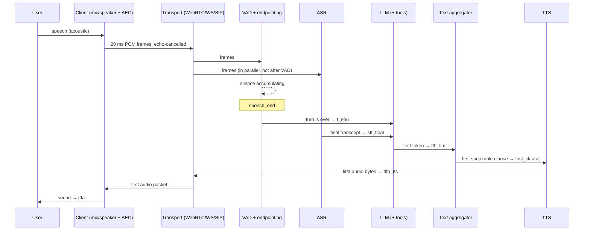
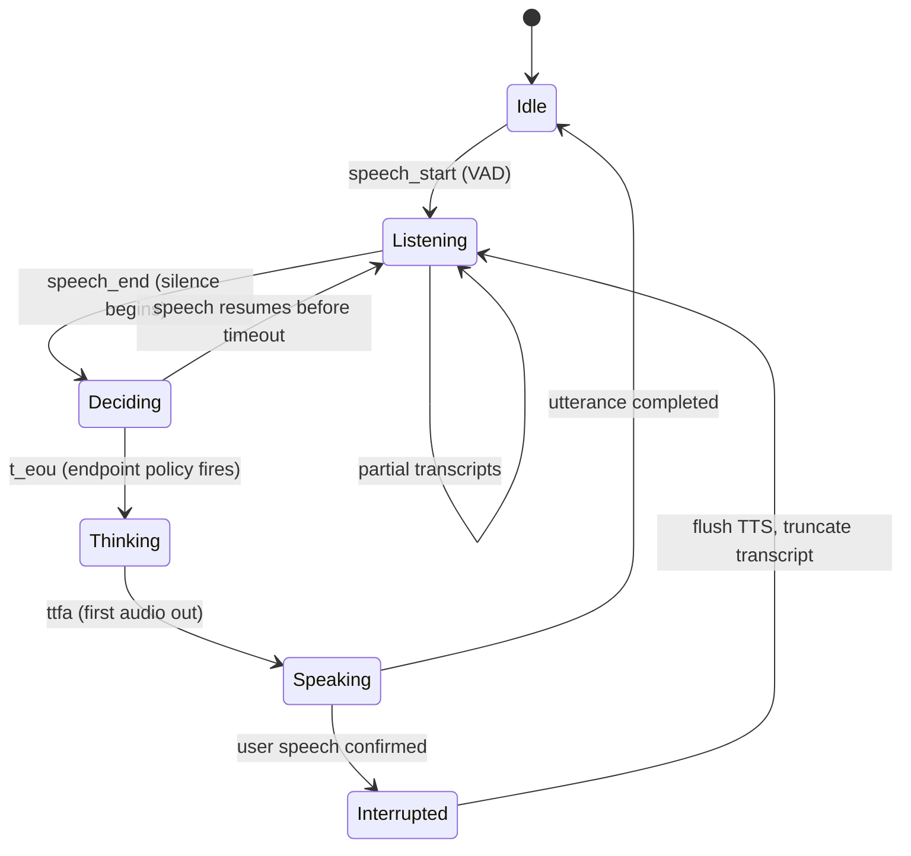

# What a Voice Agent Actually Is

**What you'll be able to do after this:** place any voice product on a precise
taxonomy (IVR, voicebot, chatbot-with-STT, cascaded agent, native speech-to-speech);
draw the canonical architecture with the right metric attached to every hop; compute
why a batch pipeline is several times slower than a streaming one; and state the four hard
problems in a form specific enough to engineer against.

---

## 1. Intuition

Everyone draws the same box diagram: microphone, speech-to-text, language model,
text-to-speech, speaker. The diagram is correct and it teaches you almost nothing,
because it hides the two properties that make voice agents hard.

**Property one: the deadline is external and non-negotiable.** In human
conversation, the gap between one person finishing and the next starting is
remarkably short and remarkably consistent across languages — on the order of a
couple of hundred milliseconds. Humans do not tolerate much more before they
interpret the silence as *meaning something*: confusion, disagreement, a bad
connection, or a machine. You cannot fix this with a spinner, a "typing…"
indicator, or a progress bar. There is no UI affordance in audio for "still
working". Either the sound arrives on time or your product feels broken. Every
web engineer's instinct — queue it, retry it, degrade gracefully, show a skeleton
— is unavailable.

**Property two: both parties can talk at once.** A request/response system has a
clean invariant: exactly one side is producing at a time. Voice does not. The user
can start speaking while your agent is mid-sentence, and when that happens you
have a genuine distributed-state problem: the words your agent has *generated*,
the words it has *synthesised*, the words it has *transmitted*, and the words the
user has actually *heard* are four different sets. Getting them back into
agreement, in under a few hundred milliseconds, is the single most under-estimated
piece of engineering in this field.

Everything else in this curriculum — jitter buffers, endpointing policy, echo
cancellation, prefix caching, frame graphs — exists to serve those two properties.

So the useful definition is not architectural, it is behavioural:

> A **voice agent** is a system that (a) holds a spoken conversation in real time,
> (b) maintains state across turns, (c) can take consequential actions in the
> world, and (d) does all of it inside a latency budget set by human conversational
> expectation rather than by your infrastructure.

Drop (a) and you have a transcription service. Drop (b) and you have a voice
search box. Drop (c) and you have a talking FAQ. Drop (d) and you have a demo that
impresses in a video and fails in production.

### The taxonomy, precisely

| System | Input handling | State | Turn-taking | Can act | Typical response gap |
|---|---|---|---|---|---|
| **Touch-tone IVR** | DTMF digits, no speech understanding | Explicit menu position | Rigid: system speaks, then waits for a keypress | Yes, via fixed integrations | Instant (no inference) |
| **Rule-based voicebot** | Grammar/keyword-constrained ASR | Finite state machine, hand-authored | System-initiated, barge-in usually disabled | Yes, within scripted flows | 300–800 ms |
| **Chatbot + STT/TTS bolted on** | Full ASR, but batch: record, stop, transcribe, reply | Chat history only | Push-to-talk or fixed silence timeout | Only what the chatbot could do | 2–5 s |
| **Cascaded voice agent** | Streaming ASR, streaming LLM, streaming TTS | Conversation state plus external memory | Continuous VAD and endpointing, barge-in supported | Yes, via tool calling | 500–900 ms |
| **Native speech-to-speech agent** | Audio tokens straight into a multimodal model | Model-internal plus injected context | Often model-side turn detection, full duplex possible | Yes, but tool orchestration is weaker | 300–600 ms |
| **Voice agent (the target)** | Any of the above transports | Working, episodic, semantic memory | Explicit policy, tuned and measured | Yes, with idempotency and confirmation | Budgeted and monitored |

Two rows deserve comment.

The **chatbot + STT/TTS** row is where most first attempts land, and its 2–5 second
gap is not caused by slow models. It is caused by *serialisation*: nothing starts
until the previous stage finishes. §2 quantifies this.

The **native speech-to-speech** row is genuinely different in kind, not just in
speed. There is no transcript in the middle, which is simultaneously its advantage
(prosody, emotion, laughter and interruption handling survive the round trip) and
its cost (you lose the text artifact that your logging, evaluation, guardrails,
tool routing and compliance redaction were all built on). That tradeoff gets a full
chapter in [`../06-realtime-systems/04-speech-to-speech.md`](../06-realtime-systems/04-speech-to-speech.md).

### What "conversational AI" means

Nothing, technically. It is a market category that spans all six rows above. When
a vendor says "conversational AI platform", the questions that recover the actual
information are: *Is your ASR streaming or batch? What is your endpointing policy?
Can the caller interrupt, and what happens to the transcript when they do? What is
your p95 from end-of-user-speech to first audio byte?* The answers place them on
the table within a minute.

---

## 2. Rigour

### The canonical cascaded architecture



Three details in that diagram are where beginners lose 300 ms without noticing.

**ASR runs in parallel with VAD, not after it.** If you wait for the endpointing
decision before you start recognising, you have serialised two things that are
independent. Feed frames to the recogniser continuously; the endpointer only
decides *when to stop waiting for more*.

**`t_eou` is a decision, not a measurement.** The endpointer does not detect that
the user finished; it *decides* that enough silence has elapsed to bet on it. That
wait — typically 300–800 ms with a naive fixed timeout — is usually the single
largest line item in the whole budget, and it is pure policy. It costs no compute.
See [`../03-turn-taking/02-endpointing.md`](../03-turn-taking/02-endpointing.md).

**The aggregator between LLM and TTS is a real component.** The LLM emits token
fragments; TTS wants linguistically coherent chunks. Naively waiting for the full
response before synthesising throws away the entire benefit of streaming. Naively
sending every token produces prosodic garbage. That component is designed in
[`../04-tts/03-streaming-tts.md`](../04-tts/03-streaming-tts.md).

### Defining a turn

A turn is not a message. Formally, a turn is the interval from the first frame the
system attributes to the user's speech to the last audio byte of the agent's reply,
and it passes through these states:



The `Deciding → Listening` edge is why a fixed timeout feels robotic: a person
pausing to think mid-sentence traverses it, and if your timeout is too short you
cut them off. The `Speaking → Interrupted` edge is the barge-in problem, and the
"truncate transcript" action on it is the state-reconciliation problem from §1.

### The latency identity

Decompose the headline metric:

$$
\texttt{eou\_to\_ttfa} = \underbrace{(t_{\text{stt\_final}} - t_{\text{eou}})}_{\text{ASR flush}}
+ \underbrace{(t_{\text{ttft}} - t_{\text{stt\_final}})}_{\text{LLM prefill}}
+ \underbrace{(t_{\text{clause}} - t_{\text{ttft}})}_{\text{aggregation}}
+ \underbrace{(t_{\text{ttfb}} - t_{\text{clause}})}_{\text{TTS}}
+ \underbrace{(t_{\text{ttfa}} - t_{\text{ttfb}})}_{\text{egress}}
$$

and what the user actually experiences:

$$
\texttt{perceived\_gap} = (t_{\text{eou}} - t_{\text{speech\_end}}) + \texttt{eou\_to\_ttfa}
$$

The first term is the endpointing wait. Engineers optimise the second sum for weeks
and leave the first at a hardcoded 700 ms. Report both, always. The full
term-by-term budget with realistic numbers is
[`04-latency-budget.md`](04-latency-budget.md).

### Batch versus streaming, with arithmetic

Let $D$ be the duration of the user's utterance, and let each stage have a fixed
overhead plus a rate. Take an illustrative model, all figures as *stated
assumptions* rather than measurements:

- ASR, batch: processes the whole $D$-second clip at real-time factor $r = 0.15$, so $0.15D$.
- ASR, streaming: processes continuously; on `t_eou` only the tail remains, so a fixed flush of ~100 ms.
- LLM: TTFT of 300 ms, then 40 tokens/s; the reply is 60 tokens.
- TTS, batch: synthesises the whole reply at RTF $0.3$; a 60-token reply is about 12 s of speech, so ~3.6 s.
- TTS, streaming: TTFB of 150 ms for the first clause.

For $D = 5$ s:

| Pipeline | Computation | `eou_to_ttfa` |
|---|---|---|
| Fully batch | $0.15(5) + 300\text{ ms} + \frac{60}{40}\text{s} + 3600\text{ ms}$ | $750 + 300 + 1500 + 3600 = 6150$ ms |
| Streaming ASR only | $100 + 300 + 1500 + 3600$ | $5500$ ms |
| Streaming ASR + streaming TTS, no aggregation | $100 + 300 + 1500 + 150$ | $2050$ ms |
| All streaming, clause aggregation | $100 + 300 + 120 + 150$ | $670$ ms |

The decisive line is the last one. The win is not "TTS got faster" — it is that
**the agent starts speaking after the first clause instead of after the last
token**. That single design decision removes $\frac{60}{40} = 1.5$ s of decode
time from the critical path, because the remaining tokens are generated *while the
first clause is being spoken*. Streaming is not an optimisation of the same
pipeline; it is overlapping stages that a batch pipeline serialises.

Note also that batch cost scales with utterance length $D$ and reply length, while
streaming cost is nearly constant in both. Batch pipelines therefore feel fine in a
demo with three-word utterances and collapse on real callers who speak for eight
seconds.

### Three independent streaming axes

"Streaming" is three separate decisions, and teams routinely get one right and
assume they are done:

| Axis | Batch choice | Streaming choice | What it costs you to get wrong |
|---|---|---|---|
| **Transport** | HTTP upload of a recorded clip | WebRTC/WS frames as captured | Cannot detect barge-in at all; cannot start ASR early |
| **ASR** | Recognise after the utterance ends | Recognise continuously, emit partials | Adds $rD$ to every turn; no partials for speculative work |
| **TTS** | Synthesise whole reply | Synthesise per clause, stream out | Adds full-reply synthesis time; cannot flush on interruption |

All eight combinations exist in the wild. Only the all-streaming corner reaches a
human-plausible gap. And note the second-order effects in the last column: batch
transport does not merely add latency, it makes interruption *structurally
impossible*, because there are no inbound frames to analyse while you are speaking.

### Error compounding

Accuracy multiplies along the cascade. If ASR returns a fully correct transcript
for 95% of utterances, and the LLM produces a correct action for 95% of correct
transcripts, end-to-end correctness is at most

$$0.95 \times 0.95 = 0.9025$$

That is roughly one in ten turns wrong, before you have added a tool call or a TTS
mispronunciation. Two consequences follow, and both are design mandates rather than
observations:

1. **Optimise the weakest link, not the most interesting one.** Moving ASR from 95%
   to 98% utterance accuracy buys more than any prompt engineering, and domain
   biasing ([`../02-asr/06-decoding-and-biasing.md`](../02-asr/06-decoding-and-biasing.md))
   is usually the cheapest way to get it.
2. **The LLM must be robust to its input being wrong.** It should be prompted to
   treat the transcript as a noisy observation — confirming a phone number, not
   parroting "you said 6127" when the caller said 6217. See
   [`../05-llm-layer/01-prompting-for-speech.md`](../05-llm-layer/01-prompting-for-speech.md).

The compounding argument is also the strongest technical case for native
speech-to-speech: one model, one error surface, no transcript bottleneck. The
counter-argument is that you lose the transcript you needed for evaluation,
guardrails and audit — so you trade a known error budget for an unmeasurable one.

---

## 3. From scratch

The clearest way to internalise §2 is to build the loop with the models stubbed
out, so nothing is hidden behind an inference library. The code below is a complete
standalone illustration: fake ASR, LLM and TTS with realistic timing, a real
aggregator, and a `BATCH` switch that reproduces both rows of the arithmetic table.

```python
"""Batch vs streaming voice-agent loop, with everything faked except the timing.

Run:  python loop.py streaming
      python loop.py batch
"""
import asyncio, sys, time

SR = 16_000
FRAME_MS = 20                      # 320 samples, 640 bytes at 16 kHz mono s16le

class Trace:
    """First-write-wins marks, so mark('ttfb_tts') in a loop still means *first*."""
    def __init__(self): self.m = {}
    def mark(self, k):
        self.m.setdefault(k, time.monotonic()); return self.m[k]
    def ms(self, a, b):
        return (self.m[b] - self.m[a]) * 1000 if a in self.m and b in self.m else None

async def fake_asr(utterance_s: float, batch: bool, tr: Trace) -> str:
    # Streaming: only the tail remains to flush when the turn ends.
    # Batch: the whole clip is processed after the fact, at real-time factor 0.15.
    await asyncio.sleep(0.15 * utterance_s if batch else 0.10)
    tr.mark("stt_final")
    return "I need to reschedule my appointment to next Tuesday afternoon"

async def fake_llm(prompt: str, tr: Trace):
    await asyncio.sleep(0.30)                       # prefill / TTFT
    tr.mark("ttft_llm")
    reply = ("Of course. I can move that to Tuesday. "
             "I have two thirty or four fifteen open. Which suits you?")
    for tok in reply.split(" "):
        yield tok + " "
        await asyncio.sleep(1 / 40)                 # 40 tokens/s decode

# Terminal punctuation that ends a speakable clause. The hard cases -- "Dr.",
# "42.50", "e.g." -- are handled properly in 04-tts/03-streaming-tts.md.
TERMINALS = ".?!"

async def aggregate(tokens, min_chars: int, tr: Trace):
    """Release text to TTS at clause boundaries. This is the latency lever."""
    buf = ""
    async for t in tokens:
        buf += t
        if buf.strip() and buf.rstrip()[-1] in TERMINALS and len(buf.strip()) >= min_chars:
            tr.mark("first_clause"); yield buf.strip(); buf = ""
    if buf.strip():
        tr.mark("first_clause"); yield buf.strip()

async def fake_tts(clauses, batch: bool, tr: Trace):
    async for c in clauses:
        audio_s = len(c.split()) * 0.4             # ~0.4 s of speech per word
        # A streaming engine returns its first bytes after a roughly constant
        # TTFB. A batch engine must finish the whole utterance first, so its
        # delay scales with the audio it has to produce (real-time factor 0.3).
        await asyncio.sleep(0.3 * audio_s if batch else 0.15)
        tr.mark("ttfb_tts")
        # ~0.4 s of audio per word, emitted as 20 ms frames
        frames = int(len(c.split()) * 0.4 * 1000 / FRAME_MS)
        for _ in range(frames):
            yield b"\x00" * 640

async def turn(utterance_s: float, batch: bool) -> Trace:
    tr = Trace()
    tr.mark("speech_start")
    await asyncio.sleep(utterance_s)                # the user is talking
    tr.mark("speech_end")
    await asyncio.sleep(0.70)                       # naive fixed endpoint timeout
    tr.mark("t_eou")

    transcript = await fake_asr(utterance_s, batch, tr)
    tokens = fake_llm(transcript, tr)

    if batch:
        # Collect the entire reply, then synthesise it. min_chars=10**9 makes the
        # aggregator emit exactly once, at the end -- which is what batch means.
        clauses = aggregate(tokens, 10**9, tr)
    else:
        clauses = aggregate(tokens, 12, tr)

    async for _frame in fake_tts(clauses, batch, tr):
        tr.mark("ttfa")                             # first frame handed to transport
    return tr

async def main(mode: str):
    tr = await turn(utterance_s=5.0, batch=(mode == "batch"))
    print(f"mode={mode}")
    for label, a, b in (
        ("endpoint wait (policy)", "speech_end", "t_eou"),
        ("asr flush",              "t_eou",      "stt_final"),
        ("llm prefill (ttft)",     "stt_final",  "ttft_llm"),
        ("clause aggregation",     "ttft_llm",   "first_clause"),
        ("tts synthesis (ttfb)",   "first_clause","ttfb_tts"),
    ):
        print(f"  {label:<24}{tr.ms(a, b):8.1f} ms")
    print(f"  {'= eou_to_ttfa':<24}{tr.ms('t_eou','ttfa'):8.1f} ms")
    print(f"  {'= perceived gap':<24}{tr.ms('speech_end','ttfa'):8.1f} ms")

asyncio.run(main(sys.argv[1] if len(sys.argv) > 1 else "streaming"))
```

Running both modes on this machine `[MEASURED]`:

```
mode=streaming                        mode=batch
  endpoint wait (policy)   702.2 ms     endpoint wait (policy)   701.8 ms
  asr flush                102.1 ms     asr flush                752.1 ms
  llm prefill (ttft)       302.1 ms     llm prefill (ttft)       302.2 ms
  clause aggregation       188.3 ms     clause aggregation       514.6 ms
  tts synthesis (ttfb)     152.0 ms     tts synthesis (ttfb)    2282.1 ms
  = eou_to_ttfa            744.4 ms     = eou_to_ttfa           3851.0 ms
  = perceived gap         1446.6 ms     = perceived gap         4552.8 ms
```

A 5.2× difference in `eou_to_ttfa`, from the same models, the same network, and
the same reply text. Nothing was optimised; stages were merely allowed to overlap.

Three things to notice when you run it.

**The `min_chars` argument is the entire batch/streaming difference.** Setting it
to $10^9$ forces the aggregator to hold everything until the token stream ends,
which is precisely what a batch pipeline does. One parameter, seconds of latency.

**The endpoint wait dominates the streaming run.** In the streaming configuration
the compute path is a few hundred milliseconds and the fixed 700 ms timeout is
larger than everything else combined. This is why
[`../03-turn-taking/02-endpointing.md`](../03-turn-taking/02-endpointing.md) is
the highest-leverage chapter in the curriculum.

**`ttfa` is marked inside the frame loop, but only the first mark counts.** That
first-write-wins discipline is not a nicety. If you record the last frame instead,
your "latency" metric silently becomes a measure of reply *length*, and it will
look worse whenever the agent is more helpful.

---

## 4. How production does it

The three architectural families you will meet, and where each is dissected here.

**Explicit frame graphs.** Pipecat models the pipeline as processors passing typed
frames — audio frames, text frames, and control frames such as interruption
signals — through a linear pipeline, in both directions. The design commitment is
that control travels *in band* with data, so ordering is preserved: an interrupt
cannot overtake the audio it is meant to cancel. Dissected in
[`../06-realtime-systems/03-pipeline-architecture.md`](../06-realtime-systems/03-pipeline-architecture.md).

**Opinionated sessions with override points.** LiveKit Agents (verified against
`livekit-agents==1.7.0` on PyPI) exposes an `AgentSession` constructed with `stt`,
`llm`, `tts` and `vad` components plus an `Agent` carrying instructions and tools;
the framework owns the turn loop, and you customise by overriding node hooks
rather than by rewiring a graph. Less flexible than a frame graph, considerably
less code for the common case. Deep dive in
[`../07-livekit/02-agents-framework.md`](../07-livekit/02-agents-framework.md).

**Single-socket speech-to-speech.** OpenAI's Realtime API and Google's Gemini Live
API collapse the cascade into one bidirectional connection carrying audio in and
audio out, with server-side turn detection and interruption events. There is no
ASR/LLM/TTS boundary to instrument, which is the point and the price. See
[`../06-realtime-systems/04-speech-to-speech.md`](../06-realtime-systems/04-speech-to-speech.md).

### The 2026 ecosystem, by layer

Treat this as a map for the rest of the curriculum, not a recommendation. Verify
current capabilities and prices yourself; that discipline is the subject of
[`../07-livekit/06-alternatives.md`](../07-livekit/06-alternatives.md).

| Layer | Open weights / self-hostable | Hosted |
|---|---|---|
| **Transport / orchestration** | LiveKit (Apache-2.0 SFU + agents framework), Pipecat, Janus, mediasoup | LiveKit Cloud, Daily, Twilio, Agora |
| **ASR** | Whisper family (faster-whisper, whisper.cpp, Distil-Whisper), NVIDIA NeMo/Parakeet, Zipformer via icefall/sherpa-onnx, wav2vec2 | Deepgram, AssemblyAI, Speechmatics, Google STT, Azure Speech |
| **VAD / turn detection** | Silero VAD, WebRTC VAD, LiveKit turn-detector plugin, Smart Turn | bundled in most platforms |
| **TTS** | Piper, Kokoro, Coqui TTS/XTTS, Orpheus, F5-TTS, Chatterbox | ElevenLabs, Cartesia, PlayHT, Rime, Azure/Google TTS |
| **LLM** | Llama, Qwen, Mistral, Gemma via vLLM / SGLang / llama.cpp / MLX | OpenAI, Anthropic, Google, Groq, Cerebras |
| **Native S2S** | Moshi (full-duplex), Ultravox (audio-in/text-out), Qwen-Omni | OpenAI Realtime, Gemini Live, Amazon Nova Sonic |
| **Full agent platforms** | — | Vapi, Retell, Bland, ElevenLabs Agents, Amazon Connect, Azure Voice Live |

The structural point: **every layer has a credible open-weight option that runs on
a laptop.** That is why this curriculum is local-first. You can hold all six layers
in your head simultaneously on a 16 GiB Mac, and an engineer who has done that
reasons about the hosted versions far better than one who has only ever held an API
key.

---

## 5. At scale

The deadline does not relax when traffic grows, and that single fact invalidates
most web-scaling intuition.

| Concurrency | What dominates | What breaks first |
|---|---|---|
| **1 session** | Model cold start, your own code's correctness | Nothing; everything looks fine, which is the trap |
| **~100 sessions** | Per-session CPU (Opus decode, resampling, VAD on every 20 ms frame) and GPU residency | Event-loop starvation: one blocking call in an async stage adds latency to *every* session on that worker |
| **~10,000 sessions** | Fleet orchestration: session affinity, regional placement, draining during deploys, GPU packing | Deploys. You cannot terminate a worker holding live calls, so rollout must drain, and drain time is bounded by max call duration |

Three consequences worth internalising now, each developed later.

**You cannot queue.** A web service under load queues requests and degrades
throughput. A voice service under load must either serve the call inside the
deadline or reject it at the door. Admission control is therefore a first-class
feature, and utilisation must be held well below saturation — the queueing
arithmetic showing why roughly 70% is the practical ceiling is in
[`04-latency-budget.md`](04-latency-budget.md).

**Sessions are sticky and long-lived.** A stateless request router is useless here:
the agent process must stay co-located with the media path for the entire call,
which turns autoscaling into a bin-packing problem over minutes-long,
non-interruptible units. See
[`../06-realtime-systems/05-scale-and-orchestration.md`](../06-realtime-systems/05-scale-and-orchestration.md).

**Cost is per minute, and dominated by whichever layer you were least careful
about.** ASR, LLM and TTS each bill per unit of *time or tokens spent talking*, so
a persona that is 30% more verbose is a 30% cost increase on two of three layers,
plus a latency regression. Persona is a cost decision, which is why it gets an
engineering chapter: [`../05-llm-layer/05-persona-design.md`](../05-llm-layer/05-persona-design.md).

---

## 6. Exercises

**E1.0.1** Place these five products on the §1 taxonomy table, and name the single
observation that decides each: an airline's "press 1 for bookings" line; a
smart-speaker timer; a browser dictation box; a support line that lets you
interrupt it mid-sentence; a language-practice app that laughs at your jokes.

**E1.0.2** Using the illustrative model in §2, recompute the four-row batch/streaming
table for a 12-second user utterance and a 200-token reply. Which single term grew
most, and which pipeline configuration is least sensitive to $D$? State the
assumption that drives your answer.

**E1.0.3** Run the §3 script in both modes. Then change only the endpoint timeout
from 700 ms to 250 ms and re-run. By what fraction did `perceived_gap` improve in
streaming mode, and what have you traded away? (Answer in terms of a cost you
cannot see in this script.)

**E1.0.4** The aggregator in §3 splits on `.?!`. Construct three inputs where this
produces audibly wrong speech. For each, state whether the fix belongs in the
aggregator, the prompt, or the TTS front end.

**E1.0.5** ASR is 96% utterance-accurate, the LLM is 97% correct given a correct
transcript, tool execution succeeds 99% of the time, and TTS mispronounces a
critical entity in 2% of turns. Compute end-to-end turn success. Then find the
cheapest single-component improvement that lifts the total above 92%, and justify
"cheapest" explicitly.

**E1.0.6** Explain, in terms of the four sets in §1 (generated / synthesised /
transmitted / heard), why a barge-in implementation that only stops the speaker is
insufficient. What must additionally be corrected, and what happens on the next
turn if it is not?

**E1.0.7** For each of the three streaming axes in §2, name a product decision that
becomes *impossible* rather than merely slower if you choose batch on that axis.

---

## 7. Interview drill

> "We have a working voice prototype. Users say it feels slow and it talks over
> them. You have one week and no budget for new vendors. What do you do first, and
> how do you know it worked?"

A strong answer starts by refusing to guess. Instrument first: emit the marks from
§2 per turn (`speech_end`, `t_eou`, `stt_final`, `ttft_llm`, `first_clause`,
`ttfb_tts`, `ttfa`) and report the p50 and p95 of both `eou_to_ttfa` and
`perceived_gap`. Without that split you cannot distinguish "our models are slow"
from "our endpoint timeout is 900 ms", and those have opposite fixes.

Then predict, out loud, what the data will show, because that demonstrates a model
of the system: most likely the endpoint wait is the largest term and the aggregator
is holding the full reply before synthesis. Both are configuration changes, not
vendor changes, which fits the constraint.

"Talks over them" is the more interesting half, because it is two distinct bugs
wearing one symptom: either the agent is not detecting the interruption (check
whether inbound frames are even being analysed during playback — batch transport
makes this structurally impossible), or it is detecting its *own* voice through the
speaker and mis-attributing it, which is an echo-cancellation problem and belongs
on the client ([`../03-turn-taking/05-echo-and-aec.md`](../03-turn-taking/05-echo-and-aec.md)).
The diagnostic that separates them costs nothing: put the tester on headphones. If
the problem vanishes, it was echo.

Close on verification: the same instrumentation becomes the regression gate, and
the success criterion is stated as a p95 target plus a bounded cut-off rate — never
as a single anecdote or a p50.

---

## Sources

- `livekit-agents` package metadata, version 1.7.0, PyPI JSON API (`https://pypi.org/pypi/livekit-agents/json`), retrieved 2026-08-22 — confirms the `AgentSession` / `Agent` construction shown in §4 and the plugin extras enumerated in the ecosystem table.
- Vizuara Voice Agent Engineering Bootcamp syllabus, `https://voice-agents.vizuara.ai/`, retrieved 2026-08-22 — the Day 1 topics this chapter covers.
- Latency figures in §2 are an explicitly stated illustrative model, not measurements. Measured budgets appear in [`04-latency-budget.md`](04-latency-budget.md); the human turn-gap literature is cited there.
- Ecosystem table entries are project and product names current as of 2026-08; capabilities and licences must be re-verified before any architecture decision. `[INFERENCE]` applies to the "typical response gap" column of the §1 taxonomy, which reflects commonly reported ranges rather than a single measured source.
