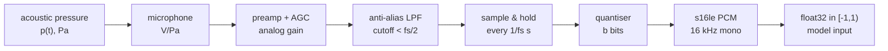

# Sound and Sampling: Pressure Waves → PCM

**What you'll be able to do after this**
Derive the sampling theorem from impulse-train multiplication rather than quote it; predict the exact alias frequency *and phase* of any tone at any sample rate; compute quantisation SNR and explain why 16-bit is enough and 8-bit linear is not; use `dBFS`, `dB SPL` and `dBA` without conflating them; and explain, with the arithmetic, why every phone call on Earth is 8 kHz / 64 kbit/s and what that costs your ASR.

---

## 1. Intuition

Speech is a pressure disturbance. Your larynx chops the airflow from your lungs into a periodic train of puffs; the vocal tract above it is a resonant tube that boosts some frequencies and suppresses others; the lips and nostrils radiate the result into the room as a travelling variation in air pressure of order 0.01–1 Pa on top of a 101 325 Pa static atmosphere. A microphone diaphragm converts that variation into a voltage. An ADC samples that voltage at fixed instants and rounds each sample to one of a finite set of integers. That integer stream — 16 000 of them per second, each two bytes, little-endian — is the only thing your agent ever sees.

Three lossy steps hide in that sentence, and every foundational audio bug lives in one of them:

1. **Bandlimiting.** Sampling throws away everything above half the sample rate. If you do not *remove* it first, it does not vanish — it comes back disguised as a lower frequency you cannot distinguish from real speech.
2. **Quantisation.** Rounding to integers adds noise. The noise floor is set by the bit depth, so headroom you do not use is SNR you threw away.
3. **Companding.** Telephony trades uniform absolute precision for uniform *relative* precision, so a whisper and a shout both get ~38 dB of SNR out of 8 bits — at the price of a hard 3.4 kHz ceiling that deletes the acoustic cue distinguishing "s" from "f".

The rest of this chapter turns each of those into arithmetic you can do on a whiteboard.



Steps D and E are physically inseparable in a modern sigma-delta ADC — it oversamples at MHz rates and does the bandlimiting digitally — but logically they are distinct, and the failure mode of skipping D is what we are about to measure.

## 2. Rigour

### 2.1 What speech actually occupies

The audible band is conventionally $20\ \text{Hz}$–$20\ \text{kHz}$; the upper limit degrades with age and is often below 15 kHz by 40. Speech uses a much narrower slice.

The following are computed directly from the Hillenbrand et al. (1995) release of `vowdata.dat` — 1668 tokens, 45 men / 48 women / 46 children, 12 vowels in `hVd` frames, formants sampled at steady state. These are primary-source numbers, not textbook rounding. `[MEASURED]` on that dataset:

| Talker class | n | $F_0$ mean | sd | p5 | p95 |
|---|---|---|---|---|---|
| Men | 540 | 131.2 Hz | 22.0 | 100 Hz | 171 Hz |
| Women | 576 | 220.4 Hz | 23.2 | 178 Hz | 257 Hz |
| Boys | 324 | 236.1 Hz | 28.3 | 199 Hz | 287 Hz |
| Girls | 228 | 238.4 Hz | 20.9 | 208 Hz | 276 Hz |

Formants, same dataset, mean with 5th–95th percentile range `[MEASURED]`:

| | Men | Women | Boys | Girls |
|---|---|---|---|---|
| $F_1$ | 524 Hz (338–738) | 617 Hz (433–915) | 638 Hz | 668 Hz |
| $F_2$ | 1508 Hz (887–2319) | 1763 Hz (987–2760) | 1915 Hz | 2011 Hz |
| $F_3$ | 2517 Hz (1745–2972) | 2866 Hz (1973–3391) | 3028 Hz | 3199 Hz |

Two consequences to internalise. First, the voicing fundamental for adult men bottoms out near 90 Hz in this corpus, so a 100 Hz high-pass — which cheap "rumble removal" defaults to — removes the first harmonic for a substantial fraction of male talkers. Second, $F_3$ for women and children routinely exceeds 3.4 kHz, and $F_3$ is the primary cue for /r/ (it drops sharply toward ~2 kHz). Narrowband telephony truncates precisely that.

Per-vowel extremes, same dataset `[MEASURED]`: /i/ ("heed") men average $F_1{=}343$, $F_2{=}2323$ Hz; /ɑ/ ("hod") men average $F_1{=}756$, $F_2{=}1309$ Hz; /u/ ("who'd") men average $F_1{=}380$, $F_2{=}992$ Hz. Women's values run 20–25% higher throughout, which is just the shorter vocal tract: a quarter-wave tube resonates at $c/(4L)$, so a 15% shorter tract gives ~18% higher formants.

Fricatives break the pattern entirely. They are turbulence noise, not harmonic, and their energy sits *above* the formant range: /s, z/ have a primary spectral peak around 4–5 kHz, while /ʃ, ʒ/ peak lower, around 2.5–3 kHz (Jongman, Wayland & Wong 2000). This single fact is why 16 kHz — Nyquist 8 kHz — is the practical floor for good ASR, and why 8 kHz telephony confuses /s/ with /f/ and /θ/: their distinguishing energy is entirely above the channel.

### 2.2 The sampling theorem, derived

Model ideal sampling as multiplication by a Dirac comb of period $T = 1/f_s$:

$$s(t) = \sum_{n=-\infty}^{\infty} \delta(t - nT), \qquad x_s(t) = x(t)\,s(t)$$

The comb's Fourier transform is another comb:

$$S(f) = \frac{1}{T}\sum_{k=-\infty}^{\infty} \delta\!\left(f - \frac{k}{T}\right) = f_s \sum_k \delta(f - k f_s)$$

Multiplication in time is convolution in frequency, so

$$X_s(f) = X(f) * S(f) = f_s \sum_{k=-\infty}^{\infty} X(f - k f_s)$$

**The spectrum of a sampled signal is the original spectrum replicated at every integer multiple of $f_s$.** That is the whole theorem. If $X(f) = 0$ for $|f| \ge B$, the replicas centred at $0, \pm f_s, \pm 2 f_s, \dots$ do not overlap iff $B \le f_s - B$, i.e.

$$f_s \ge 2B$$

and then an ideal brickwall filter at $f_s/2$ recovers $X(f)$ exactly — equivalently, in the time domain, $x(t) = \sum_n x(nT)\,\mathrm{sinc}\!\big((t - nT)/T\big)$. Below $2B$ the replicas overlap, high frequencies are *summed* into low ones, and no filter can separate them because the information has already been added together. Aliasing is **irreversible**.

**The alias map.** A real sinusoid at $f$ sampled at $f_s$ is bit-identical to one at $f_{\text{alias}} = |f - k f_s|$ folded into $[0, f_s/2]$ for the nearest $k$. For 6 kHz at 8 kHz, $k = 1$ and $f_{\text{alias}} = 2$ kHz. The phase also flips, and this drops straight out of the algebra:

$$\sin\!\left(2\pi \frac{(f_s - f_a)\,n}{f_s}\right) = \sin\!\left(2\pi n - 2\pi \frac{f_a n}{f_s}\right) = -\sin\!\left(2\pi \frac{f_a n}{f_s}\right)$$

So 6 kHz at $f_s = 8$ kHz is not merely "something near 2 kHz" — it is *exactly* $-\sin(2\pi \cdot 2000\,t)$ at the sample instants. Section 3 measures this residual at $2.4\times10^{-12}$.

**Anti-alias filtering.** Since aliasing is unfixable after the fact, the filter must precede the sampler. Real filters have a transition band. A practical design needs stopband attenuation below the quantisation noise floor (≈96 dB for 16-bit) by the time it reaches $f_s/2$, so the passband edge must sit meaningfully below it. Telephony's 300–3400 Hz passband inside an 8 kHz rate leaves a 600 Hz transition band — buildable with a cheap analog filter in 1970s silicon. Modern converters sidestep the problem: sigma-delta modulators sample at 64–256× the output rate, where a gentle analog rolloff suffices, then decimate with a steep *digital* FIR whose response is exactly controllable.

The same rule applies inside your own code. `x[::3]` is not resampling; it is sampling a signal you have not bandlimited. Decimation is always *filter, then drop*.

### 2.3 Quantisation as additive noise

Round each sample to a grid of step $\Delta$ and define the error $e = \hat{x} - x$. For a signal that is busy relative to $\Delta$ (true for speech, false for a slow ramp or near-silence), $e$ is well modelled as uniform on $[-\Delta/2, \Delta/2]$, white, and independent of $x$. Then

$$\sigma_e^2 = \frac{1}{\Delta}\int_{-\Delta/2}^{\Delta/2} e^2\, de = \frac{\Delta^2}{12}$$

For a $b$-bit signed converter spanning $[-1, 1)$, $\Delta = 2/2^b = 2^{1-b}$. A full-scale sine has amplitude 1 and power $1/2$. Therefore

$$\mathrm{SNR} = \frac{1/2}{\Delta^2/12} = \frac{12}{2 \cdot 2^{2 - 2b}} = \frac{3}{2}\,2^{2b}$$

$$\mathrm{SNR_{dB}} = 10\log_{10}\!\left(\tfrac{3}{2}\right) + 20\,b\,\log_{10} 2 = 1.76 + 6.02\,b \ \ \text{dB}$$

**Each bit buys 6.02 dB.** 16-bit gives 98.1 dB, which is why 16-bit is the wire format: it exceeds the ~90 dB span between the softest useful speech and clipping in any real room, while costing half of float32. Section 3 measures 98.17 dB against the predicted 98.08 dB.

Two caveats the formula hides:

- The $1.76$ dB term assumes a *full-scale sine*. A signal peaking at $-20$ dBFS gets 20 dB less SNR, because $\Delta$ is fixed. Speech has a crest factor of roughly 12–18 dB, so even peak-normalised speech runs well below the sine bound.
- The uniform-error model fails when the signal is comparable to $\Delta$. Then the error is *correlated* with the signal and appears as harmonic distortion, not noise. That is what dither fixes.

### 2.4 Dither

A quantiser is a deterministic staircase, so its error on a periodic input is periodic — harmonic distortion, which the ear detects far more readily than broadband noise of the same power. Worse, a signal below $\Delta/2$ quantises to *exactly zero*: it disappears.

Adding a small random signal before rounding decorrelates the error from the input. The standard choice is TPDF (triangular probability density) dither of 2 LSB peak-to-peak, generated as the difference of two independent uniform variates, because it makes both the error mean and the error *variance* independent of the input. It costs about 4.77 dB of SNR ($\sigma_e^2$ rises from $\Delta^2/12$ to $\Delta^2/4$) and buys linearity all the way below the LSB. Section 3 measures a sub-LSB tone vanishing completely without dither and surviving 28.4 dB above the noise floor with it.

You will rarely add dither by hand in a voice pipeline — but you will meet it as a symptom. Requantising float32 model output to int16 without dither is a real source of the faint gritty "sizzle" on quiet TTS tails.

### 2.5 dBFS vs dB SPL vs dBA

All three are $20\log_{10}$ of an amplitude ratio. They differ only in the reference, and conflating them is the most common unit error in audio code.

| Unit | Reference | Range you'll see | Notes |
|---|---|---|---|
| **dBFS** | digital full scale | $-\infty$ to $0$ | A full-scale *sine* measures $20\log_{10}(1/\sqrt2) = -3.01$ dBFS RMS `[MEASURED]`; only a full-scale square wave reaches 0. Healthy speech: $-30$ to $-18$ dBFS RMS. |
| **dB SPL** | $20\ \mu\text{Pa}$ | 0 to 130 | Conversational speech ≈ 60 dB SPL at 1 m; quiet office ≈ 40; threshold of pain ≈ 130. |
| **dBA** | as dB SPL, A-weighted | — | A frequency weighting approximating the ear's sensitivity at moderate levels, standardised in IEC 61672-1. One number for "loudness". |

There is **no fixed conversion between dBFS and dB SPL** — the mapping depends on microphone sensitivity and preamp gain, and both vary per device and per driver. Every "loudness" number your agent computes from PCM is therefore *relative*, so thresholds tuned in one room are wrong in another. This is why energy-based VAD thresholds do not transfer; see `../03-turn-taking/01-vad.md`.

A-weighting from the IEC 61672-1 pole definition ($f_1{=}20.599$, $f_2{=}107.653$, $f_3{=}737.862$, $f_4{=}12194.217$ Hz, normalised to 0 dB at 1 kHz) `[MEASURED]`:

| f | 20 Hz | 100 Hz | 500 Hz | 1 kHz | 2 kHz | 4 kHz | 10 kHz | 20 kHz |
|---|---|---|---|---|---|---|---|---|
| A-weight | $-50.4$ | $-19.1$ | $-3.25$ | $0.00$ | $+1.20$ | $+0.96$ | $-2.49$ | $-9.35$ |

Note the $+1.2$ dB boost at 2 kHz: the ear is *more* sensitive there than at 1 kHz. That is the ear canal's quarter-wave resonance, and it sits right on top of $F_2$ — the formant that carries most vowel identity. Evolution and physics agreeing is a good sanity check on your unit handling.

### 2.6 Companding: µ-law and A-law

Uniform quantisation gives constant absolute precision, but hearing is roughly logarithmic — we care about constant *relative* precision. Companding applies a compressive nonlinearity before a uniform quantiser and its inverse after.

**µ-law** (North America, Japan), $\mu = 255$:

$$F(x) = \operatorname{sgn}(x)\,\frac{\ln(1 + \mu|x|)}{\ln(1+\mu)}, \qquad F^{-1}(y) = \operatorname{sgn}(y)\,\frac{(1+\mu)^{|y|} - 1}{\mu}$$

**A-law** (Europe, international), $A = 87.6$:

$$F(x) = \operatorname{sgn}(x) \begin{cases} \dfrac{A|x|}{1 + \ln A}, & |x| < 1/A \\[2mm] \dfrac{1 + \ln(A|x|)}{1 + \ln A}, & 1/A \le |x| \le 1\end{cases}$$

**Why SNR becomes level-independent.** After compression, a uniform step $\Delta$ in the compressed domain maps back to an effective step in the input domain of $\Delta_{\text{eff}}(x) = \Delta / F'(x)$. For µ-law with $\mu|x| \gg 1$, $F'(x) \approx \dfrac{1}{|x|\ln(1+\mu)}$, so $\Delta_{\text{eff}}(x) \approx \Delta\,|x|\,\ln(1+\mu)$ — proportional to the signal. Noise power $\propto x^2$ and signal power $\propto x^2$, so their ratio is constant. The standard closed form is

$$\mathrm{SNR_{dB}} \approx 6.02\,b + 4.77 - 20\log_{10}\!\big[\ln(1+\mu)\big]$$

For $b = 8$, $\mu = 255$: $48.16 + 4.77 - 14.87 = 38.1$ dB. Section 3 measures 37.5 dB at $-3$ dBFS and 35.5 dB at $-40$ dBFS — flat across 37 dB of input range, where 8-bit linear collapses from 47.2 dB to 11.1 dB.

**G.711 is not that formula.** ITU-T G.711 specifies a *piecewise-linear* 8-segment approximation, not the transcendental curve: 1 sign bit, 3 exponent bits, 4 mantissa bits, applied to a biased 13-bit (µ-law) or 12-bit (A-law) linear magnitude, with bits inverted on the wire. The decoder's 256 codes produce 255 distinct levels with step sizes from 8 to 1024 in int16 units — a 128:1 ratio, 42.1 dB of step-size range `[MEASURED]` — and codes 127 and 255 both decode to zero, because µ-law has a positive and a negative zero. If you implement the analytic formula and compare bytes against a telco, you will differ on most samples. Section 3 gives the piecewise version.

### 2.7 Why telephony is 8 kHz and 64 kbit/s

Work it forward from the constraint that mattered:

1. **Intelligibility floor.** Carrier engineers settled on a 300–3400 Hz passband, later codified as the reference PCM channel in ITU-T G.712. It keeps $F_1$, $F_2$ and most of male $F_3$; it discards $F_0$ for men (the ear reconstructs pitch from harmonic spacing) and all sibilant place discrimination.
2. **Nyquist plus a realisable filter.** $2 \times 3400 = 6800$ Hz minimum. Round up to 8000 to leave a 600 Hz transition band an analog filter could actually hit.
3. **Bits per sample.** 8, because octets. Uniform 8-bit gives ~50 dB SNR at full scale but 11 dB at $-40$ dBFS — unusable on a network with 40 dB of level variation between talkers and subscriber loops. Companding fixes exactly this: ~38 dB, flat.
4. **Bit rate.** $8000 \times 8 = 64\,000$ bit/s. This is the DS0, the atom of the telephone network. A T1 carries 24 DS0s plus 8 kbit/s framing = 1.544 Mbit/s; an E1 carries 32 timeslots = 2.048 Mbit/s.

Every one of those numbers is still in your build today. A SIP call arrives as 8 kHz G.711 in 20 ms RTP packets — 160 samples, 160 bytes — and you must upsample to 16 kHz before your ASR sees it. Upsampling does not restore the missing 4–8 kHz band; it only makes the tensor shape right. Expect a WER penalty; see `../07-livekit/05-telephony-sip.md`.

## 3. From scratch

Everything below ran under `uv run --with numpy python`, numpy 2.5.2, Python 3.12, Apple M5.

### 3.1 Hearing the alias

```python
import numpy as np

fs_hi = 48000          # oversampled stand-in for the continuous domain
fs_lo = 8000           # telephony rate; Nyquist = 4000 Hz
f_tone = 6000.0        # above Nyquist -> must alias
dur = 0.25

t_hi = np.arange(int(fs_hi * dur)) / fs_hi
x_hi = np.sin(2 * np.pi * f_tone * t_hi)

x_lo = x_hi[::fs_hi // fs_lo]          # naive decimation: NO anti-alias filter
t_lo = np.arange(x_lo.size) / fs_lo

X = np.fft.rfft(x_lo * np.hanning(x_lo.size))
freqs = np.fft.rfftfreq(x_lo.size, 1 / fs_lo)
print("dominant freq after naive decimation: %.1f Hz" % freqs[np.argmax(np.abs(X))])
print("predicted alias |f - fs| = %.1f Hz" % abs(f_tone - fs_lo))

alias = np.sin(2 * np.pi * 2000.0 * t_lo)
corr = float(np.dot(x_lo, alias)) / float(np.linalg.norm(x_lo) * np.linalg.norm(alias))
print("|corr(decimated, 2 kHz sine)| = %.6f" % abs(corr))
print("max |x_lo + alias| = %.3e" % np.max(np.abs(x_lo + alias)))
```

`[MEASURED]`:

```
dominant freq after naive decimation: 2000.0 Hz
predicted alias |f - fs| = 2000.0 Hz
|corr(decimated, 2 kHz sine)| = 1.000000
max |x_lo + alias| = 2.356e-12
```

The residual against $-\sin(2\pi \cdot 2000\,t)$ is $2.4\times10^{-12}$, i.e. float64 rounding. The 6 kHz tone did not merely fold "near" 2 kHz; it *became* a phase-inverted 2 kHz tone, exactly as §2.2 predicts. Write both arrays to WAV and listen: they are the same sound. To hear the fold as a glide, sweep $f$ from 3 kHz to 7 kHz and note that the audible pitch rises, hits 4 kHz, and comes back down.

### 3.2 The 6.02b + 1.76 law

```python
import numpy as np
fs, n = 16000, 16000 * 4
x = np.sin(2 * np.pi * 997.0 * np.arange(n) / fs)   # 997: not a submultiple of fs

def snr_db(b):
    q = 2.0 / 2 ** b                 # step over the [-1, 1) range
    e = np.round(x / q) * q - x      # mid-tread quantiser error
    return 10 * np.log10(np.mean(x ** 2) / np.mean(e ** 2))

for b in (4, 8, 12, 16):
    print("b=%2d  measured %6.2f dB   6.02b+1.76 = %6.2f dB" % (b, snr_db(b), 6.02 * b + 1.76))
```

`[MEASURED]`:

```
b= 4  measured  26.22 dB   6.02b+1.76 =  25.84 dB
b= 8  measured  50.02 dB   6.02b+1.76 =  49.92 dB
b=12  measured  74.03 dB   6.02b+1.76 =  74.00 dB
b=16  measured  98.17 dB   6.02b+1.76 =  98.08 dB
b=8: measured noise var = 4.9802e-06   q^2/12 = 5.0863e-06
```

The measured noise variance is within 2% of $\Delta^2/12$, and SNR tracks the law to 0.4 dB at $b{=}4$ and 0.1 dB by $b{=}8$ — the residual is exactly the uniform-error approximation getting better as $\Delta$ shrinks relative to the signal.

### 3.3 Dither, measured two ways

A tone at 0.45 LSB amplitude through an 8-bit quantiser, $2^{16}$ samples at 48 kHz, with and without 2-LSB-p-p TPDF dither built as `(rng.random(n) - rng.random(n)) * q`:

```
undithered: unique output levels = 1        # the signal is GONE
dithered:   unique output levels = 3
dithered    tone bin 0.0 dB, worst non-tone bin -28.4 dB
```

`[MEASURED]`. Without dither the sub-LSB tone quantises to a constant zero: 100% signal loss. With dither it is recoverable 28.4 dB above the worst noise bin — *below the quantiser's own step size*. Dither buys resolution the staircase does not have, by trading determinism for noise.

Now a tone at 1.5 LSB, bin-centred at 750 Hz so there is no spectral leakage, reporting harmonic levels relative to the carrier:

```
undithered  H2..H5 = -inf, -18.1, -inf, -34.1 dBc   noise floor median: -inf dBc
dithered    H2..H5 = -62.4, -47.1, -60.1, -49.5 dBc  noise floor median: -53.3 dBc
```

`[MEASURED]`. The undithered quantiser has *no noise floor at all* — every non-harmonic bin is exactly zero — and a third harmonic only 18 dB down. That is a buzz, not a hiss, and it is why undithered low-level quantisation sounds broken rather than merely noisy. Dither converts 18 dB of tonal distortion into a flat $-53$ dBc floor.

### 3.4 Bit-exact G.711 µ-law, and the level sweep

```python
import numpy as np
CLIP, BIAS = 32635, 132                       # ITU-T G.711 constants

def mulaw_encode(x):                          # int16 -> uint8
    x = np.asarray(x, np.int32)
    sign = np.where(x < 0, 0x80, 0x00).astype(np.uint8)
    mag = np.minimum(np.abs(x), CLIP) + BIAS  # bias guarantees bit-length >= 8
    exp = (np.floor(np.log2(mag)).astype(np.int32) - 7).clip(0, 7)
    man = (mag >> (exp + 3)) & 0x0F
    return (~(sign | (exp << 4).astype(np.uint8) | man.astype(np.uint8))).astype(np.uint8)

def mulaw_decode(u):                          # uint8 -> int16
    v = (~np.asarray(u, np.uint8)).astype(np.int32)
    mag = ((((v & 0x0F) << 3) + BIAS) << ((v >> 4) & 0x07)) - BIAS
    return np.where(v & 0x80, -mag, mag).astype(np.int16)
```

`np.floor(np.log2(mag))` is a safe integer bit-length here: `log2` of an exactly representable integer below $2^{53}$ is exact in float64, and `+BIAS` guarantees `mag >= 132`, so the exponent always lands in $[0, 7]$. Watch the Python precedence in the decoder — `+` binds tighter than `<<`, so the parentheses around `((v & 0x0F) << 3) + BIAS` are load-bearing.

`[MEASURED]` — 440 Hz sine at 8 kHz, µ-law vs 8-bit uniform over the full int16 range:

| Input level | G.711 µ-law SNR | 8-bit linear SNR |
|---|---|---|
| $-3$ dBFS | 37.5 dB | 47.2 dB |
| $-10$ dBFS | 37.0 dB | 39.4 dB |
| $-20$ dBFS | 38.3 dB | 29.8 dB |
| $-30$ dBFS | 34.6 dB | 20.6 dB |
| $-40$ dBFS | 35.5 dB | 11.1 dB |
| $-50$ dBFS | 30.2 dB | 0.0 dB |
| $-60$ dBFS | 20.6 dB | 0.0 dB |

Linear wins by 10 dB at full scale and loses by 24 dB at $-40$ dBFS, which is where real telephone speech actually lives. That trade — give up peak fidelity, guarantee a floor — is the entire design. The measured 37.5 dB at $-3$ dBFS is within 0.6 dB of the 38.1 dB predicted by the closed form in §2.6, which is good agreement given that G.711 is the piecewise approximation and the formula describes the smooth curve.

Also `[MEASURED]` from the same run: `codes that do not survive dec->enc: [127] -> decodes to 0` (the µ-law double zero), and `255 unique levels, min step 8, max step 1024`. The final 2 dB of low-level SNR loss at $-60$ dBFS is that minimum step size of 8: below roughly $-70$ dBFS, G.711 has the same "signal disappears" problem as any undithered quantiser.

## 4. How production does it

- **`torchaudio` is not G.711.** `torchaudio.functional.mu_law_encoding` (read from `pytorch/audio` `src/torchaudio/functional/functional.py:mu_law_encoding`, main branch) computes `torch.sign(x) * torch.log1p(mu*|x|) / torch.log1p(mu)` then maps linearly to $[0, \mu]$ — the **analytic** curve, with no bit inversion and no 8-segment structure. It is fine as a WaveNet-style 256-way output quantisation, which is what it was written for, and it is **not interoperable with a telephone network**. If you feed its bytes to a SIP trunk you get loud garbage. Use the piecewise implementation from §3.4 at the telephony edge.
- **`audioop` is gone.** The CPython `audioop` module — for decades the standard way to do `lin2ulaw` and `ratecv` — was removed in Python 3.13 under PEP 594, and is deprecated on 3.12. The `audioop-lts` package on PyPI (0.2.2, `requires_python >= 3.13`) is the maintained drop-in. Any inherited codebase using `audioop` needs one of these two paths; vectorising it as in §3.4 is usually faster anyway, because the loop moves into numpy.
- **µ-law at the SIP edge.** A PSTN gateway hands you 8 kHz G.711 in 20 ms RTP payloads (160 bytes µ-law). The gateway resamples to 48 kHz Opus for the WebRTC leg; your agent then downsamples to 16 kHz. Two resamplers in series, both lossy in the transition band, neither able to recover the 3.4–8 kHz band that the carrier's anti-alias filter already deleted.
- **Clipping vs limiting.** Hardware AGC in a phone or headset applies analog gain *before* the ADC, so a loud talker can clip the converter and no amount of digital work recovers it. The signature is sustained runs at exactly $\pm 32767$. ASR degrades sharply because clipping generates broadband harmonics that smear the spectrogram; see `02-time-frequency.md`.
- **Clip, never wrap.** Converting float32 to int16 with `astype(np.int16)` on an out-of-range value wraps in C semantics: $+1.2$ becomes a large negative number, i.e. a full-scale click on every overshoot. Always `np.clip(x * 32767.0, -32768, 32767)` first. This is the single most common audio bug in Python voice code.
- **Why not float32 on the wire.** float32 doubles bandwidth and buys nothing: int16's 98 dB exceeds any microphone's own SNR (a good electret is 60–75 dB(A)). Convert to float only at the model boundary, dividing by 32768 so the range is $[-1, 1)$ and $-32768$ maps to exactly $-1$.

## 5. At scale

- **Format conversions are CPU, and CPU is your cost per minute.** At 1000 concurrent 16 kHz mono streams you are moving $1000 \times 32\,000 = 32$ MB/s of PCM. That is trivial for memory bandwidth and non-trivial for Python: every `np.frombuffer` → `astype` → arithmetic chain allocates and copies. Convert once, at the edge, into the canonical format (16 kHz mono s16le, 20 ms = 320 samples = 640 bytes) and pass `bytes` or preallocated `int16` views everywhere else.
- **Do not resample twice.** Each stage costs CPU and adds group delay (see `03-audio-io-and-buffering.md`). A path that goes 8 k → 48 k at the gateway → 16 k in the agent → 16 k at the model is paying twice for a band that no longer exists. If you own both ends, negotiate the rate instead.
- **Sample rate is a product decision with a WER price tag.** Narrowband input costs measurable accuracy on sibilants and on any alphanumeric spelling task — the NATO spelling alphabet exists because /f/ and /s/ collide on a phone line. Budget for it: spelling alphabets, digit grouping, and confirmation prompts on SIP legs that you would not need on WebRTC legs. Report `wer` split by transport, never aggregated; see `../02-asr/07-evaluation.md`.
- **Level normalisation must be per-stream and adaptive.** Across a large caller population the RMS dBFS distribution spans tens of dB. A global gain constant is guaranteed wrong for most streams. Normalise on a rolling window of *speech-active* frames only — normalising during silence amplifies the noise floor straight into your VAD, inflating `interruption_rate`.
- **Storage arithmetic.** 16 kHz s16le is 32 kB/s = 115 MB per stream-hour. At 10 000 concurrent streams, keeping raw PCM is 1.15 TB/hour. Compress recordings (Opus at 24 kbit/s is 3 kB/s, a ~10× reduction) and keep raw PCM only for a fixed-size evaluation corpus. See `../06-realtime-systems/06-observability.md`.

## 6. Exercises

**E1.1.1** Synthesise a linear sweep from 100 Hz to 7900 Hz over 5 s at 48 kHz. Decimate to 8 kHz (a) by `x[::6]` and (b) with a low-pass at 3.6 kHz applied first. Write out the alias trajectory of (a) as a closed-form function of time, then verify your formula against the measured spectral peak at 10 checkpoints. Pass condition: agreement within 1% at every checkpoint.

**E1.1.2** Prove that real sinusoids at $f$ and at $f_s - f$ produce sample sequences that are identical up to sign, and state the exact condition under which they are identical *including* sign. Verify numerically for three $(f, f_s)$ pairs, one of which satisfies the sign condition.

**E1.1.3** Derive the quantisation SNR for a full-scale triangle wave and for a full-scale square wave, predicting the constant that replaces 1.76 dB in each case. Measure both against your predictions. Explain the square-wave result in one sentence.

**E1.1.4** Record 30 s of your own speech at 16 kHz. Measure the crest factor (peak dBFS minus RMS dBFS, computed over speech-active frames only) and from it compute the SNR actually available at 16, 12, 8 and 6 bits. Then requantise and find the lowest bit depth at which you cannot hear the difference on headphones. Report the number, not an impression.

**E1.1.5** Implement A-law encode/decode bit-exactly (13-segment, $A = 87.6$, including the `^ 0x55` even-bit inversion G.711 specifies), verify round-trip idempotence on all 256 codes, and reproduce the §3.4 level sweep for A-law. Identify the one structural difference from µ-law that changes behaviour at very low levels, and show it in your numbers.

**E1.1.6** Build a narrowband simulator in ~20 lines: band-limit 16 kHz speech to 300–3400 Hz, decimate to 8 kHz, µ-law round-trip, upsample back to 16 kHz. Feed the original and the simulated version through the same ASR and report the `wer` delta. Then classify the substitution errors by phoneme class and check whether sibilants dominate as §2.1 predicts.

**E1.1.7** Requantise a synthetic fade-out (a 300 Hz tone descending from $-40$ to $-90$ dBFS over 5 s) from float32 to int16 with and without TPDF dither. Measure THD in a 1 s window centred at $-80$ dBFS for both. Then argue, with those two numbers, whether dither belongs in a production TTS output path.

**E1.1.8** Using the Hillenbrand $F_3$ distributions in §2.1, compute the fraction of women's and children's tokens with $F_3$ above 3.4 kHz. From that number alone, decide whether narrowband /r/ confusion is a real production risk or a textbook curiosity, and say what measurement would settle it.

## 7. Interview drill

> *"A customer reports that your voice agent mishears spelled-out email addresses on phone calls but never on the web app. Walk me from the physics to the fix."*

A strong answer moves through four layers without hand-waving.

**Physics.** Place-of-articulation cues for fricatives live in the spectral peak of the noise: ~4–5 kHz for /s, z/, ~2.5–3 kHz for /ʃ, ʒ/, and /f/ and /θ/ are flat and diffuse with no strong peak at all (Jongman et al. 2000). Discriminating them requires the 3.4–8 kHz band.

**Channel.** The SIP leg is G.711 at 8 kHz with a 300–3400 Hz passband, so all of that energy is gone before your process starts. The web leg is 48 kHz Opus resampled to 16 kHz, retaining content to 8 kHz.

**Why it is unfixable in software.** The anti-alias filter removed the band at the gateway. §2.2 shows aliasing and bandlimiting are both irreversible: upsampling to 16 kHz restores the tensor shape, not the information. No model reliably recovers discarded bandwidth, and one that appears to is hallucinating a plausible completion — which is worse than an error you can detect.

**Fix, in priority order.** (1) Change the *task*, not the model: force a spelling alphabet or offer DTMF entry for identifiers on narrowband legs. (2) Apply contextual biasing over the plausible domain list — see `../02-asr/06-decoding-and-biasing.md`. (3) Route narrowband audio to a model trained or fine-tuned on 8 kHz telephony rather than using a wideband model out of distribution. (4) If the carrier supports it, negotiate a wideband codec (G.722 at 50–7000 Hz, or Opus over SIP) — the only option that recovers actual signal.

The answer should close with the measurement plan: report `wer` *and* entity-level WER split by transport, because an aggregate `wer` hides a 5× error rate on the 2% of tokens that are identifiers — and identifiers are the tokens that make a task fail.

## Sources

- ITU-T Recommendation **G.711** (11/1988), *Pulse code modulation (PCM) of voice frequencies* — 8 kHz sampling, 8-bit µ-law/A-law, 64 kbit/s, the piecewise segment tables. <https://www.itu.int/rec/T-REC-G.711/>
- ITU-T Recommendation **G.712** (11/2001), *Transmission performance characteristics of pulse code modulation channels* — the 300–3400 Hz reference channel. <https://www.itu.int/rec/T-REC-G.712-200111-I/en>
- **IEC 61672-1**, *Electroacoustics — Sound level meters*: A-weighting pole definition ($f_1{=}20.599$, $f_2{=}107.653$, $f_3{=}737.862$, $f_4{=}12194.217$ Hz), used to compute the §2.5 table.
- Shannon, C. E. (1949), *Communication in the Presence of Noise*, Proc. IRE 37(1):10–21.
- Hillenbrand, J., Getty, L. A., Clark, M. J. & Wheeler, K. (1995), *Acoustic characteristics of American English vowels*, JASA 97(5):3099–3111, doi:10.1121/1.411872. Statistics in §2.1 computed directly from `vowdata.dat` (1668 tokens) in `h95-alldata.zip`, obtained from <https://github.com/santiagobarreda/hillenbrand_et_al_1995> (hosted with the author's permission).
- Jongman, A., Wayland, R. & Wong, S. (2000), *Acoustic characteristics of English fricatives*, JASA 108(3):1252–1263, doi:10.1121/1.1288413 — spectral peak locations for /s, z/ (~4–5 kHz) vs /ʃ, ʒ/ (~2.5–3 kHz).
- `pytorch/audio`, `src/torchaudio/functional/functional.py:mu_law_encoding` and `:mu_law_decoding` (main branch, read 2026-08) — the analytic µ-law, not G.711.
- **PEP 594**, *Removing dead batteries from the standard library* — removal of `audioop` in Python 3.13. `audioop-lts` 0.2.2 on PyPI (`requires_python >= 3.13`) is the maintained port.
- Oppenheim, A. V. & Schafer, R. W., *Discrete-Time Signal Processing* — impulse-train sampling, the additive quantisation noise model, dither.
- All `[MEASURED]` values: numpy 2.5.2 under Python 3.12 via `uv run`, Apple M5, macOS 26.5.2.
