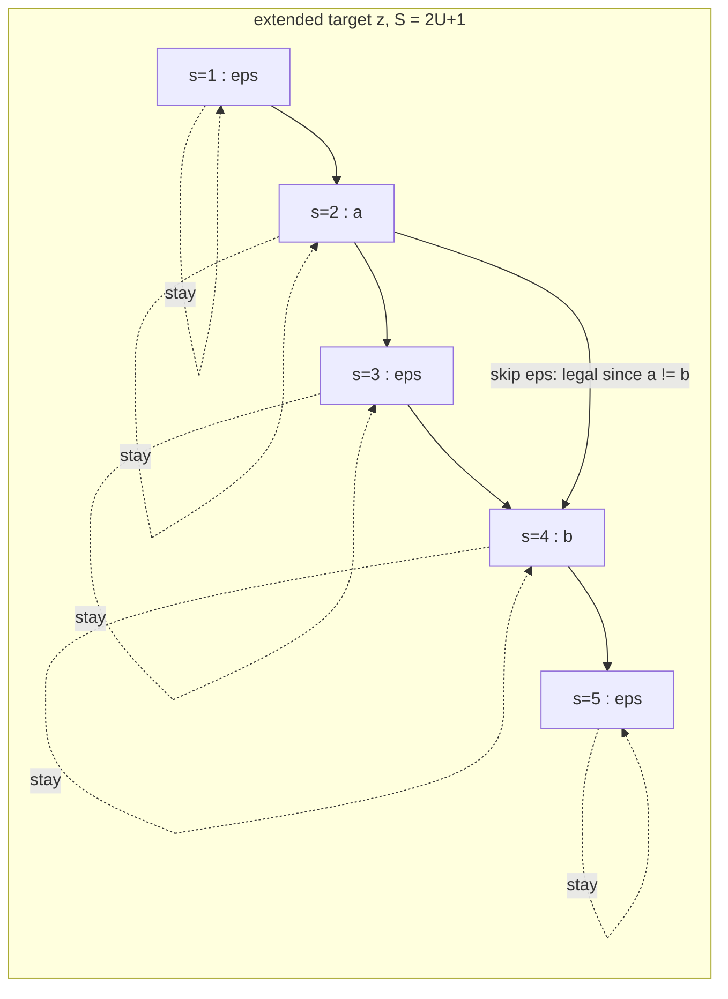

# CTC From Scratch

**What you'll be able to do after this**
Derive the CTC loss from the alignment problem, implement forward–backward and its analytic
gradient in ~120 lines of numpy that agree with PyTorch to $10^{-14}$, count the valid
alignments of a transcript in closed form, implement prefix beam search and show it beating
greedy decoding, and explain — with the gradient in front of you — exactly which limitation of
CTC forced the field to invent the transducer.

---

## 1. Intuition

You have 400 frames of audio and the label `hello world`. Eleven characters. The training signal
you actually want is per-frame: "at frame 137 the network should say `l`". Nobody gave you that.
Getting it requires an *alignment*, and producing alignments was the entire industry described in
[`01-from-hmm-to-e2e.md`](01-from-hmm-to-e2e.md) — a lexicon, an HMM topology, a bootstrapped
GMM, several Viterbi passes.

Connectionist Temporal Classification (Graves et al., ICML 2006) makes a different move: **do not
pick an alignment. Sum over all of them.** The network emits a distribution over labels at every
frame independently. Define a many-to-one map $\mathcal{B}$ that squashes a frame-level label
sequence down to a transcript. Then

$$p(y \mid x) \;=\; \sum_{\pi \,\in\, \mathcal{B}^{-1}(y)} p(\pi \mid x)$$

and you maximise that. The alignment is never chosen; it is *marginalised*. That single idea is why
CTC needs no lexicon, no HMM, no bootstrap, and why it trains from `(audio, text)` pairs alone.

Two details make it work and both are easy to get wrong.

**The blank.** $\mathcal{B}$ has to compress — 400 frames to 11 characters — so its natural form is
"delete repeats". But then `hello` becomes unrepresentable: the double `l` collapses. So the
alphabet gains one extra symbol, $\epsilon$ (blank, "output nothing here"), and $\mathcal{B}$
becomes *first* merge adjacent duplicates, *then* delete blanks. Now `h e l l o` is reachable as
`h e l ε l o`. The blank is not a padding token or a silence model; it is the separator that makes
the collapse invertible enough to represent repeated labels. It also gives the network a legal way
to say "nothing happened in this 40 ms", which is what it says for the overwhelming majority of
frames.

**The order of operations.** Merge-then-delete, never delete-then-merge. `a ε a` → merge (no-op) →
delete → `aa`. Delete-then-merge would give `a`. Every off-by-one bug in a hand-rolled CTC lives
here.

---

## 2. Rigour

### 2.1 Setup

Let $V$ be the label alphabet (characters, BPE pieces, phones) and $V' = V \cup \{\epsilon\}$ with
$C = |V'|$. The encoder consumes audio and emits $T$ frames; a softmax head gives

$$y^k_t = p(\pi_t = k \mid x), \qquad k \in V',\; t = 1..T .$$

A *path* (alignment) is $\pi \in V'^T$. CTC assumes conditional independence across frames given
$x$:

$$p(\pi \mid x) = \prod_{t=1}^{T} y^{\pi_t}_t . \tag{1}$$

Remember Eq. (1). It is the whole reason CTC is fast, and the whole reason it is limited.

$\mathcal{B}: V'^T \to V^{\le T}$ merges adjacent identical labels then removes blanks. For target
$y$ of length $U$,

$$p(y \mid x) = \sum_{\pi \in \mathcal{B}^{-1}(y)} \prod_{t=1}^{T} y^{\pi_t}_t . \tag{2}$$

Note $T \ge U + r$ is required, where $r$ is the number of adjacent repeats in $y$ — each repeat
needs a blank wedged between its two labels. If your encoder subsamples too aggressively, long
words become *unrepresentable* and the loss goes to $+\infty$. This is the single most common cause
of `inf` CTC loss in practice.

### 2.2 How many alignments?

Enumerating $\mathcal{B}^{-1}(y)$ is hopeless, but counting it is instructive. Run the forward
recursion below in the counting semiring (replace products by 1 and sums by integer addition). Doing
that and fitting the result gives a clean closed form:

$$\bigl|\mathcal{B}^{-1}(y)\bigr| = \binom{T + U - r}{2U}$$

where $U = |y|$ and $r$ is the number of positions with $y_u = y_{u-1}$.

`[MEASURED]` The counting DP agrees with $\binom{T+U-r}{2U}$ on 200 random $(T, y)$ pairs with
$U \le 7$, $T \le 40$, $|V| = 3$ (exact integer equality, zero failures). Spot values:

| $T$ | target | $r$ | alignments |
|---|---|---|---|
| 5 | `abc` | 0 | 28 |
| 10 | `abc` | 0 | 1 716 |
| 10 | `abb` | 1 | 924 |
| 10 | `aaa` | 2 | 462 |
| 100 | 25 distinct labels | 0 | $2.50 \times 10^{35}$ |
| 1500 | 200 labels | 0 | 402-digit integer |

A 15-second utterance at a 40 ms frame rate with a 200-token transcript has more alignments than a
402-digit number can be casually described. Dynamic programming is not an optimisation here; it is
the only reason the loss is computable at all.

### 2.3 The extended target and the lattice

Insert blanks around and between every label. For $y = (y_1..y_U)$ define
$z = (\epsilon, y_1, \epsilon, y_2, \epsilon, \ldots, y_U, \epsilon)$ with $S = 2U + 1$. Odd indices
(1-based) are blanks; even indices are labels. Every valid path corresponds to a monotone walk
through the $T \times S$ lattice that starts at $s \in \{1, 2\}$, ends at $s \in \{S-1, S\}$, and at
each step advances $s$ by 0, 1, or 2 — where the "+2" (skipping a blank) is only legal when the
blank being skipped is not separating two identical labels.



### 2.4 Forward recursion

Let $\alpha_t(s)$ be the total probability of all length-$t$ path prefixes that consume exactly
$z_{1:s}$ and emit at frame $t$ the symbol $z_s$:

$$\alpha_1(1) = y^{\epsilon}_1, \qquad \alpha_1(2) = y^{z_2}_1, \qquad \alpha_1(s) = 0 \;\; \forall s > 2 .$$

$$\alpha_t(s) = y^{z_s}_t \cdot
\begin{cases}
\alpha_{t-1}(s) + \alpha_{t-1}(s-1)
  & \text{if } z_s = \epsilon \;\text{ or }\; z_s = z_{s-2} \\[4pt]
\alpha_{t-1}(s) + \alpha_{t-1}(s-1) + \alpha_{t-1}(s-2)
  & \text{otherwise}
\end{cases} \tag{3}$$

The two cases are the crux. The skip arc $s-2 \to s$ jumps over the blank at $s-1$.

- If $z_s = \epsilon$, then $z_{s-2}$ is also a blank and jumping from blank to blank would delete a
  label. Forbidden.
- If $z_s = z_{s-2}$ — a **repeated label** like the two `l`s in `hello` — the blank at $s-1$ is
  load-bearing: skipping it makes the two `l`s adjacent, and $\mathcal{B}$ would merge them back
  into one. Forbidden.
- Otherwise the blank is optional and the skip is legal. This is why `cat` can be aligned in 3
  frames but the `kk` in `bookkeeper` forces an extra frame of its own.

Terminal:

$$p(y \mid x) = \alpha_T(S) + \alpha_T(S-1), \qquad \mathcal{L} = -\log p(y \mid x) . \tag{4}$$

Both terms are needed: a path may end on the final label or on the trailing blank.

### 2.5 Backward recursion

Symmetrically, $\beta_t(s)$ is the total probability of all path suffixes from $t$ to $T$ that start
by emitting $z_s$ at frame $t$ and consume exactly $z_{s:S}$:

$$\beta_T(S) = y^{\epsilon}_T, \qquad \beta_T(S-1) = y^{z_{S-1}}_T, \qquad \beta_T(s) = 0 \;\; \forall s < S-1 .$$

$$\beta_t(s) = y^{z_s}_t \cdot
\begin{cases}
\beta_{t+1}(s) + \beta_{t+1}(s+1)
  & \text{if } z_s = \epsilon \;\text{ or }\; z_{s+2} = z_s \\[4pt]
\beta_{t+1}(s) + \beta_{t+1}(s+1) + \beta_{t+1}(s+2)
  & \text{otherwise}
\end{cases} \tag{5}$$

Both $\alpha$ and $\beta$ as defined here *include* the emission $y^{z_s}_t$ at frame $t$, so the
product double-counts it. Divide once and you get the total probability of all complete paths
passing through lattice node $(t,s)$:

$$\gamma_t(s) \;=\; \frac{\alpha_t(s)\,\beta_t(s)}{y^{z_s}_t}, \qquad
\sum_{s=1}^{S} \gamma_t(s) \;=\; p(y\mid x) \quad \text{for every } t . \tag{6}$$

Eq. (6) is the best unit test in this chapter: the marginal must be identical at every frame.
`[MEASURED]` On a $T{=}12$, $C{=}5$, $y = $ `abb` problem, the spread
$\max_t \log Z_t - \min_t \log Z_t = 3.55\times10^{-15}$ at $\log Z = -11.797819$.

### 2.6 Gradient

Let $a^k_t$ be the pre-softmax logit, so $y^k_t = \mathrm{softmax}(a_t)_k$. Write
$\mathrm{lab}(z,k) = \{s : z_s = k\}$ — a label may appear at several positions in $z$. From Eq. (2),
$p(y\mid x)$ is linear in each $y^k_t$ once we hold the other frames fixed, and each occurrence
contributes $\gamma$:

$$\frac{\partial\, p(y\mid x)}{\partial\, y^k_t} \;=\; \frac{1}{\bigl(y^k_t\bigr)^2}\sum_{s \in \mathrm{lab}(z,k)} \alpha_t(s)\beta_t(s) .$$

Push through $\mathcal{L} = -\log p$ and the softmax Jacobian, and everything collapses:

$$\boxed{\;\frac{\partial \mathcal{L}}{\partial a^k_t} \;=\; y^k_t \;-\; \underbrace{\frac{1}{p(y\mid x)}\sum_{s \in \mathrm{lab}(z,k)} \frac{\alpha_t(s)\beta_t(s)}{y^{z_s}_t}}_{\textstyle \hat{\gamma}_t(k)}\;} \tag{7}$$

This is *prediction minus soft target*, exactly as in plain cross-entropy — except the target
$\hat{\gamma}_t(k)$ is not a one-hot label supplied by a human, it is the **posterior occupancy**
computed by forward–backward from the network's own current beliefs. CTC is soft-EM training where
the E-step is $O(TU)$ dynamic programming. Because $\hat{\gamma}_t$ is a distribution over $V'$,
each gradient row sums to zero. `[MEASURED]` $\max_t |\sum_k \partial\mathcal{L}/\partial a^k_t| =
2.86\times10^{-15}$.

### 2.7 Log-space stabilisation

Eq. (3) multiplies $T$ probabilities. At $T = 400$ with typical $y \approx 0.1$ you underflow float32
by frame 40 and float64 by frame 320. Every real implementation works in log space, replacing
$a + b$ with

$$\mathrm{logaddexp}(u,v) = m + \log\!\left(e^{u-m} + e^{v-m}\right), \quad m = \max(u,v),$$

which is exact when $u = v$ and degrades gracefully to $\max$ when they differ. Impossible states
carry $-\infty$; `logaddexp(-inf, -inf)` must return $-\infty$, not `nan`, which means you branch on
$m = -\infty$ before exponentiating. The gradient in Eq. (7) is computed as
$\exp(\log \alpha + \log \beta - \log y - \log Z)$ — a single `exp` at the end, on a quantity that is
a probability and therefore in $[0,1]$.

Complexity: $O(TS) = O(TU)$ time and, because the gradient needs both matrices, $O(TU)$ memory per
utterance. For a batch that is $O(B \cdot T \cdot U_{\max})$ — cheap next to the encoder. Compare
this to RNN-T in [`03-rnnt-transducer.md`](03-rnnt-transducer.md), whose lattice is
$O(B \cdot T \cdot U \cdot C)$ and *dominates* training memory.

---

## 3. From scratch

### 3.1 Loss and analytic gradient

Blank is index 0, matching PyTorch's default.

```python
import numpy as np

NEG_INF = -np.inf


def _logsumexp(*vals):
    m = max(vals)
    if m == NEG_INF:          # all-impossible state: keep -inf, never exp(-inf - -inf)
        return NEG_INF
    return m + np.log(sum(np.exp(v - m) for v in vals))


def log_softmax(logits):
    m = logits.max(axis=-1, keepdims=True)
    z = logits - m
    return z - np.log(np.exp(z).sum(axis=-1, keepdims=True))


def extend(labels, blank=0):
    """y -> z = (eps, y1, eps, y2, ..., yU, eps), length S = 2U+1."""
    z = [blank]
    for c in labels:
        z.extend((c, blank))
    return np.asarray(z, dtype=np.int64)


def ctc_forward(logp, z, blank=0):
    T, S = logp.shape[0], len(z)
    a = np.full((T, S), NEG_INF)
    a[0, 0] = logp[0, z[0]]
    if S > 1:
        a[0, 1] = logp[0, z[1]]
    for t in range(1, T):
        for s in range(S):
            acc = a[t - 1, s]
            if s >= 1:
                acc = _logsumexp(acc, a[t - 1, s - 1])
            # skip arc: only across an optional blank between two *different* labels
            if s >= 2 and z[s] != blank and z[s] != z[s - 2]:
                acc = _logsumexp(acc, a[t - 1, s - 2])
            a[t, s] = acc + logp[t, z[s]]
    return a


def ctc_backward(logp, z, blank=0):
    T, S = logp.shape[0], len(z)
    b = np.full((T, S), NEG_INF)
    b[T - 1, S - 1] = logp[T - 1, z[S - 1]]
    if S > 1:
        b[T - 1, S - 2] = logp[T - 1, z[S - 2]]
    for t in range(T - 2, -1, -1):
        for s in range(S):
            acc = b[t + 1, s]
            if s + 1 < S:
                acc = _logsumexp(acc, b[t + 1, s + 1])
            if s + 2 < S and z[s] != blank and z[s + 2] != z[s]:
                acc = _logsumexp(acc, b[t + 1, s + 2])
            b[t, s] = acc + logp[t, z[s]]
    return b


def ctc_loss_and_grad(logits, labels, blank=0):
    """logits: (T, C) pre-softmax. labels: (U,) ints in [1, C).
    Returns (-log p(y|x), dL/dlogits (T, C), alpha, beta, log p(y|x))."""
    logp = log_softmax(logits)
    z = extend(labels, blank)
    T, C = logits.shape
    S = len(z)
    a = ctc_forward(logp, z, blank)
    b = ctc_backward(logp, z, blank)
    logZ = _logsumexp(a[T - 1, S - 1], a[T - 1, S - 2] if S > 1 else NEG_INF)

    gamma = a + b - logp[:, z]            # Eq. (6): emission counted once
    post = np.zeros((T, C))
    for t in range(T):
        for s in range(S):
            if gamma[t, s] > NEG_INF:     # scatter-add over lab(z, k)
                post[t, z[s]] += np.exp(gamma[t, s] - logZ)
    return -logZ, np.exp(logp) - post, a, b, logZ
```

The two nested Python loops are $O(TS)$ and deliberately unvectorised so the recursion is legible;
`ctc_forward` vectorises over $s$ with three shifted slices, which is what CUDA kernels do.

### 3.2 Verification against PyTorch

```python
import numpy as np, torch, torch.nn.functional as F

rng = np.random.default_rng(0)
maxl = maxg = 0.0
for _ in range(20):
    T = int(rng.integers(8, 30)); C = int(rng.integers(4, 9))
    U = int(rng.integers(1, min(6, (T + 1) // 2)))
    labels = rng.integers(1, C, size=U)
    logits = rng.normal(size=(T, C)) * 2.0

    loss, grad, *_ = ctc_loss_and_grad(logits, labels)

    x = torch.tensor(logits, requires_grad=True)
    lp = F.log_softmax(x, dim=-1).unsqueeze(1)                     # (T, N=1, C)
    tloss = F.ctc_loss(lp, torch.tensor(labels[None, :]),
                       torch.tensor([T]), torch.tensor([U]),
                       blank=0, reduction='none', zero_infinity=False)
    tloss.backward()
    maxl = max(maxl, abs(float(tloss.item()) - loss))
    maxg = max(maxg, float(np.abs(x.grad.numpy() - grad).max()))
print("max|loss diff| = %.3e   max|grad diff| = %.3e" % (maxl, maxg))
```

`[MEASURED]` on torch 2.13.0 / numpy 2.5.2 / CPU float64, 20 random problems with
$T \in [8,30)$, $C \in [4,9)$, $U \in [1,6)$:

```
trials=20  max|loss diff| = 1.421e-14   max|grad diff| = 2.406e-14
per-t logZ spread = 3.553e-15   (logZ=-11.797819)
grad rows sum to ~0: max=2.859e-15
```

Both are at float64 round-off, twelve orders of magnitude inside the $10^{-5}$ acceptance bar. Note
the deliberate choice to feed `log_softmax` output to `F.ctc_loss` and take the gradient at the
*logits*: PyTorch's kernel returns $\partial\mathcal{L}/\partial \log y$, which equals
$-\hat{\gamma}_t(k)$; composing with the softmax Jacobian recovers Eq. (7). Getting $-\hat{\gamma}$
where you expected $y - \hat{\gamma}$ means you differentiated at the wrong tensor.

### 3.3 Greedy decoding — and why it is wrong

Greedy (best-path) decoding takes $\arg\max_k y^k_t$ per frame and applies $\mathcal{B}$. It is
$O(TC)$, embarrassingly parallel, and finds $\arg\max_\pi p(\pi\mid x)$ — the most likely
*alignment*. But we want $\arg\max_y p(y\mid x)$, the most likely *transcript*, and those differ
whenever probability mass is spread over many alignments of one transcript.

Take $T = 8$, $V' = \{\epsilon, a, b, c\}$, with rows that already sum to 1:

| $t$ | $\epsilon$ | a | b | c |
|---|---|---|---|---|
| 1 | **0.80** | 0.10 | 0.05 | 0.05 |
| 2 | 0.15 | **0.70** | 0.10 | 0.05 |
| 3–6 | **0.40** | 0.10 | 0.35 | 0.15 |
| 7–8 | **0.70** | 0.10 | 0.10 | 0.10 |

Frames 3–6 each prefer blank by 0.40 vs 0.35, so the frame argmax is `_a______` and greedy returns
`a`. But `b` has four chances to appear, and those alignments add up.

`[MEASURED]` exact values from the forward algorithm above on this matrix:

| transcript | $-\log p(y\mid x)$ | $p(y\mid x)$ |
|---|---|---|
| `a` | 4.3349 | 0.013103 |
| `ab` | **2.4505** | **0.086248** |
| `abc` | 2.7927 | 0.061258 |
| `abb` | 2.9012 | 0.054956 |

and the single best path (the greedy one) has $p = 0.8 \cdot 0.7 \cdot 0.4^4 \cdot 0.7^2 = 0.007025$.
So the best alignment is $12\times$ less probable than the best transcript, and greedy's answer loses
to `ab` by a factor of 6.6 in transcript probability. This is not a contrived edge case; it is the
generic situation for any label whose acoustic evidence is smeared across frames — plosives, short
function words, fast speech.

### 3.4 Prefix beam search

The fix is to search over *transcripts*, accumulating all alignments of each prefix as you go. The
data structure is the trick: for each prefix keep **two** scores, $p_b$ (all alignments of this
prefix that end in blank at frame $t$) and $p_{nb}$ (all that end in a non-blank). You need both
because extending by a character $c$ behaves differently depending on how the prefix ended: if $c$
equals the prefix's last character, only the blank-ending mass may extend the prefix (otherwise
$\mathcal{B}$ would merge them), while the non-blank-ending mass stays on the same prefix.

```python
from collections import defaultdict

def lse(a, b):
    if a == NEG_INF: return b
    if b == NEG_INF: return a
    m = max(a, b)
    return m + np.log(np.exp(a - m) + np.exp(b - m))


def prefix_beam_search(logp, vocab, blank=0, beam=8, prune=-9.0):
    T, C = logp.shape
    B = {(): [0.0, NEG_INF]}                       # prefix -> [log p_blank, log p_nonblank]
    for t in range(T):
        cand = [c for c in range(C) if logp[t, c] > prune]   # per-frame vocab pruning
        nxt = defaultdict(lambda: [NEG_INF, NEG_INF])
        for pref, (pb, pnb) in B.items():
            ptot = lse(pb, pnb)
            for c in cand:
                p = logp[t, c]
                if c == blank:
                    e = nxt[pref]                  # blank never changes the prefix
                    e[0] = lse(e[0], ptot + p)
                    continue
                last = pref[-1] if pref else None
                if c == last:
                    nxt[pref][1] = lse(nxt[pref][1], pnb + p)               # repeat collapses
                    nxt[pref + (c,)][1] = lse(nxt[pref + (c,)][1], pb + p)  # blank separated it
                else:
                    e = nxt[pref + (c,)]
                    e[1] = lse(e[1], ptot + p)
        B = dict(sorted(nxt.items(), key=lambda kv: -lse(*kv[1]))[:beam])
    ranked = sorted(B.items(), key=lambda kv: -lse(*kv[1]))
    return [("".join(vocab[c] for c in p), lse(*v)) for p, v in ranked]
```

`[MEASURED]` on the matrix of §3.3, `vocab = ["_", "a", "b", "c"]`:

```
frame argmax : _a______
greedy       : 'a'
beam (w=8):
   'ab'   logp= -2.4585  p=0.08557
   'abc'  logp= -2.7959  p=0.06106
   'abb'  logp= -2.9076  p=0.05461
   'aba'  logp= -3.0965  p=0.04521
   'acb'  logp= -3.1366  p=0.04343
   'ac'   logp= -3.6605  p=0.02572
```

Beam search recovers `ab`. Sweeping the width shows the beam score converging *upward* to the exact
forward-algorithm value, because a wider beam retains more alignments of the same prefix:

| beam width | top hypothesis | $p$(top) |
|---|---|---|
| 1 | `a` | 0.009362 |
| 2 | `ab` | 0.080336 |
| 4 | `ab` | 0.080336 |
| 8 | `ab` | 0.085566 |
| 32 | `ab` | 0.086218 |
| 256 | `ab` | 0.086248 |
| exact forward | `ab` | **0.086248** |

`[MEASURED]`. At width 256 the beam agrees with the $O(TU)$ forward algorithm to all six printed
digits — an end-to-end consistency check between two completely independent pieces of code. Note
also that beam 1 gives 0.009362, slightly *above* the single best path 0.007025, because even width 1
merges the alignments that share a prefix. Beam search over transcripts is never worse than best-path
decoding, and the gap is exactly the alignment mass you were throwing away.

The score returned is $\log p(y \mid x)$, an *acoustic* score. Adding a language model turns the
inner loop into `lse(...) + alpha * lm_logp(c | pref) + beta`; that is shallow fusion, covered with
its length-bias pathologies in [`06-decoding-and-biasing.md`](06-decoding-and-biasing.md).

---

## 4. How production does it

**The posterior is peaky, and this is a real phenomenon, not a bug you introduced.** A trained CTC
model puts most of its mass on blank for most frames and fires a narrow spike for each label.
Zeyer, Schlüter & Ney (2021, arXiv:2105.14849) prove this formally: on a task trivial for any model,
a feed-forward net trained with CTC from uniform initialisation converges to peaky behaviour with
100% error rate, and their analysis explains why CTC only works well *with* the blank label. The
practical consequences:

- Frame posteriors are not calibrated segment posteriors. Do not threshold them for confidence
  without recalibration (see [`07-evaluation.md`](07-evaluation.md)).
- Spike position is a biased estimate of the acoustic boundary. Huang et al. (2024,
  arXiv:2406.02560) reduce that bias with label priors, specifically for forced alignment.
- Blank dominance is exploitable: skip the expensive decoder work on frames whose blank posterior
  exceeds a threshold. A large slice of real CTC decoding throughput comes from exactly this.

**Timestamps are free.** This is CTC's underrated superpower for voice agents. Because the output is
frame-synchronous, the frame index at which a token was emitted *is* its timestamp — no extra
alignment pass, no DTW. In `k2-fsa/sherpa-onnx`,
`sherpa-onnx/csrc/offline-ctc-greedy-search-decoder.cc:OfflineCtcGreedySearchDecoder::Decode` is
exactly the collapse function from §3.3:

```cpp
if (y != blank_id_ && y != prev_id) {
  r.tokens.push_back(y);
  r.timestamps.push_back(t);      // the timestamp *is* the frame index
}
prev_id = y;
```

and `sherpa-onnx/csrc/online-recognizer-ctc-impl.h:ConvertCtc` converts frames to seconds with
`frame_shift_s = frame_shift_ms / 1000. * subsampling_factor`, where the Zipformer2 path sets
`frame_shift_ms = 10` and `subsampling_factor = 4` — a **40 ms** output frame, so token timestamps
land on a 40 ms grid for free. That number is what feeds barge-in transcript reconciliation in
[`../03-turn-taking/04-barge-in.md`](../03-turn-taking/04-barge-in.md): when TTS is cut off
mid-sentence you must know which words the human actually heard, and CTC hands you token-level times
at zero extra compute.

**Decoders shipped in the wild.** `sherpa-onnx` offers two CTC decoders, and notably *not* a prefix
beam search: `offline-ctc-greedy-search-decoder.{h,cc}` and `offline-ctc-fst-decoder.{h,cc}`, plus
the streaming `online-` twins. The FST decoder composes the CTC output with an HLG graph — the same
WFST machinery from [`01-from-hmm-to-e2e.md`](01-from-hmm-to-e2e.md), now with the CTC topology
replacing the HMM. The classical stack did not die; it became the decoder for a neural acoustic
model, and that is where contextual biasing lives.

**CTC as an auxiliary head.** Modern encoders are rarely CTC-only. ESPnet and WeNet train hybrid
CTC/attention; icefall's Zipformer recipes train pruned RNN-T, CTC, and attention-decoder heads on
one shared encoder. The CTC head costs almost nothing (one linear layer), regularises the encoder
toward monotonic alignment, provides a cheap first-pass hypothesis for rescoring, and gives you
timestamps. `sherpa-onnx` ships a wide CTC model zoo — `offline-zipformer-ctc-model.cc`,
`online-zipformer2-ctc-model.cc`, `offline-nemo-enc-dec-ctc-model.cc`,
`online-nemo-ctc-model.cc`, `offline-wenet-ctc-model.cc` — which tells you how many production
systems still put a CTC head in front.

**The limitation that created RNN-T.** Look again at Eq. (1). $p(\pi_t \mid x)$ conditions on the
audio and on nothing else — not on $\pi_{<t}$, not on the labels emitted so far. Therefore CTC
cannot represent a factorisation of the form $\prod_u p(y_u \mid y_{<u}, x)$: it has **no internal
language model**. The symptoms are diagnostic:

- character-level CTC produces phonetically plausible misspellings (`recognise` → `reconize`);
- it cannot learn hard orthographic constraints such as "`q` is followed by `u`";
- its WER improves dramatically with an external LM, in a way an attention model's does not;
- it cannot express "having just emitted `hel`, an `l` is likely" — every frame decision is made in
  ignorance of the transcript so far.

RNN-T fixes precisely this by adding a *prediction network* over previously emitted labels and a
joint network, keeping the frame-synchronous streaming property while restoring the output
dependency. That is [`03-rnnt-transducer.md`](03-rnnt-transducer.md), and the price is a lattice
$C$ times larger.

**When CTC is still the right choice in 2026.**

| Requirement | CTC | RNN-T | AED / Whisper |
|---|---|---|---|
| Token timestamps for free | yes | yes (blank-aligned) | no (needs DTW or timestamp tokens) |
| Streaming, frame-synchronous | yes | yes | no (chunked workarounds) |
| Training memory | $O(TU)$ | $O(TUC)$ | $O(T^2)$ attention |
| Decode cost per frame | 1 argmax | encoder step + $\ge 1$ predictor/joint step | autoregressive over tokens |
| Per-stream decoder state | none | predictor state | full KV cache |
| Internal LM | none | yes | yes (strong) |
| Non-autoregressive batch inference | trivial | no | no |
| Best raw WER at fixed encoder size | worst | middle | best (offline) |

Pick CTC when you need forced alignment or timestamps; when you are CPU-bound on-device (no
autoregressive loop, no per-stream decoder state); when you want a cheap auxiliary loss; when a
domain-specific WFST/HLG decoder will supply the language model anyway; or for keyword spotting,
where only a handful of tokens matter. Pick RNN-T for streaming general-purpose transcription. Pick
AED for offline accuracy.

---

## 5. At scale

**Training.** The loss is $O(TU)$ per utterance but has a serial data dependency along $t$, so it
does not parallelise over time. On GPU the standard trick is to vectorise over $(B, S)$ and step $t$
serially; `warp-ctc` and the PyTorch/cuDNN kernels do exactly this. At batch 64, $T = 1500$,
$U = 200$, the $\alpha$ and $\beta$ tensors together are $2 \cdot 64 \cdot 1500 \cdot 401$ float32
$\approx 308$ MB — noticeable but an order of magnitude below the encoder activations. `inf` losses
appear when $T < U + r$ after subsampling; `zero_infinity=True` masks them, but the correct fix is to
reject or resegment those utterances, because silently zeroing them biases the model against long
words and fast speech.

**Decoding.** Greedy CTC is the cheapest ASR decoder in existence: one argmax over $C$ per frame,
25 frames/s per stream at a 40 ms output frame. A thousand concurrent streams is 25 k argmaxes/s over
a few thousand vocabulary entries — microseconds of CPU. The encoder is essentially 100% of the cost,
which means CTC serving is *pure batching economics*; see
[`08-serving-asr.md`](08-serving-asr.md).

Prefix beam search is where cost hides. Per frame the work is
$O(|B| \cdot |\text{cand}| \cdot \log|B|)$ over a Python dict of tuples — allocation-heavy and
GIL-bound. At width 16 with vocabulary pruning to ~8 candidates that is roughly 128 dict operations
per 40 ms per stream; at 500 concurrent streams you are doing on the order of $1.6\times10^{6}$ dict
operations per second in Python, and that will be your bottleneck long before the encoder is.
`[INFERENCE]` — the operation count is arithmetic from the loop structure, not a benchmark.
Production answers, in order of preference: (a) greedy plus a rescoring pass over the top hypothesis;
(b) an HLG/WFST decoder in C++ where the LM is folded into the graph; (c) beam search in a compiled
extension. Prefix beam search in Python is a teaching implementation and a prototyping tool, never a
serving path.

**Latency.** CTC's emission delay is the spike position relative to the acoustic event, plus the
encoder's right context. There is no autoregressive decode loop, so `stt_final` after end-of-audio
costs one encoder chunk — which is why CTC heads are attractive when the endpointing decision in
[`../03-turn-taking/02-endpointing.md`](../03-turn-taking/02-endpointing.md) sits on the critical
path of your `eou_to_ttfa` budget
([`../01-foundations/04-latency-budget.md`](../01-foundations/04-latency-budget.md)).

**Failure modes at scale.** Peaky posteriors mean confidence-based routing ("escalate to a bigger
model when unsure") needs per-token aggregation and recalibration, not raw $\max_k y^k_t$. And
because CTC has no internal LM, its errors are *unlike* what a downstream LLM expects — the prompt in
[`../05-llm-layer/01-prompting-for-speech.md`](../05-llm-layer/01-prompting-for-speech.md) must
tolerate phonetic misspellings, not merely semantic noise.

---

## 6. Exercises

**E2.2.1** Implement the counting-semiring version of `ctc_forward` (replace `_logsumexp` with integer
`+` and drop the emission term) and verify $\binom{T+U-r}{2U}$ for 500 random $(T, y)$ pairs with
$|V| = 4$, $U \le 10$, $T \le 60$. Then find and explain the smallest $(T, y)$ for which the count is
exactly zero.

**E2.2.2** Break the skip-arc condition three ways — (a) drop the `z[s] != blank` test, (b) drop the
`z[s] != z[s-2]` test, (c) allow the skip unconditionally — and for each, report the target string and
$T$ at which your loss first disagrees with `F.ctc_loss` by more than $10^{-6}$. Explain each
disagreement in one sentence.

**E2.2.3** Verify Eq. (7) by central finite differences: perturb each logit by $\pm h$, recompute the
loss with `ctc_forward` only, and compare against the analytic gradient. Sweep
$h \in \{10^{-3}, 10^{-5}, 10^{-7}\}$ and report where the finite-difference error is minimised.
Explain the U-shape in terms of truncation versus cancellation error.

**E2.2.4** Convert `ctc_forward` to float32 and find the smallest $T$ at which the log-space version
and a naive linear-probability version disagree by more than 1%. Then find the $T$ at which the linear
version returns exactly 0.0, and compare it to the $\log_2$ of the float32 minimum subnormal.

**E2.2.5** Construct a $(T, C)$ log-probability matrix on which greedy decoding beats prefix beam
search at width 2 but loses at width 4. Report the matrix and the three transcripts involved. (Hint:
you need a decoy prefix that dominates early and dies late.)

**E2.2.6** Add shallow fusion to `prefix_beam_search`: a character bigram LM estimated from any text
file, scored as $\log p_{\text{ac}} + \alpha \log p_{\text{lm}} + \beta |y|$. On the §3.3 matrix, find
the $(\alpha, \beta)$ region in which the top hypothesis changes, and explain why $\beta$ is needed at
all.

**E2.2.7** Download a streaming CTC model from `sherpa-onnx`, run it on 30 s of your own speech, and
measure (a) the fraction of output frames whose argmax is blank and (b) the mean spike width at half
maximum, in frames. Then compare the emitted token frame indices against a hand-marked word-level
reference and report the mean signed offset in milliseconds. Does the spike lead or lag the acoustic
onset?

**E2.2.8** Prove that CTC cannot represent the distribution "output `ab` or `ba`, each with probability
exactly 0.5, and nothing else" for any $T$ and any frame posteriors. Then state the smallest
architectural change that fixes it, and name the model family that made that change.

---

## 7. Interview drill

> *"We run a streaming CTC recogniser. Word error rate is 11%, and when we add a 5-gram language
> model with shallow fusion it drops to 7.5%. My colleague says we should switch to RNN-T, which
> would give us 8% with no external LM, and that RNN-T lets us delete the LM server entirely. Walk me
> through the decision — and tell me what would change your answer."*

A strong answer starts by naming the mechanism rather than the numbers. The 3.5-point gain from
shallow fusion is an *estimate of the size of CTC's missing internal LM*, a direct consequence of the
conditional independence in Eq. (1). RNN-T's prediction network internalises approximately that same
signal, which is why "8% with no LM" and "7.5% with one" land in the same neighbourhood. So on WER
alone this is close to a wash, and the decision is therefore a systems decision, not a modelling one.

Next, enumerate what is actually traded. Deleting the LM server removes a hop, a cache, and a tuning
surface ($\alpha$, $\beta$, and their interaction with beam width) — but it also removes your only
cheap mechanism for domain adaptation and contextual biasing. If the product must recognise a
customer's SKU list or a caller's contact names, an LM or WFST you can rebuild in seconds is worth
more than 0.5 WER; RNN-T biasing means fine-tuning, or on-the-fly fusion against an internal LM you
must first estimate and then subtract. The serving profile also changes: CTC decoding is one argmax
per frame with no per-stream decoder state, whereas RNN-T carries predictor state per stream and needs
at least one predictor+joint evaluation per frame, which changes both batching strategy and memory per
concurrent call. Then timestamps: if barge-in reconciliation or forced alignment depends on
frame-synchronous token times, verify RNN-T gives you what you need before deleting the CTC head.
Finally training cost: the RNN-T lattice is $C$ times larger, so budget for pruned RNN-T or more GPU.

Then state what would flip the answer. Switch to RNN-T if the vocabulary is open and general, if LM
ops burden is real, and if GPU budget exists. Keep CTC if you need contextual biasing, if you run on
CPU at the edge, or if you care about alignment. And offer the answer most candidates miss but most
production systems actually pick: **train one encoder with both heads** — ship RNN-T as primary, keep
the CTC head for timestamps, first-pass hypotheses, and a cheap fallback. That is exactly what
icefall's Zipformer recipes and the `sherpa-onnx` model zoo do. The interviewer is testing whether you
know the choice is not binary.

---

## Sources

- Graves, Fernández, Gomez & Schmidhuber (2006). *Connectionist Temporal Classification: Labelling
  Unsegmented Sequence Data with Recurrent Neural Networks.* ICML 2006, 369–376. The forward–backward
  recursions and the gradient of §2.4–2.6 follow this paper's notation.
- Graves & Jaitly (2014). *Towards End-to-End Speech Recognition with Recurrent Neural Networks.*
  ICML 2014. First large-vocabulary character-level CTC ASR.
- Hannun, Maas, Jurafsky & Ng (2014). *First-Pass Large Vocabulary Continuous Speech Recognition using
  Bi-Directional Recurrent DNNs.* arXiv:1408.2873. The $p_b$/$p_{nb}$ prefix beam search of §3.4.
- Zeyer, Schlüter & Ney (2021). *Why does CTC result in peaky behavior?* arXiv:2105.14849. Formal proof
  of peaky convergence, and why the blank label is necessary.
- Huang et al. (2024). *Less Peaky and More Accurate CTC Forced Alignment by Label Priors.*
  arXiv:2406.02560.
- `pytorch/pytorch` v2.13.0 — `torch.nn.functional.ctc_loss` (blank index defaults to 0; consumes
  log-probabilities shaped `(T, N, C)`). Reference implementation for the `[MEASURED]` comparison in
  §3.2.
- `k2-fsa/sherpa-onnx` (master, checked 2026-08) —
  `sherpa-onnx/csrc/offline-ctc-greedy-search-decoder.cc:OfflineCtcGreedySearchDecoder::Decode`
  (collapse + timestamps);
  `sherpa-onnx/csrc/online-recognizer-ctc-impl.h:ConvertCtc`
  (`frame_shift_ms = 10`, `subsampling_factor = 4`);
  `sherpa-onnx/csrc/offline-ctc-fst-decoder.cc` (HLG decoding for CTC);
  `offline-zipformer-ctc-model.cc`, `online-zipformer2-ctc-model.cc`,
  `offline-nemo-enc-dec-ctc-model.cc`, `online-nemo-ctc-model.cc`, `offline-wenet-ctc-model.cc`
  (the CTC model zoo).
- All `[MEASURED]` numbers in §2.2, §2.5, §3.2, §3.3 and §3.4 were produced locally on Apple M5 /
  macOS 26.5.2 via `uv run --with numpy --with torch --python 3.12`, numpy 2.5.2, torch 2.13.0, CPU,
  float64.
