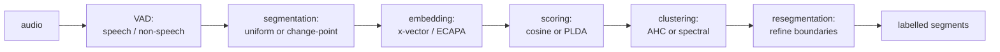

# Diarization and Speaker Identity: Who Spoke, and When

**What you'll be able to do after this:** explain why "who spoke" is a different
problem from "what was said" and cannot be read off an ASR transcript; build the
classical pipeline and see why its clustering threshold must track embedding quality;
compute DER with its three components and the speaker-mapping step, and know why a
single-speaker guess scores 50% on a balanced two-party call; and state why speaker
verification is unsafe as a sole authentication factor.

This chapter is not in the Vizuara syllabus. It is here because meeting assistants,
multi-party calls and any agent that must attribute a statement to a person cannot be
built without it — and because it is where the voiceprint privacy obligations live.

---

## 1. Intuition

An ASR system answers *what words were spoken*. It has no concept of a person. Feed it
a two-party phone call on one channel and it returns a single stream of words with the
speaker boundaries silently erased — "yes I can do Tuesday what time works for you"
could be one speaker or two, and the transcript cannot tell you.

Speaker diarization answers the orthogonal question: **segment the audio by speaker
identity, without knowing in advance who the speakers are or how many there are.**
That last clause is what makes it hard. It is clustering with an unknown number of
clusters, on a signal where the same person sounds different across a call (loudness,
emotion, channel) and different people sometimes sound alike.

The framing that makes the problem tractable: find an embedding space where **distance
means "different person" and not "different words".** A speaker embedding must be
invariant to what was said, to how loud it was, and to the channel — while remaining
discriminative for the speaker. That is a strong requirement, and it is why speaker
embeddings are trained with explicitly discriminative objectives rather than as a
by-product of recognition.

Three distinct tasks are routinely conflated, and keeping them apart is most of the
clarity available here:

| Task | Question | Enrolment needed | Output |
|---|---|---|---|
| **Diarization** | Who spoke when? | none | anonymous labels: speaker_0, speaker_1 |
| **Identification** | Which of my $N$ known people is this? | yes, $N$ enrolments | a name, or "unknown" |
| **Verification** | Is this the person they claim? | yes, one enrolment | accept / reject |

Diarization produces *relative* identity — it can tell you two utterances came from the
same person without knowing who that is. Identification and verification require
enrolment and produce *absolute* identity, which brings a biometric under data
protection law ([`../08-eval-safety/03-safety-and-privacy.md`](../08-eval-safety/03-safety-and-privacy.md)).

One more practical note before the mechanics. For a **two-party phone call, diarization
is often unnecessary**: if you have separate RTP streams or a stereo recording with one
party per channel, channel identity *is* speaker identity, exactly and for free.
Discarding that separation by mixing to mono and then running diarization to recover it
is a surprisingly common self-inflicted wound. Diarization is for single-channel
mixtures: conference rooms, mixed recordings, and any call where the carrier hands you
one stream.

---

## 2. Rigour

### 2.1 The classical pipeline



Each stage has a characteristic failure, and knowing them turns debugging from
guesswork into elimination:

| Stage | Failure | Downstream effect |
|---|---|---|
| VAD | speech missed | those words are unattributed (DER *miss*) |
| VAD | noise kept | phantom speaker or corrupted embedding (DER *false alarm*) |
| Segmentation | segment spans a speaker change | embedding is a blend; clustering cannot fix it |
| Embedding | segment too short | high variance; the dominant error source in practice |
| Clustering | threshold wrong | wrong number of speakers (§2.4) |
| Overlap | simultaneous speech | one of the two is always missed by a single-label system |

The **short-segment problem** deserves emphasis because it drives real designs. A
reliable speaker embedding wants on the order of 1.5–3 seconds of speech; conversational
turns are frequently shorter than that, and backchannels ("mhm", "right") are far
shorter. So the segments you most want to attribute are the ones you can least reliably
embed. Every production system trades here: longer windows give better embeddings and
worse boundary resolution.

### 2.2 Speaker embeddings

The lineage:

**i-vectors** (Dehak et al., 2011) — a factor-analysis model over GMM supervector
statistics, producing a low-dimensional total-variability vector. Generative, elegant,
superseded.

**x-vectors** (Snyder et al., 2018) — a time-delay neural network trained to classify
speakers, with a **statistics pooling** layer that aggregates mean and standard
deviation over time. Two properties made this the turning point: pooling makes the
output length-independent, and training discriminatively for speaker ID yields
embeddings that transfer to speakers never seen in training.

**ECAPA-TDNN** (Desplanques et al., 2020) — adds squeeze-excitation, multi-scale
Res2Net blocks and *attentive* statistics pooling, so the pooling weights informative
frames more heavily. The current common default, typically 192-dimensional.

Scoring two embeddings:

- **Cosine similarity** — simple, needs no training, works well with modern embeddings
  after length normalisation.
- **PLDA** — models within-speaker and between-speaker covariance explicitly and
  produces a calibrated log-likelihood ratio. Better when domain-matched, and it
  requires training data from your domain; a mismatched PLDA is worse than cosine.

The quantity that determines whether clustering can work is the **separation** between
the within-speaker and between-speaker similarity distributions. Measured on synthetic
192-dimensional embeddings where I control the within-speaker noise directly
`[MEASURED]`:

| Embedding noise | Within-speaker cos | Between-speaker cos | Separation | Clusters found (thr 0.5) | Purity |
|---|---|---|---|---|---|
| 0.3 | 0.917 | −0.081 | +0.997 | **2** | 100% |
| 0.6 | 0.735 | −0.071 | +0.805 | **2** | 100% |
| 1.0 | 0.510 | −0.055 | +0.565 | 8 | 100% |
| 1.5 | 0.305 | −0.037 | +0.342 | 50 | 100% |

Two things to read off this. Between-speaker similarity stays near zero throughout — in
high dimension, unrelated vectors are nearly orthogonal, which is what makes the space
usable at all. And **the failure mode is over-segmentation, not confusion**: purity
stays at 100% while the cluster count explodes from 2 to 50. Degraded embeddings do not
merge speakers; they split each speaker into fragments. That asymmetry is worth
internalising because it tells you what a diarization failure looks like in production —
23 speakers in a two-person call, not two speakers swapped.

### 2.3 Clustering with an unknown number of speakers

**Agglomerative hierarchical clustering (AHC).** Start with every segment its own
cluster, repeatedly merge the most similar pair, stop at a similarity threshold. The
threshold, not the algorithm, determines the speaker count.

**Spectral clustering.** Build an affinity matrix, take the eigenvectors of its
Laplacian, and cluster in that space. The number of speakers can be estimated from the
**eigengap** — the largest jump in the sorted eigenvalue spectrum — which is a
principled alternative to a threshold and more robust when clusters are non-spherical.

**Bayesian / VBx.** A variational HMM over speaker states with a Bayesian prior on
speaker count, which jointly smooths temporal assignment and estimates the number of
speakers. Strong results and more machinery.

### 2.4 The threshold is the whole game

Measured with fixed embedding noise of 1.0, sweeping only the AHC stopping threshold
`[MEASURED]`:

| Threshold | Clusters found | Purity | Correct ($k = 2$)? |
|---|---|---|---|
| 0.20 | 2 | 100% | **yes** |
| 0.35 | 2 | 100% | **yes** |
| 0.50 | 11 | 100% | no |
| 0.65 | 48 | 100% | no |
| 0.80 | 50 | 100% | no |

At one fixed embedding quality, the threshold moves the answer from correct to
50 clusters. And the correct threshold *depends on the embedding quality*: at noise 0.3
a threshold of 0.5 was right (§2.2), and at noise 1.0 it is badly wrong. Since
embedding quality varies with segment length, channel, noise and language, **a
hard-coded threshold is a hard-coded assumption about your audio**.

The practical responses, in order of robustness: calibrate the threshold on held-out
data *from your domain*; prefer eigengap-based speaker-count estimation over a raw
threshold; if you know the speaker count a priori — a two-party call, a scheduled
meeting with a known attendee list — **pass it in**, because the hardest part of the
problem disappears. Constraining $k$ is the single largest accuracy win available.

### 2.5 End-to-end neural diarization

EEND (Fujita et al., 2019) replaces the pipeline with a single network emitting
per-frame, per-speaker activity, trained with a **permutation-invariant loss** — the
loss takes the minimum over assignments of output slots to reference speakers, because
"speaker 1" is an arbitrary label.

The decisive advantage is **overlap**. A clustering pipeline assigns each segment one
label by construction, so simultaneous speech is unrepresentable. EEND emits
independent per-speaker activity, so overlap is native. Given that overlap is where
conversational diarization errors concentrate, this matters.

The historical limitation was a fixed maximum speaker count; EEND-EDA and
speaker-attractor variants address it by generating attractors until a stopping
criterion fires. The current practical landscape is hybrid — neural segmentation with
overlap awareness, then embedding and clustering for identity across the recording,
which is the architecture `pyannote.audio` uses.

### 2.6 DER, and its three components

**Diarization error rate** is total misattributed speaker time over total reference
speaker time:

$$\mathrm{DER} = \frac{T_{\text{miss}} + T_{\text{false alarm}} + T_{\text{confusion}}}{T_{\text{total}}}$$

- **Miss** — reference speech with no hypothesis speaker (usually a VAD failure).
- **False alarm** — hypothesis speech where the reference has none.
- **Confusion** — speech attributed to the wrong speaker.

Two subtleties make DER easy to compute wrongly.

**The mapping step.** Hypothesis labels are arbitrary, so you must first find the
optimal one-to-one mapping between hypothesis and reference speakers — a linear
assignment problem — and only then count errors. Skipping it can report near-100% DER
for a perfect diarization that happened to name the speakers the other way round.

**The collar.** Human boundary annotations are imprecise, so DER is conventionally
computed with a forgiveness collar (commonly 250 ms) around each reference boundary.
Reported DERs with and without a collar differ substantially, and comparing across
papers requires knowing which was used — the same problem as the WER normaliser in
[`07-evaluation.md`](07-evaluation.md) §2.2. Whether overlap is scored is a second such
flag.

Measured on a synthetic four-turn two-speaker reference, no collar `[MEASURED]`:

| Hypothesis | DER | Miss | False alarm | Confusion |
|---|---|---|---|---|
| Accurate boundaries, correct 2 speakers | **8.25%** | 1.67% | 0.00% | 6.58% |
| Turns merged into 2 long blocks | **50.00%** | 0.00% | 0.00% | 50.00% |
| Everything labelled one speaker | **50.00%** | 0.00% | 0.00% | 50.00% |

The third row is the one to remember: **on a balanced two-speaker conversation,
guessing "one speaker throughout" scores 50% DER.** So 50% is not a bad score, it is
the trivial baseline, and a system at 45% has barely demonstrated it can hear a
difference. This is directly analogous to accuracy on a balanced binary task, and it is
why DER must always be read against the trivial baseline for that recording's speaker
balance. Note also the second row scoring identically to the third despite being a
structurally better hypothesis — DER is time-weighted and cares nothing for how many
boundaries you got approximately right.

### 2.7 Verification, and why it is not authentication

Verification compares a claimed identity's enrolled embedding against a test embedding
and thresholds the score. The operating characteristic is the tradeoff between **false
accept rate** and **false reject rate**, summarised at the **equal error rate**.

For a voice agent the security conclusion is unambiguous: **voice is not an
authentication factor on its own.** Three reasons, and the third is decisive.
Modern zero-shot TTS clones a voice from seconds of audio
([`../04-tts/02-codec-lm-tts.md`](../04-tts/02-codec-lm-tts.md)), so a spoofed sample is
cheap. A phone call is a replay channel by nature, so recorded audio is trivially
injectable. And a biometric cannot be revoked — a leaked voiceprint is leaked
permanently, unlike a password.

Legitimate uses remain: as one signal among several in a risk score, for
personalisation rather than authorisation, and for fraud *detection* (flagging that
this caller does not sound like the account holder) which fails safe by escalating
rather than granting. Anti-spoofing countermeasures exist and are an arms race, not a
solution.

---

## 3. From scratch

Agglomerative clustering over speaker embeddings, and frame-based DER with the mapping
step. Standalone, numpy only.

```python
"""Speaker clustering and DER, with the two things people get wrong:
the clustering threshold must track embedding quality, and DER needs a mapping."""
import numpy as np
from itertools import permutations

def unit(x):
    return x / np.linalg.norm(x, axis=-1, keepdims=True)

def make_embeddings(centroid, n, noise, rng, dim):
    """Noise scaled by 1/sqrt(dim) so `noise` is the vector-norm ratio.
    Without that scaling, per-dimension noise of 0.3 in 192-D has norm ~4.2 and
    swamps a unit centroid -- the embeddings become pure noise."""
    return unit(centroid + (noise / np.sqrt(dim)) * rng.standard_normal((n, dim)))

def agglomerative(X, threshold):
    """AHC with average linkage on cosine similarity. Stops when the most similar
    remaining pair falls below `threshold`, so the threshold -- not the algorithm
    -- decides the speaker count."""
    S = X @ X.T
    labels = np.arange(len(X))
    while True:
        ids = np.unique(labels)
        if len(ids) < 2:
            break
        best = (-2.0, None)
        for i, a in enumerate(ids):
            for b in ids[i + 1:]:
                sim = S[np.ix_(labels == a, labels == b)].mean()
                if sim > best[0]:
                    best = (sim, (a, b))
        if best[0] < threshold:
            break
        a, b = best[1]
        labels[labels == b] = a
    return labels

def purity(labels, truth):
    return sum(max((truth[labels == i] == k).sum() for k in np.unique(truth))
               for i in np.unique(labels)) / len(truth)

def der(reference, hypothesis, step=0.01):
    """Frame-based DER over (start, end, label) segments.

    The permutation search is the part naive implementations omit: hypothesis
    labels are arbitrary, so errors can only be counted after the best
    hypothesis-to-reference speaker mapping is found.
    """
    end = max(max(e for _, e, _ in reference), max(e for _, e, _ in hypothesis))
    n = int(end / step)

    def grid(segments):
        g = [set() for _ in range(n)]
        for s, e, label in segments:
            for i in range(int(s / step), min(n, int(e / step))):
                g[i].add(label)
        return g

    R, H = grid(reference), grid(hypothesis)
    ref_labels = sorted({l for _, _, l in reference})
    hyp_labels = sorted({l for _, _, l in hypothesis})

    best = None
    for perm in permutations(hyp_labels, min(len(hyp_labels), len(ref_labels))):
        mapping = dict(zip(perm, ref_labels))
        miss = fa = conf = total = 0
        for i in range(n):
            r = R[i]
            h = {mapping[x] for x in H[i] if x in mapping}
            total += len(r)
            miss += max(0, len(r) - len(h))
            fa += max(0, len(h) - len(r))
            conf += len(r - h) - max(0, len(r) - len(h))
        score = (miss + fa + conf) / max(total, 1)
        if best is None or score < best[0]:
            best = (score, miss / total, fa / total, conf / total, mapping)
    return best

if __name__ == "__main__":
    rng = np.random.default_rng(5)
    DIM = 192
    c1, c2 = unit(rng.standard_normal(DIM)), unit(rng.standard_normal(DIM))

    print(f"{'noise':>6} {'within':>8} {'between':>8} {'sep':>7} {'clusters':>9} {'purity':>7}")
    for noise in (0.3, 0.6, 1.0, 1.5):
        A = make_embeddings(c1, 25, noise, rng, DIM)
        B = make_embeddings(c2, 25, noise, rng, DIM)
        X, y = np.vstack([A, B]), np.array([0] * 25 + [1] * 25)
        S = X @ X.T
        within = (S[:25, :25].sum() - 25 + S[25:, 25:].sum() - 25) / (2 * 25 * 24)
        between = S[:25, 25:].mean()
        labels = agglomerative(X, 0.5)
        print(f"{noise:6.1f} {within:8.3f} {between:8.3f} {within - between:+7.3f} "
              f"{len(np.unique(labels)):9d} {100 * purity(labels, y):6.0f}%")

    print("\nthreshold sweep at noise=1.0 -- one fixed embedding quality:")
    A = make_embeddings(c1, 25, 1.0, rng, DIM)
    B = make_embeddings(c2, 25, 1.0, rng, DIM)
    X, y = np.vstack([A, B]), np.array([0] * 25 + [1] * 25)
    for thr in (0.20, 0.35, 0.50, 0.65, 0.80):
        labels = agglomerative(X, thr)
        k = len(np.unique(labels))
        print(f"  thr={thr:.2f} -> {k:2d} cluster(s), purity {100*purity(labels,y):3.0f}%"
              f"{'   <- correct k=2' if k == 2 else ''}")

    print()
    ref = [(0.0, 3.0, "A"), (3.0, 6.0, "B"), (6.0, 9.0, "A"), (9.0, 12.0, "B")]
    for name, hyp in [
        ("accurate", [(0.2, 3.1, "s1"), (3.1, 5.5, "s2"),
                      (5.5, 9.2, "s1"), (9.2, 12.0, "s2")]),
        ("merged turns", [(0.0, 6.0, "s1"), (6.0, 12.0, "s2")]),
        ("one speaker", [(0.0, 12.0, "s1")]),
    ]:
        d, miss, fa, conf, _ = der(ref, hyp)
        print(f"{name:13s} DER={100*d:6.2f}%  miss={100*miss:5.2f}%  "
              f"fa={100*fa:5.2f}%  confusion={100*conf:5.2f}%")
```

The `make_embeddings` noise scaling is worth dwelling on, because getting it wrong is
how I first wrote this and the result was silently meaningless. In 192 dimensions,
per-dimension Gaussian noise with $\sigma = 0.3$ has expected norm
$0.3\sqrt{192} \approx 4.2$ — four times the unit centroid — so the "speakers" were
indistinguishable random vectors and every configuration produced 50 clusters. High
dimension makes norms behave unintuitively, and any synthetic embedding experiment must
scale noise by $1/\sqrt{d}$ for the parameter to mean what you think it means.

---

## 4. How production does it

**`pyannote/pyannote-audio`** is the de facto open reference: a pipeline of neural
segmentation with overlap awareness, embedding extraction, and clustering, distributed
as versioned pretrained pipelines. Two operational notes. Its models are gated on
Hugging Face, so deployment needs a token and a licence review. And it exposes the
speaker-count constraint from §2.4 — passing a known or bounded number of speakers is
the cheapest accuracy improvement available.

**`NVIDIA/NeMo`** ships a diarization stack including the VBx-style clustering
lineage and neural diarization models, plus multi-scale segmentation that addresses
§2.1's short-segment tradeoff by extracting embeddings at several window lengths and
fusing them — a direct engineering answer to the boundary-resolution-versus-embedding-
quality conflict.

**`m-bain/whisperX`** combines Whisper transcription with diarization and forced
alignment, which is the shape most applications want: words, times, and speakers
together. Note the architecture — three separate models, because none of the three
problems is solved by the others.

**`k2-fsa/sherpa-onnx`** provides ONNX speaker-embedding models and diarization
suitable for on-device or CPU deployment, which matters when audio cannot leave the
machine.

**`wenet-e2e/wespeaker`** and **`modelscope/3D-Speaker`** are the embedding-model
zoos: ECAPA-TDNN, ResNet and CAM++ variants with published verification benchmarks.
This is where to get an embedding extractor rather than training one.

**The channel shortcut, restated because it is so often missed.** If your telephony
integration can deliver separate streams per participant — and SIP conference bridges
often can — take them. Per-channel attribution is exact and free. Diarization is the
fallback for mixed audio, not the default
([`../07-livekit/05-telephony-sip.md`](../07-livekit/05-telephony-sip.md)).

---

## 5. At scale

**Offline diarization and real-time diarization are different products.** The classical
pipeline is inherently offline: clustering needs all the embeddings before it can decide
how many speakers exist. Online diarization must assign a label to the current segment
without seeing the future, which means incremental clustering, a growing speaker
inventory, and the possibility of *revising* earlier labels — the same commit-versus-
revise dilemma as streaming ASR ([`05-streaming-asr.md`](05-streaming-asr.md) §2.4),
with the same conclusion: decide where a wrong label is cheap, and never let an
irreversible action depend on an unstable one.

**Cost is dominated by embedding extraction, and it is easy to bound.** One embedding
per segment per scale, so multi-scale segmentation multiplies the cost by the number of
scales. Embedding models are small compared with ASR encoders, so diarization typically
adds a modest fraction to the ASR cost — but the clustering step is $O(n^2)$ in
segments for AHC, which becomes the bottleneck on long recordings. An hour-long meeting
at 1.5-second segments is 2400 segments and roughly 2.9 million similarity computations
per merge sweep; naive implementations become quadratic-time in wall clock. Use a
sparse affinity matrix or spectral clustering beyond a few thousand segments.

**Speaker enrolment turns diarization into identification, and turns your database into
a biometric store.** Enrolled voiceprints are biometric data: special-category personal
data under GDPR Article 9, with specific consent regimes in some US states. That
changes retention, access control and deletion obligations, and it is a decision to
make deliberately rather than by accident when someone adds a `speaker_embeddings`
table. Treated fully in
[`../08-eval-safety/03-safety-and-privacy.md`](../08-eval-safety/03-safety-and-privacy.md).

**Evaluate against the trivial baseline, always.** §2.6 showed that "one speaker
throughout" scores 50% DER on a balanced two-party call. Report the baseline for each
recording alongside the system's DER; without it, a DER number is uninterpretable. Also
report whether a collar was used and whether overlap was scored, for the same reason a
WER needs its normaliser.

**Overlap is where the remaining errors live.** In natural multi-party conversation a
meaningful fraction of speech is overlapped, and clustering pipelines miss all of it by
construction (§2.5). If your product depends on attributing interruptions — which a
meeting assistant does, since interruptions carry the conversational dynamics people
want summarised — you need overlap-aware segmentation, not a better clusterer.

---

## 6. Exercises

**E2.9.1** Run the §3 code, then remove the $1/\sqrt{d}$ noise scaling and re-run.
Report the within-speaker cosine and cluster count, and compute the expected norm of the
unscaled noise vector to explain the result.

**E2.9.2** For each embedding-noise level in §2.2, find the threshold range that
recovers $k = 2$. Plot the correct-threshold band against noise and state what this
implies about shipping a fixed threshold.

**E2.9.3** Implement eigengap-based speaker-count estimation via spectral clustering on
the same synthetic data. Compare its accuracy against thresholded AHC across all four
noise levels.

**E2.9.4** Add a third speaker whose centroid is deliberately close to the first
(cosine 0.6). Report purity and cluster count, and identify at which noise level the two
similar speakers merge.

**E2.9.5** Extend the §3 `der` to support a forgiveness collar of 250 ms around
reference boundaries. Recompute all three hypotheses from §2.6 and report how much the
collar improves each. Which hypothesis benefits most, and why?

**E2.9.6** Construct a reference with 20% overlapped speech. Compute DER for a
single-label hypothesis and decompose the error. What fraction of the total DER is
attributable to overlap alone?

**E2.9.7** For a two-party phone call, compute the trivial-baseline DER as a function of
the speaking-time ratio between the parties, from 50/50 to 90/10. At what ratio does
"one speaker throughout" become a strong-looking score, and what does that say about
reporting DER without the baseline?

---

## 7. Interview drill

> "Our meeting assistant produces transcripts where speaker labels are scrambled — a
> two-person meeting comes back with eleven speakers, and the same person appears as
> speakers 3, 7 and 9. Diagnose it."

The symptom names the failure class immediately, and saying so is the first mark:
**over-segmentation, not confusion.** §2.2 showed that degraded embeddings never merge
distinct speakers, they fragment each speaker — purity stayed at 100% while cluster
count went from 2 to 50. Eleven clusters for two people with each person split across
several is exactly that signature, so the embeddings are not discriminating well enough
at the threshold in use.

Then the causal chain, in the order worth checking. **Segment length** is the most likely
root cause: a meeting is full of short turns and backchannels, embeddings from
sub-second segments have high variance, and §2.1 says these are the segments you most
want and can least trust. **Audio conditions** compound it — far-field room microphones,
reverberation and overlapping speech all degrade embeddings relative to the close-talking
data the extractor was probably trained on. **The threshold is then wrong by
construction**, because §2.4 showed the correct threshold depends on embedding quality,
and a default calibrated on clean telephony will over-segment on far-field meeting audio.

The fixes, ordered by benefit per effort. **Constrain the speaker count** — a meeting
has an invite list, so pass $k$ or an upper bound; this removes the hardest part of the
problem and is nearly free. **Use multi-scale segmentation** so short turns are
attributed using longer surrounding context, which is precisely the NeMo approach in §4.
**Recalibrate the threshold on your own audio**, or switch to eigengap estimation so
there is no threshold to miscalibrate. **Use overlap-aware neural segmentation**, since a
meeting assistant specifically needs interruptions attributed and clustering pipelines
cannot represent them.

The senior addition is to question the problem statement: if this is a video-conference
integration, per-participant audio streams may be available, in which case speaker
attribution is exact and free and the entire diarization stage should be deleted rather
than fixed. Reaching for the constraint that dissolves the problem — rather than the
better algorithm — is the answer that distinguishes an engineer from a modeller.

Close on measurement, because the original report was anecdotal: build a labelled set of
your own meetings, report DER with the collar and overlap conventions stated, and always
report the trivial single-speaker baseline alongside it (§2.6), since without it nobody
in the room can tell whether the new number is good.

---

## Sources

- Dehak, N. et al. (2011). *Front-End Factor Analysis for Speaker Verification.* IEEE TASLP 19(4) — i-vectors.
- Snyder, D., Garcia-Romero, D., Sell, G., Povey, D. & Khudanpur, S. (2018). *X-vectors: Robust DNN Embeddings for Speaker Recognition.* ICASSP — statistics pooling, §2.2.
- Desplanques, B., Thienpondt, J. & Demuynck, K. (2020). *ECAPA-TDNN.* arXiv:2005.07143 — attentive statistics pooling and the 192-dimensional embeddings used as the reference size in §2.2.
- Fujita, Y. et al. (2019). *End-to-End Neural Diarization with Permutation-Free Objectives.* arXiv:1909.05952; and Horiguchi, S. et al. (2020). *EEND-EDA* arXiv:2005.09921 — §2.5.
- Landini, F. et al. (2022). *Bayesian HMM clustering of x-vector sequences (VBx).* Computer Speech & Language — the VBx approach in §2.3.
- Bredin, H. et al. — `pyannote/pyannote-audio`, the neural segmentation plus clustering pipeline in §4.
- NIST Rich Transcription evaluation plans — the DER definition, the 250 ms forgiveness collar convention, and the speaker-mapping requirement in §2.6.
- `NVIDIA/NeMo` (multi-scale diarization), `m-bain/whisperX`, `k2-fsa/sherpa-onnx`, `wenet-e2e/wespeaker`, `modelscope/3D-Speaker` — production references in §4, checked 2026-08.
- All `[MEASURED]` values in §2.2, §2.4 and §2.6 were produced by the code in §3 on Apple M5 / macOS 26.5.2 via `uv run --python 3.12 --with numpy`, numpy 2.5.2.
