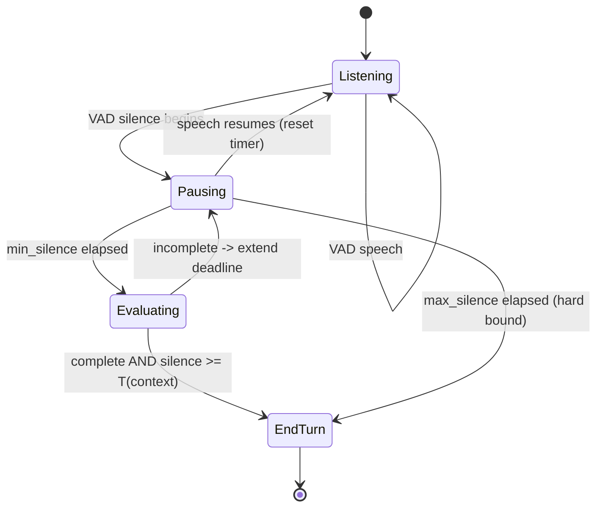

# Endpointing: Deciding the Turn Is Over

**What you'll be able to do after this:** frame end-of-turn detection as a decision
under uncertainty with asymmetric costs; read the cut-off-rate versus added-latency
frontier and pick an operating point from a cost ratio rather than a habit; prove that
an adaptive policy dominates any fixed timeout, and quantify how accurate the signal
must be; and design a policy that combines VAD silence, ASR stability and syntactic
completeness into one state machine.

This is the highest-leverage chapter in the curriculum. The endpointing wait is
routinely the largest single term in the latency budget
([`../01-foundations/04-latency-budget.md`](../01-foundations/04-latency-budget.md)),
and it costs no compute — it is pure policy.

---

## 1. Intuition

Your VAD reports silence. The user has stopped making sound. Now what?

You cannot know whether they are finished. They might be done, or drawing breath, or
thinking, or about to add "…actually, make that Thursday". The only way to be certain
is to wait until they speak again — and waiting is exactly the thing you cannot afford.

So endpointing is not a detection problem, it is a **betting** problem. Every silence
forces a wager: end the turn now and risk cutting the user off, or wait longer and
guarantee dead air. There is no algorithm that avoids the wager, and no amount of model
quality removes it, because the information you need is in the future.

What makes this tractable is that the two errors have **different and asymmetric
costs**, and the asymmetry depends on context:

- **Cutting the user off** interrupts them mid-thought. They must repeat themselves,
  the agent has half the information, and the interaction feels aggressive. In a
  medical or financial context it is worse: acting on half a sentence can be dangerous.
- **Dead air** makes the agent feel slow or broken. Users start talking again to fill
  the gap, which creates overlap you now have to resolve. It is annoying rather than
  dangerous.

Because the costs differ, the optimal wait differs — and it differs *within a single
conversation*. After "what's your account number?" you should wait a long time, because
people pause inside digit strings. After "is that correct?" you should wait almost no
time, because the answer is one word. A single global timeout is a claim that every turn
in your product has the same cost structure, which is never true.

The last intuition, and the one that unlocks the engineering: **the information that
disambiguates a pause is not acoustic.** Silence is silence. What tells you the turn is
over is *what was said* — "I'd like to book a" is obviously unfinished, "I'd like to
book a table for four" is obviously complete. So a good endpointer is mostly a
linguistic component wearing an audio costume, which is why §2.4 can beat any silence
timer.

---

## 2. Rigour

### 2.1 The decision problem

At each moment of silence, with elapsed silence $s$, choose to end the turn or continue
waiting. Let $C_{\text{cut}}$ be the cost of ending while the user intended to
continue, and $C_{\text{wait}}$ the cost per unit time of waiting. With $P(\text{done}
\mid s, \text{context})$ the posterior that the turn is complete, end the turn when

$$(1 - P(\text{done} \mid s, \text{context})) \cdot C_{\text{cut}} < C_{\text{wait}} \cdot \Delta t$$

Three things fall out of this formulation immediately.

**A fixed timeout is the degenerate case** where you ignore context and approximate the
posterior by elapsed silence alone.

**The cost ratio $C_{\text{cut}} / C_{\text{wait}}$ sets the operating point.** It is a
product decision, not an engineering one, and it should be written down. §2.5 computes
the optimum as a function of it.

**Improving the posterior is worth more than tuning the threshold**, because a sharper
posterior improves *both* error rates at once, while moving the threshold only trades
one for the other. That is the argument for §2.4 in one sentence.

### 2.2 Why pause distributions overlap

Simulating two pause populations — hesitation pauses where the speaker continues, and
turn-final pauses where they are done — as lognormals with medians of 250 ms and 900 ms,
200 000 samples `[MEASURED]`:

| Population | Median | p90 |
|---|---|---|
| Mid-turn (hesitation) | 251 ms | 507 ms |
| Turn-final | 898 ms | 1705 ms |

The distributions are well separated at their medians and still overlap in the tails,
and the overlap is the entire problem. A threshold at 250 ms catches most turn ends
quickly and fires during a majority of hesitations. A threshold at 900 ms almost never
cuts anyone off and adds nearly a second to every turn.

Note the shape: lognormal, so **right-skewed with a long tail**. This matters
practically. The mean is a poor summary, the tail is heavy enough that "just wait for
the p99 hesitation" costs seconds, and any threshold you choose will be wrong for a
non-trivial fraction of pauses no matter how carefully you tune it.

### 2.3 The fixed-timeout frontier

Sweeping the timeout, with 35% of detected silences being mid-turn hesitations
`[MEASURED]`:

| Timeout | Cut-off rate | Added latency |
|---|---|---|
| 200 ms | **65.88%** | 200 ms |
| 300 ms | 37.36% | 300 ms |
| 400 ms | 19.85% | 400 ms |
| 500 ms | 10.50% | 500 ms |
| 600 ms | 5.69% | 600 ms |
| 700 ms | 3.04% | 700 ms |
| 800 ms | 1.70% | 800 ms |
| 1000 ms | 0.60% | 1000 ms |
| 1200 ms | 0.24% | 1200 ms |
| 1500 ms | 0.06% | 1500 ms |

This table explains a great deal of observed voice-agent behaviour.

**It explains why 700–800 ms became the folk default.** It is where the cut-off rate
falls to a few percent — the first point where the agent stops feeling rude. It is also
700–800 ms of latency on every single turn, which is why those agents feel sluggish.

**It explains why "just make it faster" fails.** Dropping from 700 ms to 400 ms saves
300 ms and takes the cut-off rate from 3% to 20%. One turn in five gets interrupted. The
agent is faster and much worse, and the team that made the change will hear about
interruptions rather than latency.

**The frontier is steep at the low end and flat at the high end.** Between 200 and
400 ms, each 100 ms buys enormous cut-off reduction; between 1000 and 1500 ms, 500 ms
buys half a percent. So there is a knee, it sits somewhere around 500–800 ms for this
distribution, and *any* fixed timeout is a bad deal on one side of it.

### 2.4 Adaptive endpointing dominates

Now condition the timeout on a signal that predicts completeness — syntactic
completeness, a semantic turn detector, or the expected answer type. Use a short timeout
when the signal says "complete", a long one when it says "incomplete". Measured across
signal accuracies `[MEASURED]`:

| Signal accuracy | $T_{\text{short}}$ | $T_{\text{long}}$ | Cut-off rate | Mean wait on real turn ends |
|---|---|---|---|---|
| 0.70 | 250 ms | 1000 ms | 15.59% | 476 ms |
| 0.70 | 300 ms | 900 ms | 11.91% | 481 ms |
| 0.85 | 250 ms | 1000 ms | 7.99% | 362 ms |
| 0.85 | 300 ms | 900 ms | 6.36% | 390 ms |
| 0.95 | 250 ms | 1000 ms | 3.08% | 287 ms |
| 0.95 | **300 ms** | **900 ms** | **2.78%** | **330 ms** |
| 0.95 | 200 ms | 1200 ms | 3.46% | 250 ms |

Compare the highlighted row against the fixed-timeout table. A 95%-accurate completeness
signal achieves **2.78% cut-off at 330 ms mean wait**. The best fixed timeout achieving a
comparable cut-off rate is 700 ms, at 3.04% — so the adaptive policy is **slightly better
on cut-offs and 370 ms faster**. That is not a marginal gain; 370 ms is a third of a
typical perceived gap, obtained with no change to any model in the pipeline.

Two further readings that matter for what to build.

**Even a mediocre signal helps.** At 70% accuracy — barely better than a coin flip on
the minority class — the policy delivers 11.91% cut-off at 481 ms. The comparable fixed
timeout is 500 ms at 10.50%, so a weak signal is roughly break-even. The useful
conclusion is that the signal must be *good* to pay off, which is precisely why the
transformer turn detectors in
[`03-semantic-turn-detection.md`](03-semantic-turn-detection.md) exist rather than
hand-written heuristics.

**Accuracy improves both axes simultaneously.** Going from 0.70 to 0.95 at fixed
timeouts (300/900) takes cut-offs from 11.91% to 2.78% *and* mean wait from 481 ms to
330 ms. This is the §2.1 point empirically: a better posterior moves the whole frontier,
whereas threshold tuning only slides along it.

### 2.5 Choosing the operating point from costs

With cost of a cut-off expressed as a multiple $k$ of the cost of waiting 100 ms, the
optimal fixed timeout is `[MEASURED]`:

| $k$ | Optimal timeout | Cut-off rate at optimum |
|---|---|---|
| 2 | 880 ms | 1.07% |
| 5 | 1080 ms | 0.40% |
| 10 | 1260 ms | 0.17% |
| 20 | 1300 ms | 0.13% |
| 50 | 1480 ms | 0.06% |

The optimum rises with $k$, and it rises **sub-linearly** — a 25× increase in the cost
ratio moves the timeout by less than 2×, because the frontier's tail is so flat.
Practically: if cut-offs are expensive in your domain, you should wait noticeably longer
than the folk default, and the exact value is not delicate. Being roughly right about
$k$ matters far more than being precise about the timeout.

This is also the honest framing to bring to a product discussion. Rather than arguing
about milliseconds, ask: *how many times worse is interrupting a caller than making them
wait an extra 100 ms?* If the answer is "ten times", the timeout should be around
1.2 seconds — and if the resulting latency is unacceptable, the correct response is to
buy a better completeness signal (§2.4), not to accept a cut-off rate nobody chose.

### 2.6 Context-dependent policies

Beyond a global signal, the expected answer type sharply constrains the posterior. This
is cheap because *you* asked the question, so you know what is coming:

| Agent's last utterance | Expected reply | Reasonable timeout | Why |
|---|---|---|---|
| "Is that correct?" | yes / no | 200–300 ms | One word; a pause after it means done |
| "What's your account number?" | digit string | 1200–2000 ms | People pause between digit groups |
| "How can I help you today?" | free-form | 700–900 ms | Unconstrained; hesitation likely |
| "Anything else?" | yes / no / list | 400–600 ms | Short but may extend |
| "Please describe the problem." | long narrative | 1000–1500 ms | Multi-clause, mid-turn pauses expected |

The digit-string case is worth internalising as the canonical failure. "Four one five…
two two two… nine nine nine nine" contains two 800 ms pauses. A 700 ms global timeout
ends the turn after "four one five", the agent responds to a partial phone number, and
the user has to start over. Every deployment that takes numbers from callers hits this,
and the fix is not a better model — it is knowing that you just asked for digits.

Two mechanisms that compose with the above:

**ASR stability as evidence.** If the partial transcript has stopped changing for
200 ms, that is independent evidence the speaker has stopped
([`../02-asr/05-streaming-asr.md`](../02-asr/05-streaming-asr.md) §2.6), and it is
available before a silence timer would fire.

**Prosody.** Terminal falling pitch signals completion; sustained or rising pitch
signals continuation. Real, language-dependent, and usable — but it requires an $F_0$
tracker and reliable voicing detection, so most teams get more value from the text-based
signal first.

### 2.7 The policy state machine



Two details in that diagram are the difference between a working policy and a hung one.

**`min_silence` before evaluating at all.** Evaluating completeness on every frame of a
50 ms gap wastes compute and produces noisy decisions. Wait for a floor — 150–200 ms —
then start asking.

**`max_silence` as a hard bound.** If the completeness signal keeps saying "incomplete"
— which happens on trailing-off speech, noise that looks like speech, or a genuinely
ambiguous fragment — the turn must still end. Without this bound the agent waits
forever, the user hears nothing, and nothing is logged as an error. This is the same
failure-isolation argument as the maximum utterance duration in
[`01-vad.md`](01-vad.md) §5, and it belongs in every implementation.

---

## 3. From scratch

The frontier measurement and a context-aware policy engine. Standalone, numpy only.

```python
"""Endpointing: the cut-off/latency frontier, and a context-aware policy."""
import numpy as np

def simulate_pauses(n=200_000, p_mid=0.35, seed=4):
    """Two lognormal pause populations. Mid-turn = speaker will continue;
    turn-final = speaker is done. Lognormal because pause durations are
    right-skewed with a heavy tail, which is what makes any threshold wrong
    for a meaningful fraction of pauses."""
    rng = np.random.default_rng(seed)
    mid = rng.lognormal(np.log(0.25), 0.55, n)
    final = rng.lognormal(np.log(0.90), 0.50, n)
    is_mid = rng.random(n) < p_mid
    return mid, final, is_mid, rng

def fixed_frontier(mid, is_mid, timeouts):
    """Cut-off rate = fraction of hesitations whose pause exceeded the timeout,
    i.e. we ended the turn while the speaker intended to continue."""
    out = []
    for T in timeouts:
        cutoff = (is_mid & (mid > T)).sum() / max(is_mid.sum(), 1)
        out.append((T, cutoff, T * 1000))
    return out

def adaptive(mid, is_mid, accuracy, t_short, t_long, seed=7):
    """A completeness signal with the given accuracy selects the timeout.
    Returns (cut-off rate, mean wait on genuine turn ends).

    Own RNG seeded per call, so a row's value never depends on how many other
    rows were computed first -- otherwise the table is not reproducible."""
    rng = np.random.default_rng(seed)
    says_complete = np.where(is_mid,
                             rng.random(len(mid)) > accuracy,   # wrong on mid-turn
                             rng.random(len(mid)) < accuracy)   # right on final
    T = np.where(says_complete, t_short, t_long)
    cutoff = (is_mid & (mid > T)).sum() / max(is_mid.sum(), 1)
    return cutoff, T[~is_mid].mean() * 1000

def optimal_timeout(mid, is_mid, k, grid=np.arange(0.1, 2.01, 0.02)):
    """Minimise k * cutoff_rate + wait_cost, where k is the cost of one cut-off
    expressed in units of 100 ms of waiting. k is a PRODUCT decision."""
    best = None
    for T in grid:
        cutoff = (is_mid & (mid > T)).sum() / max(is_mid.sum(), 1)
        cost = k * cutoff + (T * 1000 / 100) * 0.01
        if best is None or cost < best[0]:
            best = (cost, T, cutoff)
    return best

# --------------------------------------------------------------------------- #
# A policy engine: context sets the deadline, three signals can shorten it.
# --------------------------------------------------------------------------- #
EXPECTED = {                 # expected answer type -> (min_ms, max_ms)
    "yes_no":     (200, 600),
    "short":      (300, 900),
    "freeform":   (500, 1400),
    "digits":     (1200, 2500),
    "narrative":  (1000, 2000),
}

class EndpointPolicy:
    """Combines: silence duration, ASR partial stability, and a completeness
    probability. Emits end-of-turn when the evidence clears the context-dependent
    bar, and unconditionally at max_ms so the turn can never hang."""

    def __init__(self, expected="freeform", complete_threshold=0.7,
                 stability_ms=200, min_eval_ms=150):
        self.min_ms, self.max_ms = EXPECTED[expected]
        self.complete_threshold = complete_threshold
        self.stability_ms = stability_ms
        self.min_eval_ms = min_eval_ms
        self.reset()

    def reset(self):
        self.silence_ms = 0
        self.stable_ms = 0
        self._last_partial = None

    def update(self, frame_ms, is_speech, partial=None, p_complete=None):
        """Call once per audio frame. Returns (end_turn, reason)."""
        if is_speech:
            self.silence_ms = 0
            self.stable_ms = 0
            self._last_partial = partial
            return False, None

        self.silence_ms += frame_ms
        # ASR stability: an unchanged partial is independent evidence of stopping.
        if partial is not None and partial == self._last_partial:
            self.stable_ms += frame_ms
        else:
            self.stable_ms = 0
            self._last_partial = partial

        if self.silence_ms < self.min_eval_ms:
            return False, None                      # too early to judge
        if self.silence_ms >= self.max_ms:
            return True, "max_silence"              # hard bound: never hang
        if self.silence_ms < self.min_ms:
            return False, None                      # context floor not reached

        # Past the floor: require completeness evidence, or ASR stability as a
        # fallback when no completeness model is wired up.
        if p_complete is not None and p_complete >= self.complete_threshold:
            return True, f"complete(p={p_complete:.2f})"
        if p_complete is None and self.stable_ms >= self.stability_ms:
            return True, f"stable({self.stable_ms}ms)"
        return False, None

if __name__ == "__main__":
    mid, final, is_mid, _ = simulate_pauses()
    print(f"mid-turn   median {np.median(mid)*1000:5.0f} ms  p90 {np.percentile(mid,90)*1000:5.0f} ms")
    print(f"turn-final median {np.median(final)*1000:5.0f} ms  p90 {np.percentile(final,90)*1000:5.0f} ms")

    print(f"\n{'timeout':>8} {'cutoff%':>8} {'added_ms':>9}")
    for T, cutoff, added in fixed_frontier(mid, is_mid,
                                           (0.2, 0.3, 0.5, 0.7, 0.8, 1.0, 1.5)):
        print(f"{T*1000:8.0f} {100*cutoff:8.2f} {added:9.0f}")

    print(f"\n{'acc':>5} {'T_short':>8} {'T_long':>7} {'cutoff%':>8} {'mean_wait':>10}")
    for acc in (0.70, 0.85, 0.95):
        for ts, tl in ((0.25, 1.00), (0.30, 0.90), (0.20, 1.20)):
            c, w = adaptive(mid, is_mid, acc, ts, tl)
            print(f"{acc:5.2f} {ts*1000:8.0f} {tl*1000:7.0f} {100*c:8.2f} {w:10.0f}")

    print(f"\n{'k':>5} {'best_T_ms':>10} {'cutoff%':>8}")
    for k in (2, 5, 10, 20, 50):
        _, T, cutoff = optimal_timeout(mid, is_mid, k)
        print(f"{k:5d} {T*1000:10.0f} {100*cutoff:8.2f}")

    # Policy demo: a digit string with an 800 ms internal pause.
    print("\ndigits context, 800 ms internal pause:")
    pol = EndpointPolicy(expected="digits")
    script = ([(True, "four one five")] * 30 + [(False, "four one five")] * 40
              + [(True, "four one five two two two")] * 30
              + [(False, "four one five two two two")] * 140)
    for i, (speech, partial) in enumerate(script):
        end, reason = pol.update(20, speech, partial=partial)
        if end:
            print(f"  ended at frame {i} ({20*i} ms into script): {reason}")
            break
    else:
        print("  never ended within the script")
```

The `EndpointPolicy` class is the deliverable. Three design choices in it are worth
stating explicitly.

**Context sets a floor *and* a ceiling.** `min_ms` prevents the digit-string failure by
refusing to end early no matter what the completeness signal says; `max_ms` prevents a
hang no matter what it says. The signal only operates in the band between them, which
bounds the damage a wrong signal can do in either direction.

**ASR stability is a fallback, not the primary signal.** If no completeness model is
wired up, an unchanged partial for 200 ms is better evidence than silence alone, and it
costs nothing — you already have the partials.

**`update` is synchronous and per-frame.** Like VAD, endpointing must see every frame in
order. An async boundary here introduces jitter into the one measurement the policy is
built on.

---

## 4. How production does it

**LiveKit Agents** exposes endpointing through `AgentSession`, combining a VAD component
with an optional turn-detection model, and the interruption and endpointing behaviour is
configurable on the session. The version-specific parameter names and defaults belong in
[`../07-livekit/02-agents-framework.md`](../07-livekit/02-agents-framework.md); the
architectural point here is that the framework owns the timer and you supply the signals,
so tuning your VAD threshold without knowing the session's endpointing defaults produces
confusing results.

**Silero VAD's `min_silence_duration_ms`** (default 100 ms) is *not* an endpointing
timeout — it is the hangover that prevents segment fragmentation
([`01-vad.md`](01-vad.md) §2.5). Endpointing sits above it and measures silence between
VAD segments. Conflating the two is a common source of accidentally-aggressive
endpointing, since the numbers look similar and are an order of magnitude apart in
purpose.

**Hosted ASR endpointing.** Most streaming ASR vendors implement their own endpointing
and emit an end-of-utterance event, with a configurable silence threshold. If you use
it, their policy is your policy and their default is your latency floor. Find out what it
is, and prefer running your own endpointer over the transcript stream when you need
context-dependent behaviour — which you do, as soon as you ask anyone for a phone number.

**OpenAI Realtime and Gemini Live** perform server-side turn detection with configurable
sensitivity, and the tradeoff is the same one in §2.3 with the dial in someone else's
hands ([`../06-realtime-systems/04-speech-to-speech.md`](../06-realtime-systems/04-speech-to-speech.md)).

---

## 5. At scale

**Endpointing is where you find latency, and it is free to change.** Before optimising
models, measure `speech_end → t_eou` per turn and compare it against the compute terms.
If it dominates — and §2.3 says it usually does — the highest-return work in your entire
system is a better completeness signal, not a faster model.

**Instrument both errors, or you are flying blind.** The two metrics are: cut-off rate,
estimated by counting turns where the user began speaking again within ~500 ms of the
agent starting, and mean endpoint wait. You cannot tune the frontier without both,
because every change trades them against each other, and a change that looks like a
latency win is usually a cut-off regression nobody measured.

**Per-context timeouts need per-context metrics.** A global cut-off rate hides that
digit-entry turns are cut off 30% of the time while yes/no turns are fine. Segment by
expected answer type — which you know, because the agent asked the question — and you
will find the failures immediately.

**Cut-off rate varies by population, so a single global timeout is a fairness issue.**
Speech rate and pause structure differ by age, by language, by whether the speaker is
using their first language, and by cognitive load. A timeout tuned on fluent native
speakers systematically cuts off everyone else. If your product serves a broad
population, measure cut-off rate by segment; this is the kind of disparity that is
invisible in aggregate and obvious once you split the data.

**The policy interacts with barge-in and can oscillate.** Aggressive endpointing
produces more agent responses that begin while the user is still speaking, which raises
interruptions, which raises the barge-in rate, which raises transcript truncations
([`04-barge-in.md`](04-barge-in.md)). Tune them together, and treat a rising
interruption rate as possible evidence that endpointing became too aggressive rather than
as a barge-in problem.

**Bound it, and alert on the bound.** `max_silence` firing frequently means the
completeness signal is failing on a class of input you have not seen. It is a cheap
canary for distribution shift.

---

## 6. Exercises

**E3.2.1** Run the §3 code. Then change `p_mid` from 0.35 to 0.15 and to 0.55, and
recompute the fixed-timeout frontier. How does the optimal timeout move, and what
real-world difference does `p_mid` correspond to?

**E3.2.2** Reproduce the adaptive table for $T_{\text{short}}/T_{\text{long}}$ pairs of
your own choosing, and find the pair that minimises mean wait subject to a cut-off rate
below 3% at 85% signal accuracy. Compare against the best fixed timeout meeting the same
constraint.

**E3.2.3** Derive the minimum signal accuracy at which the adaptive policy strictly
dominates the best fixed timeout — better on both axes. Verify by simulation and explain
why weak signals are not merely less useful but actively not worth wiring up.

**E3.2.4** Implement the digit-string scenario properly: generate realistic phone-number
utterances with pauses between digit groups, and measure cut-off rate under a global
700 ms timeout versus the context-aware policy from §3. Report both.

**E3.2.5** Add prosody as a second signal with its own accuracy, and model the two
signals as conditionally independent given the true state. Compute the combined
posterior and the resulting frontier. How much does the second signal add over the
first, and at what accuracy does it stop being worth the $F_0$ tracker?

**E3.2.6** Instrument the §3 policy to emit the two production metrics from §5, then run
it over a mixed script of yes/no, freeform and digit turns. Report metrics per context
type and identify which context is worst served by a single global setting.

**E3.2.7** Write the cost-ratio argument for a specific product of your choosing:
state $C_{\text{cut}}$ and $C_{\text{wait}}$ in comparable units with a justification,
derive $k$, and read the optimal timeout off §2.5. Then state what would have to change
about the product for that number to halve.

---

## 7. Interview drill

> "Users complain our agent interrupts them. The fix that shipped was raising the silence
> timeout from 600 ms to 1200 ms. Interruption complaints stopped, and now users say it's
> slow. What should have happened?"

This is the §2.3 frontier being walked in the wrong currency, and the answer should say
so with numbers. From the measured table, 600 ms gives roughly a 5.7% cut-off rate and
1200 ms roughly 0.24%; the fix worked, and it cost 600 ms on every single turn. The team
traded a problem affecting one turn in twenty for a problem affecting *every* turn. Both
complaints are correct and the tradeoff was made implicitly.

What should have happened, in order.

**Measure both sides before changing anything.** Cut-off rate and mean endpoint wait,
segmented by what the agent had just asked. The near-certain finding is that cut-offs
concentrate in a few contexts — digit strings and open-ended questions — while yes/no
turns were never a problem and are now 600 ms slower for no reason.

**Make the timeout context-dependent** (§2.6). This alone recovers most of the latency:
long timeouts where people pause, short ones where the answer is one word. It requires no
model and the agent already knows which question it asked.

**Add a completeness signal** (§2.4). At 95% accuracy, 300/900 ms delivers 2.78% cut-off
at 330 ms mean wait — better than 600 ms fixed on cut-offs and 270 ms faster. That is the
change that actually moves the frontier rather than sliding along it, and it is what
[`03-semantic-turn-detection.md`](03-semantic-turn-detection.md) is for.

**State the cost ratio explicitly** (§2.5) so the decision stops being a tug of war
between two complaint channels. If interrupting is ten times worse than 100 ms of
waiting, the optimum is around 1.26 s and the team should accept the latency; if it is
twice as bad, around 880 ms. Whichever it is, write it down so the next change is
evaluated against it.

The senior addition is to name the second-order effect: raising the timeout to 1200 ms
also means the user is more likely to start speaking again during the wait, producing
overlap that lands on the barge-in path (§5). So the "slow" complaint may be
accompanied by a rise in interruptions from the *other* direction, and looking only at
the endpointing metric would miss it. Tune endpointing and barge-in together, and be
suspicious of any change to one that is evaluated without the other.

---

## Sources

- Stivers, T. et al. (2009). *Universals and cultural variation in turn-taking in conversation.* PNAS 106(26) — human inter-turn gaps, modally 0–200 ms; the reference point for what "slow" means, discussed in [`../01-foundations/04-latency-budget.md`](../01-foundations/04-latency-budget.md) §2.3.
- Sacks, H., Schegloff, E. A. & Jefferson, G. (1974). *A simplest systematics for the organization of turn-taking for conversation.* Language 50(4) — turn-constructional units and transition-relevance places, the linguistic basis for §1's claim that completeness is a linguistic rather than acoustic property.
- Levinson, S. C. & Torreira, F. (2015). *Timing in turn-taking and its implications for processing models of language.* Frontiers in Psychology — pause distributions and predictive turn-end processing.
- `snakers4/silero-vad` — `min_silence_duration_ms` default of 100 ms, distinguished from endpointing in §4; verified 2026-08-22.
- `livekit-agents` 1.7.0 — `AgentSession` VAD and turn-detection composition referenced in §4; API specifics in [`../07-livekit/02-agents-framework.md`](../07-livekit/02-agents-framework.md).
- All `[MEASURED]` values in §2.2–§2.5 were produced by the code in §3 on Apple M5 / macOS 26.5.2 via `uv run --python 3.12 --with numpy`, numpy 2.5.2, 200 000 simulated pauses per configuration. The pause distributions are a stated lognormal model, not measured human data; the *shape* of the frontier and the dominance of adaptive policies are the transferable results, and the absolute rates should be recalibrated against your own traffic.
