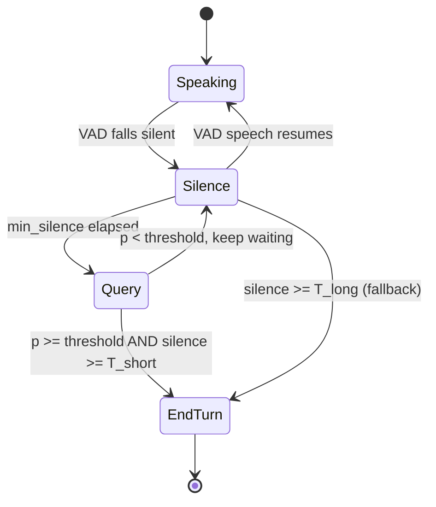

# Semantic Turn Detection

**What you'll be able to do after this:** explain why a model that looks at *content*
beats any silence timer, and by how much; design the fusion policy that combines a
turn-detector probability with a VAD timer, and pick its threshold from measured
consequences; state why the field moved from text-based to audio-native detectors; and
recognise that a weak detector is worse than no detector at all.

---

## 1. Intuition

[`02-endpointing.md`](02-endpointing.md) established that endpointing is a bet, and that
the way to win it is a better posterior rather than a better threshold. This chapter is
about buying that posterior.

The insight is almost embarrassingly simple. Consider two silences of exactly 400 ms:

- "I'd like to book a table for" — obviously unfinished. Any English speaker knows more
  is coming, because "for" is a preposition awaiting its object.
- "I'd like to book a table for four" — obviously complete.

Acoustically these silences are identical. A VAD cannot tell them apart, because there
is nothing in the silence to tell apart. What distinguishes them is **syntax**, and
syntax is exactly what a language model represents. So the natural move is to train a
small model to answer one question — *given what has been said, is this turn over?* —
and use its output to modulate the timer.

The second, less obvious insight is that **text is not the best input for this**, even
though the distinguishing information looked syntactic. Humans do not wait for a
transcript. They use falling pitch, final-syllable lengthening, breath, and rate of
speech, and they use them *simultaneously* with the words. A text-based detector must
wait for the ASR to produce a transcript — adding latency and inheriting ASR errors —
and it throws away prosody entirely.

This is why both major implementations converged on **audio-native** turn detection. As
of `livekit-agents==1.7.0`, LiveKit's text-based English and multilingual turn-detector
plugin is **deprecated**, replaced by a unified audio end-of-turn detector shipped
inside `livekit-agents` itself; and `pipecat-ai/smart-turn` v3 is explicitly audio-native,
operating on PCM samples "rather than text transcriptions, allowing it to take into
account subtle prosody cues". Two independent teams, same conclusion, within a couple of
years of the text-based approach appearing.

The third thing to internalise, and §2.4 measures it: **a bad turn detector is worse
than no turn detector.** This is not a truism. A detector with no discriminative power,
wired into a fusion policy, produces both a higher cut-off rate *and* a longer wait than
a plain fixed timeout, because it randomly assigns short timeouts to turns that needed
long ones. There is a minimum quality bar below which you should not ship the component
at all.

---

## 2. Rigour

### 2.1 What the model predicts

The task is binary classification per candidate endpoint: given the utterance so far —
as audio, as text, or both — output $P(\text{turn complete})$.

Three input regimes, with real consequences:

| Input | Sees | Latency cost | Fails on |
|---|---|---|---|
| **Text only** | words, syntax | must wait for ASR partial or final | prosody; inherits ASR errors; unpunctuated input |
| **Audio only** | prosody, rate, breath, and implicitly phonetics | runs on the audio you already have | long-range semantic dependencies |
| **Audio + text** | both | max of the two | complexity, and two failure sources |

The text-only approach was the obvious first move — take a small language model, fine-tune
it to predict whether an utterance is complete. It works, and it has two structural
problems. It is **downstream of ASR**, so it cannot fire before a transcript exists, which
puts it behind the ASR's own finalisation latency
([`../02-asr/05-streaming-asr.md`](../02-asr/05-streaming-asr.md) §2.6); and it is
**blind to prosody**, so "yes." and "yes…?" are the same input.

Audio-native models invert this. They run on PCM directly, so they can fire during the
silence itself with no ASR dependency, and they see the pitch contour and final-syllable
lengthening that carry much of the human turn-taking signal. The cost is that they have
weaker access to long-range meaning — a model looking at the last second of audio cannot
know that the caller has been asked for a phone number, which is why §2.5's fusion keeps
context in the *policy* rather than expecting the model to supply it.

### 2.2 Training such a model

**Labels.** The supervision signal is turn boundaries in real conversation. Two-party
conversational corpora provide them: a turn ends where the other speaker begins. The
subtlety is that this labelling conflates "the speaker finished" with "the other speaker
interrupted", so naive labels teach the model that interruptions are endings. Filtering
overlapped regions matters.

**Negatives are the hard part.** Positives (real turn ends) are easy to harvest.
Negatives are *mid-turn pauses*, which requires detecting pauses inside a turn and
labelling them "not the end" — and these are exactly the examples the model must get
right, because they are the cut-off cases. A dataset that undersamples hesitation pauses
produces a model with excellent accuracy and terrible cut-off behaviour.

**Class imbalance and calibration.** Most silences in a conversation are short
intra-turn gaps, so the negative class dominates. The consequence for deployment is
that raw model probabilities are usually **not calibrated**, so a threshold of 0.5 has no
particular meaning. Calibrate on held-out data from your own traffic — Platt scaling or
isotonic regression — before choosing the operating point, otherwise §2.4's threshold
sweep is measuring the wrong axis.

**Language coverage is a real constraint.** Turn-taking cues are language-specific:
falling terminal pitch means completion in English, and languages differ in
sentence-final particles, verb-final word order, and politeness markers that shift where
completion sits. Smart Turn v3.2 lists 23 supported languages. A model trained only on
English will systematically cut off speakers of verb-final languages, where the
information that completes a clause arrives last.

### 2.3 The fusion policy

The detector does not replace the VAD, it modulates the timer. The standard structure:



Two properties of this structure matter more than the model inside it.

**The detector runs only during silence.** Smart Turn's documentation makes this explicit
— it "works in conjunction with a lightweight VAD model like Silero, meaning Smart Turn
only needs to run during periods of silence". This is a large compute saving, since most
of a call is either speech (where the answer is obviously "not finished") or long silence
(already decided). You query the model at a handful of decision points per turn, not per
frame.

**`T_long` is a hard fallback, not a suggestion.** If the model never crosses the
threshold — trailing-off speech, an unusual language, background noise that looks like
speech — the turn must still end. Without it the agent hangs, silently, and the failure
appears as "the agent stopped responding" with nothing in the logs
([`02-endpointing.md`](02-endpointing.md) §2.7).

### 2.4 What the threshold actually buys

Simulating a detector whose output is beta-distributed — mean 0.749 on genuine turn
ends, 0.250 on mid-turn pauses, approximate AUC 0.985 — fused with $T_{\text{short}} =
250$ ms and $T_{\text{long}} = 1000$ ms, over 200 000 pauses with the same lognormal
pause model as the previous chapter `[MEASURED]`:

| Threshold | Cut-off rate | Mean wait on real endings | Detector/truth agreement |
|---|---|---|---|
| 0.30 | 16.82% | 253 ms | 88.2% |
| **0.50** | **3.63%** | **297 ms** | **93.7%** |
| 0.70 | 0.74% | 499 ms | 78.3% |
| 0.90 | 0.57% | 888 ms | 44.8% |

Compare the 0.50 row against the fixed-timeout frontier from
[`02-endpointing.md`](02-endpointing.md) §2.3: a fixed timeout needs **700 ms** to reach
a 3.04% cut-off rate. The fused policy reaches 3.63% at **297 ms** — comparable
cut-offs for less than half the wait. That 400 ms is the entire value proposition of this
component, and it is large relative to any latency win available elsewhere in the
pipeline.

Two further readings.

**High thresholds degenerate into the fallback.** At 0.90 the mean wait is 888 ms,
approaching $T_{\text{long}}$, and agreement collapses to 44.8% — the policy is
effectively ignoring the model and waiting out the timer. Setting the threshold
conservatively does not make the system safe, it makes the component pointless while
still paying for it.

**Low thresholds are worse than they look.** At 0.30 the wait is only 253 ms but the
cut-off rate is 16.82% — one turn in six interrupted. On the fixed-timeout frontier, a
400 ms timeout gives 19.85%, so this is barely better than a very aggressive fixed
timeout. The model is not adding value at that threshold; it is being overridden by
optimism.

### 2.5 Detector quality is the binding constraint

The same fusion policy at a fixed threshold of 0.5, varying only the detector's
discriminative power `[MEASURED]`:

| Detector output distributions | Approx. AUC | Cut-off rate | Mean wait |
|---|---|---|---|
| final Beta(3,3), mid Beta(3,3) | **0.510** | **25.10%** | **624 ms** |
| final Beta(4,3), mid Beta(3,4) | 0.718 | 17.63% | 509 ms |
| final Beta(6,2), mid Beta(2,6) | 0.985 | 3.63% | 297 ms |
| final Beta(9,1.5), mid Beta(1.5,9) | 1.000 | 0.84% | 254 ms |

The first row is the finding worth carrying. A detector with **no** discriminative power
(AUC 0.510) produces a 25.10% cut-off rate at 624 ms of mean wait. Look that up on the
fixed-timeout frontier: a 300 ms fixed timeout gives 37% cut-off, a 600 ms fixed timeout
gives 5.69%. So this configuration is **strictly dominated** — a plain 600 ms timeout is
six times better on cut-offs at the same latency.

The mechanism is worth stating precisely, because it is not obvious: a random detector
assigns the short timeout to half of the *mid-turn* pauses, which is exactly where the
long timeout was needed, while assigning the long timeout to half the genuine endings,
where it was not. Randomness does not average out to neutral; it actively misallocates
the resource the policy exists to allocate.

The practical consequences:

- **Measure AUC before deploying.** A turn detector below roughly 0.8 AUC on your own
  audio is not ready, and shipping it will make the product worse while appearing
  sophisticated.
- **AUC maps almost directly onto the achievable frontier.** 0.718 → 17.6% cut-off,
  0.985 → 3.6%. Model quality is the constraint; threshold tuning only chooses where on
  a given model's frontier you sit.
- **Evaluate on your traffic.** Published accuracy is measured on the publisher's data.
  Accented speech, code-switching, telephony bandwidth and your specific prompts all move
  the number ([`../02-asr/07-evaluation.md`](../02-asr/07-evaluation.md)).

### 2.6 Where these models fail

Four categories worth designing around, because none is fixed by a better threshold.

**Dictation and enumeration.** "My address is 42 Oak Street, Apartment 3B, Bengaluru,
560001" contains several syntactically complete prefixes. A detector will report
completion after "42 Oak Street". The mitigation is the context floor from
[`02-endpointing.md`](02-endpointing.md) §2.6: when you asked for an address, refuse to
end early regardless of what the model says.

**Code-switching.** A Hindi-English speaker switching mid-sentence presents the model
with a prosodic and syntactic pattern it may not have seen jointly, even if both
languages are individually supported. Expect degraded accuracy exactly where multilingual
support looks like it should help.

**Trailing off.** "So I was wondering if maybe you could…" — the speaker genuinely
stopped without completing. Truth is ambiguous; the model will be uncertain; and the
correct behaviour is a product decision (respond helpfully to the fragment, or prompt for
more), not a modelling one.

**Backchannels.** "mhm", "right", "okay" are complete utterances syntactically and are
*not* turn transitions — they are the listener signalling attention. A detector trained
on turn boundaries may score them as complete. This is the shared boundary with
[`04-barge-in.md`](04-barge-in.md), and it is why backchannel handling is a separate
mechanism rather than a threshold.

---

## 3. From scratch

The fusion policy and its evaluation. The detector itself is a trained model; what is
worth implementing is the policy around it and the harness that tells you whether it is
good enough to use. Standalone, numpy only.

```python
"""Fusion of a turn-detector probability with a VAD timer, and its evaluation."""
import numpy as np

def simulate(n=200_000, p_mid_frac=0.35, final=(6, 2), mid=(2, 6), seed=9):
    """Simulate pauses plus detector outputs.

    `final`/`mid` are Beta parameters for the detector's P(complete) on genuine
    endings and on mid-turn pauses. Equal parameters => a useless detector, which
    Section 2.5 shows is worse than having none.
    """
    rng = np.random.default_rng(seed)
    is_mid = rng.random(n) < p_mid_frac
    p_complete = np.where(is_mid, rng.beta(*mid, n), rng.beta(*final, n))
    mid_pause = rng.lognormal(np.log(0.25), 0.55, n)
    return is_mid, p_complete, mid_pause

def auc(scores, positive_mask, n_sample=4000, seed=0):
    """Probability a random positive outscores a random negative."""
    rng = np.random.default_rng(seed)
    pos = scores[positive_mask]
    neg = scores[~positive_mask]
    i = rng.integers(0, len(pos), n_sample)
    j = rng.integers(0, len(neg), n_sample)
    return float((pos[i] > neg[j]).mean())

def fuse(is_mid, p_complete, mid_pause, threshold, t_short, t_long):
    """The policy: a short deadline when the detector says complete, else long.

    Returns (cut-off rate, mean wait on genuine endings, agreement rate).
    Cut-off = a mid-turn pause outlasted the deadline we chose, so we ended a
    turn the speaker intended to continue.
    """
    says_complete = p_complete >= threshold
    deadline = np.where(says_complete, t_short, t_long)
    cutoff = (is_mid & (mid_pause > deadline)).sum() / max(is_mid.sum(), 1)
    mean_wait = deadline[~is_mid].mean() * 1000
    agreement = ((says_complete & ~is_mid) | (~says_complete & is_mid)).mean()
    return cutoff, mean_wait, agreement

class FusedEndpointer:
    """Production shape of the policy. Query the model only during silence, and
    always honour the hard fallback so a turn can never hang."""

    def __init__(self, threshold=0.5, t_short_ms=250, t_long_ms=1000,
                 min_query_ms=150, query_every_ms=100):
        self.threshold = threshold
        self.t_short_ms, self.t_long_ms = t_short_ms, t_long_ms
        self.min_query_ms, self.query_every_ms = min_query_ms, query_every_ms
        self.reset()

    def reset(self):
        self.silence_ms = 0
        self._next_query_ms = self.min_query_ms
        self.queries = 0

    def update(self, frame_ms, is_speech, detector):
        """`detector` is called lazily -- only at query points during silence.
        Returns (end_turn, reason)."""
        if is_speech:
            self.reset()
            return False, None

        self.silence_ms += frame_ms
        if self.silence_ms >= self.t_long_ms:
            return True, f"fallback({self.silence_ms}ms)"     # never hang
        if self.silence_ms < self._next_query_ms:
            return False, None

        self._next_query_ms += self.query_every_ms
        self.queries += 1
        p = detector()                                        # the model call
        if p >= self.threshold and self.silence_ms >= self.t_short_ms:
            return True, f"complete(p={p:.2f}, {self.silence_ms}ms)"
        return False, None

if __name__ == "__main__":
    is_mid, p_complete, mid_pause = simulate()
    print(f"detector AUC = {auc(p_complete, ~is_mid):.3f}")
    print(f"mean p_complete: true-final {p_complete[~is_mid].mean():.3f}  "
          f"mid-turn {p_complete[is_mid].mean():.3f}\n")

    print(f"{'thr':>5} {'cutoff%':>8} {'mean_wait':>10} {'agree%':>7}")
    for thr in (0.30, 0.50, 0.70, 0.90):
        c, w, a = fuse(is_mid, p_complete, mid_pause, thr, 0.25, 1.00)
        print(f"{thr:5.2f} {100*c:8.2f} {w:10.0f} {100*a:7.1f}")

    print(f"\n{'final':>12} {'mid':>10} {'AUC':>6} {'cutoff%':>8} {'mean_wait':>10}")
    for f, m in (((3, 3), (3, 3)), ((4, 3), (3, 4)),
                 ((6, 2), (2, 6)), ((9, 1.5), (1.5, 9))):
        im, pc, mp = simulate(final=f, mid=m)
        c, w, _ = fuse(im, pc, mp, 0.50, 0.25, 1.00)
        print(f"{str(f):>12} {str(m):>10} {auc(pc, ~im):6.3f} "
              f"{100*c:8.2f} {w:10.0f}")

    # Query-count check: the model runs a handful of times per turn, not per frame.
    ep = FusedEndpointer()
    rng = np.random.default_rng(1)
    for i in range(60):                       # 1.2 s of silence at 20 ms frames
        end, reason = ep.update(20, False, detector=lambda: rng.beta(2, 6))
        if end:
            print(f"\nturn ended after {20*(i+1)} ms, {ep.queries} model call(s): {reason}")
            break
```

The `FusedEndpointer` embodies the two things that make this cheap and safe: the detector
is a **lazy callable** invoked only at query points during silence, so a 5-second turn
costs a handful of inferences rather than 250; and the fallback branch is checked
**before** the query, so a hung detector cannot hang the turn.

---

## 4. How production does it

**LiveKit — note the change.** `livekit-plugins-turn-detector` is **deprecated as of
1.7.0**. Its README states plainly that it "will be removed in a future release" and
directs users to `livekit.agents.inference.TurnDetector`, which ships inside
`livekit-agents`, needs no extra install, and "replaces both the English and Multilingual
text-based models with a unified audio end-of-turn detector". Usage is
`AgentSession(..., turn_detection=TurnDetector())`, and it is documented as working with
speech-to-speech models such as OpenAI Realtime as well as cascaded pipelines. Model
files are not bundled: run `python -m livekit.agents download-files` before first start
and when building images, with weights cached under `HF_HUB_CACHE`. Stated system
requirements are CPU-friendly, under 500 MB of RAM, running inside a shared inference
server that supports multiple concurrent sessions. Licensing is split and matters for
commercial use: **plugin code Apache-2.0, model weights under the LiveKit Model
License**, not Apache.

If your team is on an older LiveKit version using the text-based plugin, this is a
migration worth planning: the replacement is audio-native, so it changes *when* the
signal is available (during silence, not after an ASR partial) and therefore changes your
latency profile.

**Pipecat Smart Turn.** `pipecat-ai/smart-turn` v3.2 is fully open — **BSD 2-clause,
with datasets, training script and weights published** — which makes it the one you can
actually study and fine-tune. Verified characteristics from its README: 23 supported
languages, audio-native operation on PCM samples rather than transcriptions, inference in
"as little as 10 ms on some CPUs, and under 100 ms on most cloud instances", and two
builds — an **8 MB int8 CPU** version and a **32 MB fp32 GPU** version, with the fp32
version roughly 1% more accurate. It is designed to run only during VAD-detected silence,
exactly as §2.3 describes.

The comparison that matters for a decision: LiveKit's detector is more integrated and
comes with a restrictive model licence; Smart Turn is permissively licensed and
fine-tunable on your own data, which is the deciding factor if your traffic differs from
the training distribution — accented speech, a language with thin coverage, or a domain
full of enumerations.

**Hosted speech-to-speech APIs** perform their own server-side turn detection with a
sensitivity setting, which is the same tradeoff with the dial in someone else's process
([`../06-realtime-systems/04-speech-to-speech.md`](../06-realtime-systems/04-speech-to-speech.md)).
Note from the LiveKit usage example that you can override it — running your own turn
detector in front of a realtime model is a supported and often better configuration,
because you control the frontier.

---

## 5. At scale

**Cost is bounded by query count, not by call duration.** With the §2.3 structure the
model runs a few times per turn during silence. At 10 ms of CPU per query and a handful
of queries per turn, this is negligible per session — which is why an 8 MB int8 model on
CPU is the right engineering choice and why LiveKit can state a sub-500 MB shared
inference server for many concurrent sessions. Do not put this on a GPU; you would be
paying accelerator prices for microseconds of work and adding a network hop.

**Calibrate and re-calibrate per segment.** §2.2 noted that raw probabilities are
typically uncalibrated, and §2.4 shows the threshold is consequential. Calibrate per
language and per channel type — telephony narrowband is a different distribution from a
wideband headset — and store thresholds as configuration rather than constants.

**Monitor cut-off rate as the primary SLI for this component.** The proxy from
[`02-endpointing.md`](02-endpointing.md) §5 works: count turns where the user resumed
speaking within ~500 ms of the agent starting. Segment it by language and by expected
answer type. A rise in one segment with the others flat is a distribution-shift signal,
and it is the earliest warning you will get.

**Fail open, toward waiting.** If the detector is unavailable — model not downloaded,
inference server saturated, an exception — the policy must degrade to the fixed
$T_{\text{long}}$ timeout rather than ending turns immediately. A component failure
should make the agent slightly slow, never rude. This is a one-line default with a large
behavioural consequence
([`../06-realtime-systems/07-reliability.md`](../06-realtime-systems/07-reliability.md)).

**Version the model alongside the threshold.** The threshold is only meaningful for a
specific model version, since calibration shifts between releases. Deploying a new
detector with the old threshold is a silent behavioural change, and §2.5 shows how much
range there is between good and harmful configurations.

**Budget the licence review, not just the compute.** The LiveKit model licence is not
Apache; Smart Turn is BSD 2-clause. For a commercial deployment this is a real decision
input, and it is easier to resolve before the model is embedded in production than after.

---

## 6. Exercises

**E3.3.1** Run the §3 code. Then sweep the threshold in steps of 0.05 and plot cut-off
rate against mean wait. Mark the point that matches a 700 ms fixed timeout's cut-off rate
and report the latency saved.

**E3.3.2** Find the AUC at which the fused policy stops being worse than the best fixed
timeout at equal mean wait. Verify by simulation, and state the practical hiring-decision
version of that number: what accuracy must a vendor demonstrate before you integrate?

**E3.3.3** Add a miscalibration to the detector — multiply all probabilities by 0.7 —
without changing its AUC. Show that the ranking quality is unchanged while the fused
policy degrades, then fix it by recalibrating the threshold. Explain why AUC alone is an
insufficient acceptance criterion.

**E3.3.4** Implement the dictation failure from §2.6: generate address-like utterances
with syntactically complete prefixes, assign high detector probabilities at those
prefixes, and measure the cut-off rate. Then add the context floor and re-measure.

**E3.3.5** Extend `FusedEndpointer` to consult the detector *and* ASR partial stability,
requiring both before ending early. Measure the effect on cut-off rate and wait, and
state whether the second signal was worth its complexity.

**E3.3.6** Instrument query count per turn as a function of `query_every_ms` and turn
duration. Compute total model inferences per 1000 calls at 100 ms and 50 ms query
intervals, and the CPU cost of each at 10 ms per inference.

**E3.3.7** Design the fail-open test: simulate the detector raising an exception, timing
out, and returning NaN. Verify the policy degrades to `T_long` in all three cases and
that nothing ends a turn early. Write the assertions.

---

## 7. Interview drill

> "We added a semantic turn detector. Average latency improved 300 ms. But complaints
> about the agent interrupting people went *up*. How is that possible, and what do you
> do?"

Both observations can be true simultaneously, and the answer should explain the mechanism
rather than doubting the data. The detector shortened the timeout on turns it judged
complete, which is where the 300 ms came from. The complaints come from the turns it
judged *wrongly* — and §2.5 shows that misallocating the short deadline to a mid-turn
pause is precisely the failure mode of an imperfect detector. Average latency improved
because most turns are correctly classified; cut-offs rose because the errors now
concentrate on the pauses that most needed patience.

The diagnostic path, in order. **Measure cut-off rate, not just latency** — the team
tracked one axis of a two-axis tradeoff, which guarantees this outcome. **Segment the
cut-offs**: by language, by channel, and above all by what the agent had just asked. The
near-certain finding is concentration in enumerations and digit strings (§2.6), because
those contain syntactically complete prefixes. **Check calibration**: if the threshold
was carried over from a different model version or was simply left at 0.5, the operating
point may be far from where anyone intended, and §2.4 shows how much range there is
between thresholds.

The fixes follow from whichever the data supports. If cut-offs concentrate by context,
add the context floor from [`02-endpointing.md`](02-endpointing.md) §2.6 — refuse to end
early when you asked for an address or a number, regardless of the model. If they are
diffuse, raise the threshold and accept part of the latency back; §2.4 quantifies that
trade so it can be made deliberately. If they concentrate in one language, that is a
coverage problem, and the answer is either a permissively-licensed model you can
fine-tune on that language or a per-language threshold.

The senior addition is to question whether these are cut-offs at all. "The agent
interrupts me" is also the symptom of an echo-cancellation failure, where the agent hears
its own output and reacts
([`05-echo-and-aec.md`](05-echo-and-aec.md)), and of barge-in misfiring on backchannels
([`04-barge-in.md`](04-barge-in.md)). Those have completely different fixes, and the
distinguishing test is cheap: check whether the interruptions correlate with the user
speaking at all, or with the agent's own audio. Confirming which mechanism you are
looking at before tuning is the difference between fixing it and moving the problem.

Close on process: this component needs both metrics on one dashboard permanently, a
threshold versioned with the model, and a fail-open default (§5) so an outage degrades
latency rather than manners.

---

## Sources

- `livekit/agents`, `livekit-plugins/livekit-plugins-turn-detector/README.md` and the `livekit-plugins-turn-detector` 1.7.0 PyPI metadata (both retrieved 2026-08-22) — the deprecation notice, the replacement `livekit.agents.inference.TurnDetector` with `AgentSession(turn_detection=...)` usage, the unified **audio** end-of-turn model replacing the English and Multilingual text-based models, `python -m livekit.agents download-files`, `HF_HUB_CACHE` model caching, the "<500MB of RAM" and shared-inference-server statements, and the Apache-2.0 code / LiveKit Model License weights split quoted in §4.
- `pipecat-ai/smart-turn`, `README.md` for Smart Turn v3.2 (retrieved 2026-08-22) — BSD 2-clause licensing with open datasets/training script/weights, the 23-language list, "as little as 10ms on some CPUs, and under 100ms on most cloud instances", the 8 MB int8 CPU and 32 MB fp32 GPU builds with roughly 1% accuracy difference, audio-native operation on PCM rather than transcriptions, and the design of running only during VAD-detected silence — all as quoted in §1, §2.3 and §4.
- Sacks, H., Schegloff, E. A. & Jefferson, G. (1974). *A simplest systematics for the organization of turn-taking for conversation.* Language 50(4) — transition-relevance places, the linguistic basis for §1.
- Levinson, S. C. & Torreira, F. (2015). *Timing in turn-taking and its implications for processing models of language.* Frontiers in Psychology — evidence that humans predict turn ends from content rather than reacting to silence.
- Platt, J. (1999) and Zadrozny, B. & Elkan (2002) — Platt scaling and isotonic regression, the calibration methods referenced in §2.2.
- All `[MEASURED]` values in §2.4 and §2.5 were produced by the code in §3 on Apple M5 / macOS 26.5.2 via `uv run --python 3.12 --with numpy`, numpy 2.5.2, 200 000 simulated pauses per configuration. The detector output distributions are a stated Beta model, not a measured model's outputs; the transferable results are the shape of the threshold frontier and the demonstration that a low-AUC detector is dominated by a plain fixed timeout.
