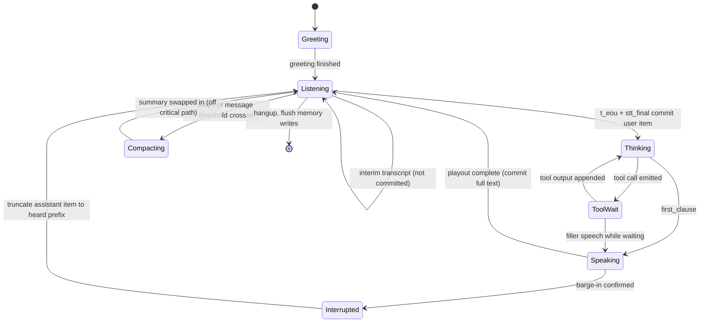
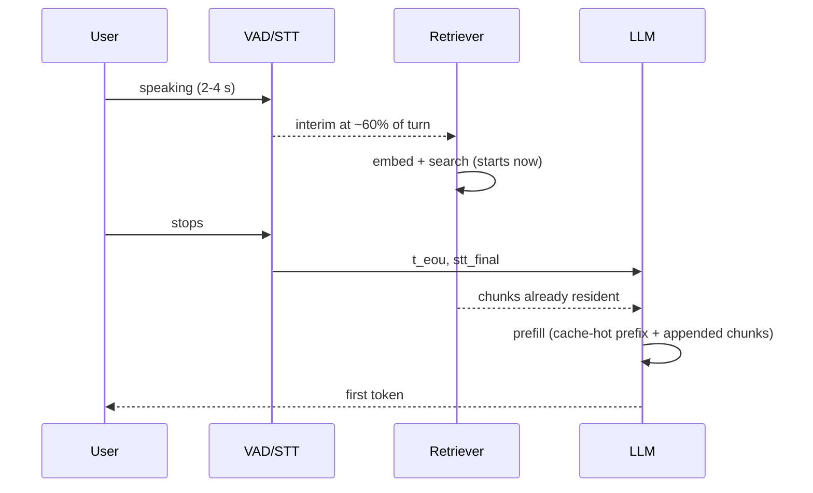

# Context and Memory

**What you'll be able to do after this:** model a conversation as an explicit state machine
whose transitions edit the transcript rather than append to it; curate that transcript so an
interrupted turn records what the user *heard*; choose a context-curation policy from its
prefill cost under a prefix cache rather than from its token count; design four tiers of
memory with real schemas and retrieval budgets; and start retrieval *during* the user's turn
so it costs nothing on the critical path.

---

## 1. Intuition

Three ideas reframe this chapter, and each contradicts a habit carried over from text chat.

**The context window is not storage; it is a bill you pay every turn.** Nothing persists
between LLM calls except what you resend. A 40-turn conversation with a 2000-token system
prompt does not "have" 2000 tokens of instruction — it re-prefills them 40 times. Context
length therefore converts directly into `ttft_llm`, and `ttft_llm` sits on the critical path
between the user finishing and the first audio
([`../01-foundations/04-latency-budget.md`](../01-foundations/04-latency-budget.md)). Every
byte you carry, you carry at 10 Hz for the whole call.

**The transcript is a mutable data structure, not an append-only log.** In text chat the
assistant's message is what the model generated. In voice it is what the user *heard*, which
after a barge-in is a strict prefix of what was generated — 5 of 14 words in the measurement
from [`../03-turn-taking/04-barge-in.md`](../03-turn-taking/04-barge-in.md). Recording the
full generated text makes the model believe it said things the user never heard, and it will
refer back to them. Turn-end therefore *edits* the previous item as often as it appends a new
one.

**Anything that can happen off the critical path must.** Summarisation, memory writes,
embedding, and vector search all take tens to hundreds of milliseconds. The user's turn
typically lasts 2–4 seconds, and during it the agent has an idle CPU and a partial transcript.
Work scheduled there is free; the same work scheduled after `t_eou` is added to
`eou_to_ttfa` in full. Nearly every "memory made our agent slow" complaint is a scheduling bug
rather than a memory-system bug.

---

## 2. Rigour

### 2.1 The conversation as a state machine

A voice conversation is not a request/response loop; it is a state machine in which several
transitions mutate history that has already been written.



Four transitions do something a text chat loop never does. `Listening → Thinking` commits a
user item only on the final transcript, never on interims. `Interrupted → Listening` rewrites
an item already in history. `Compacting` runs concurrently with listening and must not block
it. And `hangup` is a flush point with no user waiting, which is where expensive
consolidation belongs.

### 2.2 What is actually in a request, and what it costs

Token cost per character is not a constant; it depends on what kind of text it is.
`[MEASURED]` with `tiktoken` `o200k_base`:

| Content | chars/token | tokens/word |
|---|---|---|
| Spoken transcript (5 real utterances) | **5.02** | **1.038** |
| Written prose with digits, dates, a URL | 3.35 | 2.300 |
| Tool schema JSON | 3.99 | 2.636 |

Two consequences. Spoken text is unusually cheap per character — conversational vocabulary is
short, common, and unpunctuated, so it hits the merge table well. And the widely used
"4 characters per token" heuristic, which Pipecat uses in
`LLMContextSummarizationUtil.estimate_tokens` (§4), **over-counts spoken transcripts by about
25%** while being nearly exact for JSON. If you budget with it you will compact earlier than
necessary.

Chat framing costs roughly 3–4 tokens per message for role and delimiters, which matters
because voice turns are short: a 12-token utterance carries ~30% overhead.

The measured composition surprise from §3: over a 40-message conversation with one tool call
every seventh assistant turn, **17% of history tokens are tool JSON** `[MEASURED]`. Tool
outputs are written in the expensive dialect and never shrink, so on a tool-heavy agent they
overtake speech quickly. Truncating tool outputs before they enter history is usually a bigger
win than compacting the dialogue.

### 2.3 Transcript curation rules

Six rules, each fixing a specific failure.

**Commit finals, never interims.** Interim hypotheses flip
([`../02-asr/05-streaming-asr.md`](../02-asr/05-streaming-asr.md)); a committed interim leaves
a wrong sentence in history permanently. If you use preemptive generation off an interim, the
speculative request must be discarded, not committed.

**Truncate interrupted assistant turns to the heard prefix.** Track the playout position at
the moment of the flush and cut the text there, appending an explicit marker such as
`[interrupted]`. Without the marker the model sees a sentence that stops mid-clause and often
tries to complete it. LiveKit models this with `ChatMessage.interrupted: bool`; the OpenAI
Realtime API does it server-side with `conversation.item.truncate(audio_end_ms=...)` (§4).

**Keep tool calls and their outputs paired and adjacent.** Every provider rejects a
`function_call` whose `function_call_output` was trimmed away. This is why LiveKit's
`ChatContext.truncate` pops leading `function_call` / `function_call_output` items after
slicing (§4) — a window boundary that lands between a call and its result produces a
400 from the provider, not a degraded answer.

**Carry confidence, do not carry it into the prompt.** Store per-item ASR confidence
(LiveKit: `ChatMessage.transcript_confidence`) and use it for *your* logic — confirmation
strategy, repair escalation
([`01-prompting-for-speech.md`](01-prompting-for-speech.md) §2.4). Do not paste confidence
numbers into the prompt; models handle them poorly and it costs tokens.

**Keep disfluencies in the user's text, strip them from summaries.** "Um" and "uh" carry
hesitation signal that helps the model judge uncertainty, and removing them costs a
normalisation pass. But they must not survive into a summary, where they are pure token waste.

**Record wall-clock gaps, not timestamps.** A 30-second silence changes the right response
("are you still there?"); an ISO timestamp on every line costs ~12 tokens and is rarely used.
Insert a marker only when the gap exceeds a threshold.

### 2.4 Prefill, and the prefix cache that decides everything

Prefill is compute over the whole prompt before the first token appears. It is close to linear
in prompt length. `[MEASURED]` on Apple M5 / MPS with GPT-2 124M — absolute values are for
this tiny model on this laptop, the *shape* is what transfers:

| Prompt tokens | Prefill | Throughput |
|---|---|---|
| 128 | 17.00 ms | 7 530 tok/s |
| 256 | 30.80 ms | 8 313 tok/s |
| 512 | 71.46 ms | 7 165 tok/s |
| 1024 | 128.10 ms | 7 994 tok/s |
| 2048 | 274.21 ms | 7 469 tok/s |

So $t_{\text{prefill}} \approx N / R$ with $R \approx 7\,900$ tok/s here. A production 8B model
on a modern accelerator has a much larger $R$, but the linearity and the conclusion below do
not change.

Now reuse the KV cache for a shared prefix and re-prefill only the new tokens `[MEASURED]`:

| Shared prefix | New tokens | Cold prefill | With cache hit | Saving |
|---|---|---|---|---|
| 1024 | 128 | 148.08 ms | 22.10 ms | **85.1%** |
| 2048 | 64 | 287.38 ms | 17.13 ms | **94.0%** |

This is the single largest lever on `ttft_llm` in a long conversation, and it comes with a
hard constraint. vLLM's automatic prefix caching hashes each KV block **by the tokens in the
block together with all tokens before it** (vLLM `docs/design/prefix_caching.md`), so a block
is reusable only if the entire preceding sequence is byte-identical. Hosted providers use the
same construction.

The discipline that follows:

$$
\text{recomputed tokens} = \sum_{b \ge k} |b|, \qquad
k = \text{index of the first block whose content changed}
$$

1. **Order by volatility, ascending.** System prompt, then tool schemas, then long-lived
   summary, then history, then the volatile per-turn material. One early insertion invalidates
   everything after it.
2. **Never inject retrieved chunks in the middle.** Append them after the history, immediately
   before generation.
3. **Do not put a timestamp, session id, or user name in the system prompt.** It changes per
   session and destroys cross-session reuse of the largest stable block.
4. **Compact in bulk, rarely.** Every compaction is a full cache miss; amortise it.
5. **Sliding windows are cache poison.** Dropping the oldest message shifts every subsequent
   block and invalidates the whole suffix — every single turn.

### 2.5 What the policies actually cost

From the simulation in §3 — 40 context items, 20 LLM calls, prefix cache modelled at message
granularity `[MEASURED]`:

| Policy | Mean context | p95 | Recomputed/turn | Total recomputed | Prefill/turn @7.9k tok/s |
|---|---|---|---|---|---|
| Full history | 788 | 1206 | **62** | 1 243 | 7.9 ms |
| Sliding window 12 | **539** | 609 | 213 | 4 261 | 27.0 ms |
| Compact every 8 | 645 | 818 | 109 | 2 186 | 13.8 ms |
| Full + RAG prepended | 909 | 1328 | 609 | 12 179 | 77.1 ms |
| Full + RAG appended | 909 | 1328 | 184 | 3 673 | 23.2 ms |

Read the second row carefully. The sliding window makes the context **32% smaller** and the
per-turn prefill **3.4× larger**. Context length is the metric everyone tracks and it is the
wrong one; recomputed tokens is the one that maps to latency and to the bill.

Rows four and five are the same prompt content in a different order, and placement alone is a
**3.3× difference in prefill**. This is why "we added RAG and TTFT doubled" is usually a
placement bug rather than a retrieval bug.

"Compact every 8" is the production answer: append-only between compactions so the cache is
hot, with a bulk rewrite whose cost is amortised over eight turns.

### 2.6 Four tiers of memory

Two tiers ("short-term and long-term") is the common framing and it is too coarse, because the
four things below have different latencies, lifetimes, consistency requirements and deletion
obligations.

| Tier | Contents | Lifetime | Store | Read budget | Written |
|---|---|---|---|---|---|
| **T0 working** | current turn: partial transcript, active slots, in-flight tool calls | one turn | process memory | 0 ms | synchronously |
| **T1 session** | curated transcript, rolling summary, filled slots, call metadata | one call | process memory + Redis checkpoint | 0 ms (in process) | on transition, async checkpoint |
| **T2 profile** | durable user facts: name, preferences, account ids, consent flags, past outcomes | months–years | Postgres row | 5–20 ms, once at call start | after the call |
| **T3 knowledge** | product docs, policies, FAQs — not user-specific | until reindexed | vector index | 2–30 ms + embedding | offline |

Schemas worth writing down, because the shape prevents the mistakes:

```sql
-- T1: one row per call, checkpointed so a worker crash can resume mid-call.
CREATE TABLE session_state (
  session_id   uuid PRIMARY KEY,
  user_id      uuid REFERENCES users(id),
  started_at   timestamptz NOT NULL,
  summary      text,                    -- rolling, regenerated at compaction
  slots        jsonb NOT NULL DEFAULT '{}',   -- {"appt_id": "...", "new_start": "..."}
  turn_count   int  NOT NULL DEFAULT 0,
  last_seq     bigint NOT NULL          -- monotonic; makes checkpoints idempotent
);

-- T2: facts, not prose. Each row is independently retrievable, auditable, deletable.
CREATE TABLE user_memory (
  user_id     uuid NOT NULL,
  key         text NOT NULL,            -- 'preferred_clinician', 'callback_number'
  value       jsonb NOT NULL,
  confidence  real NOT NULL,            -- how sure we are; below 0.8, confirm before use
  source      text NOT NULL,            -- 'stated' | 'inferred' | 'crm'
  updated_at  timestamptz NOT NULL,
  expires_at  timestamptz,              -- retention policy, enforced by a job
  PRIMARY KEY (user_id, key)
);
```

Three design rules. **T2 stores facts with provenance, not conversation prose** — a free-text
memory blob grows without bound, cannot be corrected, and cannot be deleted selectively when a
user exercises an erasure right
([`../08-eval-safety/03-safety-and-privacy.md`](../08-eval-safety/03-safety-and-privacy.md)).
**T2 is read once at call start**, so its latency lands in the greeting rather than in a turn.
And **`confidence` and `source` are load-bearing**: an inferred preference should be confirmed
before being acted on, and a fact that came from the CRM should not be silently overwritten by
a misheard utterance.

### 2.7 Speculative retrieval during the user's turn

Reactive retrieval is serial with the deadline: `t_eou` → embed → search → prompt → prefill.
Speculative retrieval starts from an interim transcript while the user is still speaking.



The arithmetic. Let $p$ be the probability the speculative query is still valid at `t_eou`
(the final transcript did not change the intent), $t_r$ the retrieval time, and $t_{\text{rem}}$
the time remaining in the user's turn when the speculation launched. Expected saving on the
critical path:

$$
E[\text{saving}] = p \cdot \min(t_r,\ t_{\text{rem}}) - (1-p)\cdot c_{\text{cancel}}
$$

With $p = 0.8$, $t_r = 120$ ms and $t_{\text{rem}} = 1.2$ s, that is ~96 ms saved per turn for
the cost of some wasted retrievals. $c_{\text{cancel}}$ is near zero if the retrieval is
cancellable and idempotent — which means speculative work must never write anything, never
charge anything, and never have a side effect. Retrieval qualifies. Tool calls generally do
not ([`03-tools-and-agentic.md`](03-tools-and-agentic.md)).

The waste is bounded and cheap. `[MEASURED]` brute-force cosine top-5 over float32 embeddings
of dimension 384 on this M5:

| Corpus | Search | Index RAM |
|---|---|---|
| 1 000 | 0.008 ms | 1.5 MiB |
| 10 000 | 0.149 ms | 14.6 MiB |
| 100 000 | 2.660 ms | 146.5 MiB |
| 1 000 000 | 24.341 ms | 1464.8 MiB |

At 100k chunks — larger than most single-product knowledge bases — exact search is 2.7 ms with
no index to build, no approximation, and no recall loss. **The search is not your latency;
the embedding call and the network hop to the vector service are.** A hosted embedding
endpoint at 40–80 ms round trip is 15–30× the cost of the search it enables, which is the
argument for a local embedding model in-process, and for keeping the index in the worker's
memory when the corpus is small.

Trigger speculation once, at a stable point — roughly 60–70% into the expected turn, or when
the interim transcript stops changing for 300 ms — not on every interim, which produces a
storm of embeddings.

### 2.8 Summarisation without a stall

Compaction blocks nothing if it runs as a background task with three properties. A **guard**
so only one runs at a time. A **snapshot** of the items being summarised, so the live context
can keep growing while the summary is produced. And an **atomic swap** that replaces exactly
the snapshotted range, leaving the recent tail untouched.

A summary must preserve, in this order: filled slots and their values verbatim (identifiers,
times, amounts, names), commitments the agent made, unresolved questions, and only then
topical gist. The classic failure is a fluent summary that drops the account number, after
which the agent asks for it again. Test it directly: summarise, then ask the agent to recall
each slot.

Trigger on a token threshold rather than a message count, and never mid-turn — compact during
`Listening`, when a stall is invisible.

---

## 3. From scratch

Model the context assembly and count what a prefix cache can actually reuse. Standalone,
stdlib only.

```python
"""What each context-curation policy costs under a prefix cache.

Models a 40-message voice conversation and, for five assembly policies, reports
context size and -- the number people forget -- how many tokens must actually be
re-prefilled each turn because the cached prefix was invalidated.

Token counts use characters/token ratios measured with tiktoken o200k_base on
spoken transcripts (5.02), written prose (3.35) and tool JSON (3.99); the widely
used "4 characters per token" rule over-counts speech by about 25%.
"""

import hashlib
import random
import statistics

CPT = {"spoken": 5.02, "prose": 3.35, "json": 3.99}  # chars per token, measured
FRAMING = 4          # per-message role/delimiter tokens the chat template adds
PREFILL_TOK_PER_S = 7900  # measured: GPT-2 124M prefill on M5 MPS, see Section 2.4

USER_WORDS = ["yeah", "um", "can", "you", "move", "the", "appointment", "to",
              "tuesday", "afternoon", "after", "three", "if", "there", "is",
              "anything", "else", "no", "the", "other", "one", "ending",
              "four", "two", "sorry", "i", "meant", "next", "week", "thanks"]
AGENT_WORDS = ["sure", "i", "can", "do", "that", "your", "appointment", "is",
               "on", "tuesday", "at", "four", "fifteen", "would", "you", "like",
               "me", "to", "send", "a", "confirmation", "to", "the", "number",
               "ending", "four", "four", "two", "one", "instead"]


def tokens(text, kind="spoken"):
    """Estimated tokens for one message, including chat-template framing."""
    return round(len(text) / CPT[kind]) + FRAMING


class Block:
    """A contiguous piece of the prompt. `key` identifies its exact content."""

    __slots__ = ("name", "text", "kind", "key", "n")

    def __init__(self, name, text, kind="spoken"):
        self.name, self.text, self.kind = name, text, kind
        self.key = hashlib.blake2b(f"{name}\x00{text}".encode(), digest_size=8).hexdigest()
        self.n = tokens(text, kind)


def cache_split(prev, cur):
    """(cached_tokens, recomputed_tokens) for request `cur` given request `prev`.

    A prefix cache serves the longest common *prefix*; the first differing block
    invalidates everything after it, however small the difference.
    """
    i = 0
    while i < len(prev) and i < len(cur) and prev[i].key == cur[i].key:
        i += 1
    return sum(b.n for b in cur[:i]), sum(b.n for b in cur[i:])


def build_conversation(n_messages=40, seed=7):
    """Alternating user/assistant messages, with a tool call+output every 7th turn."""
    rng = random.Random(seed)
    msgs = []
    for i in range(n_messages):
        if i % 2 == 0:
            w = max(3, int(rng.gauss(11, 4)))
            msgs.append(Block(f"u{i}", " ".join(rng.choices(USER_WORDS, k=w)), "spoken"))
        else:
            w = max(6, int(rng.gauss(22, 6)))
            msgs.append(Block(f"a{i}", " ".join(rng.choices(AGENT_WORDS, k=w)), "spoken"))
            if i % 7 == 0:
                payload = ('{"appointment_id":"apt_8f31c2","slots":[{"start":'
                           '"2026-03-03T16:15:00Z","clinician":"Dr Okonkwo","room":"3B"},'
                           '{"start":"2026-03-03T16:45:00Z","clinician":"Dr Rai",'
                           '"room":"1A"}],"timezone":"Europe/London"}')
                msgs.append(Block(f"tool{i}", payload, "json"))
    return msgs


SYSTEM = Block("system", "You are the voice assistant for Northwind Clinic. " * 12, "prose")
TOOLS = Block("tools", '{"name":"reschedule_appointment","parameters":{"type":"object",'
                       '"properties":{"appointment_id":{"type":"string"},"new_start":'
                       '{"type":"string"},"notify":{"type":"boolean"}}}}' * 3, "json")


def summary_block(upto):
    """A summary of messages[:upto]. Its key changes whenever `upto` changes."""
    return Block("summary", f"Conversation summary covering {upto} messages. "
                            "Caller wants to move a Tuesday appointment to the afternoon "
                            "and confirm the contact number. " * 2, "prose")


def rag_block(turn):
    """Retrieved chunks for this turn. Different content every turn."""
    return Block(f"rag{turn}", f"Clinic policy excerpt {turn}: appointments may be moved "
                               "up to two hours before the slot without a fee. " * 4, "prose")


# Each policy maps (all messages, index of last message in this request) -> block list.
def p_full(msgs, upto, turn):
    return [SYSTEM, TOOLS] + msgs[:upto]


def p_window(msgs, upto, turn, w=12):
    return [SYSTEM, TOOLS] + msgs[max(0, upto - w):upto]


def p_compact(msgs, upto, turn, keep=12, every=8):
    """Append-only, compacted in bulk every `every` messages."""
    boundary = max(0, ((upto - keep) // every) * every)
    head = [summary_block(boundary)] if boundary else []
    return [SYSTEM, TOOLS] + head + msgs[boundary:upto]


def p_rag_prepend(msgs, upto, turn):
    return [SYSTEM, TOOLS, rag_block(turn)] + msgs[:upto]


def p_rag_append(msgs, upto, turn):
    return [SYSTEM, TOOLS] + msgs[:upto] + [rag_block(turn)]


POLICIES = [("full history", p_full),
            ("sliding window 12", p_window),
            ("compact every 8", p_compact),
            ("full + RAG prepended", p_rag_prepend),
            ("full + RAG appended", p_rag_append)]

if __name__ == "__main__":
    msgs = build_conversation()
    n_llm_calls = sum(1 for m in msgs if m.name.startswith("u"))
    print(f"{len(msgs)} context items, {n_llm_calls} LLM calls\n")
    print(f"{'policy':22s} {'ctx mean':>9} {'ctx p95':>8} {'recomp/turn':>12} "
          f"{'total recomp':>13} {'ms/turn':>8}")

    for name, policy in POLICIES:
        prev, ctx_sizes, recomps = [], [], []
        for turn, i in enumerate(i for i, m in enumerate(msgs) if m.name.startswith("u")):
            cur = policy(msgs, i + 1, turn)     # request made after the user's message
            _, recomp = cache_split(prev, cur)
            ctx_sizes.append(sum(b.n for b in cur))
            recomps.append(recomp)
            prev = cur
        p95 = sorted(ctx_sizes)[int(0.95 * (len(ctx_sizes) - 1))]
        mean_recomp = statistics.mean(recomps)
        print(f"{name:22s} {statistics.mean(ctx_sizes):9.0f} {p95:8d} "
              f"{mean_recomp:12.0f} {sum(recomps):13d} "
              f"{1000 * mean_recomp / PREFILL_TOK_PER_S:8.1f}")

    tool_tokens = sum(m.n for m in msgs if m.name.startswith("tool"))
    speech_tokens = sum(m.n for m in msgs if not m.name.startswith("tool"))
    n_tools = sum(1 for m in msgs if m.name.startswith("tool"))
    print(f"\nfixed prefix: system {SYSTEM.n} + tools {TOOLS.n} = {SYSTEM.n + TOOLS.n} tokens")
    print(f"{n_tools} tool outputs = {tool_tokens} tokens vs "
          f"{len(msgs) - n_tools} speech turns = {speech_tokens} tokens "
          f"({tool_tokens / (tool_tokens + speech_tokens):.0%} of history is tool JSON)")
```

Output `[MEASURED]`:

```
43 context items, 20 LLM calls

policy                  ctx mean  ctx p95  recomp/turn  total recomp  ms/turn
full history                 788     1206           62          1243      7.9
sliding window 12            539      609          213          4261     27.0
compact every 8              645      818          109          2186     13.8
full + RAG prepended         909     1328          609         12179     77.1
full + RAG appended          909     1328          184          3673     23.2

fixed prefix: system 183 + tools 133 = 316 tokens
3 tool outputs = 165 tokens vs 40 speech turns = 789 tokens (17% of history is tool JSON)
```

Three load-bearing details. **`cache_split` compares block *keys*, not contents or lengths** —
that is the whole point: a cache serves a prefix, so the first mismatch costs you everything
downstream regardless of how similar the rest is. **The cache is modelled at message
granularity**, whereas vLLM hashes fixed-size token blocks (§4); finer granularity moves the
boundary by at most one block and never changes the ranking of these policies. And
**`p_compact` computes its boundary by flooring to a multiple of `every`**, so the summary
block's key is stable between compactions — write it as "summarise everything older than the
last 12 messages" instead and the key changes every single turn, silently turning the best
policy into the worst.

---

## 4. How production does it

**LiveKit `ChatContext` is an item list, not a message list.** Verified in
`livekit-agents/livekit/agents/llm/chat_context.py` (main branch, retrieved 2026-08-22):
`ChatItem = ChatMessage | FunctionCall | FunctionCallOutput | AgentHandoff |
AgentConfigUpdate`. `ChatMessage` carries `role`, `content`, `interrupted: bool`,
`transcript_confidence: float | None`, `created_at`, `extra`, and a `metrics: MetricsReport`.
The two voice-specific fields are the ones to notice — `interrupted` is §2.3's truncation rule
made into a field, and `transcript_confidence` is the ASR confidence §2.3 says to keep out of
the prompt but inside your logic. `AgentHandoff` and `AgentConfigUpdate` being *items* means a
multi-agent handoff is recorded in history rather than hidden in orchestration state.

**Curation is explicit API surface, not a helper you write.** `ChatContext.truncate(max_items=n)`
keeps the last *n* items, then pops leading `function_call` / `function_call_output` items and
re-inserts the first system/developer message at the front — the pairing rule and the
system-prompt rule from §2.3 and §2.4, implemented. `copy()` takes
`exclude_function_call`, `exclude_instructions`, `exclude_empty_message`, `exclude_handoff`,
`exclude_config_update`, and a `tools` filter that drops calls to tools the current agent no
longer has. `insert()` and `find_insertion_index(created_at=...)` place late-arriving items in
time order rather than at the end, which is what you need when a slow transcription lands
after the agent already replied.

**Mutation is gated.** `Agent.chat_ctx` returns a `_ReadOnlyChatContext` whose mutators raise;
you must call `await agent.update_chat_ctx(ctx)`. That prevents the common bug of editing a
context that the in-flight generation is already using.

**The RAG hook is `Agent.on_user_turn_completed(turn_ctx, new_message)`**, called after the
user's turn is final and before the LLM request — the correct place to append retrieved
context (append, per §2.4). It is on the critical path, and LiveKit measures it:
`MetricsReport.on_user_turn_completed_delay` exists precisely so you can see what your
retrieval added to `eou_to_ttfa`. If that number is not near zero you have reactive rather
than speculative retrieval. The same `MetricsReport` carries `transcription_delay`,
`end_of_turn_delay`, `llm_node_ttft`, `tts_node_ttfb` and `e2e_latency`, per item
([`../06-realtime-systems/06-observability.md`](../06-realtime-systems/06-observability.md)).

**Pipecat ships compaction as a component.** `pipecat-ai` 1.7.0 has
`processors/aggregators/llm_context_summarizer.py:LLMContextSummarizer` with
`LLMAutoContextSummarizationConfig(max_context_tokens=8000, max_unsummarized_messages=20)` and
`LLMContextSummaryConfig(target_context_tokens=6000, min_messages_after_summary=4,
summary_message_template="Conversation summary: {summary}",
summarization_timeout=120.0)`. It has the `_summarization_in_progress` guard from §2.8, and
`min_messages_after_summary=4` is the untouched-tail rule. Its
`LLMContextSummarizationUtil.estimate_tokens` is `len(text) // 4`, documented as "the
industry-standard heuristic" — accurate for the JSON in your context, ~25% pessimistic for the
speech in it (§2.2), so it compacts sooner than a tokenizer would.

**Realtime APIs keep conversation state on the server, which changes the truncation
mechanics.** LiveKit's OpenAI Realtime plugin
(`livekit-plugins-openai/.../realtime/realtime_model.py`) implements barge-in as
`response.cancel` followed by `conversation.item.truncate(item_id, content_index=0,
audio_end_ms=<played ms>)`, and falls back to `conversation.item.delete` when
`audio_end_ms == 0`. Same rule as §2.3, expressed in milliseconds of audio because with a
speech-to-speech model there is no text to cut
([`../06-realtime-systems/04-speech-to-speech.md`](../06-realtime-systems/04-speech-to-speech.md)).

**vLLM's prefix cache is content-addressed by prefix.** `docs/design/prefix_caching.md`:
each KV block is hashed from "the tokens in the block and the tokens in the prefix before the
block". That is the formal statement of §2.4 — and the reason a per-session id in the system
prompt costs you the entire cache.

---

## 5. At scale

**Prefill dominates the LLM bill for voice, and caching decides its size.** Take the measured
shape: 6-minute calls, 20 LLM turns each, so 167 calls per 1000 minutes. Assuming cached input
tokens bill at 10% of uncached `[UNVERIFIED PRICE — provider-specific]`:

| Policy | Tokens sent /1000 min | At full price | Effective | Cheaper than no cache |
|---|---|---|---|---|
| Full history | 2.63 M | 0.21 M | 0.45 M | 5.85× |
| Compact every 8 | 2.15 M | 0.36 M | 0.54 M | 3.96× |
| Sliding window 12 | **1.80 M** | 0.71 M | **0.82 M** | 2.19× |
| Full + RAG appended | 3.03 M | 0.61 M | 0.85 M | 3.55× |
| Full + RAG prepended | 3.03 M | 2.03 M | 2.13 M | 1.42× |

The sliding window sends the fewest tokens and costs the most. Optimising the visible number
made the invisible one worse by 1.8×, and the same ordering holds for latency.

**Session affinity becomes a cost decision.** A prefix cache is local to the serving instance,
so routing turn 20 of a call to a different replica is a full cache miss — the 5.85× above
collapses. If you self-host, hash-route by session id and accept the load imbalance
([`../06-realtime-systems/05-scale-and-orchestration.md`](../06-realtime-systems/05-scale-and-orchestration.md)).
Cache entries also expire; a caller who is silent for minutes may return to a cold prefix, so
long pauses cost tokens, not just patience.

**Memory stores are low-QPS and must stay that way.** T2 is one read at call start and one
write batch at hangup: at 10 000 concurrent calls averaging 6 minutes, that is
$10\,000/360 \approx 28$ calls/s, so ~28 reads/s and ~28 write batches/s — trivial for
Postgres. It stops being trivial the moment someone reads memory *per turn*, which multiplies
it by 20 and puts a database on the critical path. Read once, cache in T1.

**Run the summariser on a small, cheap model, and never on the conversational one.**
Compaction is not latency-sensitive, so it should not consume capacity on the model holding
your latency SLO. At 28 calls/s with a compaction every 8 turns, that is roughly
$28 \times 20/8 = 70$ summarisation calls/s — small in tokens, large in request count, and
worth its own pool.

**Bound everything that can grow.** Tool outputs are the worst offender (17% of history in
§3, from three calls): truncate them at the tool boundary to the fields the model needs.
Cap history items, cap the retrieval budget in tokens rather than in chunks, and alert on p95
context tokens per turn as an SLI — its growth is the leading indicator of a latency
regression.

**Retention is an architecture constraint, not a legal footnote.** The T2 schema has
`expires_at` and per-key rows because "delete everything you know about me" must be a `DELETE`
with a `WHERE`, and because transcripts containing PII need a documented lifetime
([`../08-eval-safety/03-safety-and-privacy.md`](../08-eval-safety/03-safety-and-privacy.md)).
A design where memory is an opaque summary blob cannot satisfy either.

---

## 6. Exercises

**E5.2.1** Take a real 5-minute transcript and count its tokens with a real tokenizer, then
with the `len(text) // 4` heuristic. Report the error separately for user speech, assistant
speech and tool outputs. State the threshold at which the heuristic would have compacted
early.

**E5.2.2** Run the §3 listing. Add a sixth policy, "compact every 4", and explain from the
recomputed-token column why more frequent compaction can be worse than less frequent even
though the context is smaller.

**E5.2.3** Modify `p_compact` so the summary boundary is `upto - keep` (not floored to a
multiple of `every`). Measure the change in total recomputed tokens and explain the mechanism
in one sentence.

**E5.2.4** Reproduce the cache measurement in §2.4 on any local model: prefill $N$ tokens
cold, then prefill the same $N$ with the first $N-k$ supplied as a KV cache. Plot saving
against $k/N$ and state where the curve stops being worth it.

**E5.2.5** Implement the barge-in truncation rule: given generated text, per-word playout
times and a flush timestamp, produce the item that should be committed. Include the case where
the flush lands mid-word, and justify your choice of rounding.

**E5.2.6** Design the summarisation prompt for your domain and test slot preservation: run
20 conversations, compact, then ask the agent to recall each slot. Report per-slot recall and
name the slot type that fails most.

**E5.2.7** Instrument speculative retrieval: log every speculative query, whether it was still
valid at `t_eou`, and the retrieval time. Compute the measured $E[\text{saving}]$ from §2.7 and
the wasted-query rate. State the $p$ below which you would turn it off.

**E5.2.8** Take the §5 cost table and recompute it for your provider's actual cached-input
discount and your measured turn count per call. Identify the policy change with the largest
saving and estimate the engineering cost of making it.

---

## 7. Interview drill

> "Our voice agent's first response is fast, but by minute five the pauses are unbearable.
> The LLM provider says our latency is normal. What is happening, and how do you fix it
> without shortening the conversation?"

The premise to accept is that the provider is telling the truth: per-token generation speed is
unchanged, and what has grown is prefill. Prefill is linear in prompt length, and the prompt
grows monotonically with the conversation, so `ttft_llm` at minute five is several times
`ttft_llm` at minute one for structural reasons — not because anything degraded. The first
diagnostic is therefore to plot `ttft_llm` against context tokens per turn and check for the
linear relationship; if it is there, this is a context problem, and if it is not, look at
`eou_to_ttfa` decomposition instead, because the growth may be in retrieval or endpointing.

The instinct most candidates reach for is a sliding window, and it is the wrong answer. It
reduces the number that is being watched and increases the one that matters: dropping the
oldest message shifts every downstream token, so the prefix cache misses on every turn. In the
measurement in §2.5 a 12-message window cut context by 32% and tripled per-turn prefill, and
the cost table in §5 shows it billing 1.8× more than sending the full history. A senior answer
states that the metric to optimise is recomputed tokens, not context tokens, and can explain
why: caches serve prefixes, and vLLM-style implementations hash each block together with
everything before it, so the first byte you change invalidates the rest.

The fix is ordering plus bulk compaction. Order the prompt by volatility — system, tools,
summary, history, then anything per-turn — so the stable head is always a cache hit; append
retrieved chunks after the history rather than inserting them before it, which in §2.5 was
alone a 3.3× difference in prefill; and compact in bulk every N turns rather than trimming
continuously, so the inevitable full miss is amortised. Then check the composition: tool
outputs were 17% of history from three calls in the measurement, and truncating them at the
tool boundary often beats compacting the dialogue. None of this shortens the conversation,
which was the constraint.

Two things distinguish the strongest answers. The first is questioning whether the growth is
even in the LLM: with a hosted speech-to-speech model the audio history grows the context far
faster than text would, and the fix is different. The second is naming the operational
prerequisite — session affinity. A perfectly ordered prompt still misses if turn 20 is routed
to a replica that never saw turns 1 through 19, so the caching argument is only valid if the
router is sticky, and that is a platform decision rather than a prompt decision.

---

## Sources

- `livekit/agents`, `livekit-agents/livekit/agents/llm/chat_context.py` (main branch, retrieved 2026-08-22) — `ChatItem` union, `ChatMessage.interrupted`, `ChatMessage.transcript_confidence`, `MetricsReport` fields, `ChatContext.truncate(max_items=...)`, `copy(exclude_*)`, `insert`, `find_insertion_index`.
- `livekit/agents`, `livekit-agents/livekit/agents/voice/agent.py` (main branch, retrieved 2026-08-22) — `Agent.on_user_turn_completed(turn_ctx, new_message)`, `Agent.chat_ctx` returning `_ReadOnlyChatContext`, `Agent.update_chat_ctx`, `on_user_turn_exceeded`.
- `livekit/agents`, `livekit-plugins/livekit-plugins-openai/livekit/plugins/openai/realtime/realtime_model.py` (retrieved 2026-08-22) — `truncate()` emitting `conversation.item.truncate` with `audio_end_ms`, and `conversation.item.delete` when zero.
- `pipecat-ai/pipecat` 1.7.0 — `src/pipecat/processors/aggregators/llm_context.py:LLMContext`, `src/pipecat/processors/aggregators/llm_context_summarizer.py:LLMContextSummarizer`, `src/pipecat/utils/context/llm_context_summarization.py` (`max_context_tokens=8000`, `target_context_tokens=6000`, `max_unsummarized_messages=20`, `min_messages_after_summary=4`, `DEFAULT_SUMMARIZATION_TIMEOUT=120.0`, `estimate_tokens = len(text) // 4`), version from PyPI JSON, retrieved 2026-08-22.
- `vllm-project/vllm`, `docs/design/prefix_caching.md` (retrieved 2026-08-22) — block hash computed from the block's tokens plus all preceding tokens.
- Barge-in truncation semantics and the 14-generated / 5-heard measurement: [`../03-turn-taking/04-barge-in.md`](../03-turn-taking/04-barge-in.md).
- `[MEASURED]` on Apple M5 / macOS 26.5.2, Python 3.12: chars-per-token ratios with `tiktoken` `o200k_base`; GPT-2 124M prefill and KV-cache-reuse timings with `torch` on MPS (small model, laptop GPU — the linearity and the cache-hit ratio transfer, the absolute throughput does not); brute-force cosine search with `numpy` 2.5.2; the §3 policy table from the listing as printed.
