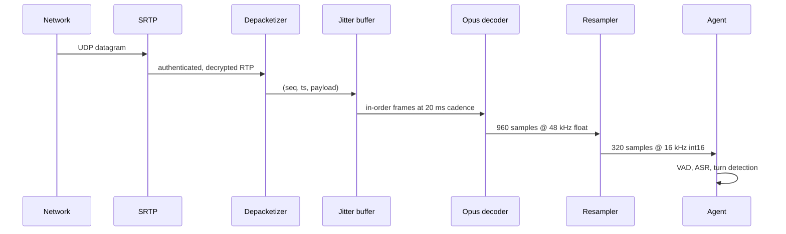

# WebRTC internals

**What you'll be able to do after this:** read an SDP offer and say exactly what was
negotiated; explain ICE candidate gathering, priority and TURN fallback well enough to
budget for it; trace one 20 ms frame from SRTP bytes to `np.int16` on your server; size a
jitter buffer against a measured delay-versus-loss frontier instead of a guess; and say
what NetEQ is doing to your audio before your metrics ever see it.

---

## 1. Intuition

WebRTC is not a protocol. It is a dozen RFCs stacked into one answer to five questions:
*what can we both speak* (SDP), *how do packets reach you* (ICE/STUN/TURN), *how is this
not eavesdropped* (DTLS-SRTP), *how does audio travel* (RTP/Opus), and *how do we cope
when the network misbehaves* (RTCP, NACK, FEC, PLC, jitter buffer, congestion control).

For a voice agent, one sentence compresses all of it: **WebRTC's job is to turn an
unreliable, variable-delay packet stream back into a smooth 20 ms frame cadence.** Every
mechanism in the stack is either *finding a path* or *hiding variance*. Path-finding costs
you setup time and possibly a relay bill. Variance-hiding costs you **latency**, and it is
the single largest discretionary term in the mouth-to-ear budget
([`../01-foundations/04-latency-budget.md`](../01-foundations/04-latency-budget.md)).

That is where the leverage is. You will not rewrite ICE. You will absolutely find yourself
deciding whether 60 ms or 200 ms of jitter buffer is correct, and the honest answer is a
frontier, not a number: measured below, a fixed buffer needs **280 ms** of delay to reach
99.0% usable frames, while an adaptive one reaches **97.8% at 67.1 ms mean** on the same
trace. Four times the latency to recover the last 1.2% of frames — almost always the wrong
trade in a conversation. The other thing worth carrying: by the time audio reaches your
agent code the stack has already lied to you a little. It has concealed losses, and it may
have **changed the playback rate** to drain or refill the buffer. Your timestamps are
reconstructions.

---

## 2. Rigour

### 2.1 SDP: what actually got negotiated

SDP (RFC 8866) is an offer/answer exchange of line-oriented text. For a voice agent the
audio `m=` section carries everything that matters:

| Line | Meaning | Why you care |
|---|---|---|
| `m=audio 9 UDP/TLS/RTP/SAVPF 111 63 9 0 8` | payload types, in preference order | `111` is dynamic Opus; `0`/`8` are PCMU/PCMA fallbacks |
| `a=rtpmap:111 opus/48000/2` | codec name, clock rate, encoding params | **must** be `48000/2` |
| `a=fmtp:111 minptime=10;useinbandfec=1` | codec parameters | FEC is **off** unless this says so |
| `a=ptime:20` / `a=maxptime:40` | preferred / maximum packet duration | your frame contract, negotiated |
| `a=ice-ufrag:` / `a=ice-pwd:` | ICE credentials | STUN checks are authenticated with these |
| `a=fingerprint:sha-256 …` | hash of the DTLS certificate | the entire security model hinges on this |
| `a=setup:actpass` | DTLS role | offerer defers; answerer picks `active` and dials |
| `a=mid:0` + `a=group:BUNDLE 0` | bundling | one ICE transport for all media |
| `a=rtcp-mux` | RTCP on the RTP port | halves candidates and ports |
| `a=sendrecv` | direction | `sendonly`/`recvonly` are how half-duplex bugs enter |

Two details are load-bearing and routinely misread.

**`opus/48000/2` is not a stereo request.** RFC 7587 requires the `a=rtpmap` clock rate to
be 48000 and the encoding parameter to be 2, *regardless* of what you send; mono is
signalled by omitting `stereo=1` in `fmtp`, not by writing `/1`. The same section fixes the
media clock: "the RTP timestamp is incremented with a 48000 Hz clock rate for all modes of
Opus and all sampling rates." So even when your pipeline is 16 kHz internally, RTP
timestamps advance **960 per 20 ms frame**, not 320 — and conflating the two produces audio
that is subtly the wrong speed, which is a miserable bug to chase.

**`useinbandfec` defaults to 0.** RFC 7587 is explicit: "If no value is specified,
useinbandfec is assumed to be 0." The measurement in
[`01-transports.md`](01-transports.md) showed in-band FEC lifting usable frames from 95.1%
to 99.8% at 5% loss for one frame of delay — the best line in that table — and you do not
get it by default. You get it by writing `useinbandfec=1`.

### 2.2 ICE: finding a path, and what it costs

Each endpoint gathers **candidates** — plausible transport addresses — and the two sides
run connectivity checks over the cross product. Four candidate types:

| Type | How obtained | Typical use |
|---|---|---|
| `host` | local interface address | same LAN, or localhost testing |
| `srflx` (server-reflexive) | a STUN Binding request reveals your public mapping | the common case through NAT |
| `prflx` (peer-reflexive) | learned from an incoming check's source address | symmetric-NAT surprises |
| `relay` | allocated on a TURN server | last resort; **all** media traverses your relay |

RFC 8445 gives the priority exactly:

$$
\text{priority} = 2^{24} \cdot \text{type\_pref} + 2^{8} \cdot \text{local\_pref} + (256 - \text{component\_id})
$$

with RECOMMENDED type preferences of **126** host, **110** peer-reflexive, **100**
server-reflexive, **0** relay, and local preference 65535 for an IPv4-only host. Because
the type preference occupies the top bits, the ordering is categorical: *every* host
candidate is tried before *any* relay candidate. Candidate pairs are then ordered by

$$
\text{pair priority} = 2^{32}\cdot\min(G,D) + 2\cdot\max(G,D) + [G>D]
$$

where $G$ and $D$ are the controlling and controlled agents' priorities, and the default
checklist limit is 100 pairs.

Two operational consequences. **Trickle ICE is the difference between a 200 ms and a 2 s
connect** — gathering every candidate before sending an offer means waiting on STUN and
TURN round trips, while trickling sends the offer immediately and streams candidates as
they appear, so the host pair usually succeeds before the relay candidate is even
allocated. **And relay is a bill, not just a fallback:** a relayed session pushes both
directions through your TURN server, and corporate firewalls that permit only TCP/443
outbound force exactly that. Budget TURN from your measured fallback rate. Separately,
**ICE restart** re-gathers and re-checks without tearing down the session — preserving the
DTLS session and media state — which is how a client survives Wi-Fi-to-LTE with a glitch
rather than a reconnect ([`07-reliability.md`](07-reliability.md)).

### 2.3 STUN and TURN

STUN (RFC 8489) is one cheap UDP round trip whose useful trick is `XOR-MAPPED-ADDRESS`:
the server tells you how your packets look from outside, which is your `srflx` candidate.

TURN (RFC 8656) is a relay. The client **allocates** a relayed address, installs
**permissions** for peers allowed to send to it, then forwards data either in `Send`/`Data`
indications (36 bytes of overhead) or over a **ChannelData** binding whose header is
**4 bytes** — on a 50-byte Opus frame, the difference between 72% and 8% overhead, so any
TURN deployment you care about uses channels. TURN also offers TCP and TLS transports, and
TLS/443 — the one that defeats hostile firewalls — reintroduces exactly the head-of-line
blocking [`01-transports.md`](01-transports.md) measured. A relayed-over-TCP session is a
WebSocket wearing a WebRTC costume, and it sounds like one.

### 2.4 DTLS-SRTP: one handshake, then symmetric crypto

Media is encrypted with SRTP (RFC 3711), which has no key exchange of its own. DTLS-SRTP
(RFC 5764) supplies one: the peers run a DTLS handshake over the *same* ICE-selected
5-tuple, verify each other's certificate against the SDP `a=fingerprint`, then **export**
SRTP keying material from the DTLS master secret. Per-packet work afterwards is AES plus a
10-byte authentication tag.

Two consequences. Because the peer is authenticated only by a hash carried in the SDP,
**media confidentiality rests on the integrity of your signalling channel** — anyone who
can rewrite the offer can substitute their own fingerprint and terminate the session
themselves, which is why LiveKit's join flow is a signed JWT over TLS
([`../07-livekit/01-architecture.md`](../07-livekit/01-architecture.md)). And the handshake
costs one to two round trips *after* ICE succeeds, before the first audio byte: establish
media early, which is why agents join the room before they have anything to say.

### 2.5 RTP and RTCP

The RTP fixed header (RFC 3550) is 12 bytes: version/padding/extension/CSRC-count, then
marker plus 7-bit payload type, then a 16-bit **sequence number**, a 32-bit **timestamp**
in codec clock units, and a 32-bit **SSRC**. Sequence detects loss and reordering;
timestamp carries the media clock and is *not* wall time; SSRC identifies the stream and
changes on renegotiation, which is a classic source of "audio stopped" bugs.

RTCP rides alongside. Sender and Receiver Reports carry cumulative loss, extended highest
sequence, and the **interarrival jitter**, an exponential filter of gain 1/16:

$$
J(i) = J(i-1) + \frac{|D(i-1,i)| - J(i-1)}{16}
$$

where $D$ is the difference between RTP-timestamp spacing and arrival spacing; the RFC
notes that 1/16 "gives a good noise reduction ratio while maintaining a reasonable rate of
convergence". RTCP is bandwidth-limited to a small share of the session — a RECOMMENDED
**1.25% senders / 3.75% receivers** split — so its feedback is coarse by design and never
per-packet. RTCP-FB (RFC 4585) adds the low-latency signals: **NACK** for selective
retransmission, plus transport-wide congestion feedback.

**NACK is usually wrong for a voice agent.** A retransmission arrives at least one RTT
later, so with a 60 ms buffer and a 200 ms RTT it is useless before it is requested. Opus
in-band FEC costs one *frame* of delay instead of one round trip, which is why §2.1's
`useinbandfec=1` matters more than NACK on the audio path.

### 2.6 The jitter buffer, derived

Packets arrive at $a_i$; they must be played at a uniform cadence. Define the relative
delay of packet $i$ against the first packet's arrival:

$$
r_i = a_i - \left(a_0 + i \cdot 20\ \text{ms}\right)
$$

If the receiver holds a buffer target $T$, packet $i$ is played at $a_0 + T + i\cdot20$ ms
and is **usable** iff $r_i \le T$. So choosing $T$ is choosing a quantile of the relative
delay distribution:

$$
T = Q_{1-\epsilon}(r) \quad\Longrightarrow\quad \text{late rate} \approx \epsilon
$$

Three consequences fall straight out. The added latency $T$ is paid by *every* frame,
including the 99% that did not need it. The tail sets the price: a 200 ms spike costs
200 ms of buffer to absorb fully, even at 1% of the call. And **"late" and "lost" are the
same event** — a frame missing its deadline is concealed exactly like a dropped one, so the
only honest metric is usable frames, not delivery rate.

`[MEASURED]` from §3 — 2500 frames, 1.0% loss, 30 ms base one-way delay, Gaussian jitter
$\sigma = 6$ ms, 0.5% reordering, and two congestion spikes (+180 ms for 800 ms, +120 ms
for 500 ms):

| Buffer | Mean delay | p95 delay | Max delay | Late | Concealed | Usable |
|---|---|---|---|---|---|---|
| fixed 20 ms | 50.0 | 50.0 | 50.0 | 3.0% | 1.0% | 95.9% |
| fixed 60 ms | 90.0 | 90.0 | 90.0 | 2.6% | 1.0% | 96.4% |
| fixed 120 ms | 150.0 | 150.0 | 150.0 | 2.0% | 1.0% | 97.0% |
| fixed 250 ms | 280.0 | 280.0 | 280.0 | 0.0% | 1.0% | **99.0%** |
| adaptive | **67.1** | 215.2 | 228.9 | 1.2% | 1.0% | **97.8%** |

Read the frontier, not the winner. Going from a 20 ms to a 250 ms fixed buffer buys 3.1
points of usable frames for **230 ms** of unconditional added latency — catastrophic in a
conversation whose entire target budget is around 300 ms. The adaptive buffer lands within
1.2 points of the best fixed buffer at **under a quarter of the mean delay**, because it
pays for spikes only while they happen: its target ranges over 20–199 ms across the call,
and its 215 ms p95 *is* the spike being absorbed. Brief localised latency instead of
permanent latency is the correct shape.

### 2.7 What NetEQ actually does

`libwebrtc`'s jitter buffer is NetEQ, and it is more aggressive than the model above. From
`api/neteq/neteq.h`, `NetEq::Config` defaults: `sample_rate_hz = 48000`,
`max_packets_in_buffer = 200`, `max_delay_ms = 0` and `min_delay_ms = 0` (unconstrained).
Two hundred packets is **4 seconds** of 20 ms audio — capacity exists for bursts, not for
delay.

The `NetEq::Operation` enum is the real interface to reason about: `kNormal`, `kMerge`,
`kExpand`, `kAccelerate`, `kFastAccelerate`, `kPreemptiveExpand`, `kRfc3389Cng`,
`kCodecInternalCng`, `kDtmf`. Only `kNormal` plays audio as sent; `kExpand` is
packet-loss concealment; and **`kAccelerate` and `kPreemptiveExpand` are time-stretching**,
WSOLA-style removal or insertion of audio to shrink or grow the buffer without dropping
whole frames. This is the part people miss: a jitter buffer is not a delay line, it is a
**playback-rate controller**, and when over-full it plays your agent's speech slightly fast
to drain itself.

The target comes from `DelayManager`, whose defaults encode a policy: `quantile = 0.95`,
`forget_factor = 0.983`, `start_forget_weight = 2`, `reorder_forget_factor = 0.9993`,
`ms_per_loss_percent = 20`, `kStartDelayMs = 80`. NetEQ tracks the **95th percentile** of
arrival delay with exponential forgetting rather than a sliding window, weights early
observations double so a fresh call converges fast, and — the striking one — carries an
explicit **exchange rate of 20 ms of delay per 1% of loss avoided**. Google's jitter buffer
has a price list; yours should too, and §2.6's frontier is how you write it.

Two agent-level consequences. **Client-side latency measurements measure NetEQ, not your
pipeline** — timing first-audio at the speaker includes a buffer target that adapts to the
user's network. And **time-stretching corrupts duration-based logic**: computing how much
of your reply the user heard from elapsed wall time is wrong when the client may have
played it 5% fast. Use explicit playback marks
([`../03-turn-taking/04-barge-in.md`](../03-turn-taking/04-barge-in.md)).

### 2.8 Congestion control

WebRTC's send rate is governed by Google Congestion Control: a delay-based estimator
(arrival-time filter over inter-group delay variation, fed by transport-wide sequence
numbers in RTCP feedback) combined with a loss-based estimator. REMB, the older
receiver-side estimate, has been superseded by transport-wide feedback.

Audio-only sessions are *mostly* immune — 40 kbit/s is far under any plausible estimate —
but not entirely, and the exceptions bite. The bandwidth estimate gates whether the
encoder enables FEC and how much redundancy it adds, so a congested path can silently
lose the FEC that was protecting it. And congestion control is shared across a BUNDLE
group: put video in the same session and audio now competes with a stream that will
happily consume every available bit.

### 2.9 Topology: P2P, SFU, MCU

| Axis | P2P | SFU | MCU |
|---|---|---|---|
| Server does | nothing (or TURN) | forwards packets, no decode | decodes, mixes, re-encodes |
| Added latency | none | ~1–5 ms | one full codec round trip, 40–100 ms |
| Server CPU per session | ~0 | per-packet SRTP + forwarding | per-stream decode + encode |
| Streams to a client in $n$-party | $n-1$ up, $n-1$ down | 1 up, $n-1$ down | 1 up, 1 down |
| Recording / server-side ASR | hard | needs a subscriber | trivial, already mixed |
| Right for | two browsers, no infrastructure | almost every voice agent | conference bridges, PSTN gateways |

For a voice agent the SFU wins on a technicality that matters: the agent *is* a
participant. It subscribes to the caller's track and publishes its own, so one topology
serves one-to-one calls, human-plus-agent-plus-supervisor, and recording, with no special
cases. MCU mixing is redundant work when only one party needs the mix. The cost is that
the **agent server** does the Opus decode, which is where your CPU goes at scale (§5).

### 2.10 From SRTP bytes to `np.int16`

The full chain on the receive side, which is what "how does server code get PCM out of a
track" actually means:



Every stage can hurt you. SRTP authentication failures are silent discards that look like
packet loss. The depacketizer must handle a 16-bit sequence number that **wraps** every
65536 packets — 21.8 minutes at 50 packets/s, comfortably inside a support call. The Opus
decoder always outputs 48 kHz (§2.1), so a resample to the internal 16 kHz contract is
mandatory and belongs at the edge and nowhere else
([`../00-setup/03-canonical-formats.md`](../00-setup/03-canonical-formats.md)). In LiveKit
you see none of this — `rtc.AudioStream` hands you frames — which is a good boundary right
up to the moment you must explain a latency regression and discover the buffer was never
yours to see.

---

## 3. From scratch

RTP header round trip, then a fixed-versus-adaptive jitter buffer measured on one trace.
Standalone, stdlib only, deterministic.

```python
"""From RTP bytes to played-out audio: parse a packet, then survive the network.

Part A builds and parses an RFC 3550 RTP packet, because "how does server code get
PCM out of a track" starts with 12 bytes of header.

Part B is the jitter buffer. A fixed buffer trades latency against late-arriving
frames on a fixed schedule; an adaptive buffer tracks the recent delay spread and
pays only for the jitter it actually sees. Both are measured on the same trace,
which includes Gaussian jitter, reordering, loss, and two congestion spikes.
"""

import random
import struct

FRAME_MS = 20
SAMPLES_PER_FRAME = 320          # 16 kHz mono, the internal contract
PT_OPUS = 111                    # dynamic payload type, RFC 7587


# ---------------------------------------------------------------- Part A
def rtp_pack(seq, timestamp, ssrc, payload, *, marker=False, pt=PT_OPUS):
    """RFC 3550 fixed header: V=2, no padding, no extension, no CSRCs."""
    b0 = 2 << 6                                    # version 2, P=0, X=0, CC=0
    b1 = (0x80 if marker else 0) | (pt & 0x7F)     # M bit + payload type
    return struct.pack("!BBHII", b0, b1, seq & 0xFFFF, timestamp & 0xFFFFFFFF,
                       ssrc & 0xFFFFFFFF) + payload


def rtp_unpack(pkt):
    b0, b1, seq, ts, ssrc = struct.unpack("!BBHII", pkt[:12])
    version, padding, ext, cc = b0 >> 6, (b0 >> 5) & 1, (b0 >> 4) & 1, b0 & 0x0F
    if version != 2:
        raise ValueError(f"not RTP: version {version}")
    off = 12 + 4 * cc
    if ext:                                        # skip the header extension
        _, words = struct.unpack("!HH", pkt[off:off + 4])
        off += 4 + 4 * words
    payload = pkt[off:len(pkt) - (pkt[-1] if padding else 0)]
    return {"seq": seq, "ts": ts, "ssrc": ssrc, "marker": bool(b1 >> 7),
            "pt": b1 & 0x7F, "payload": payload}


# ---------------------------------------------------------------- Part B
SEED = 17
N = 2500                        # 50 s of audio at 20 ms
BASE_OWD = 30.0                 # one-way delay floor, ms
JITTER_SD = 6.0
LOSS = 0.01
REORDER = 0.005
SPIKES = [(600, 40, 180.0), (1500, 25, 120.0)]   # (start frame, length, extra ms)


def make_arrivals():
    """(seq, send_ms, arrive_ms) with jitter, reordering, loss and two spikes."""
    rng = random.Random(SEED)
    out = []
    for i in range(N):
        if rng.random() < LOSS:
            continue
        send = i * FRAME_MS
        extra = sum(amt for s, ln, amt in SPIKES if s <= i < s + ln)
        arrive = send + BASE_OWD + abs(rng.gauss(0, JITTER_SD)) + extra
        if rng.random() < REORDER:
            arrive += FRAME_MS * 1.5          # overtaken by the next packet
        out.append((i, send, arrive))
    out.sort(key=lambda r: r[2])              # the receiver sees arrival order
    return out


def run_buffer(arrivals, mode, fixed_ms=60):
    """Play out one frame every FRAME_MS. Return (delays, late, underruns, targets).

    The buffer target is the delay added on top of the first packet's arrival.
    Adaptive mode tracks a high percentile of recent relative delay, grows fast
    and shrinks slowly -- shrinking during a spike is what causes audible dropouts.
    """
    first_arrive = arrivals[0][2]
    first_seq = arrivals[0][0]
    target = fixed_ms
    recent, delays, late, underruns, targets = [], [], 0, 0, []
    by_seq = {}
    idx = 0
    for step in range(N):
        seq = first_seq + step
        playout = first_arrive + target + step * FRAME_MS
        while idx < len(arrivals) and arrivals[idx][2] <= playout:
            s, snd, arr = arrivals[idx]
            by_seq[s] = arr
            rel = arr - (first_arrive + (s - first_seq) * FRAME_MS)   # jitter, ms
            recent.append(rel)
            if len(recent) > 100:
                recent.pop(0)
            idx += 1
        arr = by_seq.pop(seq, None)
        if arr is None:
            if any(a[0] == seq for a in arrivals):
                late += 1        # it exists, it just did not make the deadline
            else:
                underruns += 1   # genuinely lost, concealed by PLC
        else:
            delays.append(playout - (first_arrive + (seq - first_seq) * FRAME_MS)
                          + BASE_OWD)
        targets.append(target)
        if mode == "adaptive" and recent:
            want = sorted(recent)[int(0.98 * (len(recent) - 1))] + 15   # p98 + margin
            target = max(target, want) if want > target else target - 0.35 * FRAME_MS
            target = min(max(target, 20.0), 300.0)
    return delays, late, underruns, targets


def pct(xs, q):
    xs = sorted(xs)
    return xs[min(len(xs) - 1, int(q * len(xs)))]


if __name__ == "__main__":
    print("PART A -- RTP header round trip\n")
    payload = bytes(range(64))
    pkt = rtp_pack(seq=4001, timestamp=160 * 4001, ssrc=0xDEADBEEF, payload=payload,
                   marker=True)
    got = rtp_unpack(pkt)
    print(f"  packed {len(pkt)} bytes = 12 header + {len(payload)} payload")
    print(f"  first two bytes: {pkt[0]:#04x} {pkt[1]:#04x}  "
          f"(version {pkt[0] >> 6}, marker {bool(pkt[1] >> 7)}, pt {pkt[1] & 0x7F})")
    print(f"  parsed seq={got['seq']} ts={got['ts']} ssrc={got['ssrc']:#010x} "
          f"payload_ok={got['payload'] == payload}")
    print(f"  timestamp advances by {SAMPLES_PER_FRAME} samples per 20 ms frame at "
          f"16 kHz; the RTP clock is samples, not milliseconds")

    arrivals = make_arrivals()
    print(f"\n\nPART B -- {N} frames, {len(arrivals)} arrived "
          f"({1 - len(arrivals)/N:.1%} lost), base one-way delay {BASE_OWD:.0f} ms, "
          f"two congestion spikes\n")
    print(f"{'buffer':14s} {'mean delay':>11} {'p95 delay':>10} {'max delay':>10} "
          f"{'late':>7} {'concealed':>10} {'usable':>8}")
    configs = [("fixed 20 ms", "fixed", 20), ("fixed 60 ms", "fixed", 60),
               ("fixed 120 ms", "fixed", 120), ("fixed 250 ms", "fixed", 250),
               ("adaptive", "adaptive", 40)]
    for name, mode, fixed in configs:
        d, late, under, targets = run_buffer(arrivals, mode, fixed)
        played = len(d)
        print(f"{name:14s} {sum(d)/len(d):10.1f}  {pct(d,.95):9.1f} {max(d):10.1f} "
              f"{late/N:6.1%} {under/N:9.1%} {played/N:7.1%}"
              + (f"   target {min(targets):.0f}-{max(targets):.0f} ms"
                 if mode == "adaptive" else ""))
```

Output `[MEASURED]`:

```
PART A -- RTP header round trip

  packed 76 bytes = 12 header + 64 payload
  first two bytes: 0x80 0xef  (version 2, marker True, pt 111)
  parsed seq=4001 ts=640160 ssrc=0xdeadbeef payload_ok=True
  timestamp advances by 320 samples per 20 ms frame at 16 kHz; the RTP clock is samples, not milliseconds


PART B -- 2500 frames, 2474 arrived (1.0% lost), base one-way delay 30 ms, two congestion spikes

buffer          mean delay  p95 delay  max delay    late  concealed   usable
fixed 20 ms          50.0       50.0       50.0   3.0%      1.0%   95.9%
fixed 60 ms          90.0       90.0       90.0   2.6%      1.0%   96.4%
fixed 120 ms        150.0      150.0      150.0   2.0%      1.0%   97.0%
fixed 250 ms        280.0      280.0      280.0   0.0%      1.0%   99.0%
adaptive             67.1      215.2      228.9   1.2%      1.0%   97.8%   target 20-199 ms
```

Three load-bearing details. **The buffer must grow fast and shrink slowly**, and the
asymmetry in `run_buffer` (`max()` on the way up, a 7 ms decay on the way down) is the
whole algorithm: shrinking as fast as you grow means shrinking *during* a spike, which
converts one congestion event into a run of dropped frames. **`late` and `underruns` are
counted separately on purpose** — they look identical in the audio and have opposite
fixes; a late frame means your buffer is too small, a concealed frame means the network
lost it and no buffer size will help. Conflating them is how teams add 200 ms of latency
to "fix" packet loss. And **the RTP timestamp is a sample count**, so Part A's
`160 * 4001` is an 8 kHz media clock while the printed contract is 320 samples per frame
at 16 kHz; real Opus over RTP uses neither, because RFC 7587 fixes the RTP clock at
48 kHz regardless of the audio you feed it. Three clocks, one packet — label them.

---

## 4. How production does it

**`libwebrtc`** is the reference and the de-facto standard, and NetEQ (§2.7) is the part
worth reading: `modules/audio_coding/neteq/` for the buffer,
`neteq/delay_manager.{h,cc}` for the target-level policy. If you ever need to justify a
jitter-buffer decision to a sceptical room, `ms_per_loss_percent = 20` is the citation.

**LiveKit** terminates WebRTC in a Go SFU and hands agent processes decoded PCM through
`rtc.AudioStream`, so §2.10's chain runs inside the client core rather than your code
([`../07-livekit/01-architecture.md`](../07-livekit/01-architecture.md)). The tradeoff is
real: you get a clean frame API and lose direct visibility into the buffer that shapes
your latency numbers.

**Pion** (Go) and **aiortc** (Python) are the readable implementations: Pion's `pkg/rtp`
and ICE internals are the clearest such code in any language, and aiortc is small enough to
read end to end in an afternoon — the right place to *see* DTLS-SRTP keying happen.

**The browser gives you the APM for free**, the underrated half of choosing WebRTC:
`getUserMedia` with `echoCancellation`, `noiseSuppression` and `autoGainControl` is a tuned
AEC running where it must run, on the device that knows both the played and captured signal
([`../03-turn-taking/05-echo-and-aec.md`](../03-turn-taking/05-echo-and-aec.md)). Telephony
gateways, by contrast, are MCU-shaped by necessity — the PSTN leg is one 8 kHz G.711 stream,
so something must transcode ([`../07-livekit/05-telephony-sip.md`](../07-livekit/05-telephony-sip.md)).

---

## 5. At scale

**SRTP is a per-packet cost, so packet rate is the scaling variable.** At 50 packets/s per
direction, 10 000 concurrent calls is 1 M packets/s of authenticate-and-decrypt through
the media plane. Bandwidth is trivial by comparison. DTX removes roughly half of it during
silence, which is why it is worth negotiating rather than tolerating.

**Opus decode is your agent fleet's floor.** The SFU forwards without decoding; your agent
must decode every subscribed track. Opus decode is cheap per stream and not free per
thousand, and it is unavoidable work that scales exactly with concurrency — count it in
the per-session resource model before the model inference
([`05-scale-and-orchestration.md`](05-scale-and-orchestration.md)).

**TURN is the line item that surprises people.** Relayed sessions consume ingress and
egress in your infrastructure for both directions. If 10% of sessions relay, 10% of your
calls cost roughly 4× the network of a direct one (both directions, both legs). Measure
the fallback rate per network segment; enterprise customers skew it badly.

**Ports and buffers.** With `rtcp-mux` and BUNDLE a session needs one UDP port rather than
four — the difference between 10 000 and 40 000 sockets at 10 000 calls. NetEQ's
`max_packets_in_buffer = 200` is tens of kilobytes per stream: negligible alone, tens of
megabytes when a congestion event fills every buffer at once.

**Region choice is a latency decision, and edge media alone does not buy one.** Terminating
media near the user shortens the RTP path and narrows the jitter *spread*, which is what
§2.6 prices — but if inference stays central, the media edge sits *on* the path to the model
region, so by the triangle inequality it cannot reduce mouth-to-ear latency at all, and with
sparse edges it makes it worse. Measured in
[`08-deployment.md`](08-deployment.md): media edges plus central inference came out
identical to a single central region, and three media edges with central inference were
*worse* (756 ms mean against 730 ms). Regionalise media and models together, or accept that
you have moved latency rather than removed it.

**Deploys must not trigger ICE-restart storms.** Draining a media node moves every session
on it; if that happens as a hard cutover, thousands of clients re-gather candidates and
re-handshake DTLS at once, which is a self-inflicted thundering herd
([`../07-livekit/04-self-hosting-and-scale.md`](../07-livekit/04-self-hosting-and-scale.md)).

---

## 6. Exercises

**E6.2.1** Run the §3 listing. Replace the adaptive rule's `p98 + 15 ms` with NetEQ's
policy — a 0.95 quantile with exponential forgetting at `forget_factor = 0.983` instead of
a 100-sample window — and report the change in mean delay and usable frames. Explain which
of the two responds better to the spikes, and why.

**E6.2.2** Add a `ms_per_loss_percent` knob to the adaptive buffer: accept a target loss
budget and choose $T$ as the quantile that meets it. Plot the delay-versus-usable frontier
across budgets from 0.1% to 5% and mark where you would ship.

**E6.2.3** Break the buffer deliberately: make it shrink as fast as it grows. Report the
usable-frame rate and explain the failure in terms of the two spikes in the trace.

**E6.2.4** Extend `rtp_unpack` to handle a 16-bit sequence wrap and reordering across the
wrap boundary. Prove it with a trace that crosses 65535, and state how many minutes of a
50 packets/s call that is.

**E6.2.5** Write the SDP audio section for a voice agent that wants 20 ms mono Opus with
in-band FEC and DTX, and no video. State which of your `fmtp` parameters would be silently
ignored if you omitted them, and what each omission costs.

**E6.2.6** Compute the ICE priority of a host IPv4 candidate, a server-reflexive
candidate, and a relay candidate for component 1 using the RFC 8445 formula. Show
numerically that no relay pair can ever outrank a host pair.

**E6.2.7** For your own deployment, estimate the TURN fallback rate from logs, then compute
the additional monthly bandwidth and cost that relayed sessions add. State the fallback
rate at which a dedicated TURN fleet becomes cheaper than the managed one.

**E6.2.8** Instrument a real call to separate the three clocks in §3's last note: the RTP
timestamp, the codec sample clock, and wall time. Report the drift between them over five
minutes and explain which one your latency metrics should use.

---

## 7. Interview drill

> "Users say our agent's audio 'stutters' on mobile. Our dashboards show 0.4% packet loss
> and 45 ms p95 jitter, which look fine. Where do you start, and what would you change?"

The dashboard is measuring the network and the users are describing the playout, so the
first move is to stop trusting the aggregate. 0.4% loss and 45 ms p95 jitter are averages
over a call population, and a jitter buffer is priced by the *tail of one call*: if p95 is
45 ms then p99.9 may be 300 ms, and a buffer sized for p95 conceals every frame above it.
So I want the per-call distribution of relative arrival delay, not the mean, and I want
`late` counted separately from `lost`. Those two have identical symptoms and opposite
fixes — late means the buffer is too small, lost means the network dropped it and no buffer
size helps. Conflating them is how teams add a couple hundred milliseconds of latency and
still stutter.

Second, "mobile" is a hint about *shape*. Mobile networks deliver in bursts with periodic
radio-scheduling spikes, so the delay distribution is bimodal rather than Gaussian, and a
fixed buffer chosen from average conditions is wrong twice — too large in the good state,
too small in the spike. That points at an adaptive buffer that grows fast and shrinks
slowly. In the measurement I would cite, a fixed 250 ms buffer reached 99.0% usable frames
at 280 ms of unconditional delay while an adaptive one reached 97.8% at 67.1 ms mean, so
the adaptive policy is the right default and the residual 1.2% is a loss problem, not a
buffer problem. For that loss the audio fix is Opus in-band FEC, not NACK: a retransmission
costs at least one RTT, which on a mobile path exceeds any sane buffer target, while FEC
costs one frame because the redundant copy rides the following packet. Check the SDP first —
`useinbandfec` defaults to 0 in RFC 7587, so there is a real chance we never asked for it
and a one-line `fmtp` change recovers most of the complaint.

What distinguishes a senior answer is refusing to treat this as one bug. Three independent
candidates share the symptom: a buffer sized from the wrong statistic, missing FEC, and
NetEQ time-stretching (`kAccelerate` / `kPreemptiveExpand`), which audibly warps speech when
the buffer is over-full — and that last one is *caused* by an over-large buffer, so the naive
"add more buffer" fix can manufacture the exact complaint we are chasing. I would also ask
whether the stutter correlates with the agent speaking or the user speaking; if it is only
during agent speech this may not be transport at all, but a TTS pipeline stall or an AEC
problem wearing a network costume.

The premise to question is "stutters". Ask for a recording. Dropouts, robotic
time-stretching, self-interruption, and clipped word-onsets from an aggressive endpointer
are four different faults that users describe with the same word, and only one of them is
in this chapter.

---

## Sources

- Schulzrinne, Casner, Frederick & Jacobson, "RTP: A Transport Protocol for Real-Time Applications", RFC 3550, July 2003 — the 12-byte fixed header parsed in §3; §6.4.1 interarrival jitter $J(i) = J(i-1) + (|D(i-1,i)| - J(i-1))/16$ and the note that the 1/16 gain "gives a good noise reduction ratio while maintaining a reasonable rate of convergence"; §6.2 RTCP bandwidth with the RECOMMENDED 1.25%/3.75% sender/receiver split.
- Spittka, Vos & Valin, "RTP Payload Format for the Opus Speech and Audio Codec", RFC 7587, June 2015 — §4.1 "the RTP timestamp is incremented with a 48000 Hz clock rate for all modes of Opus and all sampling rates"; §7 `a=rtpmap` clock rate MUST be 48000; the media-type registration for `ptime`, `maxptime`, `maxaveragebitrate`, `stereo`, `sprop-stereo`, `cbr`, `usedtx`, and `useinbandfec` — including "If no value is specified, useinbandfec is assumed to be 0"; §3.1.1 the 20 ms bitrate sweet spots (8–12 NB, 16–20 WB, 28–40 FB kbit/s).
- Keränen, Holmberg & Rosenberg, "Interactive Connectivity Establishment (ICE)", RFC 8445, July 2018 — §5.1.2.1 the priority formula $2^{24}\cdot\text{type} + 2^{8}\cdot\text{local} + (256-\text{component})$ with RECOMMENDED type preferences 126/110/100/0 and local preference 65535 for IPv4-only hosts; §6.1.2.3 pair priority $2^{32}\cdot\min(G,D) + 2\cdot\max(G,D) + [G>D]$; §6.1.2.5 the default limit of 100 candidate pairs per checklist set.
- Petit-Huguenin, Salgueiro, Rosenberg, Wing, Mahy & Matthews, "Session Traversal Utilities for NAT (STUN)", RFC 8489, February 2020 — `XOR-MAPPED-ADDRESS` as the source of a server-reflexive candidate.
- Reddy, Johnston, Matthews & Rosenberg, "Traversal Using Relays around NAT (TURN)", RFC 8656, February 2020 — allocations, permissions, and the 4-byte ChannelData header versus 36-byte Send/Data indication overhead cited in §2.3.
- McGrew & Rescorla, "Datagram Transport Layer Security (DTLS) Extension to Establish Keys for the Secure Real-time Transport Protocol (SRTP)", RFC 5764, May 2010 — DTLS-SRTP key export over the ICE-selected 5-tuple.
- Baugher, McGrew, Naslund, Carrara & Norrman, "The Secure Real-time Transport Protocol (SRTP)", RFC 3711, March 2004 — the 10-byte default authentication tag priced in §2.4.
- Ott, Wenger, Sato, Burmeister & Rey, "Extended RTP Profile for RTCP-Based Feedback (RTP/AVPF)", RFC 4585, July 2006 — NACK and the feedback timing rules behind §2.5.
- Begen, Kyzivat, Perkins & Handley, "SDP: Session Description Protocol", RFC 8866, January 2021 — the offer/answer attribute set tabulated in §2.1.
- `webrtc-mirror/webrtc` (`main`, retrieved 2026-08-26) — `api/neteq/neteq.h:NetEq::Config` (`sample_rate_hz = 48000`, `max_packets_in_buffer = 200`, `max_delay_ms = 0`, `min_delay_ms = 0`) and `NetEq::Operation` / `NetEq::Mode` enums including `kAccelerate`, `kFastAccelerate`, `kPreemptiveExpand`, `kExpand`, `kMerge`; `modules/audio_coding/neteq/delay_manager.h:DelayManager::Config` (`quantile = 0.95`, `forget_factor = 0.983`, `start_forget_weight = 2`, `reorder_forget_factor = 0.9993`, `ms_per_loss_percent = 20`, `resample_interval_ms = 500`) and `delay_manager.cc:kStartDelayMs = 80`; `modules/audio_coding/neteq/packet_buffer.h` for `Flush()` and `kFlushed`.
- `pion/webrtc` and `aiortc/aiortc` — the readable ICE/RTP/DTLS-SRTP implementations recommended in §4.
- `[MEASURED]`: the §2.6 table and the §3 output are one run of the §3 listing on Apple M5 / macOS 26.5.2, CPython 3.12, stdlib only, `SEED = 17`. The loss model is independent per packet with two injected congestion spikes; real mobile networks lose in bursts and have heavier delay tails, which penalises the fixed buffers more than the adaptive one, so the adaptive advantage reported here is conservative. All ICE, SDP, RTP and NetEQ constants are quoted from the primary sources above, not measured.
