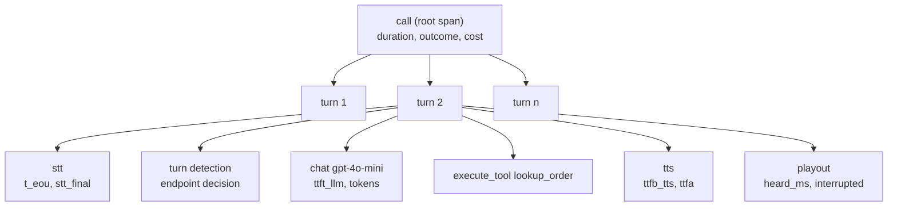

# Observability

**What you'll be able to do after this:** model a conversation as a trace using current
OTel conventions and know exactly which spans the standard does not give you; choose
histogram buckets that do not misreport your own SLO by 18%; build a regression alert that
can actually detect the regression you care about; sample traces without destroying the
tail you sample for; and attribute cost to a call.

---

## 1. Intuition

Voice agents fail in ways that logs do not capture. Nothing threw. The status code was 200.
The user simply felt talked over, or waited two seconds in silence, or heard the agent
confirm an order number it had misheard. Every one of those is a *timing* or *content*
failure spread across five services, and the only way to see it is to have decided, in
advance, to measure it.

The trap is that observability tooling gives you confident-looking numbers that are wrong.
Three measured examples from this chapter, all from defaults that a competent team would
choose:

- The **OTel GenAI semantic conventions' own recommended histogram buckets** report the p95
  of a realistic voice-agent latency distribution as **2144 ms when the truth is 1820 ms —
  17.8% high**. Prometheus's default buckets are 19.9% high. Your SLO dashboard is off by a
  fifth, in the pessimistic direction, and nothing warns you.
- A **static threshold alert cannot detect a 75 ms p95 regression at all.** At every
  threshold below the baseline it fires before *and* after the regression; above it, it
  stays quiet before *and* after. There is no setting that distinguishes them.
- **Tail sampling — keep every trace slower than 1.5 s — makes the observed p99 39% too
  high**, because you have deliberately biased your sample and then computed a quantile
  over it.

The unifying lesson is a division of labour. **Metrics measure, traces explain.** Compute
quantiles from complete data with a bucket layout you chose on purpose; use traces, sampled
however you like, to answer "why was *that* call slow". Teams that compute SLOs from
sampled traces, or debug from aggregates, get the worst of both.

---

## 2. Rigour

### 2.1 The span model for a conversation

A conversation is naturally a three-level trace, and the levels correspond to things
humans complain about:



The **turn** is the unit that matters, and it is the one people omit. A call-level span
tells you a call was slow; a stage-level span tells you TTS was slow; only the turn span
lets you say "the third turn, the one where the user gave their order number, took 2.9
seconds and was then interrupted". That is the object a product complaint maps onto.

Current OTel conventions cover the model-facing half of this properly, and it is worth
using them rather than inventing names. Note first that **the GenAI semantic conventions
moved out of the main `semantic-conventions` repository into
`open-telemetry/semantic-conventions-genai`** — the old paths are stubs. Span naming is
`{gen_ai.operation.name} {gen_ai.request.model}`, with `gen_ai.operation.name` taking
values including `chat`, `generate_content`, `text_completion`, `embeddings`,
`execute_tool` and `invoke_agent`. The attributes that earn their keep for voice:

| Attribute | Why it matters here |
|---|---|
| `gen_ai.conversation.id` | the correlation key across every turn of a call |
| `gen_ai.conversation.compacted` | records that history was summarised — a quality confound |
| `gen_ai.response.time_to_first_chunk` | this is `ttft_llm`, standardised |
| `gen_ai.usage.input_tokens` / `output_tokens` | cost attribution, per turn |
| `gen_ai.usage.cache_read.input_tokens` / `cache_write.input_tokens` | prefix-cache hit rate, which is your TTFT lever |
| `gen_ai.usage.audio.input_tokens` / `audio.output_tokens` | audio-token accounting for speech-to-speech ([`04-speech-to-speech.md`](04-speech-to-speech.md)) |
| `gen_ai.tool.name` / `tool.call.id` | join tool latency to the turn that waited on it |
| `gen_ai.request.stream` | streaming or not, which changes what TTFT means |

And the standard-recommended metrics: `gen_ai.client.operation.duration`,
`gen_ai.client.operation.time_to_first_chunk`,
`gen_ai.client.operation.time_per_output_chunk`, `gen_ai.client.token.usage`,
`gen_ai.server.time_to_first_token`, `gen_ai.server.time_per_output_token`.

**What the conventions do not give you is the entire voice-specific half.** There is no
standard attribute for end-of-utterance time, endpointing decisions, barge-in, echo, or
audio actually heard. So the metric names this curriculum has used throughout are filling a
real gap rather than reinventing a wheel: `speech_start`, `speech_end`, `t_eou`,
`stt_final`, `ttft_llm`, `first_clause`, `ttfb_tts`, `ttfa`, `eou_to_ttfa`, `wer`,
`endpoint_f1`, `interruption_rate`, `barge_in_latency`. Namespace them
(`voice.eou_to_ttfa`) and treat them as first-class alongside the `gen_ai.*` set.

The single most important derived span attribute is **`heard_ms`** — how much of the
agent's reply the user actually heard, from playout rather than from synthesis. Without it,
barge-in is unmeasurable and your transcripts are fiction
([`03-pipeline-architecture.md`](03-pipeline-architecture.md)).

### 2.2 Which instrument for which quantity

| Quantity | Instrument | Why |
|---|---|---|
| `eou_to_ttfa`, `ttft_llm`, `ttfb_tts` | histogram | you need quantiles, and averages hide everything |
| tokens per turn, cost per call | histogram | distribution matters for capacity and billing |
| concurrent sessions | gauge (up/down counter) | this is the erlang count ([`05-scale-and-orchestration.md`](05-scale-and-orchestration.md)) |
| calls started / ended / rejected | counter | rates and ratios |
| interruptions, false interruptions | counter | ratio against turns is the metric |
| queue depth per edge | histogram | the level is less useful than the distribution |
| WER, endpoint F1 | offline, batch | not a request-time metric; computed against labels ([`../08-eval-safety/01-testing.md`](../08-eval-safety/01-testing.md)) |

The rule people break: **latency is never a gauge and never an average.** A mean
`eou_to_ttfa` of 900 ms is consistent with every turn taking 900 ms and with three quarters
taking 500 ms while a quarter take 2 s, and those are different products.

### 2.3 Histogram buckets, measured

At scale you do not store latencies, you store bucket counts, and a quantile is then
*interpolated* within the bucket that contains it. So the error in your reported p95 is
bounded by the width of the bucket straddling the p95 — and a voice agent's latency
distribution is **bimodal** (fast turns; tool-call turns), which puts the interesting
quantiles in the sparse region between the modes, exactly where log-spaced layouts are
widest.

`[MEASURED]` from §3 — 200 000 samples, true p50 578.1 ms, p95 1819.6 ms, p99 2548.3 ms:

| Bucket layout | Buckets | p50 est | err | p95 est | err | p99 est | err |
|---|---|---|---|---|---|---|---|
| Prometheus defaults | 11 | 663.9 | 14.9% | 2181.0 | **19.9%** | 2752.5 | 8.0% |
| linear 500 ms | 20 | 663.9 | 14.9% | 1865.4 | 2.5% | 2574.0 | 1.0% |
| linear 100 ms | 100 | 580.9 | 0.5% | 1820.5 | **0.0%** | 2550.3 | 0.1% |
| linear 25 ms | 400 | 578.3 | 0.0% | 1818.3 | −0.1% | 2548.6 | 0.0% |
| exponential ×2 from 5 | 12 | 586.6 | 1.5% | 2144.3 | 17.8% | 2557.3 | 0.3% |
| **OTel GenAI recommended** | 14 | 586.6 | 1.5% | 2144.3 | **17.8%** | 2557.3 | 0.3% |
| OTel exponential scale=2 | 64 | 581.9 | 0.7% | 1840.3 | 1.1% | 2589.6 | 1.6% |
| OTel exponential scale=4 | 254 | 578.3 | 0.0% | 1820.1 | 0.0% | 2548.1 | −0.0% |

The GenAI conventions specify `ExplicitBucketBoundaries` of `[0.01, 0.02, 0.04, 0.08, 0.16,
0.32, 0.64, 1.28, 2.56, 5.12, 10.24, 20.48, 40.96, 81.92]` seconds for operation duration
and time-to-first-chunk. Between **1.28 s and 2.56 s there is no boundary** — and a voice
agent's p95 lands in that gap, so the estimate is pinned near the interpolation of a
1.28 s-wide bucket and comes out 17.8% high. That layout is right for LLM API calls
spanning three orders of magnitude and wrong for a conversational SLO.

Two fixes, and they are not equivalent. **Explicit linear buckets in your actual range** —
100 ms steps to 10 s — gives 0.0% error on p95 with 100 buckets, and is the right answer
when you know your range, which for `eou_to_ttfa` you do. **OTel exponential histograms**
adapt automatically: with `base = 2^{2^{-scale}}` from the data model spec, `scale=2` gives
1.1% error in 64 buckets and `scale=4` gives 0.0% in 254. Use exponential histograms where
range is unknown, explicit linear where you own the SLO.

The general statement: **choose buckets so that a boundary sits at your SLO threshold.** If
you promise p95 under 1.5 s, you need a boundary at 1.5 s, or you cannot measure compliance
with the promise you made.

### 2.4 Cardinality, the other way to lose

Every label combination is a separate time series. `session_id`, `call_id`,
`gen_ai.conversation.id`, `phone_number`, `user_id` are all unbounded, and putting any of
them on a metric turns 10 000 calls/day into 10 000 series/day, forever. The discipline:

- **Metrics get bounded labels only**: region, model, provider, tenant tier, outcome class,
  agent version. Roughly, anything you would put in a `GROUP BY`.
- **Traces and logs get high-cardinality identifiers.** That is what they are for, and
  exemplars are the supported bridge from a histogram bucket to a representative trace.
- **Watch the multiplicative ones.** `model × provider × region × tenant` is fine;
  add `error_code` from an upstream API and you inherit their taxonomy.

### 2.5 Regression detection, measured

The naive alert is `p95 > threshold`. `[MEASURED]` from §3 — baseline p95 is 1820 ms, and
the regression under test adds 75 ms to every turn:

| Static threshold | Before regression | After regression |
|---|---|---|
| p95 > 900 ms | 1832 → **fires** | 1907 → **fires** |
| p95 > 1000 ms | 1832 → **fires** | 1907 → **fires** |
| p95 > 1500 ms | 1832 → **fires** | 1907 → **fires** |
| p95 > 2000 ms | 1832 → quiet | 1907 → quiet |

**No threshold distinguishes the two states.** Below baseline it is permanently armed —
which in practice means someone silences it — and above baseline it never fires. A static
threshold is a *contract* check ("are we meeting the SLO"), not a *change* detector, and
using it as both is why alert fatigue exists.

Change detection needs a control limit computed from the baseline's own variability.
`[MEASURED]` — sampling distribution of the windowed p95 over 300 windows, with a 3σ limit:

| Calls per window | p95 noise (sd) | Detect +75 ms | False alarms |
|---|---|---|---|
| 100 | 210.1 ms | 0.7% | 0.3% |
| 500 | 93.4 ms | 2.0% | 0.0% |
| 2 000 | 46.4 ms | 6.7% | 0.3% |
| 10 000 | 21.8 ms | **65.3%** | 0.0% |

This is the sobering result. **At 100 calls per window the noise in your p95 is 210 ms —
nearly three times the regression you are hunting.** Detecting a 75 ms shift with any
reliability needs on the order of 10 000 calls in the window, and even then you catch it
65% of the time. Three consequences worth internalising:

- **Small deployments cannot detect small regressions from production traffic**, at any
  alert sophistication. If you do 500 calls a day, a 75 ms p95 shift is invisible for
  weeks. The answer is a **deterministic benchmark in CI** (§2.7), not a better alert.
- **Alert on the aggregate window that gives you power**, and accept the detection delay
  that implies. An hourly p95 on 10 000 calls is a real signal; a five-minute p95 on 300
  calls is noise you will learn to ignore.
- **Prefer a lower quantile for change detection.** p50 has far less sampling noise than
  p95, so a shift that moves the whole distribution shows up at p50 first and more
  reliably. Watch p50 for change, p95 for the SLO.

### 2.6 Sampling, and the tail you destroyed

`[MEASURED]` from §3 — true p99 is 2548 ms over 200 000 calls:

| Strategy | Traces kept | Observed p99 | Error |
|---|---|---|---|
| head sampling 1% | 1 962 | 2396 ms | −6.0% |
| head sampling 5% | 9 897 | 2591 ms | 1.7% |
| head sampling 25% | 49 799 | 2584 ms | 1.4% |
| tail sampling: all > 1000 ms + 1% | 40 412 | 3230 ms | **+26.7%** |
| tail sampling: all > 1500 ms + 1% | 20 455 | 3539 ms | **+38.9%** |

Head sampling is unbiased — a random 1% has the right shape, and its error is pure sampling
noise. Tail sampling is **deliberately biased**, so the p99 of the kept traces is not the
p99 of your traffic; it is off by 39% in the case that keeps the most interesting traces.

This is not an argument against tail sampling, which is the right way to spend a trace
budget: you keep every slow and every failed call, which is exactly what you want to look
at. It is an argument for the division of labour in §1. **Never compute an SLO from a
sampled trace store.** Emit the histogram from every call — that is cheap, because it is
bucket counters — and let the trace store be biased on purpose.

### 2.7 Recording and deterministic replay

The distinguishing capability of a mature voice platform is being able to answer "what
exactly happened on that call" and then "does the fix change it". That needs three
artefacts per call, and they are cheap if you decide early:

1. **Input audio**, per participant track, unmixed. Mixed audio is nearly useless for
   debugging AEC and diarization.
2. **The event log**: every frame boundary event with timestamps —
   `speech_start`, `t_eou`, `stt_final` with text, tool calls and results, `ttfa`,
   interruption events, `heard_ms`.
3. **The decision inputs**: prompt, model, temperature, tool schema, retrieved context,
   and the agent version. Without these a replay is not a replay.

Determinism is achievable for everything except the models, which is enough to be useful.
Replay the recorded audio through the pipeline with a **fake clock** and stubbed engines and
you get a reproducible test of your turn-taking, interruption and orchestration logic —
that is precisely the technique the testing chapter builds on
([`../08-eval-safety/01-testing.md`](../08-eval-safety/01-testing.md)). Keep model
responses cached alongside the recording so a replay exercises your code and not the
vendor's sampling temperature.

The retention question is a legal one, not a technical one: recorded audio is personal
data, a voiceprint may be biometric data, and consent law differs by jurisdiction
([`../08-eval-safety/03-safety-and-privacy.md`](../08-eval-safety/03-safety-and-privacy.md)).
Decide the retention window and the redaction path before you turn recording on, not after
your first incident.

### 2.8 Cost attribution

Cost per call is a first-class metric because it is the one that gets your architecture
changed. Attach it to the call span, built from per-turn spans:

$$
\text{cost}_{\text{call}} = \underbrace{d \cdot (c_{\text{media}} + c_{\text{telephony}} + c_{\text{agent}} + c_{\text{asr}})}_{\text{duration-priced}} + \underbrace{\sum_{\text{turns}} \left( n_{\text{in}} c_{\text{in}} + n_{\text{out}} c_{\text{out}} \right)}_{\text{tokens}} + \underbrace{\sum_{\text{turns}} k_{\text{chars}} c_{\text{tts}}}_{\text{synthesis}}
$$

Two implementation notes. **Take token counts from `gen_ai.usage.*` rather than
estimating**, because cache reads and writes are priced differently and a prefix-cache hit
rate you cannot see is a bill you cannot explain. And **track cost per *successful* call,
not per call** — an agent that fails halfway is cheap and worthless, so cost-per-call
improves when quality degrades, which makes the naive metric actively misleading.

---

## 3. From scratch

Bucket fidelity, regression detection power, and sampling bias, on one synthetic but
realistically bimodal latency distribution. Standalone, stdlib only, deterministic.

```python
"""Observability that survives contact with a latency SLO.

Three ways teams unknowingly blind themselves, all measurable.

Part A -- histogram buckets. You never store raw latencies at scale; you store
bucket counts. The bucket layout decides how wrong your p95 is, and the
default layouts in common tooling were chosen for HTTP, not for a conversation
whose latency distribution is bimodal (fast turns, plus tool-call turns).

Part B -- regression detection. "Alert when p95 > 1000 ms" both misses real
regressions and fires on noise. How many calls does it take to see a +75 ms p95
shift, and how often does a static threshold cry wolf?

Part C -- sampling. Head sampling at 1% is cheap and throws away the tail you
were hired to defend. Tail sampling keeps the slow traces. Measure the error in
the observed p99 under each.

Deterministic: fixed seed, no dependencies.
"""

import math
import random

SEED = 41
N = 200_000


# ------------------------------------------------------- the ground truth
def eou_to_ttfa(rng, shift_ms=0.0, tool_rate=0.22):
    """Bimodal: most turns are fast, tool-call turns are slow.

    This shape is why HTTP-tuned bucket layouts mislead: the mass is not
    unimodal and the interesting quantiles sit between the two modes.
    """
    if rng.random() < tool_rate:
        base = rng.lognormvariate(math.log(1400), 0.35)      # tool-call turn
    else:
        base = rng.lognormvariate(math.log(520), 0.30)       # straight answer
    return base + shift_ms


def sample(n, shift_ms=0.0, seed=SEED):
    rng = random.Random(seed)
    return [eou_to_ttfa(rng, shift_ms) for _ in range(n)]


def pct(xs, q):
    xs = sorted(xs)
    return xs[min(len(xs) - 1, int(q * len(xs)))]


# --------------------------------------------------------------- Part A
def prom_default():
    """Prometheus client default buckets, in ms (they are seconds upstream)."""
    return [5, 10, 25, 50, 100, 250, 500, 1000, 2500, 5000, 10000]


def linear(step, upto):
    return [step * i for i in range(1, int(upto / step) + 1)]


def exp_buckets(start, factor, count):
    out, v = [], start
    for _ in range(count):
        out.append(v)
        v *= factor
    return out


def otel_genai():
    """OTel GenAI semantic conventions ExplicitBucketBoundaries, in ms.

    Spec value is in seconds: 0.01, 0.02, 0.04 ... 81.92 -- powers of two from
    10 ms. Recommended for gen_ai.client.operation.duration and
    time_to_first_chunk.
    """
    return [10 * 2 ** i for i in range(14)]


def otel_exponential(scale):
    """OTel exponential histogram: base = 2**(2**-scale), boundaries are powers.

    scale=0 -> base 2; scale=3 -> base ~1.09 (about 9% relative error bound).
    """
    base = 2.0 ** (2.0 ** -scale)
    out, v = [], 1.0
    while v < 60_000:
        out.append(v)
        v *= base
    return out


def hist_quantile(xs, bounds, q):
    """Estimate a quantile from bucket counts by linear interpolation.

    This is exactly what Prometheus histogram_quantile does, and reproducing
    it is the only way to see the error your dashboard is showing you.
    """
    counts = [0] * (len(bounds) + 1)
    for x in xs:
        placed = False
        for i, b in enumerate(bounds):
            if x <= b:
                counts[i] += 1
                placed = True
                break
        if not placed:
            counts[-1] += 1                  # the +Inf bucket
    total = len(xs)
    target = q * total
    cum = 0
    for i, c in enumerate(counts):
        if cum + c >= target:
            if i >= len(bounds):
                return float("inf")          # quantile lands in +Inf: unknowable
            lo = bounds[i - 1] if i > 0 else 0.0
            hi = bounds[i]
            frac = (target - cum) / c if c else 0.0
            return lo + (hi - lo) * frac
        cum += c
    return float("inf")


def part_a():
    xs = sample(N)
    layouts = [
        ("Prometheus defaults", prom_default()),
        ("linear 500 ms", linear(500, 10_000)),
        ("linear 100 ms", linear(100, 10_000)),
        ("linear 25 ms", linear(25, 10_000)),
        ("exponential x2 from 5", exp_buckets(5, 2.0, 12)),
        ("OTel GenAI recommended", otel_genai()),
        ("OTel exponential scale=2", otel_exponential(2)),
        ("OTel exponential scale=4", otel_exponential(4)),
    ]
    print(f"true    p50 {pct(xs,.50):7.1f}  p95 {pct(xs,.95):7.1f}  "
          f"p99 {pct(xs,.99):7.1f}   ({N} samples, bimodal)\n")
    print(f"{'bucket layout':26s} {'n':>4} {'p50 est':>9} {'err':>7} "
          f"{'p95 est':>9} {'err':>7} {'p99 est':>9} {'err':>7}")
    for name, bounds in layouts:
        row = [name, len(bounds)]
        cells = ""
        for q in (0.50, 0.95, 0.99):
            true = pct(xs, q)
            est = hist_quantile(xs, bounds, q)
            err = (est - true) / true * 100 if math.isfinite(est) else float("inf")
            cells += (f" {est:9.1f} {err:6.1f}%" if math.isfinite(est)
                      else f" {'+Inf':>9} {'--':>6} ")
        print(f"{row[0]:26s} {row[1]:4d}{cells}")


# --------------------------------------------------------------- Part B
def part_b(shift=75.0):
    print(f"regression under test: +{shift:.0f} ms added to every turn\n")
    base_full = sample(N, 0.0, seed=SEED)
    p95_base = pct(base_full, .95)
    print(f"baseline p95 = {p95_base:.0f} ms; a static alert at 'p95 > 1000 ms' "
          f"is {'ARMED' if p95_base > 1000 else 'silent'} before any regression\n")
    print(f"{'calls/window':>13} {'p95 noise sd':>13} {'detect +75ms':>13} "
          f"{'false alarms':>13}")
    for n in (100, 500, 2_000, 10_000):
        # sampling distribution of the windowed p95, with and without the shift
        base_p95, shifted_p95 = [], []
        for w in range(300):
            rng = random.Random(1000 + w)
            b = [eou_to_ttfa(rng, 0.0) for _ in range(n)]
            rng2 = random.Random(1000 + w)
            s = [eou_to_ttfa(rng2, shift) for _ in range(n)]
            base_p95.append(pct(b, .95))
            shifted_p95.append(pct(s, .95))
        mu = sum(base_p95) / len(base_p95)
        sd = (sum((x - mu) ** 2 for x in base_p95) / (len(base_p95) - 1)) ** 0.5
        # a 3-sigma control limit on the windowed p95
        limit = mu + 3 * sd
        detect = sum(1 for x in shifted_p95 if x > limit) / len(shifted_p95)
        false = sum(1 for x in base_p95 if x > limit) / len(base_p95)
        print(f"{n:13d} {sd:12.1f}ms {detect:12.1%} {false:12.1%}")
    print("\nthe same shift against a STATIC threshold instead of a control limit:")
    for thr in (900, 1000, 1500, 2000):
        rng = random.Random(7)
        b = [eou_to_ttfa(rng, 0.0) for _ in range(20_000)]
        rng = random.Random(7)
        s = [eou_to_ttfa(rng, shift) for _ in range(20_000)]
        print(f"  threshold p95 > {thr:5d} ms: before {pct(b,.95):6.0f} "
              f"({'FIRES' if pct(b,.95) > thr else 'quiet'}), "
              f"after {pct(s,.95):6.0f} "
              f"({'FIRES' if pct(s,.95) > thr else 'quiet'})")


# --------------------------------------------------------------- Part C
def part_c():
    xs = sample(N)
    true_p99 = pct(xs, .99)
    print(f"true p99 = {true_p99:.0f} ms over {N} calls\n")
    print(f"{'strategy':34s} {'traces kept':>12} {'observed p99':>13} "
          f"{'err':>8}")
    rng = random.Random(SEED + 1)
    for rate in (0.01, 0.05, 0.25):
        kept = [x for x in xs if rng.random() < rate]
        e = pct(kept, .99)
        print(f"{'head sampling %.0f%%' % (rate*100):34s} {len(kept):12d} "
              f"{e:12.0f}ms {(e-true_p99)/true_p99*100:7.1f}%")
    # tail sampling: keep everything slow, plus a small random slice of the rest
    for thr in (1000, 1500):
        kept = [x for x in xs if x > thr or rng.random() < 0.01]
        e = pct(kept, .99)
        print(f"{'tail sampling: all >%dms + 1%%' % thr:34s} {len(kept):12d} "
              f"{e:12.0f}ms {(e-true_p99)/true_p99*100:7.1f}%")
    print("\n  head sampling shrinks the sample and the tail together")
    print("  tail sampling keeps every slow trace, so p99 of the KEPT set is not")
    print("  the p99 of traffic -- you must weight, or track the quantile in a")
    print("  metric and use traces only for diagnosis")


if __name__ == "__main__":
    print("PART A -- what your histogram buckets do to your p95\n")
    part_a()
    print("\n\nPART B -- can you even see a regression?\n")
    part_b()
    print("\n\nPART C -- sampling and the tail\n")
    part_c()
```

Output `[MEASURED]`:

```
PART A -- what your histogram buckets do to your p95

true    p50   578.1  p95  1819.6  p99  2548.3   (200000 samples, bimodal)

bucket layout                 n   p50 est     err   p95 est     err   p99 est     err
Prometheus defaults          11     663.9   14.9%    2181.0   19.9%    2752.5    8.0%
linear 500 ms                20     663.9   14.9%    1865.4    2.5%    2574.0    1.0%
linear 100 ms               100     580.9    0.5%    1820.5    0.0%    2550.3    0.1%
linear 25 ms                400     578.3    0.0%    1818.3   -0.1%    2548.6    0.0%
exponential x2 from 5        12     586.6    1.5%    2144.3   17.8%    2557.3    0.3%
OTel GenAI recommended       14     586.6    1.5%    2144.3   17.8%    2557.3    0.3%
OTel exponential scale=2     64     581.9    0.7%    1840.3    1.1%    2589.6    1.6%
OTel exponential scale=4    254     578.3    0.0%    1820.1    0.0%    2548.1   -0.0%


PART B -- can you even see a regression?

regression under test: +75 ms added to every turn

baseline p95 = 1820 ms; a static alert at 'p95 > 1000 ms' is ARMED before any regression

 calls/window  p95 noise sd  detect +75ms  false alarms
          100        210.1ms         0.7%         0.3%
          500         93.4ms         2.0%         0.0%
         2000         46.4ms         6.7%         0.3%
        10000         21.8ms        65.3%         0.0%

the same shift against a STATIC threshold instead of a control limit:
  threshold p95 >   900 ms: before   1832 (FIRES), after   1907 (FIRES)
  threshold p95 >  1000 ms: before   1832 (FIRES), after   1907 (FIRES)
  threshold p95 >  1500 ms: before   1832 (FIRES), after   1907 (FIRES)
  threshold p95 >  2000 ms: before   1832 (quiet), after   1907 (quiet)


PART C -- sampling and the tail

true p99 = 2548 ms over 200000 calls

strategy                            traces kept  observed p99      err
head sampling 1%                           1962         2396ms    -6.0%
head sampling 5%                           9897         2591ms     1.7%
head sampling 25%                         49799         2584ms     1.4%
tail sampling: all >1000ms + 1%           40412         3230ms    26.7%
tail sampling: all >1500ms + 1%           20455         3539ms    38.9%

  head sampling shrinks the sample and the tail together
  tail sampling keeps every slow trace, so p99 of the KEPT set is not
  the p99 of traffic -- you must weight, or track the quantile in a
  metric and use traces only for diagnosis
```

Three load-bearing details. **`hist_quantile` reimplements Prometheus's linear
interpolation exactly**, including the `+Inf` bucket returning infinity — that is not
pedantry, it is the reason a p99 above your largest boundary is not merely inaccurate but
*unknowable*, and why the top boundary must exceed your worst real latency. **The
distribution is bimodal on purpose**, because a unimodal test makes every bucket layout
look fine; the 17.8% error appears only because the p95 falls in the gap between two modes,
which is the actual shape of voice-agent latency once tool calls exist. And **Part B seeds
the baseline and shifted samples identically** (`Random(1000+w)` twice), so the two draws
are the same underlying turns with and without the regression — that removes sampling noise
*between* the arms and isolates the detection question, which is the opposite of what you
want in Part C where the sampling noise *is* the measurement.

---

## 4. How production does it

**OpenTelemetry GenAI conventions** are the right starting point for the model-facing spans
and metrics, with the caveat from §2.1 that they now live in
`open-telemetry/semantic-conventions-genai` and are marked Development — expect churn, and
pin the version you instrumented against. Their bucket recommendation is measured in §2.3
and should be overridden for conversational latency.

**LiveKit Agents emits per-session metrics** and exposes a Prometheus endpoint on the
worker (`port` 8081 in production), with session events for the turn boundaries this
chapter needs ([`../07-livekit/02-agents-framework.md`](../07-livekit/02-agents-framework.md)).
What you still have to build is the turn-level span tree and `heard_ms`.

**Exemplars are the supported bridge** between a histogram bucket and a trace: attach a
trace ID to a bucket observation and your dashboard can jump from "the p99 bucket" to a real
slow call. This is the mechanism that makes §2.6's division of labour usable rather than
merely correct.

**The pattern that works for quality metrics** is a separate offline path: WER, endpoint F1
and task success are computed in batch against labelled or replayed calls, not at request
time, and joined back to call IDs
([`../08-eval-safety/02-simulation-and-load.md`](../08-eval-safety/02-simulation-and-load.md)).
Trying to compute WER online produces neither good metrics nor good latency.

---

## 5. At scale

**Bucket counts are cheap; labels are not.** A 100-bucket histogram is 100 counters per
label set, and it is the label set that explodes. Budget series, not samples, and audit
cardinality in CI by asserting the label keys on every metric.

**At 10 000 concurrent calls, per-frame instrumentation is a load-bearing cost.** 50
packets/s per direction is a million events/s; do not create a span per frame. Instrument
*decisions* and *stage boundaries*, and use counters for per-frame phenomena.

**Sampling budget should be spent on failures and tails, weighted.** Keep 100% of errored
and slow calls, a small unbiased head sample for population questions, and record the
sampling rate as an attribute so a downstream query can reweight if it must.

**Retention differs per artefact.** Metrics for a year (they are small and you need
year-over-year), traces for days, audio for whatever your legal review permits. Conflating
these into one retention policy is how you end up either blind or non-compliant.

**Detection power scales with traffic, so small tenants need synthetic traffic.** §2.5 says
a low-volume deployment cannot see small regressions; the fix is a scheduled synthetic call
suite whose numbers are deterministic enough to alert on
([`../08-eval-safety/01-testing.md`](../08-eval-safety/01-testing.md)).

**Attribute cost per successful call and per tenant** from day one. Retrofitting cost
attribution requires token counts you did not record, and `gen_ai.usage.cache_read.
input_tokens` in particular cannot be reconstructed after the fact.

---

## 6. Exercises

**E6.6.1** Run the §3 listing. Add a bucket layout with an explicit boundary at your own
p95 SLO threshold and report the error. State how many buckets you need for under 1% error
on p95.

**E6.6.2** Make the distribution unimodal with the same mean and re-run Part A. Explain why
the Prometheus and OTel GenAI layouts look much better, and what that says about testing
bucket layouts on synthetic unimodal data.

**E6.6.3** Compute the maximum relative error of an OTel exponential histogram at
`scale = 2, 3, 4` from `base = 2^{2^{-scale}}`, and check your answer against Part A's
measured errors.

**E6.6.4** Extend Part B to detect a shift at p50 instead of p95. Report the calls-per-
window needed for 80% detection at each quantile and explain the difference.

**E6.6.5** Implement the two-alert design: a static SLO threshold and a control-limit
change detector. State the window, quantile and limit for each, and which one pages a human.

**E6.6.6** Add a weighted-quantile estimator to Part C that corrects tail sampling using
the known sampling rates, and report the residual error. State why you would still not
compute your SLO this way.

**E6.6.7** Design the span tree for one real call in your system, listing every span, its
attributes, and which `gen_ai.*` convention it maps to. Name the spans that have no
standard convention and choose namespaced names for them.

**E6.6.8** Record one call with all three artefacts from §2.7, then replay it with a fake
clock and stubbed models. Report whether the turn boundaries reproduce exactly, and what
made them non-deterministic if not.

---

## 7. Interview drill

> "We shipped a change last Tuesday. Our p95 latency dashboard looks flat, but support
> tickets about the agent being slow have doubled. Reconcile that for me."

Two hypotheses, and they are not exclusive: either the dashboard cannot see the change, or
the users are not complaining about what the dashboard measures. I would test both, and I
would start with the dashboard because it is cheap to check and it is wrong surprisingly
often.

The first thing I would check is the histogram bucket layout, because a p95 read off
log-spaced buckets is only as precise as the bucket straddling it. In a measurement I would
cite, a realistic bimodal voice-agent distribution with a true p95 of 1820 ms reads as
2144 ms through the OTel GenAI recommended boundaries and 2181 ms through Prometheus's
defaults — 18 to 20% high — because there is no boundary between 1.28 s and 2.56 s and the
p95 falls in that gap. A layout that coarse does not merely mis-report the level, it
*flattens changes*: a 100 or 200 ms shift inside one wide bucket barely moves the
interpolated estimate. So a flat dashboard is entirely consistent with a real regression.

Second, detection power. Even with good buckets, the windowed p95 is a noisy statistic. At
100 calls per window its standard deviation was 210 ms in the same measurement — so any
regression smaller than a couple of hundred milliseconds is invisible at that window size,
and moving to hourly windows of ten thousand calls only gets you to about 65% detection for
a 75 ms shift. I would recompute the p95 from raw or finely-bucketed data over a longer
window either side of Tuesday, and I would look at p50 as well, because p50 has much less
sampling noise and a whole-distribution shift shows there first and more reliably.

Third, and this is where I would expect the real answer to be: users may not be complaining
about `eou_to_ttfa` at all. "Slow" is what people say about dead air after they finish
speaking, which is the endpointing delay, and about the agent taking a long turn before
getting to the point, which is response length, and about being talked over and having to
repeat themselves, which is barge-in and adds a whole turn to the interaction. None of those
move a stage-latency p95 much, and all of them feel slow. So I would segment the tickets,
pull the specific calls they reference, and look at the turn-level spans — which is why the
turn span and `heard_ms` need to exist before the incident rather than after it.

What distinguishes a senior answer is refusing to trust either signal alone and knowing the
division of labour: metrics measure, traces explain. I would not compute a corrected p95
from our trace store, because if we tail-sample — keep everything slow — that store is
biased by construction; in the same measurement, tail sampling above 1.5 s reported a p99
39% too high. So the plan is: fix the buckets so a boundary sits at our SLO, add a
control-limit change detector alongside the static threshold, and use the tickets' call IDs
to pull real traces. And regardless of the outcome I would add a deterministic replay
benchmark to CI, because a 75 ms regression is something we should catch before deploying
rather than argue about afterwards.

The premise worth questioning is "shipped a change last Tuesday". I would confirm the
correlation before accepting the causation — a vendor-side model or region change, a
traffic-mix shift toward tool-heavy calls, or a new customer with worse network conditions
all produce this pattern, and only one of them is our deploy.

---

## Sources

- OpenTelemetry, "Metrics Data Model", `open-telemetry/opentelemetry-specification`, `specification/metrics/data-model.md`, retrieved 2026-08-26 — the exponential histogram definition `base = 2**(2**(-scale))` and the note that "with `scale=3` there are `2**3` buckets between 1 and 2", implemented in §3's `otel_exponential`.
- OpenTelemetry, GenAI semantic conventions, `open-telemetry/semantic-conventions-genai`, `docs/gen-ai/gen-ai-spans.md` and `docs/gen-ai/gen-ai-metrics.md`, retrieved 2026-08-26 (relocated from `open-telemetry/semantic-conventions`, where the old paths are now stubs; status Development) — span naming `{gen_ai.operation.name} {gen_ai.request.model}`; `gen_ai.operation.name` values `chat`, `generate_content`, `text_completion`, `embeddings`, `execute_tool`, `invoke_agent`; attributes `gen_ai.conversation.id`, `gen_ai.conversation.compacted`, `gen_ai.response.time_to_first_chunk`, `gen_ai.usage.input_tokens` / `output_tokens` / `cache_read.input_tokens` / `cache_write.input_tokens` / `audio.input_tokens` / `audio.output_tokens` / `reasoning.output_tokens`, `gen_ai.tool.name` / `tool.call.id`, `gen_ai.request.stream`, `gen_ai.request.reasoning.level`; metrics `gen_ai.client.operation.duration`, `gen_ai.client.operation.time_to_first_chunk` ("Time to receive the first chunk, measured from when the client issues the generation request to when the first chunk is received in the response stream"), `gen_ai.client.operation.time_per_output_chunk`, `gen_ai.client.token.usage`, `gen_ai.server.time_to_first_token`, `gen_ai.server.time_per_output_token`; and the `ExplicitBucketBoundaries` recommendation of `[0.01, 0.02, 0.04, 0.08, 0.16, 0.32, 0.64, 1.28, 2.56, 5.12, 10.24, 20.48, 40.96, 81.92]` seconds measured in §2.3.
- Prometheus client library default histogram buckets (`.005, .01, .025, .05, .1, .25, .5, 1, 2.5, 5, 10` seconds) and the `histogram_quantile` linear-interpolation semantics reproduced in §3's `hist_quantile`.
- `livekit/agents` 1.7.0 — per-session metrics and the worker Prometheus endpoint (`port` 8081 in production), referenced in §4.
- Beyer, Jones, Petoff & Murphy (eds.), *Site Reliability Engineering*, O'Reilly 2016 — the SLO-versus-change-detection distinction formalised in §2.5, and the case against alerting on causes rather than symptoms.
- Metric names used throughout this curriculum (`speech_start`, `speech_end`, `t_eou`, `stt_final`, `ttft_llm`, `first_clause`, `ttfb_tts`, `ttfa`, `eou_to_ttfa`, `wer`, `endpoint_f1`, `interruption_rate`, `barge_in_latency`) are this curriculum's own contract, not a standard; §2.1 states which parts OTel does and does not cover.
- `[MEASURED]`: all three tables are the output of the §3 listing on Apple M5 / macOS 26.5.2, CPython 3.12, stdlib only, `SEED = 41`. The latency distribution is a two-component lognormal mixture (78% at median 520 ms, 22% at median 1400 ms) chosen to match the shape this curriculum measured for tool-bearing turns; it is an `[INFERENCE]` model of a real deployment, not a recording of one, so the exact percentages depend on it. The bucket-error, detection-power and sampling-bias *conclusions* are properties of the estimators rather than of the specific distribution, and hold for any bimodal latency whose interesting quantile falls between the modes — which is the general case once an agent calls tools.
