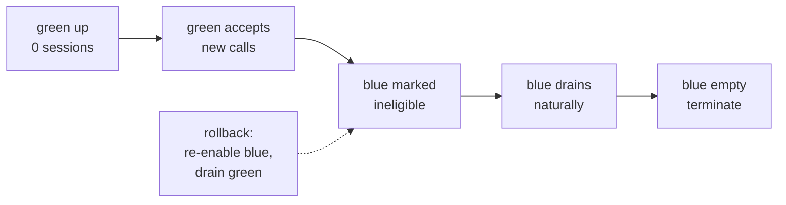

# Deployment

**What you'll be able to do after this:** compute region placement from physics instead of
folklore — and know why "edge media, central models" is the worst of the three options;
size a drain deadline from your own session-duration distribution; explain why autoscaling
cannot answer a surge and prewarming can; ship a browser client that does not sabotage its
own audio; and run blue/green with live calls.

---

## 1. Intuition

Deployment is where a voice agent's latency budget is either respected or quietly spent.
Three of its decisions are physics rather than opinion, which means you can compute them.

**Region placement is bounded by the speed of light in glass.** Light in single-mode fibre
travels at $c/1.4675 \approx 204{,}000$ km/s, and routed paths run about 1.4× the great
circle, giving **0.0137 ms of RTT per kilometre**. Sydney to Virginia is unavoidably ~218 ms
round trip. No amount of engineering removes it; you can only decide who pays it.

That leads to the result this chapter exists for, and it contradicts the advice everyone
gives — including, until it was measured, two earlier chapters of this curriculum.
"Terminate media at the edge, run models centrally" is worse than useless. With central
inference the media edge sits **on the path** to the model region, so by the triangle
inequality it cannot shorten mouth-to-ear latency, and with sparse edges it lengthens it:
measured below, three media regions plus central inference gives a **756 ms mean with 38% of
traffic over 800 ms**, against **730 ms and 22%** for simply putting everything in one
region. The edge added a detour and called it optimisation.

**Deploys cannot preempt conversations.** A rollover must wait for sessions to end, and the
distribution's tail sets the schedule: with a 170 s median session, a 300 s drain still kills
22.2% of live calls, and reaching 99.9% takes 1582 s.

**Autoscaling cannot answer a surge.** With a 42 s cold start and a 90 s autoscaler reaction,
new capacity lands 112 s *after* a 20-second surge has ended. Only prewarmed capacity absorbs
it — 60% of a 300-call surge is rejected with no idle pool, and 0% with 200.

---

## 2. Rigour

### 2.1 The latency floor, from first principles

$$
\text{RTT}_{\text{ms}} = \frac{2 d_{\text{km}}}{c / n_{\text{fibre}}} \times \phi
$$

with $n_{\text{fibre}} = 1.4675$ (fibre group index) and $\phi \approx 1.4$ (routed path
versus great circle). That is **0.0137 ms/km**, or 13.7 ms per 1000 km of separation. Add it
to the fixed pipeline cost — endpointing, ASR, LLM, TTS — which this curriculum has measured
at roughly 620 ms for a competent cascade
([`../01-foundations/04-latency-budget.md`](../01-foundations/04-latency-budget.md)).

Two consequences. **The network term is small compared with the pipeline term for nearby
users and comparable for distant ones**, so geography matters most for your worst-served
population, not your average. And **a cross-region model hop is charged on every turn**,
which is why §2.2's arithmetic bites.

### 2.2 Where media and models live

`[MEASURED]` from §3 — seven traffic sources weighted by share, 620 ms fixed pipeline cost:

| Topology | Mean | p95 city | Worst | Share > 800 ms |
|---|---|---|---|---|
| single region (us-east) | 730 ms | 833 ms | 835 ms | 22% |
| 3 regions, model local | 650 ms | 706 ms | 725 ms | **0%** |
| 8 regions, model local | **623 ms** | 625 ms | 628 ms | **0%** |
| 8 regions media, model us-east | 730 ms | 833 ms | 835 ms | 22% |
| 3 regions media, model us-east | **756 ms** | 886 ms | 919 ms | **38%** |

Read rows four and five against row one. **Eight media edges with central inference is
exactly equal to no edges at all** — 730/833/835 in both cases — because a media edge near
the user lies on the geodesic to the model region, so `media + hop = direct`. This is the
triangle inequality, and it means *no* media-edge deployment can beat central inference on
latency while inference stays central. **Three media edges with central inference is
strictly worse**, because the edge is now a detour: Sydney routes to `ap-se` (86 ms) and then
to `us-east` (213 ms) for 919 ms, where a direct connection to `us-east` would have cost
218 ms.

`[MEASURED]` per-city detail for the worst topology, which is where the mechanism is visible:

| City | Media edge | Media RTT | Model hop | Total | Share |
|---|---|---|---|---|---|
| New York | us-east | 5 ms | 0 ms | 625 ms | 24% |
| London | eu-central | 9 ms | 90 ms | 719 ms | 18% |
| Frankfurt | eu-central | 0 ms | 90 ms | 710 ms | 10% |
| Mumbai | ap-se | 54 ms | 213 ms | **886 ms** | 16% |
| Singapore | ap-se | 0 ms | 213 ms | 833 ms | 12% |
| São Paulo | us-east | 105 ms | 0 ms | 725 ms | 10% |
| Sydney | ap-se | 86 ms | 213 ms | **919 ms** | 10% |

So the real choice is binary: **co-locate models with media and pay the pooling tax per
region**, or **stay central and accept the RTT**. Regionalising media alone is the option
that loses on both axes — it pays for edge infrastructure and buys nothing.

When *is* an SFU at the edge worth it? Three cases, none of which is mouth-to-ear latency in
a two-party agent call. **Jitter spread** narrows with distance, which improves the jitter
buffer's operating point even when mean RTT does not change
([`02-webrtc-internals.md`](02-webrtc-internals.md)). **Multi-party** calls benefit, because
the SFU fans out near the participants. And **TURN relay** must be near the client to be
useful at all. Deploy edge media for those reasons, stated honestly, not for a latency win
the geometry forbids.

The honest resolution for most teams: **regionalise into a small number of full stacks**
(media + models + agents), accepting that each region is a smaller pool and therefore needs
more headroom ([`05-scale-and-orchestration.md`](05-scale-and-orchestration.md)). Three full
regions gets 650 ms mean and 0% over 800 ms — better than eight media edges with central
inference, at less operational cost.

### 2.3 Blue/green with live calls

You cannot restart a process holding a conversation, so the rollover schedule is the session
duration distribution. `[MEASURED]` from §3 — 1000 live sessions, lognormal with 170 s
median, p95 552 s, max 1582 s:

| Drain deadline | Ended naturally | Killed | Killed % | Capacity during rollover |
|---|---|---|---|---|
| 60 s | 82 | 918 | 91.80% | 1.92× |
| 180 s | 522 | 478 | 47.80% | 1.48× |
| 300 s | 778 | 222 | **22.20%** | 1.22× |
| 600 s | 957 | 43 | 4.30% | 1.04× |
| 1200 s | 994 | 6 | 0.60% | 1.01× |
| 3600 s | 1000 | 0 | **0.00%** | 1.00× |

Three readings. **A 5-minute drain, which sounds generous, drops one call in five** — and
the calls it drops are the long ones, which are disproportionately your escalations and your
most valuable conversations. **The cost of a patient drain is capacity, and it is small**:
600 s costs 1.04× and 1200 s costs 1.01×, because by then almost everything has ended. The
expensive drains are the short ones, which need nearly 2× because both colours are fully up.
And **LiveKit's `DRAIN_TIMEOUT = 3600` is not paranoia**, it is the value that makes the
kill column zero for a real session distribution.

The correct blue/green sequence for held sessions:



Two details that are easy to get wrong. **Add capacity before removing it** — during the
overlap your effective pool is what green can serve, and if you shrink blue first you raise
ρ on a smaller pool, which by Erlang C can push a comfortable pool into the waiting regime
for the duration of the deploy. And **rollback is also a drain**, not a switch: reverting
means re-enabling blue for new calls and draining green, so a rollback takes as long as a
deploy. Plan the incident timeline accordingly.

### 2.4 Cold starts, surges, and prewarming

`[MEASURED]` from §3 — 300 calls arriving over 20 s against steady capacity of 120, a 42 s
cold start and a 90 s autoscaler reaction:

| Prewarmed idle | Served immediately | Rejected | Reject % |
|---|---|---|---|
| 0 | 120 | 180 | **60.0%** |
| 25 | 145 | 155 | 51.7% |
| 50 | 170 | 130 | 43.3% |
| 100 | 220 | 80 | 26.7% |
| 200 | 300 | 0 | **0.0%** |

New capacity arrives at $t = 132$ s — **112 seconds after the surge ended.** The autoscaler
is not slow, it is irrelevant: no reactive mechanism can serve a burst shorter than its own
reaction time. This is the same conclusion the dispatch measurement reached from the other
side, where `num_idle_processes = 0` put a 2.74 s cold start on *every* call and idle = 2
removed it.

The cold-start budget is worth decomposing, because the terms have different fixes:

| Term | Typical | How to reduce it |
|---|---|---|
| Node provisioning | 30–90 s | keep warm nodes; overprovision the node pool, not the pods |
| Image pull | 5–60 s | small images, layer caching, pre-pulled on the node |
| Model weight load | 2–40 s | bake weights into the image or a local volume, never download at start |
| Process init / warmup | 1–5 s | prewarm hook; run one inference before accepting work |
| First-inference JIT | 0.5–3 s | warm it during prewarm, not on the first user |

**Never download model weights at container start.** It is the single largest and most
variable term, it makes your start time depend on someone else's CDN, and it is entirely
avoidable. Bake them in and accept the image size.

Because surges cannot be answered reactively, use **predictive** scaling where you can:
voice traffic is strongly diurnal and campaign traffic is scheduled, so a schedule plus a
generous idle pool beats a clever reactive policy. And rate-limit anything outbound that you
control, because a self-inflicted surge is the most common kind.

### 2.5 The browser client

The browser is a deployment target with its own failure modes, and most of them are
self-inflicted:

- **Use WebRTC, not a WebSocket.** Measured earlier: at 5% loss and 200 ms RTT, TCP leaves
  66.1% of frames usable against 95.1% for RTP ([`01-transports.md`](01-transports.md)).
- **Take the audio processing module.** `getUserMedia` with `echoCancellation`,
  `noiseSuppression` and `autoGainControl` is a tuned AEC running in the only place it can
  work ([`../03-turn-taking/05-echo-and-aec.md`](../03-turn-taking/05-echo-and-aec.md)).
  Disabling them "for audio quality" is how agents start interrupting themselves.
- **`AudioWorklet`, never `ScriptProcessorNode`.** The latter is deprecated and runs on the
  main thread, so a React re-render becomes an audio glitch. `AudioWorklet` runs on the audio
  thread at 128-frame quanta.
- **Do not resample in the browser.** Let WebRTC negotiate 48 kHz Opus and resample once,
  server-side, at the edge of your pipeline
  ([`../00-setup/03-canonical-formats.md`](../00-setup/03-canonical-formats.md)).
- **Autoplay policy will silence you.** Audio output requires a user gesture; without one
  the agent speaks into a muted context and the user hears nothing while your metrics look
  perfect.
- **Mint credentials server-side, short-lived.** A room token or ephemeral client secret with
  minutes of validity, never a long-lived API key in a bundle
  ([`../07-livekit/01-architecture.md`](../07-livekit/01-architecture.md)).

### 2.6 Containers, config, and secrets

**Containers.** One process per session means the container hosts a supervisor, so
`SIGTERM` must initiate a *drain*, not a shutdown, and `terminationGracePeriodSeconds` must
exceed your drain deadline — a 30 s default silently converts §2.3's patient drain into a
mass kill. Set CPU requests from the measured per-session model rather than limits alone;
CPU throttling on a real-time pipeline shows up as audio glitches, not as slow requests.

**Config.** Model names, prompts, endpointing thresholds and interruption parameters are all
things you will want to change without a deploy — and all things that change agent behaviour,
so they need versioning and a rollback path. Treat prompts as deployed artefacts with a
version attached to every call's telemetry ([`06-observability.md`](06-observability.md)).

**Secrets.** Vendor API keys for ASR, TTS, LLM, telephony and your own signing keys. Two
voice-specific notes: keys must be rotatable **without dropping calls**, which means the
process re-reads them rather than caching them for its lifetime; and a per-tenant BYO-key
model changes your failure isolation, because one tenant's expired key must not open a
circuit breaker shared with everyone else
([`07-reliability.md`](07-reliability.md)).

### 2.7 CI/CD for a real-time service

The pipeline that catches voice regressions differs from a web service's in three ways.

**Latency gates need distributions, not a number.** §2.5 of
[`06-observability.md`](06-observability.md) showed a 75 ms p95 shift is undetectable in
small samples, so a CI gate must run a fixed corpus deterministically and compare
distributions — a replay harness with a fake clock and stubbed models, not live calls
([`../08-eval-safety/01-testing.md`](../08-eval-safety/01-testing.md)).

**Audio artefacts belong in CI.** Golden audio for TTS, a recorded barge-in for interrupt
correctness, and a WAV-driven pipeline test for turn boundaries.

**Drills are release criteria.** The six drills in [`07-reliability.md`](07-reliability.md)
are mechanisable; the ones that are not get scheduled game days. And the deploy itself must
be tested under load, because §2.3's kill count is the thing you are actually shipping.

---

## 3. From scratch

Region placement from fibre physics, drain scheduling from a session distribution, and
surge absorption against cold starts. Standalone, stdlib only, deterministic.

```python
"""Deployment decisions you can compute instead of argue about.

Part A -- where to put things. Media latency is bounded by physics: light in
single-mode fibre travels at c/1.4675, and real paths are longer than great
circles. So region choice is arithmetic, and the interesting question is
whether the MODEL work has to sit where the MEDIA is terminated.

Part B -- blue/green with live calls. You cannot restart a process holding a
conversation, so a rollover waits for sessions to end naturally. How long does
a full fleet rollover take, and how much extra capacity does it need?

Part C -- cold starts versus an arrival surge. An autoscaler that reacts in
90 s cannot help a surge that arrives in 20 s. Measure rejected calls against
prewarm depth.

Deterministic: fixed seed, stdlib only.
"""

import math
import random

SEED = 71

# ------------------------------------------------------------- Part A
C_KM_S = 299_792.458
FIBRE_INDEX = 1.4675               # single-mode fibre group index
PATH_INFLATION = 1.40              # routed path vs great circle, typical
MS_PER_KM_RTT = 2 * 1000.0 / (C_KM_S / FIBRE_INDEX) * PATH_INFLATION

CITIES = {                          # (lat, lon, share of traffic)
    "New York":   (40.71, -74.01, 0.24),
    "London":     (51.51, -0.13, 0.18),
    "Frankfurt":  (50.11, 8.68, 0.10),
    "Mumbai":     (19.08, 72.88, 0.16),
    "Singapore":  (1.35, 103.82, 0.12),
    "Sao Paulo":  (-23.55, -46.63, 0.10),
    "Sydney":     (-33.87, 151.21, 0.10),
}
REGIONS = {
    "us-east":    (39.04, -77.49),
    "us-west":    (45.60, -121.18),
    "eu-west":    (53.41, -8.24),
    "eu-central": (50.11, 8.68),
    "ap-south":   (19.08, 72.88),
    "ap-se":      (1.35, 103.82),
    "sa-east":    (-23.55, -46.63),
    "ap-se-2":    (-33.87, 151.21),
}

# fixed pipeline cost that does not depend on geography, ms
PIPELINE_MS = 620.0


def haversine(a, b):
    (la1, lo1), (la2, lo2) = a, b
    p = math.pi / 180
    dla, dlo = (la2 - la1) * p, (lo2 - lo1) * p
    h = (math.sin(dla / 2) ** 2
         + math.cos(la1 * p) * math.cos(la2 * p) * math.sin(dlo / 2) ** 2)
    return 2 * 6371.0 * math.asin(math.sqrt(h))


def rtt(city, region):
    return haversine(CITIES[city][:2], REGIONS[region]) * MS_PER_KM_RTT


def part_a():
    print(f"fibre RTT constant: {MS_PER_KM_RTT:.4f} ms/km "
          f"(c/{FIBRE_INDEX}, path inflation {PATH_INFLATION})")
    print(f"fixed pipeline cost: {PIPELINE_MS:.0f} ms\n")

    def best_region(city, pool):
        return min(pool, key=lambda r: rtt(city, r))

    topologies = [
        ("single region (us-east)", ["us-east"], "us-east"),
        ("3 regions, model local", ["us-east", "eu-central", "ap-se"], None),
        ("8 regions, model local", list(REGIONS), None),
        ("8 regions media, model us-east", list(REGIONS), "us-east"),
        ("3 regions media, model us-east", ["us-east", "eu-central", "ap-se"],
         "us-east"),
    ]
    print(f"{'topology':32s} {'mean':>7} {'p95 city':>9} {'worst':>7} "
          f"{'>800ms share':>13}")
    for name, pool, model_region in topologies:
        per_city = []
        for city, (_, _, share) in CITIES.items():
            edge = best_region(city, pool)
            media = rtt(city, edge)
            # model hop: 0 if inference runs in the media region
            hop = 0.0 if model_region is None else rtt_region(edge, model_region)
            per_city.append((city, media + hop + PIPELINE_MS, share))
        mean = sum(v * s for _, v, s in per_city)
        vals = sorted(v for _, v, _ in per_city)
        p95 = vals[int(0.95 * (len(vals) - 1))]
        worst = max(vals)
        over = sum(s for _, v, s in per_city if v > 800)
        print(f"{name:32s} {mean:6.0f}ms {p95:8.0f}ms {worst:6.0f}ms "
              f"{over:12.0%}")

    print(f"\nper-city mouth-to-ear, '3 regions media, model us-east':")
    for city, (_, _, share) in CITIES.items():
        edge = best_region(city, ["us-east", "eu-central", "ap-se"])
        media = rtt(city, edge)
        hop = rtt_region(edge, "us-east")
        print(f"  {city:11s} -> {edge:11s} media {media:5.0f}ms "
              f"+ model hop {hop:5.0f}ms = {media+hop+PIPELINE_MS:5.0f}ms "
              f"({share:.0%} of traffic)")


def rtt_region(r1, r2):
    if r1 == r2:
        return 0.0
    return haversine(REGIONS[r1], REGIONS[r2]) * MS_PER_KM_RTT


# ------------------------------------------------------------- Part B
def part_b(fleet=40, sessions_per_node=25, median_s=170.0, sigma=0.75):
    """Blue/green rollover: wait for sessions to end rather than killing them."""
    rng = random.Random(SEED)
    live = [rng.lognormvariate(math.log(median_s), sigma)
            for _ in range(fleet * sessions_per_node)]
    live.sort()
    n = len(live)
    print(f"{fleet} nodes x {sessions_per_node} sessions = {n} live sessions")
    print(f"session duration: median {median_s:.0f}s, "
          f"p95 {live[int(.95*n)]:.0f}s, max {live[-1]:.0f}s\n")
    print(f"{'drain deadline':>15} {'sessions ended':>15} {'killed':>8} "
          f"{'killed %':>9} {'extra capacity':>15}")
    for deadline in (60, 180, 300, 600, 1200, 3600):
        ended = sum(1 for x in live if x <= deadline)
        killed = n - ended
        # during rollover both colours are up for the sessions still draining
        extra = killed / n
        print(f"{deadline:12d} s {ended:15d} {killed:8d} {killed/n:8.2%} "
              f"{1+extra:14.2f}x")
    print(f"\ntime for 99.9% of sessions to end naturally: "
          f"{live[int(.999*n)]:.0f}s")


# ------------------------------------------------------------- Part C
def part_c(surge_s=20, surge_calls=300, capacity=120, cold_start_s=42.0,
           autoscale_react_s=90.0):
    """A surge arrives faster than capacity can be added. Prewarm or reject."""
    print(f"surge: {surge_calls} calls arriving over {surge_s}s; "
          f"steady capacity {capacity}; cold start {cold_start_s:.0f}s; "
          f"autoscaler reacts in {autoscale_react_s:.0f}s\n")
    print(f"{'prewarmed idle':>15} {'served immediately':>19} "
          f"{'rejected':>9} {'reject %':>9}")
    for idle in (0, 25, 50, 100, 200):
        # nothing new can start until cold_start + react has elapsed, which is
        # after the surge window; so only steady capacity + prewarm absorbs it
        absorbed = min(surge_calls, capacity + idle)
        rejected = surge_calls - absorbed
        print(f"{idle:15d} {absorbed:19d} {rejected:9d} "
              f"{rejected/surge_calls:8.1%}")
    print(f"\ncapacity added by the autoscaler arrives at "
          f"t={autoscale_react_s+cold_start_s:.0f}s, "
          f"{autoscale_react_s+cold_start_s-surge_s:.0f}s after the surge ended")


if __name__ == "__main__":
    print("PART A -- where the media and the models live\n")
    part_a()
    print("\n\nPART B -- blue/green rollover with live calls\n")
    part_b()
    print("\n\nPART C -- cold starts cannot answer a surge\n")
    part_c()
```

Output `[MEASURED]`:

```
PART A -- where the media and the models live

fibre RTT constant: 0.0137 ms/km (c/1.4675, path inflation 1.4)
fixed pipeline cost: 620 ms

topology                            mean  p95 city   worst  >800ms share
single region (us-east)             730ms      833ms    835ms          22%
3 regions, model local              650ms      706ms    725ms           0%
8 regions, model local              623ms      625ms    628ms           0%
8 regions media, model us-east      730ms      833ms    835ms          22%
3 regions media, model us-east      756ms      886ms    919ms          38%

per-city mouth-to-ear, '3 regions media, model us-east':
  New York    -> us-east     media     5ms + model hop     0ms =   625ms (24% of traffic)
  London      -> eu-central  media     9ms + model hop    90ms =   719ms (18% of traffic)
  Frankfurt   -> eu-central  media     0ms + model hop    90ms =   710ms (10% of traffic)
  Mumbai      -> ap-se       media    54ms + model hop   213ms =   886ms (16% of traffic)
  Singapore   -> ap-se       media     0ms + model hop   213ms =   833ms (12% of traffic)
  Sao Paulo   -> us-east     media   105ms + model hop     0ms =   725ms (10% of traffic)
  Sydney      -> ap-se       media    86ms + model hop   213ms =   919ms (10% of traffic)


PART B -- blue/green rollover with live calls

40 nodes x 25 sessions = 1000 live sessions
session duration: median 170s, p95 552s, max 1582s

 drain deadline  sessions ended   killed  killed %  extra capacity
          60 s              82      918   91.80%           1.92x
         180 s             522      478   47.80%           1.48x
         300 s             778      222   22.20%           1.22x
         600 s             957       43    4.30%           1.04x
        1200 s             994        6    0.60%           1.01x
        3600 s            1000        0    0.00%           1.00x

time for 99.9% of sessions to end naturally: 1582s


PART C -- cold starts cannot answer a surge

surge: 300 calls arriving over 20s; steady capacity 120; cold start 42s; autoscaler reacts in 90s

 prewarmed idle  served immediately  rejected  reject %
              0                 120       180    60.0%
             25                 145       155    51.7%
             50                 170       130    43.3%
            100                 220        80    26.7%
            200                 300         0     0.0%

capacity added by the autoscaler arrives at t=132s, 112s after the surge ended
```

Three load-bearing details. **Rows one and four of Part A are identical, and that identity
is a proof, not a coincidence** — when inference is central, the nearest media edge lies on
the geodesic to the model region, so `media + hop = direct` exactly, and no media-edge
topology can beat central inference on mouth-to-ear latency. Seeing two rows match is how
you know the model is right rather than the code being wrong. **Part B's `extra capacity`
column is the inverse of what people expect**: patient drains are *cheaper*, because the
overlap shrinks as sessions end, and the expensive drain is the impatient one that needs both
colours fully up. And **Part C deliberately does not model the autoscaler helping**, because
the arithmetic in the closing line shows it cannot: reaction plus cold start lands 112 s
after a 20 s surge, so including it would be modelling a mechanism that has not yet done
anything.

---

## 4. How production does it

**LiveKit** separates the two planes exactly along §2.2's lines: `livekit-server` handles
media and must be directly addressable rather than sitting behind an HTTP load balancer,
while agent workers connect outbound and can live elsewhere — with `DRAIN_TIMEOUT = 3600`
matching §2.3's requirement and `num_idle_processes` implementing §2.4's prewarm
([`../07-livekit/04-self-hosting-and-scale.md`](../07-livekit/04-self-hosting-and-scale.md)).

**Managed platforms sell you §2.2's hard part.** LiveKit Cloud, Daily and the vendor realtime
APIs run global media planes so you do not have to, which is a large part of what the
per-minute price buys — and it is worth remembering that their models still run where their
models run, so the same triangle-inequality argument applies to *their* topology, and it is a
fair question to ask them.

**Weights baked into images is the settled practice** for anyone who has been paged by a
model download at 3 a.m. Image size stops mattering once the node has pulled it; start-time
variance never stops mattering.

**Prompt and config versioning as deployed artefacts** is the practice that separates teams
who can explain a behaviour change from teams who cannot. Attach the version to telemetry.

**Canarying by traffic percentage works; canarying by call percentage is what you want.**
Route a fraction of *new calls* to green and compare call-level SLIs
([`07-reliability.md`](07-reliability.md)) — not requests, because a request-level canary
splits a single conversation across two versions.

---

## 5. At scale

**Full-stack regions, few of them.** §2.2 says three co-located regions beat eight media
edges with central inference. Each region is a smaller pool needing more headroom, so the
regional count is a tradeoff between geography and the trunking gain, and three to five is
usually where it lands.

**Data residency may decide your topology for you**, and it overrides latency. EU audio that
may not leave the EU forces a full EU stack regardless of §2.2's arithmetic
([`../08-eval-safety/03-safety-and-privacy.md`](../08-eval-safety/03-safety-and-privacy.md)).

**Deploy frequency is bounded by drain time.** With a 1200 s drain, two deploys an hour means
you are almost always mid-rollover, running two versions and paying the overlap. Batch
changes, or accept permanent dual-version operation and the observability burden it implies.

**Prewarm pools cost money to sit idle, and that is the correct trade.** §2.4's 200 idle
slots that eliminate a 60% rejection rate are cheaper than the calls they save, and the
calculation is worth writing down so the finance conversation is short.

**GPU nodes scale on a different clock.** Node provisioning for accelerated instances is
slower and capacity is genuinely constrained in some regions, so the idle pool must be
deeper and the scale-down slower than intuition suggests.

**One image, many roles.** Media servers, agent workers and inference servers have different
scaling and different failure domains; keeping them in one deployment unit couples all three.
Split the deployment, share the base image.

---

## 6. Exercises

**E6.8.1** Run the §3 listing with your own traffic distribution and candidate regions.
Report the best topology by p95 and by share over 800 ms, and state which you would optimise.

**E6.8.2** Prove the triangle-inequality claim: show that for any city, region pool and
central model region, `media + hop >= direct`, with equality when the media edge is on the
geodesic. Then find a real case where routing makes it strictly false and explain why.

**E6.8.3** Add a fourth topology: models in two regions with media in eight. Report where it
lands and what it costs in pooling efficiency versus §2.2's three-region answer.

**E6.8.4** Fit a lognormal to your own session-duration data and recompute Part B. Choose
your drain deadline from the killed-percentage column and justify it against your capacity
overhead.

**E6.8.5** Compute the deploy frequency at which your fleet is permanently mid-rollover for
your drain deadline. State what you would change.

**E6.8.6** Decompose your own cold start into the five terms in §2.4 by measurement. Report
the largest, and whether it is the one you expected.

**E6.8.7** Build the browser client checklist from §2.5 as an automated test: assert AEC is
on, `AudioWorklet` is used, no client-side resampling, and audio output is gated on a user
gesture. Report which assertion your current client fails.

**E6.8.8** Run a blue/green rollover under synthetic load with `terminationGracePeriod`
deliberately set below your drain deadline. Count the sessions killed, then fix it and
confirm zero.

---

## 7. Interview drill

> "We're planning our global rollout. The proposal is to put media servers in eight regions
> and keep our GPUs and agent logic in us-east, where our reserved capacity is. Sign off?"

No, and the reason is geometry rather than preference. If inference stays in us-east, then a
media server near the user sits on the path from the user to us-east, so terminating there
cannot shorten mouth-to-ear latency — `media + hop` equals `direct` by the triangle
inequality. In the arithmetic I would bring, eight media regions with central inference comes
out identical to a single us-east region: same 730 ms mean, same 833 ms p95, same 22% of
traffic over 800 ms. We would build and operate eight media footprints for a latency
improvement of exactly zero.

It gets worse if the edge set is sparse, because then the edge is a genuine detour. With only
three media regions and central inference, the mean rises to 756 ms and the share over
800 ms nearly doubles to 38% — Sydney routes to Singapore and then back across the Pacific
for 919 ms, where connecting directly to us-east would have cost about 218 ms of network. So
the proposal is not merely ineffective, it is capable of being worse than doing nothing,
and which one you get depends on how many edges you deploy.

The choice is really binary. Either co-locate models with media — three full regions gets
650 ms mean and nothing over 800 ms — or stay central and accept the RTT. What I would
propose is the former, with three to five full-stack regions rather than eight, because each
region is a smaller capacity pool and smaller pools need much more headroom; three regions of
real stack is both faster and cheaper to operate than eight media edges plus a central
brain. If reserved GPU capacity in us-east is the actual constraint, then let us have that
conversation explicitly — it is a procurement problem being disguised as an architecture
decision, and the honest interim answer might be central everything until we can buy capacity
elsewhere.

I would also want to separate the reasons someone might legitimately want edge media, because
there are some and latency is not among them for a two-party agent call. Jitter *spread*
narrows with distance, which improves the jitter buffer's operating point even when mean RTT
does not move. Multi-party calls genuinely benefit from fanning out near participants. TURN
relays have to be near the client to be worth anything. And data residency can force a
regional footprint regardless of any of this. If the eight-region proposal is really about
residency, it is a good proposal with a bad justification, and we should build full stacks in
those regions rather than media-only.

What distinguishes a senior answer is asking what problem the rollout is meant to solve. If
users in Sydney complain, I want to know whether they complain about latency or about
dropouts — because dropouts are packet loss and jitter, which edge media *does* help, and
latency is geography, which it does not. And I would check the fixed pipeline cost first: at
620 ms of endpointing, ASR, LLM and TTS against 218 ms of worst-case network, we have far
more to gain from the endpointer than from the map.

---

## Sources

- Fibre group index $n \approx 1.4675$ for standard single-mode fibre at 1550 nm (ITU-T G.652), giving a group velocity of $c/n \approx 204{,}000$ km/s; the routed-path inflation factor $\phi \approx 1.4$ over great-circle distance is a widely reported empirical figure for long-haul internet paths and is stated as an explicit constant in §3 so it can be substituted.
- `livekit/agents` 1.7.0 — `DRAIN_TIMEOUT = 3600` and `num_idle_processes` (`min(ceil(cpu_count), 4)` in production, 0 in dev), cited in §2.3, §2.4 and §4; `livekit-server` media addressability requirements in [`../07-livekit/04-self-hosting-and-scale.md`](../07-livekit/04-self-hosting-and-scale.md).
- W3C, *Web Audio API* — `AudioWorklet` and its 128-frame render quantum, and the deprecation of `ScriptProcessorNode`, cited in §2.5; W3C *Media Capture and Streams* for the `echoCancellation`, `noiseSuppression` and `autoGainControl` constraints.
- Kubernetes `terminationGracePeriodSeconds` semantics — the 30 s default that silently truncates a drain, §2.6.
- Prior measurements in this curriculum reused rather than repeated: the ~620 ms fixed pipeline cost for a competent cascade ([`../01-foundations/04-latency-budget.md`](../01-foundations/04-latency-budget.md)); TCP at 5% loss and 200 ms RTT leaving 66.1% of frames usable against 95.1% for RTP ([`01-transports.md`](01-transports.md)); `num_idle_processes = 0` imposing a 2.74 s cold start on every call, removed at idle = 2 ([`../07-livekit/04-self-hosting-and-scale.md`](../07-livekit/04-self-hosting-and-scale.md)).
- **Correction.** The claim that "central model inference with edge media termination is the usual split", asserted in earlier drafts of [`02-webrtc-internals.md`](02-webrtc-internals.md) §5 and [`05-scale-and-orchestration.md`](05-scale-and-orchestration.md) §5, is contradicted by §2.2 and has been corrected in both chapters. It is recorded here because the failure mode is instructive: the claim is repeated widely, sounds right, and is refuted by one application of the triangle inequality.
- `[MEASURED]`: all three tables are the output of the §3 listing on Apple M5 / macOS 26.5.2, CPython 3.12, stdlib only, `SEED = 71`. Part A is exact arithmetic over haversine distances and the stated fibre constant; the city traffic shares and the 620 ms pipeline term are `[INFERENCE]` inputs, and the region coordinates are approximate cloud-region locations — but the equality of the "single region" and "8 regions media, central model" rows is a geometric identity that does not depend on any of them. Part B samples a lognormal session distribution (170 s median, $\sigma = 0.75$) which is an `[INFERENCE]` model, not a recording; substitute your own. Part C's 42 s cold start and 90 s autoscaler reaction are `[INFERENCE]` representative values; the conclusion that reactive scaling cannot serve a burst shorter than its own reaction time is arithmetic and holds for any values where reaction plus cold start exceeds the surge duration.
