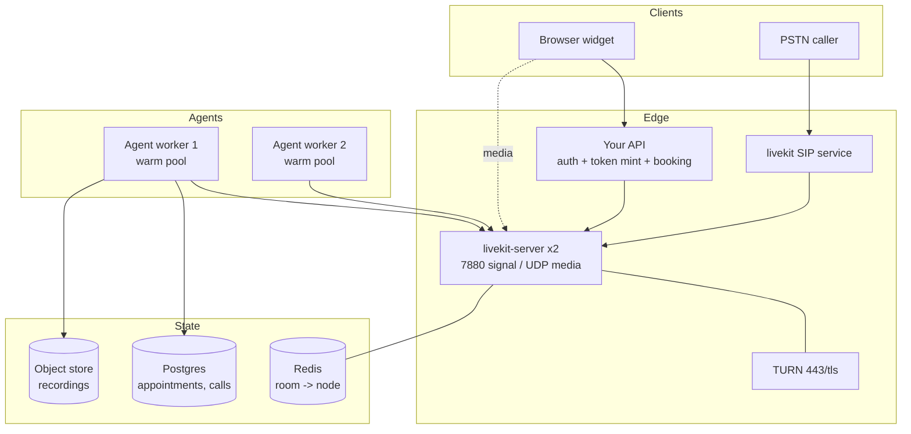

# The Large Project: a Self-Hosted Appointment Desk

One project, eight milestones, each shippable on its own. By the end you have run a voice agent on
**your own LiveKit cluster**, reachable from a browser **and** a phone number, with recordings,
metrics, cost attribution and a deploy that does not drop live calls.

This is deliberately the same shape as [`../../PROJECTS.md`](../../PROJECTS.md) **S1** (production
voice agent) plus the LiveKit-operations half of **F1** (the platform). Use those entries' accept
criteria as the bar; use this file as the order of operations.

**The product, in one paragraph.** A clinic's appointment desk. It answers, identifies the caller,
finds or books an appointment, sends a confirmation, and escalates to a human when it is out of
its depth. It speaks English and one more language. It must never book the wrong slot, must never
read a card number out loud, and must survive a deploy mid-call.

Why this product: it has all four hard parts — identity (so tokens and attributes matter), a tool
call with a side effect (so idempotency matters), a hand-off (so state matters), and a phone
channel (so 8 kHz and DTMF matter). A chatty "companion" bot has none of them.

---

## Architecture you are building toward

Nothing in that diagram is optional for the finished thing, and every box maps to a milestone
below.

---

## M0 — Skeleton that talks (week 1)

**Do.** One `livekit-server` (dev mode), one agent worker, one static HTML page with the JS SDK.
Real STT/LLM/TTS. Prompt from
[`../../05-llm-layer/01-prompting-for-speech.md`](../../05-llm-layer/01-prompting-for-speech.md).

**Accept.** You speak into a browser tab and get a spoken answer. Barge-in works — you interrupt
mid-sentence and the agent stops within a turn. `eou_metrics` + `llm_metrics` + `tts_metrics` are
logged for every turn.

**Do not yet.** Telephony, Docker, auth, database, multiple languages.

---

## M1 — Auth and identity (week 1–2)

**Do.** Replace the dev token with L0 from [`03-small-projects.md`](03-small-projects.md): your
API authenticates the user, derives the room name server-side, sets `attributes`
(`caller_id`, `locale`, `tier`), mints a short-TTL token with `canPublishSources=["microphone"]`.
The agent reads `ctx.token_claims` and the participant attributes instead of trusting anything
from the conversation.

**Accept.** No secret exists in client code (grep the bundle). A token cannot join a room it was
not issued for. The agent's greeting uses the identity from the token, and an unauthenticated
request gets no token at all.

---

## M2 — The booking tool, done honestly (week 2–3)

**Do.** Two function tools: `find_slots(date_range)` (read-only, may be called speculatively) and
`book(slot_id, idempotency_key)` (writes, exactly once). Postgres. Spoken error recovery on
failure, filler speech while waiting
([`../../05-llm-layer/03-tools-and-agentic.md`](../../05-llm-layer/03-tools-and-agentic.md)).

**Accept.**
1. A forced double-invocation of `book` with the same idempotency key creates **one** appointment
   — proven by a test.
2. A forced tool timeout produces a sensible spoken recovery, not silence and not a stack trace.
3. Slot confirmation is read back in speakable form ("Tuesday the third, ten fifteen in the
   morning"), verified against the verbalisation rules in
   [`../../04-tts/04-prosody-and-voice.md`](../../04-tts/04-prosody-and-voice.md).
4. p95 of `book` stays inside your turn budget, or the agent explicitly says it is checking.

---

## M3 — Turn-taking tuned on your own data (week 3)

**Do.** Record 30+ real calls (with consent). Label the turn ends. Sweep
`turn_handling.endpointing.min_delay` and the interruption knobs; measure cut-off rate against
dead air ([`../../03-turn-taking/02-endpointing.md`](../../03-turn-taking/02-endpointing.md)).
Decide `interruption.min_words` deliberately — the default 0 means a cough interrupts.

**Accept.** A frontier plot of cut-off rate versus mean response delay from **your** audio, a
chosen operating point, and one paragraph justifying it in product terms. Config values in code
carry a comment pointing at the measurement.

---

## M4 — Self-hosting for real (week 4)

**Do.** Drop dev mode. `config.yaml` with your own keys, Redis, two media nodes, TURN on 443,
UDP range exposed on the node, health and `prometheus_port` set, `num_idle_processes` and
`load_threshold` at production values. Docker Compose first, then Kubernetes with the official
Helm chart if that is where you are going
([`../04-self-hosting-and-scale.md`](../04-self-hosting-and-scale.md)).

**Accept.**
1. Two media nodes plus Redis; a client connecting to either node reaches the same room.
2. A client on a UDP-blocked network still gets audio (verify by blocking UDP locally), which
   proves TURN/TCP fallback.
3. Nothing media-related sits behind the HTTP load balancer, and you can explain each exposed
   port.
4. `/metrics` scrapes; a dashboard shows participants, packet loss, and worker load.

---

## M5 — The phone channel (week 5)

**Do.** SIP inbound to a number, a dispatch rule mapping it to your agent, DTMF for menu entry,
`transfer_sip_participant` for human escalation
([`../05-telephony-sip.md`](../05-telephony-sip.md)).

**Accept.**
1. A real call from a real phone reaches the agent, and the agent's `participant.kind` filtering
   is unchanged from M0 (it does not know or care it is a phone call).
2. DTMF digits are received and acted on; you state whether your carrier sends RFC 4733 or
   in-band, and what in-band does to your ASR.
3. Escalation transfers the caller to a human with context (at minimum: a spoken handoff summary
   and the call id).
4. The 8 kHz WER tax is quantified against the same audio at 16 kHz.

---

## M6 — Recording, privacy, and post-call (week 6)

**Do.** Egress per-participant recording to object storage, consent announcement, PII redaction in
**both** `transcription_node` and `tts_node`, retention policy, and a post-call summary written in
`add_shutdown_callback`
([`../../08-eval-safety/03-safety-and-privacy.md`](../../08-eval-safety/03-safety-and-privacy.md)).

**Accept.** Recording starts only after consent; a card number spoken by the caller appears in
neither the transcript store nor the synthesised audio; the retention job actually deletes; the
post-call row exists for every call including abandoned ones. Recording credentials are **not**
in any token (`RoomConfiguration.CheckCredentials` exists precisely because a JWT is readable).

---

## M7 — Deploy without dropping calls, and know what it costs (week 6+)

**Do.** Rolling deploy with drain (L7 from [`03-small-projects.md`](03-small-projects.md)),
autoscaling on a signal that leads load (active sessions per worker, not CPU), a load test with
simulated callers, and a cost model per 1000 minutes: media nodes, agent nodes, STT/LLM/TTS,
telephony ([`../../06-realtime-systems/05-scale-and-orchestration.md`](../../06-realtime-systems/05-scale-and-orchestration.md),
[`../../08-eval-safety/02-simulation-and-load.md`](../../08-eval-safety/02-simulation-and-load.md)).

**Accept.**
1. A recorded trace of a deploy completing with live calls in progress and **zero dropped calls**.
2. A load test at 3× your expected peak; you report where it broke first and why (it should be
   agent workers, not media).
3. `$/1000 minutes` broken down by layer, and the self-host-versus-Cloud crossover computed with
   your real numbers ([`../04-self-hosting-and-scale.md`](../04-self-hosting-and-scale.md) §3).
4. A runbook: agent not dispatching, no audio one way, Redis down, provider outage, cost spike.

---

## Definition of done

- A new engineer clones it, runs `docker compose up`, and gets a working call in under 15 minutes.
- Every latency number in your README comes from `metrics_collected`, with p50 **and** p95 over a
  stated number of turns.
- Killing any single component produces the degradation you documented, not a surprise.
- You can defend three decisions to a staff engineer: your endpointing delay, your dispatch
  strategy, and your self-host-versus-Cloud position.

## Sequencing advice

Do **not** start at M4. The instinct to "set up the infrastructure properly first" costs a week
and teaches nothing, because you cannot tell which knobs matter until a call is flowing. Dev mode
until M3, then harden. And keep a `docs/decisions/` folder: one short file per choice, with the
measurement that drove it. That folder is what makes this project legible to your team — and it is
the part interviewers read.
