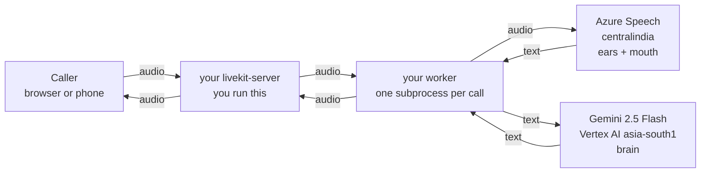

# Your Stack: Self-Hosted LiveKit + Azure Speech + Gemini 2.5 Flash, in India

**Who this is for:** you are new to voice agents, your company runs `livekit-server` itself, and
your models must stay in India. This file is the build order — what to do on day 1, day 2, day 5
— with the region facts checked rather than assumed.

**Promise about jargon:** §1 gives you five words. I use only those five for the rest of the
file, and when a sixth is unavoidable I define it in one line where it appears.

Verified on 2026-09-14 on this machine: `livekit-server` 1.13.7, `lk` 2.18.6,
`livekit-agents` 1.8.1, `livekit-plugins-azure` 1.8.1, `livekit-plugins-google` 1.8.1.

---

## 1. The five words

| Word | Plain meaning |
|---|---|
| **Room** | A phone line with a name. Two or more things join it and can hear each other |
| **Participant** | Anything in a room: the caller's browser, a phone call, **or your agent** |
| **Token** | A signed note your backend hands the caller that says "you may join room X as Y". The server checks the signature; there is no login database |
| **Worker** | Your Python program. It sits idle, connects out to your LiveKit server, and waits to be given calls. One call = one subprocess |
| **Session** | The thing inside that subprocess that listens, thinks, and speaks: it sends audio to Azure, text to Gemini, text back to Azure, audio back to the room |

That is the entire system. Everything else — codecs, ICE, jitter buffers — is LiveKit's job, not
yours, until something breaks (then [`05-debug-playbook.md`](05-debug-playbook.md)).



Read it once more and notice: **your server never talks to Azure or Google.** Only the worker
does. So the media server is cheap and boring, and all your vendor cost, latency and residency
risk lives in the worker. That is the single most useful thing to understand about your stack.

---

## 2. Is your chosen stack actually India-resident? I checked

| Thing you want | Available in India? | Evidence |
|---|---|---|
| **Gemini 2.5 Flash** on Vertex AI | **Yes — Mumbai, `asia-south1`** | Google's own endpoint-locations table marks `gemini-2.5-flash` *Supported* for Mumbai (asia-south1) `[MEASURED: parsed from the published table, 2026-09-14]` |
| Gemini **2.5 Pro** | **No** — in Asia it is Tokyo only | Same table: Mumbai cell empty for `gemini-2.5-pro` |
| **Azure Speech** (STT + TTS) | **Yes — `centralindia`** | Microsoft's regions doc lists Central India as supporting the core Speech features |
| Azure Speech in **`southindia`** | **No** | The docs say explicitly: "the following regions … are currently not supported for speech processing: southindia, spaincentral" |
| Google's own speech models (Chirp 3 STT / HD voices) | **No Mumbai** — Singapore is the nearest | Same Google table: Chirp rows marked only for `asia-southeast1` |

So your company's instinct is right, and now it is evidence: **Azure Speech in `centralindia`
for ears and mouth, Gemini 2.5 Flash in `asia-south1` for the brain.** Google cannot do your
speech inside India; Azure can. That is the reason to mix two vendors, and it is a good reason.

### The one trap that will bite you

The LiveKit Google plugin defaults to **`us-central1`** when you do not pass a location:

```
location (str, optional): The location to use for VertexAI API requests. Defaults value is "us-central1".
```

Forget `location="asia-south1"` and your customers' words are processed in Iowa — no error, no
warning, just a silent residency violation and ~250 ms of extra round trip. **Pass the location
explicitly and also set `GOOGLE_CLOUD_LOCATION=asia-south1`**, so both the code and the
environment say it.

Same shape of trap on Azure: the key is regional. A key from a `southindia` resource will not
work for speech at all, and a key from `eastus` will work *perfectly* — while sending audio to
Virginia.

---

## 3. What else is worth knowing (you asked for recommendations)

| Option | When it is the better choice | Watch out |
|---|---|---|
| **Sarvam AI** (Indian) — Saaras STT, Bulbul TTS | Your callers speak Hindi/Marathi/Tamil or mix English into them mid-sentence. Built on Indian speech data, 22 scheduled languages in one model; the company states all processing stays in India, SOC 2 Type II + ISO 27001, and offers VPC/on-prem | Official plugin exists (`livekit-plugins-sarvam` 1.8.1) but is newer than Azure's; A/B it on *your* audio before committing |
| **AWS Mumbai** (`ap-south-1`): Bedrock + Transcribe + Polly | You want one vendor, one bill, one VPC, and your company is already AWS-heavy. Plugin: `livekit-plugins-aws` | Verify per-model Bedrock availability in `ap-south-1`; voice quality for Indian English is generally behind Azure `[INFERENCE]` |
| **Azure OpenAI / Azure AI Foundry models** in Central India | You want the LLM in the same cloud, same region, same bill as Speech — one vendor to audit | Model choice in Central India is narrower than Vertex's; check the model you want is actually there before designing around it |
| Deepgram / ElevenLabs / Cartesia | Great products, and the usual tutorial default | US/EU processing. If residency is a hard requirement, they are out — do not spend a week integrating one and find out later |

**My recommendation for you, in order:**

1. **Start exactly as planned** — Azure Speech `centralindia` + Gemini 2.5 Flash `asia-south1`.
   Both are verified above, both have maintained plugins, and this is what your company already
   buys.
2. **Add Sarvam as a second STT/TTS behind the same interface** once the plain English path works
   (project L3 in [`03-small-projects.md`](03-small-projects.md)). Compare on your own call
   recordings: accuracy on Indian names, on code-mixed Hinglish, and time-to-first-audio.
3. **Do not** add a third provider until you have numbers from the first two.

Everything below assumes choice 1.

---

## 4. Day 1: get *something* talking, with no vendor keys

Do this before you touch Azure or Google. The point is to separate "LiveKit problems" from
"vendor problems" forever.

```bash
brew install livekit livekit-cli          # macOS; or run the docker image
mkdir voice && cd voice
uv venv --python 3.12 .venv
uv pip install --python .venv 'livekit-agents==1.8.1' livekit livekit-api
```

Now follow [`02-run-it-locally.md`](02-run-it-locally.md) end to end — it takes an afternoon and
ends with a real session running on fake "models" you wrote yourself. You will have seen a call
arrive, a subprocess start, a turn end, and a reply be spoken, with nothing to blame but your own
code. **Do not skip this.** Every hour here saves three later.

---

## 5. Day 2: the real agent

### 5.1 Install the two plugins

```bash
uv pip install --python .venv 'livekit-plugins-azure==1.8.1' 'livekit-plugins-google==1.8.1'
```

### 5.2 The environment file

```bash
# .env.local  — never commit this
LIVEKIT_URL=ws://127.0.0.1:7880
LIVEKIT_API_KEY=APIruSGWovPTpyf
LIVEKIT_API_SECRET=nbPkk8C5hC9ppkuzVYeEIEmS9Dh1DsGZr7quOU5ebLC

AZURE_SPEECH_KEY=<key from your Central India Speech resource>
AZURE_SPEECH_REGION=centralindia

GOOGLE_APPLICATION_CREDENTIALS=/abs/path/vertex-sa.json
GOOGLE_CLOUD_PROJECT=<your gcp project id>
GOOGLE_CLOUD_LOCATION=asia-south1
```

Getting those two credentials, the short version `[INFERENCE]` — these are the documented paths,
not something this lab ran:

- **Azure**: create a *Speech* (or Azure AI Services) resource with **Location = Central India**,
  then copy Key 1 and the region name `centralindia`. If your org uses Entra ID instead of keys,
  the plugin takes `speech_auth_token` + `speech_region` as well.
- **Google**: in your project enable the Vertex AI API, create a service account with the
  **Vertex AI User** role, download a JSON key, and point `GOOGLE_APPLICATION_CREDENTIALS` at it.
  In production prefer workload identity over a downloaded key.

### 5.3 The agent

This is the file, verified to import, construct all three providers, register with a self-hosted
server, receive a dispatched call and start a session `[MEASURED]` (the conversation itself needs
your real keys; §8 shows exactly what fake ones look like in the log):

```python
"""Appointment desk: self-hosted LiveKit + Azure Speech (Central India) + Gemini 2.5 Flash (Mumbai).

Run: python india_agent.py dev      (laptop mic, no server: python india_agent.py console)
"""

import logging
import os

from livekit.agents import (
    Agent,
    AgentSession,
    JobContext,
    RunContext,
    WorkerOptions,
    cli,
    function_tool,
)
from livekit.plugins import azure, google

log = logging.getLogger("desk")

PROJECT = os.environ.get("GOOGLE_CLOUD_PROJECT", "your-gcp-project")
LOCATION = os.environ.get("GOOGLE_CLOUD_LOCATION", "asia-south1")   # Mumbai. NEVER leave unset.

INSTRUCTIONS = """You are the appointment desk for Sunrise Clinic in Mumbai.
Speak in short spoken sentences, at most two at a time. Never use bullet points, markdown,
or emoji: everything you write is read aloud. Confirm dates and times by repeating them back
in words. If the caller speaks Hindi, answer in Hindi. If you did not hear something clearly,
ask once, plainly. If the caller asks for anything medical, say you cannot advise and offer
to book with a doctor."""


class Desk(Agent):
    def __init__(self) -> None:
        super().__init__(instructions=INSTRUCTIONS)

    async def on_enter(self) -> None:
        await self.session.say("Sunrise Clinic, appointment desk. How can I help?")

    @function_tool
    async def find_slots(self, ctx: RunContext, day: str) -> str:
        """Find free appointment slots on a given day.

        Args:
            day: the day the caller asked for, e.g. "tomorrow" or "3 October"
        """
        log.info("TOOL find_slots day=%s", day)
        return f"On {day} we have ten fifteen in the morning and four thirty in the afternoon."

    @function_tool
    async def book(self, ctx: RunContext, day: str, time: str, phone: str) -> str:
        """Book an appointment. Only call after the caller confirmed day, time and phone.

        Args:
            day: the agreed day
            time: the agreed time
            phone: the caller's ten digit phone number
        """
        log.info("TOOL book day=%s time=%s phone=%s", day, time, phone)
        return f"Booked {day} at {time}. A confirmation SMS goes to {phone}."


def build_session() -> AgentSession:
    return AgentSession(
        # Azure Speech: streaming, with interim results. Resource lives in centralindia.
        stt=azure.STT(
            language=["en-IN", "hi-IN"],          # candidate set -> Azure auto-detects
            segmentation_silence_timeout_ms=400,  # Azure's own segmenter, below our endpointing
            phrase_list=["Sunrise Clinic", "teleconsultation", "Bandra", "Andheri"],
        ),
        # Gemini 2.5 Flash through Vertex AI, pinned to Mumbai
        llm=google.LLM(
            model="gemini-2.5-flash",
            vertexai=True,
            project=PROJECT,
            location=LOCATION,
            temperature=0.6,
            thinking_config={"thinking_budget": 0},  # thinking tokens are latency you cannot hear
        ),
        # Azure TTS, Indian English voice, 16 kHz to match the rest of the pipeline
        tts=azure.TTS(voice="en-IN-NeerjaNeural", sample_rate=16000),
        turn_handling={
            "endpointing": {"min_delay": 0.5, "max_delay": 3.0},
            "interruption": {"mode": "vad", "min_words": 1},
        },
    )


async def entrypoint(ctx: JobContext) -> None:
    await ctx.connect()
    session = build_session()

    @session.on("metrics_collected")
    def _m(ev):
        log.info("METRICS %s", ev.metrics)

    @session.on("error")
    def _e(ev):
        log.error("SESSION ERROR %s", ev)

    await session.start(agent=Desk(), room=ctx.room)
    log.info("session started room=%s location=%s", ctx.room.name, LOCATION)


if __name__ == "__main__":
    cli.run_app(WorkerOptions(entrypoint_fnc=entrypoint))
```

```bash
set -a; . ./.env.local; set +a
.venv/bin/python india_agent.py dev
```

### 5.4 Every option in that file, in plain words

| Line | Why it is there |
|---|---|
| `language=["en-IN", "hi-IN"]` | You give Azure a *short list* of possible languages and it picks per utterance. Keep the list to the two or three you really serve — a longer list costs accuracy |
| `segmentation_silence_timeout_ms=400` | How much silence Azure waits before saying "that sentence is finished". Keep it **below** your own `min_delay`, or Azure becomes the thing that decides your response speed |
| `phrase_list=[…]` | Free accuracy. Put your clinic name, your localities, your product words here — recognition gives them priority. Your own proper nouns are where a general model fails first |
| `azure.TTS(sample_rate=16000)` | The plugin defaults to 24 kHz; 16 kHz matches the rest of the pipeline, so nothing is resampled twice. Supported rates are 8k/16k/22.05k/24k/44.1k/48k |
| `voice="en-IN-NeerjaNeural"` | An Indian-English voice. Pick the voice with your business, not your engineers — accent is the first thing a caller judges |
| `vertexai=True, project=…, location=…` | "Use Vertex AI in Mumbai with the service account" instead of the consumer Gemini API. This is what keeps the brain in India |
| `thinking_config={"thinking_budget": 0}` | Gemini 2.5 can "think" before answering. Thinking is invisible to the caller and adds delay, so for a live phone call turn it off and put the reasoning in your prompt instead. (Accepted by the constructor here; measure the effect with your key) |
| `temperature=0.6` | Slightly less random than default so confirmations stay boringly consistent |
| `endpointing.min_delay=0.5` | After the caller stops making noise, wait half a second before replying. Lower = snappier but you cut people off; higher = polite but sluggish. This is a **product** decision; measure it on real calls (project M3 in [`04-large-project.md`](04-large-project.md)) |
| `interruption.min_words=1` | The default (`0`) means *any* sound stops the agent — a cough, a door. Requiring one recognised word makes barge-in survive a noisy Indian street |
| `on_enter` greeting | The caller must hear something within a second of joining, or they say "hello? hello?" |
| Two `@function_tool`s | Reading is safe and can be called freely; **writing** must be confirmed first. Notice `book` takes the phone number as an argument so the model has to have collected it |
| `metrics_collected` + `error` handlers | These two log lines are your entire early observability. Do not ship without them |

### 5.5 Prompt rules that matter more than any model choice

Your model writes text that a machine reads aloud. So: no markdown, no lists, no emoji, no
abbreviations it might spell out, two sentences maximum, numbers and dates written the way a
person says them ("ten fifteen in the morning", not "10:15 AM"). Everything else in
[`../../05-llm-layer/01-prompting-for-speech.md`](../../05-llm-layer/01-prompting-for-speech.md)
is refinement; those rules are the difference between "usable" and "sounds like a robot reading a
web page".

---

## 6. Day 3–4: your own server, properly

Dev mode (`--dev`) is for your laptop. Your company runs the real thing, so learn it now.

**Make your own keys** (never ship `devkey`/`secret`) `[MEASURED]`:

```
$ livekit-server generate-keys
API Key:  APIruSGWovPTpyf
API Secret:  nbPkk8C5hC9ppkuzVYeEIEmS9Dh1DsGZr7quOU5ebLC
```

**A minimal real config** — this exact file was booted and used for a call `[MEASURED]`:

```yaml
# livekit.yaml
port: 7880                     # signalling WebSocket + HTTP API. This one may sit behind a LB
bind_addresses:
  - 127.0.0.1                  # drop this in production and bind all interfaces
rtc:
  tcp_port: 7881               # media fallback. MUST be exposed on the node, no TLS, no LB
  port_range_start: 50000      # media (UDP). MUST be reachable directly
  port_range_end: 50100        # 100 ports is fine for a test; production uses 50000-60000
  use_external_ip: false       # set true on a cloud VM so clients get the public IP
keys:
  APIruSGWovPTpyf: nbPkk8C5hC9ppkuzVYeEIEmS9Dh1DsGZr7quOU5ebLC
room:
  empty_timeout: 120           # sweep a room nobody joined after 2 min
  departure_timeout: 20        # sweep 20 s after the last person leaves
  max_participants: 8
logging:
  level: info
  json: false                  # true in production, so your log system can parse it
prometheus_port: 6789          # metrics for your dashboards
```

```bash
livekit-server --config livekit.yaml
```

Verified against it `[MEASURED]`: a token signed with those keys joined, audio flowed
(`sample_rate 16000, samples_per_channel 320, bytes_per_frame 640`), and
`curl http://127.0.0.1:6789/metrics` returned **270** `livekit_*` metric lines.

**The port rule, because it is the one thing self-hosters get wrong.** Port 7880 is HTTP — load
balance it, terminate TLS on it, put it behind your ingress. Ports 7881 and the UDP range are
**media** — expose them on the node itself. LiveKit's own config comments say the TCP port
"*cannot* be behind load balancer or TLS". Break this and about a third of your callers, mostly
on corporate Wi-Fi, get silence ([`../04-self-hosting-and-scale.md`](../04-self-hosting-and-scale.md)).

**What to add, in this order, when you go to production:**

1. **Redis** — the moment you run two server nodes. One line of config; it maps rooms to nodes.
2. **TURN on 443** — for callers whose network blocks UDP. Without it you lose real users.
3. **A second agent machine** — because workers die of CPU while media nodes are still idle.
4. `num_idle_processes` and `load_threshold` at production values — dev mode sets them to
   "0 warm processes, accept everything", which is exactly wrong for real traffic
   ([`../02-agents-framework.md`](../02-agents-framework.md) §2.2).
5. **Health checks**: port 8081 on the worker in production mode, `/` on the server.

A sizing rule of thumb to start from, then measure: one 8-vCPU media node handles on the order of
a thousand audio participants; one 8-vCPU agent machine handles tens of concurrent calls with
hosted models (Azure and Gemini do the heavy work, your process mostly waits)
`[INFERENCE — measure before you trust it]`.

---

## 7. What "fast enough" means on this stack

The number your callers feel is: **they stop talking → they hear your first word.** Budget it,
then measure it, per turn, from the log lines you already print:

| Piece | Log field | What it is |
|---|---|---|
| Silence wait | `eou_metrics.end_of_utterance_delay` | Your `min_delay`, i.e. your choice |
| Transcript lag | `eou_metrics.transcription_delay` | How late Azure's final text was |
| Thinking | `llm_metrics.ttft` | Gemini's time to its first token |
| Speaking | `tts_metrics.ttfb` | Azure's time to the first audio chunk |

Two facts about *your* stack specifically:

- **Both vendors are in India, so the network part is tens of milliseconds, not hundreds.** This
  is the whole payoff of `centralindia` + `asia-south1`: same-country round trips. Had you left
  Vertex at `us-central1`, you would add roughly a quarter of a second to every single turn —
  twice, because the request and the response both cross the ocean.
- **Azure TTS in this plugin is non-streaming** (`TTSCapabilities(streaming=False)` —
  verified `[MEASURED]`). The framework splits your reply into sentences and requests each one,
  so your first audio arrives after the *first sentence* is synthesised, not the whole answer.
  Practical consequence: **keep first sentences short.** A 40-word opening sentence is a slow
  agent no matter how fast your models are.

Target to aim at while learning: 1.5 s from end-of-speech to first audio, p95. Then tighten.
The decomposition and the arithmetic behind it are in
[`../../01-foundations/04-latency-budget.md`](../../01-foundations/04-latency-budget.md).

---

## 8. The failure modes of this exact stack, with real log lines

All of these were produced deliberately with wrong credentials against a self-hosted server
`[MEASURED]`.

**Wrong / wrong-region Azure key, on the ears side.** The call connects, the caller talks, and
nothing happens — forever, because the STT stream is recreated after each failure:

```
WARNING livekit.plugins.azure - Speech recognition canceled: … error_details="WebSocket upgrade
  failed: Authentication error (401). Please check subscription information and region name."
  {"code": "CancellationErrorCode.AuthenticationFailure"}
WARNING livekit.agents - failed to recognize speech: … retrying in 2.0s {"attempt": 1}
WARNING livekit.agents - STT stream ended on an unrecoverable error, recreating
```

Check in this order: the key belongs to the resource, the resource's region string is exactly
`centralindia`, and the resource is a Speech/AI-Services resource. Note `AuthenticationFailure`
also appears when the **region** is wrong but the key is fine.

**Wrong Azure key, on the mouth side.** Different signature, and not retried at all:

```
ERROR desk - SESSION ERROR error=TTSError(label='livekit.plugins.azure.tts.TTS',
  error=APIStatusError('Unauthorized', status_code=401, retryable=False), recoverable=False)
```

**A LiveKit Cloud feature trying to help you on a self-hosted server.** Harmless, and confusing
the first time:

```
WARNING livekit.agents - cloud turn detector failed (message='Invalid response status
  (401 Unauthorized)', status_code=401, retryable=False); falling back to local mini model
```

1.8.1 will try Cloud-hosted turn detection and Cloud-hosted barge-in detection, get 401 with your
own keys, and fall back to local models. To silence the barge-in one, set
`turn_handling={"interruption": {"mode": "vad"}}` as the listing above does
([`05-debug-playbook.md`](05-debug-playbook.md) §4).

**Vertex credential problems** look nothing like these: the STT and TTS work, the agent hears you
and then says nothing, and the error names `google` with a permission or default-credentials
message `[INFERENCE]`. Check `GOOGLE_APPLICATION_CREDENTIALS` resolves to a readable file, the
service account has **Vertex AI User**, and the API is enabled on that project.

**The silent residency failure** has *no* error at all: everything works, and your audio
transcripts are being processed in `us-central1` because `location` was never set. The only way
to catch it is to grep your own code and environment for the region strings — so put them in a
startup log line:

```python
log.info("regions: azure=%s vertex=%s", os.environ["AZURE_SPEECH_REGION"], LOCATION)
```

---

## 9. Your first two weeks, concretely

| Day | Do | Done when |
|---|---|---|
| 1 | [`02-run-it-locally.md`](02-run-it-locally.md) — dev server, tokens, the keyless session | You have seen a call dispatched and a turn completed in the log |
| 2 | §5 here with real Azure + Gemini keys, via `python india_agent.py console` (laptop mic, no server) | You hold a spoken conversation in English and in Hindi |
| 3 | Same agent over the real server, joined from a browser page | A colleague on another laptop can talk to it |
| 4 | §6 — your own keys, your own `livekit.yaml`, metrics scraped | A call works with no `--dev` anywhere |
| 5 | L0 from [`03-small-projects.md`](03-small-projects.md): a token endpoint wired to your auth | No secret in client code, and the room name comes from your backend |
| 6–7 | L1 + L2: room inspector, audio meter | You can answer "is audio arriving?" with numbers, not opinions |
| 8–9 | Tune `min_delay`, `min_words`, `segmentation_silence_timeout_ms` on 20 recorded calls | You can defend each number with a measurement |
| 10 | L4: live transcripts to the browser and a per-call JSONL | You can read back any call and its per-turn latency |
| 11–14 | L5–L7: dispatch, cold starts, drain | A deploy mid-call drops nothing |

Then start [`04-large-project.md`](04-large-project.md) at M2, since M0/M1 are now done — and
swap its Deepgram/OpenAI examples for your Azure + Gemini pair.

## 10. Cost, honestly

I am not quoting prices I have not verified. Get them from your own Azure and Google billing
pages, then use this arithmetic (the per-minute quantities come from measurements elsewhere in
this curriculum):

- **Azure STT**: billed per audio minute. A call bills roughly its wall-clock length.
- **Azure TTS**: billed per character. The agent speaks ~40% of the call, ≈ 900 characters per
  minute *of agent speech*.
- **Gemini 2.5 Flash**: billed per token, input and output separately. Budget ≈ 450 effective
  input tokens and ≈ 120 output tokens per call-minute; keep the system prompt stable so prefix
  caching helps you.
- **Your own infrastructure**: media nodes + agent machines + Redis, per hour, divided by the
  minutes they actually carry.

Multiply, add, divide by minutes, and you have `₹ per minute`. Re-check it monthly — this is the
number that decides architecture arguments, and it is the number nobody in the room can quote.
