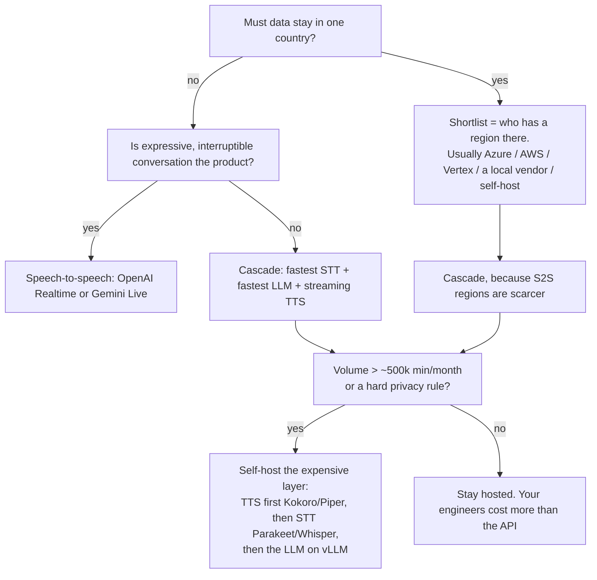

# The Whole Landscape: Cascade, Speech-to-Speech, Open Source, and Who Hosts Where

**Why this file exists:** you will build on Azure + Gemini in India, but you should be able to
hold a conversation about every other option — because that is the difference between "I use the
stack I was given" and "I chose this stack". Read it once now; come back when a decision comes up.

**How to read the tables.** The **Plugin** column is fact: it is the list of provider directories
in `livekit/agents` on `main`, retrieved 2026-09-14 `[MEASURED]`, so those integrations exist and
are maintained by LiveKit. Everything about *quality*, *speed* and *price* is marked
`[INFERENCE]` unless I measured it — those move monthly and you must re-check them yourself.

The 75 official plugin directories, verbatim, so you can see the real shape of this ecosystem:

```
anam anthropic assemblyai asyncai avatario avatartalk aws azure baseten bey bithuman bland
browser cambai cartesia cerebras clova deepgram did elevenlabs fal fireworksai fishaudio gladia
gnani google gradium groq hamming hume inworld keyframe krisp langchain lemonslice liveavatar
lmnt meta minimal minimax mistralai murf neuphonic nltk nvidia openai palabra perplexity phonic
protoface resemble respeecher rime rtzr runway sarvam silero simli simplismart slng smallestai
soniox spatius speechify speechmatics spitch synthesia tavus telnyx trugen turn-detector
ultravox upliftai vakyam xai
```

---

## 1. Two ways to build a voice agent

### Cascade (what you are building)

```
your ears        your brain        your mouth
audio → STT → text → LLM → text → TTS → audio
```

Three separate services, three separate bills, three separate failure modes — and **every part
swappable in one line**.

### Speech-to-speech, "S2S" (also called realtime, or native-audio)

```
audio → one model → audio
```

One model hears the audio and speaks the answer. No transcript in the middle (though most give
you one on the side).

### The honest comparison

| | **Cascade** | **Speech-to-speech** |
|---|---|---|
| Time from you stopping to it speaking | Sum of three services; 700–1500 ms is normal, under 500 ms is good work `[INFERENCE]` | Fundamentally lower — one hop, no text round trip. Sub-500 ms is the promise |
| Does it hear *how* you said it? | No. "yes…" and "yes!" become the same three letters | Yes — tone, hesitation, laughter, speed. This is the real advantage |
| Control over words spoken | Total. You can gate, redact, template, cache | Partial. The model chooses wording *and* delivery together |
| Debuggability | Excellent: you have the transcript at every step | Harder: when it mishears, there is no transcript to point at |
| Swap one piece | One line | You replace the whole brain |
| Function calling / tools | Mature, boring, reliable | Supported by the major ones, still less battle-tested `[INFERENCE]` |
| Cost shape | Per audio-minute + per token + per character | Per audio-minute in and out; usually pricier per minute `[INFERENCE]` |
| Data residency | Three vendors to check | One vendor to check — but fewer regions available |
| Best at | Anything transactional: booking, support, verification, collections | Anything conversational: tutoring, companionship, interviews, sales discovery |

**What experienced teams do:** cascade for the money path, S2S where expressiveness is the
product, and a *few* run both — S2S for the chat, cascade for the moment it must read out an
account number correctly. The deep version of this argument, with measurements, is
[`../../06-realtime-systems/04-speech-to-speech.md`](../../06-realtime-systems/04-speech-to-speech.md).

---

## 2. Speech-to-speech options

| Model | How you get it | India region? | Notes |
|---|---|---|---|
| **OpenAI Realtime** | `livekit-plugins-openai` → `openai.realtime.RealtimeModel` | No India region for the realtime API `[INFERENCE]` | The most widely used S2S; WebSocket/WebRTC, tools, interruption handling built in |
| **Gemini Live (native audio)** | `livekit-plugins-google` → `google.beta.realtime` | `gemini-live-2.5-flash-native-audio` shows **no Mumbai** cell in Google's own region table; global/US only `[MEASURED from the published table]` | Very natural prosody; same Vertex auth you already have |
| **Azure Voice Live** | Azure AI Foundry (see `06-alternatives.md`) | Speech features stay in Central India but **the voice-live API uses Sweden Central for generative AI load balancing** per Microsoft's docs — so it is *not* India-resident today | Bundles S2S + avatars + noise suppression |
| **AWS Nova Sonic** | `livekit-plugins-aws` | Check `ap-south-1` availability before designing `[INFERENCE]` | Attractive if you are already AWS-native |
| **Ultravox** | `livekit-plugins-ultravox` | Self-hostable | Audio-in / text-out: hears tone, still gives you text you can gate. A genuine middle ground |
| **Kyutai Moshi** (open weights) | Self-host | Yours, anywhere | Full-duplex, ~200 ms class latency; the reference open S2S. Needs a GPU per small number of calls |
| **Qwen-Omni / GLM-4-Voice / Step-Audio / MiniCPM-o** (open weights) | Self-host | Yours, anywhere | Moving fast; quality per GPU-hour is the thing to benchmark `[INFERENCE]` |

**The S2S trap nobody mentions:** interruption and turn-taking move *inside* the model, so your
carefully tuned endpointing policy no longer applies — and in LiveKit the session auto-selects
`realtime_llm` turn detection when you configure one. Your barge-in behaviour changes the day you
switch, even with identical code.

---

## 3. Cascade, layer by layer

### 3.1 Ears (STT)

| Provider | Plugin | Where it runs | Why you'd pick it |
|---|---|---|---|
| **Azure Speech** | `azure` | Global incl. **`centralindia`** `[MEASURED]` | Residency, many locales, phrase lists, strong enterprise story. **Your choice** |
| **Deepgram** (Nova) | `deepgram` | US/EU | The default in most tutorials: fast, cheap, good streaming `[INFERENCE]` |
| **AssemblyAI** | `assemblyai` | US/EU | Strong accuracy + built-in features (PII redaction, sentiment) `[INFERENCE]` |
| **Speechmatics** | `speechmatics` | US/EU, on-prem option | Good accented-English reputation; deployable in your own DC `[INFERENCE]` |
| **Gladia / Soniox / Rev (`rtzr`) / Clova** | `gladia`, `soniox`, `rtzr`, `clova` | Varies | Regional and niche strengths; Clova = Korean, `rtzr` = Korean |
| **Google Chirp 2/3** | `google` | **Not Mumbai** — `asia-southeast1` is the nearest `[MEASURED]` | Good multilingual, wrong region for you |
| **OpenAI transcription** | `openai` | US/global | Convenient if you are already OpenAI-only |
| **Sarvam (Saaras)** | `sarvam` | **India** | 22 Indian languages in one model, code-mixed Hinglish, India-only processing |
| **Gnani / Vakyam / Spitch / UpliftAI / smallest.ai** | `gnani`, `vakyam`, `spitch`, `upliftai`, `smallestai` | India / Africa / Pakistan / regional | Worth knowing that the "local language specialist" category exists and LiveKit already integrates several |
| **NVIDIA Riva / Parakeet** | `nvidia` | **Your GPUs** | The serious self-host option: Parakeet/Canary models, on-prem, no per-minute bill |
| **Whisper family** (open) | write your own (`../03-writing-plugins.md` §2.6) | Your CPU/GPU | `faster-whisper`, `whisper.cpp`, Distil-Whisper. Batch, not streaming — needs a segmenter in front, which adds delay |
| **Zipformer / sherpa-onnx, Moonshine, Vosk** (open) | write your own | Even a Raspberry Pi | Genuinely streaming, tiny, no GPU. Lower accuracy on hard audio `[INFERENCE]` |

### 3.2 Brain (LLM)

| Option | Plugin | Where | Why |
|---|---|---|---|
| **Gemini via Vertex** | `google` | **Mumbai `asia-south1` for 2.5 Flash** `[MEASURED]` | Your choice: fast, cheap, India-resident |
| **Azure OpenAI / Foundry** | `openai` (Azure endpoint) | Incl. India regions for some models | One-vendor story with your Speech resource |
| **OpenAI direct** | `openai` | US/global | Best tool-calling ergonomics `[INFERENCE]` |
| **Anthropic Claude** | `anthropic` | US/EU; also via Bedrock/Vertex | Strong instruction-following for long policy prompts `[INFERENCE]` |
| **AWS Bedrock** | `aws` | incl. `ap-south-1` (check per model) | If you want one cloud, one VPC, one bill |
| **Groq / Cerebras / Fireworks / Baseten / Simplismart** | `groq`, `cerebras`, `fireworksai`, `baseten`, `simplismart` | US mostly | These exist for **one** reason: time-to-first-token. Open-weight models served absurdly fast — the classic voice-agent trick when you cannot afford 600 ms of thinking `[INFERENCE]` |
| **xAI / Mistral / Perplexity** | `xai`, `mistralai`, `perplexity` | Varies | Mistral has EU residency; Perplexity brings search |
| **Open weights, your GPUs** | `openai` plugin against an OpenAI-compatible URL | Yours | Llama, Qwen, Gemma on **vLLM / SGLang / TensorRT-LLM**, or Ollama / llama.cpp / MLX for a laptop. Zero per-token cost, total residency control, and you now own the latency problem ([`../../05-llm-layer/04-serving-llms-fast.md`](../../05-llm-layer/04-serving-llms-fast.md)) |

### 3.3 Mouth (TTS)

| Provider | Plugin | Where | Why |
|---|---|---|---|
| **Azure** | `azure` | **`centralindia`** `[MEASURED]` | Indian-English and Hindi neural voices, lexicons, SSML-ish control. **Your choice** |
| **ElevenLabs** | `elevenlabs` | US/EU | Usually the quality benchmark; cloning `[INFERENCE]` |
| **Cartesia** | `cartesia` | US | Built for low-latency streaming voice agents `[INFERENCE]` |
| **Rime / LMNT / PlayAI / Neuphonic / Phonic / Speechify / MiniMax / Murf / Resemble / Respeecher / smallest.ai / Fish Audio / Hume** | same names | Varies | The field is crowded and prices are falling. Hume is the "emotional TTS" one; Murf/Resemble lean enterprise+cloning `[INFERENCE]` |
| **Sarvam Bulbul** | `sarvam` | **India** | Indic voices, India-resident |
| **Deepgram Aura / Google Chirp3 HD** | `deepgram`, `google` | US/EU; Chirp3 not in Mumbai `[MEASURED]` | Cheap and fast, if residency is not a constraint |
| **Kokoro, Piper** (open) | write your own (`../03-writing-plugins.md` §2.7) | Your CPU | Kokoro-82M is Apache-licensed and runs on a laptop; Piper is the embedded classic. This is how you cut a TTS bill to zero |
| **XTTS-v2, F5-TTS, Orpheus, Chatterbox, StyleTTS2, Higgs Audio** (open) | write your own | Your GPU | Cloning and expressive open models. Check licences and voice-consent law before cloning anybody `[INFERENCE]` |

### 3.4 The layer beginners forget: listening *around* the words

| Thing | Plugin | What it does |
|---|---|---|
| **VAD** | `silero` (and the bundled local Silero in 1.8.1) | "Is anyone speaking right now?" Cheap, local, runs every 32 ms `[MEASURED]` |
| **Turn detector** | `turn-detector` | A small transformer that asks "did they *finish*, or just pause?" — semantic, not silence-based. This is what makes an agent stop interrupting people |
| **Noise cancellation / echo** | `krisp` (LiveKit's `noise-cancellation`) | Background-voice removal on the caller's audio; in 1.8.1 the session also suppresses barge-in for 3 s at start while the echo canceller converges `[MEASURED]` |
| **Guardrails** | `livekit-blockguard` | Content gating in the pipeline |
| **Avatars** | `tavus`, `simli`, `bey`, `hedra`-likes (`anam`, `avatario`, `did`, `synthesia`, `liveavatar`, …) | A talking face on top of your audio. Video, not voice — ignore until someone asks |
| **Telephony** | `telnyx`, plus LiveKit's own SIP service | Phone numbers, trunks, DTMF ([`../05-telephony-sip.md`](../05-telephony-sip.md)) |

---

## 4. Choosing, for real



Four worked answers:

- **Indian regulated business (you).** Azure Speech `centralindia` + Gemini 2.5 Flash
  `asia-south1`, self-hosted LiveKit. Add Sarvam when Indic quality matters. Keep an eye on
  Azure Voice Live only when its India residency story changes.
- **Global consumer app, expressiveness is the product.** OpenAI Realtime or Gemini Live, LiveKit
  Cloud, and a cascade fallback path for anything that must be read out exactly.
- **Phone-heavy enterprise, 1M+ minutes/month.** Cascade, self-hosted everything except the LLM,
  SIP trunks direct from a carrier, and a per-minute cost dashboard that the finance team reads.
- **Air-gapped / on-prem (defence, hospital, bank core).** Whisper or Parakeet + an open-weight
  LLM on vLLM + Kokoro/Piper, all inside your DC, LiveKit self-hosted. Everything works; quality
  is 6–12 months behind hosted, and that is the price `[INFERENCE]`.

---

## 5. Staying able to change your mind

The one engineering rule that matters more than any vendor choice: **your business logic must not
know which vendor it is using.** In LiveKit that is nearly free, because STT/LLM/TTS are already
interfaces — so keep it that way:

1. **One factory function** (`build_session()` in [`06-your-stack-india.md`](06-your-stack-india.md)
   §5.3) is the only place provider classes are named. Nothing else imports `azure` or `google`.
2. **Providers come from config**, not from code: `STT_PROVIDER=azure`, `TTS_PROVIDER=sarvam`.
   Then an A/B is an environment variable, not a branch.
3. **Never put business rules in a plugin.** Prompt, tools, state machine, escalation policy live
   in your `Agent` subclass.
4. **Keep an eval set of 30–50 of your own calls** and run both candidates through it. Vendor
   choice without your own audio is marketing, not engineering
   ([`../../08-eval-safety/01-testing.md`](../../08-eval-safety/01-testing.md)).
5. **Assume one vendor will have a bad hour.** The second-best provider behind the same interface
   *is* your failover — see [`08-production-and-observability.md`](08-production-and-observability.md) §6.

The full platform-level comparison — Pipecat, Vapi, Retell, Amazon Connect, Riva, raw WebSockets,
with cost crossovers — is [`../06-alternatives.md`](../06-alternatives.md).
