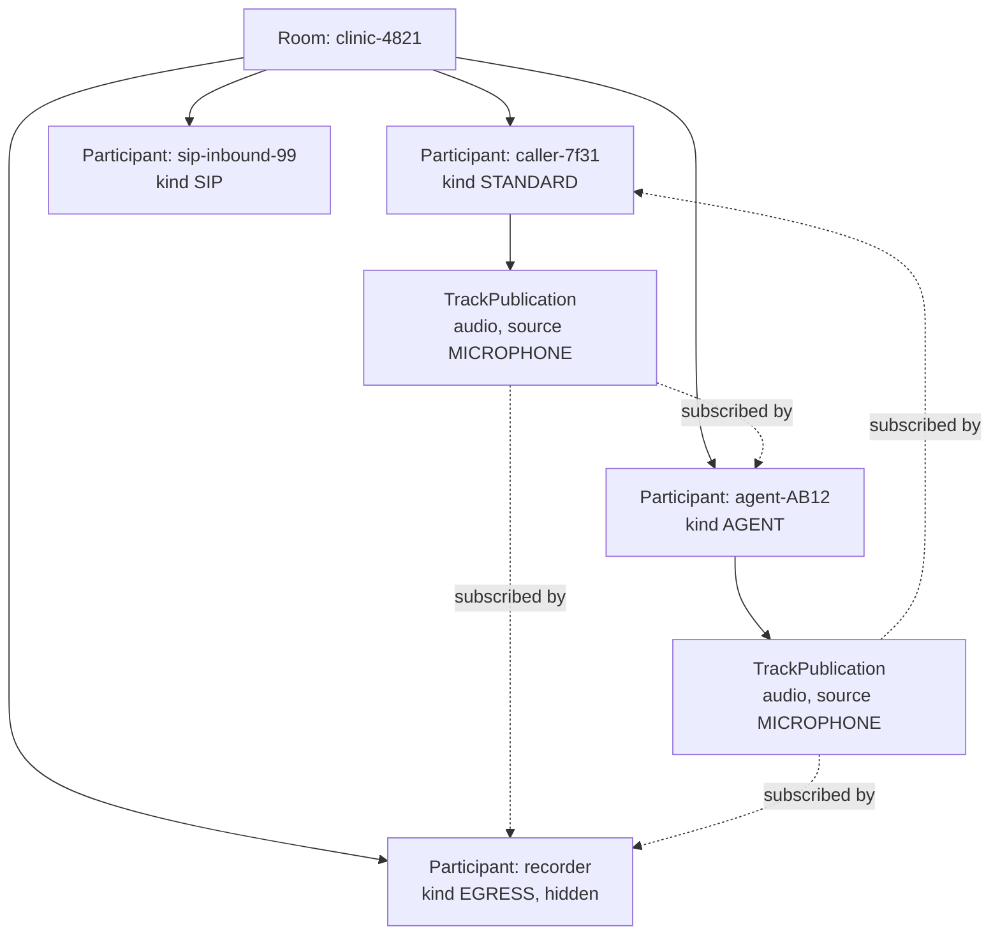
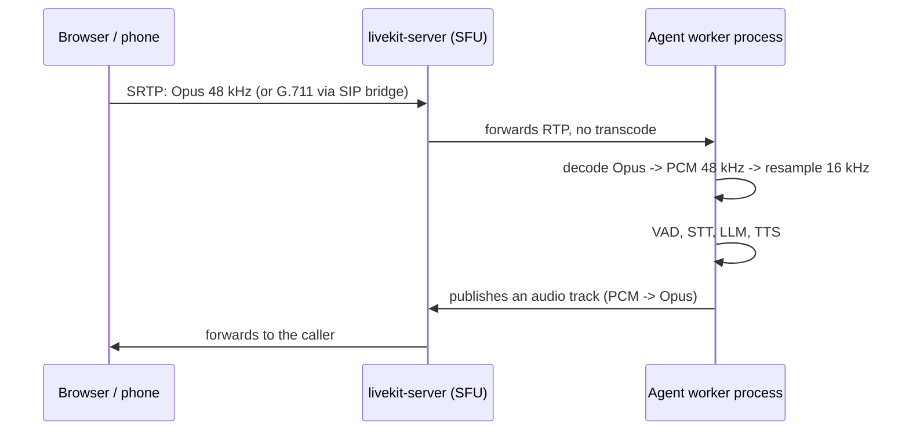

# LiveKit Architecture

**What you'll be able to do after this:** describe LiveKit's data model and signalling protocol
precisely enough to debug them; issue and verify an access token from first principles and
explain every grant field; trace how audio gets from a browser or a phone into your agent
process; and say which parts are open source and which are Cloud-only before you design around
them.

---

## 1. Intuition

LiveKit is four things wearing one name, and keeping them separate is most of the battle.

**A media server.** `livekit-server` is a Go SFU built on Pion. It receives RTP from
participants and forwards it to subscribers without transcoding. It does not understand speech,
it understands tracks.

**A data model.** Rooms contain participants, participants publish tracks, other participants
subscribe to them. Every other feature — telephony, recording, your agent — is expressed by
making something a participant in a room. That uniformity is the single most useful thing about
the design: **your agent is just another participant**, which is why the same agent code serves
a browser user and a phone call.

**An auth model.** There is no session database in the request path. A signed JWT carries the
participant's identity and permissions, the server verifies it with a shared secret and
enforces the permissions itself. Everything your agent, your SIP service and your recorder are
allowed to do is a field in that token.

**A worker framework.** `livekit-agents` is a separate process pool that registers with the
server, receives job assignments, and joins rooms as participants
([`02-agents-framework.md`](02-agents-framework.md)). It is not part of the media server, and
understanding that boundary is what lets you scale the two independently.

---

## 2. Rigour

### 2.1 The data model



A **room** is a routing domain and a lifetime: it is created on demand, and it disappears after
`empty_timeout` seconds with nobody in it (300 in the shipped config) or `departure_timeout`
after everyone leaves (20). A **participant** has a stable `identity` (yours to choose; joining
twice with the same identity displaces the first connection), a display `name`, `metadata`, and
`attributes` — a string map that is the right place for per-call state you want visible to
everyone.

A **track** is one media stream with a *source* — `microphone`, `camera`, `screen_share`,
`screen_share_audio` — and a **publication** is the room-level handle to it. Subscription is
per-subscriber and explicit: a participant subscribes to the publications it wants, which is
what makes an SFU cheaper than a conference bridge and what lets a hidden recorder subscribe to
everything without publishing anything.

Participant **kinds** matter operationally: `STANDARD`, `AGENT`, `SIP`, `INGRESS`, `EGRESS`.
Your agent should filter on kind rather than on name conventions, because "is this another
agent or the human?" is a question that comes up the moment you have two agents in a room.

### 2.2 Auth: the token is the API

Verified against `livekit/protocol`, `auth/accesstoken.go` and `auth/grants.go`, retrieved
2026-08-22.

A LiveKit token is an HS256 JWT signed with your API secret. `iss` is the API key, `sub` is the
participant identity, `iat`/`nbf`/`exp` are standard, and the default validity is
`defaultValidDuration = 6 * time.Hour`. The LiveKit-specific grants sit at the **top level of
the claims**, not inside a namespace:

| Claim | Contents |
|---|---|
| `video` | the room/participant permissions, below |
| `sip` | `admin`, `call` — the latter allows placing outbound calls |
| `agent` | `admin`, `simulationAdmin`, `databaseAdmin` — Cloud Agents, simulations, AgentDB |
| `inference`, `observability` | Cloud inference and observability scopes |
| `roomConfig` | room configuration applied if this participant creates the room |
| `roomPreset` | **Cloud-only**; `roomConfig` overrides the preset where both are set |
| `metadata`, `attributes`, `name`, `kind`, `kindDetails`, `sha256` | participant data; `sha256` binds the token to a message body |

`VideoGrant`, verbatim from the source:

| Field | Meaning |
|---|---|
| `roomCreate`, `roomList`, `roomRecord` | server-wide actions |
| `roomAdmin`, `roomJoin`, `room` | actions on one named room |
| `canPublish`, `canSubscribe`, `canPublishData` | pointers to bool — see the gotcha below |
| `canPublishSources` | list of sources; **supersedes** `canPublish` when set |
| `canUpdateOwnMetadata` | off by default |
| `ingressAdmin` | applies to all ingress |
| `hidden` | invisible to other participants |
| `recorder` | marks the participant as a recorder |
| `agent` | may register as an Agents framework worker |
| `canSubscribeMetrics`, `canManageAgentSession`, `destinationRoom` | metrics, RemoteSession, forwarding |

**The gotcha is in the comment above `CanPublish`**: "permissions within a room, if none of the
permissions are set explicitly it will be granted with all publish and subscribe permissions."
Those three fields are `*bool`, so *absent* and *false* are different. A token that omits them
grants everything. That is why the §3 output shows the `agent worker` and `sip caller` presets
with publish and subscribe implicitly allowed even though nobody wrote them down — harmless for
those two, dangerous the day you issue a "listen only" token by leaving `canPublish` out.

Four security properties follow, and all four are load-bearing:

1. **The token is signed, not encrypted.** Anything in it is readable by the holder. The
   source says so explicitly, and `RoomConfiguration.CheckCredentials()` refuses to mint a
   token whose embedded egress config contains S3 secrets or a stream key, unless you call
   `SetAllowSensitiveCredentials(true)` for a trusted server-side context.
2. **The API secret never leaves your backend.** Clients receive a token from your own endpoint;
   a client that can mint tokens can grant itself `roomAdmin`.
3. **Permissions are enforced server-side.** The token is an assertion; the server decides. This
   is why an expired token cannot be "fixed" client-side and why grants are checked per action.
4. **TTL is a real control.** Six hours is the default, not a recommendation; a token for a
   five-minute phone call should live for minutes, because a leaked long-lived token is a
   standing invitation to a room.

### 2.3 Signalling

The client opens a WebSocket to the server's RTC endpoint (port 7880 in the shipped config) and
exchanges protobuf messages. From `livekit_rtc.proto`, `SignalRequest` is a `oneof` over —
among others — `offer`, `answer`, `trickle`, `add_track`, `mute`, `subscription`,
`track_setting`, `leave`, `subscription_permission`, `sync_state`, `simulate`, `ping_req`,
`update_metadata`, `update_audio_track`, and the newer data-track messages
(`publish_data_track_request`, `update_data_subscription`, `store_data_blob_request`).
`SignalResponse` answers with `join`, `answer`, `offer`, `trickle`, `update`,
`track_published`, and the rest.

Three design points worth internalising. There are **two peer connections**, a publisher and a
subscriber, so the server can push a new subscribed track by making an offer without renegotiating
the client's own uplink. **Trickle ICE** is used throughout, so candidates flow as they are
discovered rather than waiting for gathering to complete — that is directly a connection-setup
latency decision ([`../06-realtime-systems/02-webrtc-internals.md`](../06-realtime-systems/02-webrtc-internals.md)).
And **`sync_state` exists for reconnection**: after a network change the client tells the
server what it believes it is publishing and subscribed to, and the server reconciles, rather
than tearing the session down.

### 2.4 How PCM reaches your agent



The SFU forwards; it does not decode. Decoding happens in the **agent worker**, which is why
agent workers are CPU-bound and media servers are packet-bound, and why you scale them
separately ([`04-self-hosting-and-scale.md`](04-self-hosting-and-scale.md)).

In the Python SDK the boundary is `rtc.AudioStream`, which yields `AudioFrame`s and takes
`sample_rate` (default 48000), `num_channels` (default 1) and an optional `frame_size_ms`
(verified in `livekit/python-sdks`, `livekit-rtc/livekit/rtc/audio_stream.py`, retrieved
2026-08-22). `AudioFrame` exposes `data` as a `memoryview` cast to `h` — signed 16-bit — plus
`sample_rate`, `num_channels`, `samples_per_channel` and `duration`. Asking the stream for
16 kHz gives you this curriculum's internal contract directly, with the resampling done in the
SDK ([`../00-setup/03-canonical-formats.md`](../00-setup/03-canonical-formats.md)).

### 2.5 Data, not just media

Rooms carry a data plane as well: data packets with a reliable and a lossy mode, addressed to
all or to specific participants, tagged with a topic. On top of it the SDKs build RPC, text
streams and byte streams. Voice agents use it constantly — live transcripts to the client,
UI state, "the agent is thinking" indicators, and control messages from the client.

Choose the mode deliberately. Reliable data rides a retransmitting channel and therefore has
the head-of-line behaviour of §2.2 in
[`../06-realtime-systems/01-transports.md`](../06-realtime-systems/01-transports.md): a
transcript sent reliably during congestion arrives late, in a burst. Lossy is correct for
anything that will be superseded by the next update.

### 2.6 Multi-node routing

A single `livekit-server` is a process. A cluster is that process plus Redis: "when redis is
set, LiveKit will automatically operate in a fully distributed fashion; clients could connect
to any node and be routed to the same room" (`config-sample.yaml`). The invariant is that **a
room lives on exactly one node** — all of its participants' media must meet somewhere — and
Redis holds the room-to-node map plus the message bus that routes signalling to the right node.

The consequence is the one that trips up every first deployment: media cannot sit behind an
HTTP load balancer. The config is explicit that the ICE-over-TCP port "*cannot* be behind load
balancer or TLS, and must be exposed on the node", and the UDP range
(`port_range_start: 50000`, `port_range_end: 60000`) must be reachable directly. You load
balance the signalling WebSocket; you do not load balance the media
([`04-self-hosting-and-scale.md`](04-self-hosting-and-scale.md)).

### 2.7 Egress and ingress

**Egress** takes media out: room composite recording, per-participant and per-track recording,
and live streaming to RTMP or HLS. **Ingress** brings media in from RTMP, WHIP, or by pulling a
URL. Both are separate services with their own containers, and egress in particular is
CPU-expensive because it *does* transcode and mix — the opposite of the SFU's design. Budget
egress as its own fleet, not as a feature of the media server.

For voice agents the common uses are compliance recording and post-call analysis, and both
carry consent obligations
([`../08-eval-safety/03-safety-and-privacy.md`](../08-eval-safety/03-safety-and-privacy.md)).
Note the token interaction from §2.2: room configuration embedded in a participant token is
checked for S3/GCP/Azure credentials and stream keys precisely because a recording destination
is a secret and a JWT is not a safe place for one.

### 2.8 Open source versus Cloud

| Capability | OSS | Cloud |
|---|---|---|
| `livekit-server` SFU, rooms, tracks, data | yes (Apache-2.0) | managed |
| Agents framework and workers | yes | yes, plus hosted agent runtime |
| SIP service (telephony) | yes | yes, managed trunks |
| Egress / ingress | yes | managed |
| Multi-node via Redis | yes | global mesh across regions |
| `roomPreset` in tokens | no — marked "Cloud-only" in `grants.go` | yes |
| Agent simulations / AgentDB | no — `AgentGrant.simulationAdmin`, `databaseAdmin` are Cloud scopes | yes |
| Inference and observability grants | grant fields exist in the protocol | the services behind them are Cloud |

The honest summary: **the media and agent runtime are genuinely open source and self-hostable**,
and what you buy from Cloud is operations — global anycast media, TURN at scale, capacity
management, and the managed telephony and observability layers. The crossover arithmetic is in
[`04-self-hosting-and-scale.md`](04-self-hosting-and-scale.md).

---

## 3. From scratch

A LiveKit access token built, verified and priced with nothing but the standard library.

```python
"""A LiveKit access token, from scratch: HS256 JWT with LiveKit's claim shape.

Everything a LiveKit client, agent worker, SIP service or recorder is allowed to do
is carried in a signed JWT. This builds one with nothing but the standard library,
verifies it, and prices the four grant presets you actually issue.

Claim shape verified against livekit/protocol auth/accesstoken.go and auth/grants.go
(retrieved 2026-08-22): HS256; iss = API key; sub = participant identity; iat/nbf/exp
with a 6 hour default validity; the grant objects sit at the top level of the claims.
"""

import base64
import hashlib
import hmac
import json

IAT = 1_800_000_000          # fixed so this file's output is reproducible
SIX_HOURS = 6 * 3600         # defaultValidDuration in accesstoken.go


def b64url(raw: bytes) -> str:
    """base64url without padding, as JWT requires."""
    return base64.urlsafe_b64encode(raw).rstrip(b"=").decode()


def b64url_decode(s: str) -> bytes:
    return base64.urlsafe_b64decode(s + "=" * (-len(s) % 4))


def make_token(api_key, api_secret, identity, grants, *, name=None,
               attributes=None, metadata=None, ttl=SIX_HOURS, iat=IAT):
    """Build the compact JWS. Claim names and nesting must match the server exactly."""
    header = {"alg": "HS256", "typ": "JWT"}
    claims = {"iss": api_key, "sub": identity, "iat": iat, "nbf": iat,
              "exp": iat + ttl, **grants}
    if name:
        claims["name"] = name
    if attributes:
        claims["attributes"] = attributes
    if metadata:
        claims["metadata"] = metadata
    # separators matter only for size here, but canonical JSON keeps tokens stable
    signing_input = (b64url(json.dumps(header, separators=(",", ":")).encode()) + "."
                     + b64url(json.dumps(claims, separators=(",", ":")).encode()))
    sig = hmac.new(api_secret.encode(), signing_input.encode(), hashlib.sha256).digest()
    return signing_input + "." + b64url(sig)


def verify(token, api_secret, *, now=IAT + 60):
    """Return the claims, or raise. Signature first, then time bounds -- in that order."""
    try:
        h_b64, c_b64, s_b64 = token.split(".")
    except ValueError:
        raise ValueError("malformed token: expected three dot-separated segments")
    expected = hmac.new(api_secret.encode(), f"{h_b64}.{c_b64}".encode(),
                        hashlib.sha256).digest()
    if not hmac.compare_digest(expected, b64url_decode(s_b64)):   # constant time
        raise ValueError("bad signature")
    claims = json.loads(b64url_decode(c_b64))
    if now < claims["nbf"]:
        raise ValueError("token not yet valid")
    if now >= claims["exp"]:
        raise ValueError("token expired")
    return claims


def may(claims, action, room=None):
    """Server-side permission check. The token asserts; the server decides."""
    v = claims.get("video", {})
    if action == "join":
        return bool(v.get("roomJoin")) and (room is None or v.get("room") == room)
    if action == "publish":
        return v.get("canPublish", True) is not False
    if action == "subscribe":
        return v.get("canSubscribe", True) is not False
    if action == "publish_data":
        return v.get("canPublishData", True) is not False
    if action == "register_worker":
        return bool(v.get("agent"))
    if action == "outbound_call":
        s = claims.get("sip", {})
        return bool(s.get("call") or s.get("admin"))
    raise KeyError(action)


PRESETS = {
    # A browser user: join one room, publish a mic, subscribe, no admin.
    "browser user": {"video": {"roomJoin": True, "room": "clinic-4821",
                               "canPublish": True, "canSubscribe": True,
                               "canPublishData": True,
                               "canPublishSources": ["microphone"]}},
    # An agent worker: registers with the worker pool; dispatch gives it rooms later.
    "agent worker": {"video": {"agent": True}},
    # The agent's participant in one room, hidden from the participant list.
    "agent session": {"video": {"roomJoin": True, "room": "clinic-4821",
                                "canPublish": True, "canSubscribe": True,
                                "canPublishData": True, "canUpdateOwnMetadata": True}},
    # A SIP service placing outbound calls; no room grants at all.
    "sip caller": {"sip": {"call": True}},
    # A recorder: subscribe only, and flagged so it does not count as a speaker.
    "recorder": {"video": {"roomJoin": True, "room": "clinic-4821",
                           "canPublish": False, "canSubscribe": True,
                           "recorder": True, "hidden": True}},
}

if __name__ == "__main__":
    KEY, SECRET = "APIabc123", "s3cret-do-not-ship-to-clients"

    tok = make_token(KEY, SECRET, "caller-7f31", PRESETS["browser user"],
                     name="Jane Doe", attributes={"tier": "gold"})
    print("compact JWS (browser user):")
    for i, seg in enumerate(tok.split(".")):
        print(f"  seg{i} [{len(seg):3d}] {seg[:64]}{'...' if len(seg) > 64 else ''}")
    print(f"  total {len(tok)} bytes\n")

    claims = verify(tok, SECRET)
    print("decoded claims:")
    print("  " + json.dumps(claims, indent=2, sort_keys=True).replace("\n", "\n  "))

    print("\nfailure modes:")
    for label, args in [
        ("wrong secret", (tok, "wrong-secret", {})),
        ("expired", (tok, SECRET, {"now": IAT + SIX_HOURS})),
        ("not yet valid", (tok, SECRET, {"now": IAT - 1})),
        ("tampered grant", (tok[:-4] + "AAAA", SECRET, {})),
    ]:
        t, s, kw = args
        try:
            verify(t, s, **kw)
            print(f"  {label:16s} ACCEPTED  <-- bug")
        except ValueError as e:
            print(f"  {label:16s} rejected: {e}")

    print(f"\n{'preset':14s} {'bytes':>6}  join  pub  sub  data  worker  sip-call")
    for label, grants in PRESETS.items():
        t = make_token(KEY, SECRET, "id-0001", grants)
        c = verify(t, SECRET)
        flags = [may(c, a, "clinic-4821") for a in
                 ("join", "publish", "subscribe", "publish_data",
                  "register_worker", "outbound_call")]
        cells = "  ".join(f"{'Y' if f else '.':>{w}}" for f, w in
                          zip(flags, (4, 3, 3, 4, 6, 8)))
        print(f"{label:14s} {len(t):6d}  {cells}")

    print("\nnote: 'agent worker' cannot join a room and 'sip caller' cannot either;")
    print("both get room access from a second, server-issued token at dispatch time.")
```

Output `[MEASURED]`:

```
compact JWS (browser user):
  seg0 [ 36] eyJhbGciOiJIUzI1NiIsInR5cCI6IkpXVCJ9
  seg1 [372] eyJpc3MiOiJBUElhYmMxMjMiLCJzdWIiOiJjYWxsZXItN2YzMSIsImlhdCI6MTgw...
  seg2 [ 43] qO0QQFtFc2TCUbluXRj6iIWUqrt0h7fZMtT-t5NnQVA
  total 453 bytes

decoded claims:
  {
    "attributes": {
      "tier": "gold"
    },
    "exp": 1800021600,
    "iat": 1800000000,
    "iss": "APIabc123",
    "name": "Jane Doe",
    "nbf": 1800000000,
    "sub": "caller-7f31",
    "video": {
      "canPublish": true,
      "canPublishData": true,
      "canPublishSources": [
        "microphone"
      ],
      "canSubscribe": true,
      "room": "clinic-4821",
      "roomJoin": true
    }
  }

failure modes:
  wrong secret     rejected: bad signature
  expired          rejected: token expired
  not yet valid    rejected: token not yet valid
  tampered grant   rejected: bad signature

preset          bytes  join  pub  sub  data  worker  sip-call
browser user      385     Y    Y    Y     Y       .         .
agent worker      227     .    Y    Y     Y       Y         .
agent session     376     Y    Y    Y     Y       .         .
sip caller        223     .    Y    Y     Y       .         Y
recorder          351     Y    .    Y     Y       .         .

note: 'agent worker' cannot join a room and 'sip caller' cannot either;
both get room access from a second, server-issued token at dispatch time.
```

Three load-bearing details. **Verify the signature before reading any claim** — the ordering in
`verify()` is deliberate, because parsing attacker-controlled JSON and then checking the MAC is
how token bugs happen; and `hmac.compare_digest` rather than `==` because the comparison is on a
secret-derived value. **The `agent worker` and `sip caller` rows show publish and subscribe as
allowed** even though their grants say nothing about them, reproducing the `*bool` default from
§2.2: absent is not false. And **base64url has no padding in JWT**, so the decoder must add it
back — the single most common cause of a hand-rolled token failing against a real server.

---

## 4. How production does it

**The repositories, and the files worth reading.**

| Repo | What it is | Read first |
|---|---|---|
| `livekit/livekit` | the Go SFU | `config-sample.yaml` for the operational surface; `pkg/rtc/room.go`, `pkg/rtc/participant.go` for the model |
| `livekit/protocol` | protobuf + auth, shared by every SDK | `auth/grants.go`, `auth/accesstoken.go`, `protobufs/livekit_rtc.proto` |
| `pion/webrtc` | the WebRTC stack underneath | only when debugging ICE or SRTP |
| `livekit/agents` | the Python worker framework | `livekit-agents/livekit/agents/voice/agent_session.py` |
| `livekit/python-sdks` | `livekit-rtc` and `livekit-api` | `livekit-rtc/livekit/rtc/audio_stream.py`, `audio_frame.py` |
| `livekit/sip` | the SIP bridge | [`05-telephony-sip.md`](05-telephony-sip.md) |

**Token minting belongs in your backend, always.** `livekit-api` gives you
`AccessToken().with_identity(...).with_grants(VideoGrants(...)).to_jwt()`, and the §3 listing is
what that call does. Put it behind your own auth: the endpoint that mints a token *is* your
access-control boundary, and every question about who may join which room is answered there,
not in LiveKit.

**Identity is a coordination point, not a cosmetic field.** Reconnect logic, per-participant
recording, and dispatch all key on it, and joining twice with the same identity evicts the
earlier session — which is either the reconnect behaviour you want or a bug that logs your user
out, depending on whether you chose it deliberately.

**Room metadata and participant attributes are the supported way to carry call state.** They
are replicated to every participant and survive the agent's own restarts better than
process-local state does, which matters for the drain and resume behaviour in
[`04-self-hosting-and-scale.md`](04-self-hosting-and-scale.md).

---

## 5. At scale

**Media servers scale by packet rate.** From
[`../06-realtime-systems/01-transports.md`](../06-realtime-systems/01-transports.md) §5, 10 000
concurrent two-party calls is on the order of a million packets/s across the fleet at 20 ms
frames, before DTX. The SFU does not transcode, so its cost is per packet — SRTP crypto,
syscalls, forwarding — and its capacity planning is packets and ports, not CPU-seconds of audio.

**A room is pinned to a node, so the unit of failure is the room.** Losing a node drops every
call on it, and no amount of client retry moves an in-progress room to a healthy node.
Rolling deploys therefore need draining rather than restarting, and the number of rooms per
node is a blast-radius decision as much as a density one.

**Redis is in the critical path for routing.** It holds the room-to-node map and carries
signalling between nodes, so its availability is your cluster's availability. Run it with
failover (the config supports Sentinel and Cluster), keep it close to the nodes, and treat a
Redis latency spike as a signalling outage rather than a slow cache
([`../06-realtime-systems/07-reliability.md`](../06-realtime-systems/07-reliability.md)).

**Ports are a capacity limit people meet unexpectedly.** The default UDP range of 50000–60000
is 10 001 ports per node; with TURN relay allocations drawing from their own range and a
`per_user_relay_allocation_limit` defaulting to 12, a busy node can exhaust ports before it
exhausts CPU. Size the range against expected concurrency, and monitor it.

**Egress is the expensive service.** It transcodes and mixes, so a recorded call costs
meaningfully more than an unrecorded one, and "record everything" is a budget decision. If the
goal is analysis rather than evidence, recording the *transcript* is orders of magnitude cheaper
than recording the audio ([`../06-realtime-systems/06-observability.md`](../06-realtime-systems/06-observability.md)).

**Token TTL and clock skew interact.** Short TTLs are correct, but `nbf` is enforced, so a
backend whose clock runs ahead of the server's mints tokens that are "not yet valid". Keep NTP
honest and leave a small negative skew allowance rather than lengthening the TTL.

---

## 6. Exercises

**E7.1.1** Run the §3 listing, then mint a token against a real `livekit-server` (dev mode) with
your own code and connect with it. Confirm the server accepts a token your code signed and
rejects one with a flipped bit.

**E7.1.2** Issue a "listen only" token by omitting `canPublish` rather than setting it to false.
Verify from the server's behaviour that the participant can still publish, and explain the
`*bool` semantics that cause it.

**E7.1.3** Trace a join end to end with server logs at debug level: WebSocket connect, `join`,
offer/answer, trickle candidates, first RTP. Record the wall-clock time of each and identify
which step dominates connection setup.

**E7.1.4** Write the token-minting endpoint for your own product: authenticate the user, decide
the room, set the TTL, and set the narrowest grants that work. Justify each field in one line.

**E7.1.5** Put two agents in one room. Use participant `kind` to make each ignore the other's
audio, then break it deliberately by filtering on identity prefix instead and show the failure.

**E7.1.6** Start a two-node cluster with Redis. Connect two participants to *different* nodes in
the same room and confirm media flows. Then stop the node hosting the room and describe exactly
what the clients observe.

**E7.1.7** Subscribe to a track from Python with `rtc.AudioStream` at 48 kHz and at 16 kHz.
Compare `samples_per_channel` and `duration` per frame, and confirm the byte layout matches the
`s16le` contract in [`../00-setup/03-canonical-formats.md`](../00-setup/03-canonical-formats.md).

**E7.1.8** Send the same transcript update over reliable and lossy data channels while inducing
congestion. Measure arrival timing for both and state which you would use for live captions.

---

## 7. Interview drill

> "Walk me through what happens between a user tapping 'call' in a browser and your agent
> hearing their first word. Where would you look if it takes four seconds?"

The sequence has five distinct phases and each has a different failure mode, so the answer
should name them in order. The client asks *your* backend for a token, which authenticates the
user and mints an HS256 JWT with a `roomJoin` grant scoped to one room. The client opens a
WebSocket to the LiveKit signalling endpoint and sends the token; the server verifies it against
the shared secret and replies with `join`. WebRTC negotiation follows — SDP offer/answer plus
trickled ICE candidates, then a DTLS handshake that establishes SRTP keys. Meanwhile the server
dispatches a job to an agent worker, which joins the same room as a participant and subscribes
to the caller's track. Only then does audio flow, get decoded from Opus to PCM in the worker,
and reach the VAD.

Four seconds means one of those phases is pathological, and they are distinguishable with cheap
evidence. Token minting is your own backend, so a slow database or a cold serverless function
shows up as time before the WebSocket even opens. ICE is the classic culprit: if UDP is blocked
the client burns its candidate-checking timeout before falling back to TCP or TURN, which is
seconds by design, and the tell is a relay candidate in the selected pair. Agent dispatch is the
other big one — if there is no warm worker, the caller waits for a process to start, load models
and join, which is exactly why the framework has prewarm
([`02-agents-framework.md`](02-agents-framework.md)). And a cold TTS or STT connection inside
the agent delays the greeting even after everything else is up.

The instrumentation to ask for is a timestamp at each boundary: token issued, WebSocket open,
`join` received, ICE connected, DTLS complete, agent participant joined, first audio frame
decoded, first agent audio published. That decomposition turns "four seconds" into one number
that is large, and every candidate above produces a different one.

What distinguishes a senior answer is knowing which of these are *structural* rather than
tunable. ICE and DTLS have a floor set by round trips, so a user far from the region pays for
it and no amount of code fixes it — that is a placement decision. Agent dispatch can be made
nearly free with a warm pool, and should be, because it is the largest avoidable term. And the
premise is worth questioning: if the four seconds is measured to the agent's *greeting* rather
than to first audio, the problem may not be connection setup at all but the greeting path — a
cold model load or a TTS cold start — which is a completely different fix.

---

## Sources

- `livekit/protocol`, `auth/grants.go` (retrieved 2026-08-22) — `ClaimGrants` fields (`identity`, `name`, `kind`, `kindDetails`, `video`, `sip`, `agent`, `inference`, `observability`, `roomConfig`, `roomPreset` marked Cloud-only, `sha256`, `metadata`, `attributes`); `VideoGrant` fields quoted in §2.2 including the `*bool` default comment; `SIPGrant{admin, call}`; `AgentGrant{admin, simulationAdmin, databaseAdmin}`; `RoomConfiguration.CheckCredentials` and `ErrSensitiveCredentials`.
- `livekit/protocol`, `auth/accesstoken.go` (retrieved 2026-08-22) — `defaultValidDuration = 6 * time.Hour`, `jwt.SigningMethodHS256`, and the `Issuer`/`Subject`/`IssuedAt`/`NotBefore`/`ExpiresAt` claim assembly reproduced in §3.
- `livekit/protocol`, `protobufs/livekit_rtc.proto` (retrieved 2026-08-22) — the `SignalRequest` / `SignalResponse` `oneof` members listed in §2.3.
- `livekit/livekit`, `config-sample.yaml` (master, retrieved 2026-08-22) — port 7880, `rtc.port_range_start/end` 50000–60000, `tcp_port` 7881 with the "cannot be behind load balancer or TLS" note, the Redis distributed-mode comment, `room.empty_timeout` 300 / `departure_timeout` 20, and the TURN block including `per_user_relay_allocation_limit` default 12.
- `livekit/python-sdks`, `livekit-rtc/livekit/rtc/audio_stream.py` and `audio_frame.py` (retrieved 2026-08-22) — `AudioStream(sample_rate=48000, num_channels=1, frame_size_ms=None)`, `AudioFrame.data` as a 16-bit `memoryview`, `samples_per_channel`, `duration`.
- `[MEASURED]`: the §3 output is the listing's own run on Apple M5 / macOS 26.5.2, CPython 3.12, stdlib only. It is a faithful reimplementation of LiveKit's token format, not a capture from a live server; the claim names and defaults come from the sources above.
