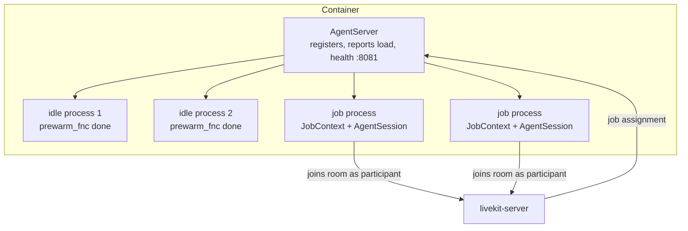

# The Agents Framework

**What you'll be able to do after this:** name the three nested lifetimes in a LiveKit agent
deployment and what fails in each; set every dispatch, prewarm and load knob from evidence
rather than from the example repo; configure turn handling with the real 1.7.0 option tree and
its actual defaults; and know which node override to reach for when you need to change
behaviour the API does not expose.

Version pinned: **`livekit-agents` 1.7.0**, read from the published wheel, 2026-08-22.

---

## 1. Intuition

The framework is two things bolted together, and most confusion comes from treating them as
one.

**A job scheduler.** A long-lived process registers with LiveKit, reports its load, and receives
job assignments. Each job runs in its own subprocess. This half is about capacity, cold starts,
draining and failure isolation, and it looks like any worker pool you have operated before.

**A voice state machine.** Inside a job, `AgentSession` wires VAD, STT, LLM and TTS together and
runs the turn-taking loop from [`../03-turn-taking/`](../03-turn-taking/). This half is about
endpointing delays, interruption policy and node overrides.

The three nested lifetimes are worth memorising, because every operational question is really
"which of these died?":

| Lifetime | Object | Duration | Killed by |
|---|---|---|---|
| Server | `AgentServer` | days | deploy, crash, SIGTERM |
| Job process | `JobProcess` | one call | job end, memory limit, hang |
| Session | `AgentSession` | one call | hangup, error, `ctx.shutdown()` |

One naming note before anything else: 1.7.0 renamed `WorkerOptions` to `ServerOptions` and
`Worker` to `AgentServer`, keeping `WorkerOptions = ServerOptions` and `WorkerType = ServerType`
as aliases in `worker.py`. Both names are live; the new ones are what the source uses.

---

## 2. Rigour

### 2.1 The process model



Jobs run in **processes**, not threads: `_default_job_executor_type` is
`JobExecutorType.PROCESS` everywhere except Windows, where a `BrokenPipeError` on process
creation forces `THREAD`. `multiprocessing_context` is `"spawn"` except on Linux, where it is
`"forkserver"`.

Three reasons this matters. A model that blocks the GIL — a local VAD, an ONNX session — stalls
only its own call. A segfault in a native audio library kills one conversation instead of
fifty. And `job_memory_limit_mb` can enforce a hard ceiling per call, which is only meaningful
with real process boundaries.

### 2.2 `ServerOptions` / `WorkerOptions`, with verified defaults

| Field | Default (1.7.0) | What it decides |
|---|---|---|
| `entrypoint_fnc` | required | your code, per job |
| `request_fnc` | accept everything | inspect a `JobRequest` and accept or reject |
| `prewarm_fnc` | no-op | runs in an idle process before any job (§2.5) |
| `load_fnc` | `_DefaultLoadCalc.get_load` (CPU) | the number compared against `load_threshold` |
| `load_threshold` | dev `inf`, prod **0.7** | above it the server reports itself unavailable |
| `job_executor_type` | `PROCESS` (`THREAD` on Windows) | isolation model |
| `num_idle_processes` | dev 0, prod `min(ceil(cpu_count), 4)` | warm pool size |
| `initialize_process_timeout` | 10.0 s | how long `prewarm_fnc` may take |
| `shutdown_process_timeout` | 10.0 s | graceful job shutdown budget |
| `session_end_timeout` | 300.0 s | `on_session_end` budget |
| `drain_timeout` | `DRAIN_TIMEOUT = 3600` s | wait for jobs to finish on TERM/INT |
| `job_memory_warn_mb` | 1000 | log a warning above this |
| `job_memory_limit_mb` | 0 (disabled) | kill the job process above this |
| `agent_name` | `""` (env `LIVEKIT_AGENT_NAME`) | non-empty switches to **explicit dispatch** |
| `worker_type` | `WorkerType.ROOM` | one job per room, or per publisher |
| `permissions` | all true, `hidden=False` | the grants the agent joins with |
| `max_retry` | 16 | reconnect attempts to LiveKit |
| `port` | dev 0, prod 8081 | health-check HTTP server |
| `prometheus_port` | unset | `/metrics` when set |
| `log_level` | dev `DEBUG`, prod `INFO` | validated against `TRACE…CRITICAL` |

The `ServerEnvOption(dev_default, prod_default)` wrapper is why these differ by mode: dev mode
disables admission control (`inf`) and keeps zero idle processes so you are not waiting on a
warm pool while editing code. **Both of those are wrong for production and right for a laptop**,
which is exactly the kind of default that bites when someone copies a dev config into a
deployment.

### 2.3 Load and admission control

The default load is CPU: `_DefaultLoadCalc` samples `cpu_percent(interval=0.5)` in a background
thread and keeps a five-sample moving average — a 2.5-second window. `UPDATE_LOAD_INTERVAL` is
0.5 s, so the server republishes its load twice a second, and `ASSIGNMENT_TIMEOUT` is 7.5 s:
the window in which a worker must accept an offered job before the server gives up on it.

Two consequences. **The load signal lags by seconds**, so a burst of arrivals can be admitted
before the average catches up — hence a threshold well below 1.0. And **CPU is a proxy, not the
constraint**: an agent that offloads STT, LLM and TTS to hosted APIs is I/O-bound and will show
20% CPU while its event loop is saturated. If your bottleneck is anything other than CPU, write
`load_fnc` yourself — active sessions divided by a measured maximum is a better signal than CPU
for a cascaded agent, and GPU memory is the right one when you run models locally.

The threshold is admission control, and §3 quantifies the trade: under a 2× surge, a worker pool
at `thr=0.7` rejected 10.0% of jobs and never exceeded 0.72 load, while the same pool at
`thr=inf` accepted everything and spent 38 seconds above 1.0 `[MEASURED]`. Rejection is visible
and recoverable — the server can route elsewhere, and your alert fires. Overload is invisible
and degrades every call on the box.

### 2.4 Dispatch

**Automatic dispatch** is the default: leave `agent_name` empty and every new room gets an agent
from the pool. **Explicit dispatch** is enabled by setting `agent_name`, and then "jobs will not
be dispatched to rooms automatically. Instead, you can either specify the agent(s) to be
dispatched in the end-user's token, or use the `AgentDispatch.createDispatch` API". Any system
with more than one kind of agent needs explicit dispatch, and it is easier to start there than
to migrate later.

`request_fnc(JobRequest)` gets the room, the publisher and `agent_name` before you commit, and
must call `accept(...)` or `reject(terminate=True)`. The default identity is
`"agent-" + job.id`; override it when per-participant recording or your own telemetry needs a
stable name. `reject` is documented as final for that job: "the job will not be assigned to
another worker".

`worker_type` chooses `ROOM` (one job per room — the normal voice-agent case) or `PUBLISHER`
(one job per publishing participant, for per-track processing such as transcription of a
multi-party call).

### 2.5 Prewarm, and the cold start it removes

`prewarm_fnc(proc: JobProcess)` runs in an idle process before any job is assigned, and whatever
it stores in `proc.userdata` is inherited by the job that lands there. The canonical use is
loading VAD or any local model once per process rather than once per call. It must finish inside
`initialize_process_timeout` (10 s).

`num_idle_processes` is what makes prewarm useful, and its production default —
`min(ceil(cpu_count), 4)` — is a compromise between memory and cold starts. The cost is real: an
idle process holding a Silero VAD and a resampler is tens to hundreds of megabytes, times four.

The benefit is measured in §3. With a 2.5 s process start and no warm pool, **100% of jobs paid
the cold start and job start p50 was 2.74 s**; with two idle processes, 1% paid it and p50 fell
to 0.24 s `[MEASURED]`. Those 2.5 seconds land directly in front of the caller's greeting, which
makes `num_idle_processes` the highest-leverage line in the config for perceived latency.

### 2.6 `JobContext`

The handle your entrypoint receives. The parts you will actually use:

| Member | Purpose |
|---|---|
| `await ctx.connect(auto_subscribe=...)` | join the room; `AutoSubscribe` is `SUBSCRIBE_ALL`, `SUBSCRIBE_NONE`, `AUDIO_ONLY`, `VIDEO_ONLY` |
| `ctx.room`, `ctx.agent` | the `rtc.Room` and the agent's `LocalParticipant` |
| `await ctx.wait_for_participant(...)` | block until the human arrives |
| `ctx.proc.userdata` | whatever `prewarm_fnc` put there |
| `ctx.job`, `ctx.worker_id`, `ctx.token_claims` | job metadata and the verified token claims |
| `ctx.api` | a `LiveKitAPI` client for server-side calls |
| `ctx.add_shutdown_callback(fn)` | run cleanup when the job ends — where post-call writes belong |
| `ctx.shutdown(reason=...)` | end the job deliberately |
| `ctx.session_directory` | a per-job scratch directory |
| `ctx.add_sip_participant(...)`, `ctx.transfer_sip_participant(...)` | telephony ([`05-telephony-sip.md`](05-telephony-sip.md)) |
| `ctx.init_recording(options)`, `ctx.delete_room(...)` | egress and room lifecycle |
| `ctx.add_participant_entrypoint(fn)` | per-participant coroutine, for multi-party rooms |

`AUDIO_ONLY` is the right default for a voice agent: subscribing to video you never use costs
bandwidth on the SFU and decode work you do not need.

Note `DEFAULT_PARTICIPANT_KINDS = [CONNECTOR, SIP, STANDARD]` in `job.py` — the kinds the
framework treats as "a human might be here". Agent and egress participants are excluded, which
is the built-in answer to "how do I stop two agents talking to each other".

### 2.7 Turn handling, with the real defaults

1.7.0 moved every interruption and endpointing knob under a single
`turn_handling=TurnHandlingOptions(...)` tree, with `_migrate_turn_handling()` translating the
deprecated flat keyword arguments (`min_endpointing_delay`, `allow_interruptions`,
`min_interruption_duration`, `min_interruption_words`, `discard_audio_if_uninterruptible`,
`false_interruption_timeout`, `resume_false_interruption`, `agent_false_interruption_timeout`,
`preemptive_generation`, `max_endpointing_delay`, `turn_detection`). Verified defaults from
`voice/turn.py`:

**`endpointing`** — `mode: "fixed" | "dynamic"`, `min_delay` 0.5 s, `max_delay` 3.0 s, `alpha`
0.9. When `turn_detection` is a *streaming* turn detector the unset keys fall back to tighter
defaults instead: `min_delay` **0.3**, `max_delay` **2.5**. `alpha` is the EMA coefficient used
only in `dynamic` mode. Compare with the measured cut-off/latency frontier in
[`../03-turn-taking/02-endpointing.md`](../03-turn-taking/02-endpointing.md): 500 ms is a
defensible default, and the right value for *your* traffic is a measurement, not a preference.

**`interruption`** — `enabled` True, `discard_audio_if_uninterruptible` True, `min_duration`
0.5 s, `min_words` 0, `resume_false_interruption` True, `false_interruption_timeout` 2.0 s,
`backchannel_boundary` (1.0, 1.0). Two of these are subtle. `min_words: 0` means barge-in fires
on *audio*, not on recognised words, so a cough interrupts; raising it to 1–2 trades barge-in
latency for robustness ([`../03-turn-taking/04-barge-in.md`](../03-turn-taking/04-barge-in.md)).
And `resume_false_interruption` with a 2.0 s timeout is the framework admitting that VAD fires
on noise: if the interruption produces no transcript within the timeout, the agent resumes what
it was saying.

**`preemptive_generation`** — `enabled` True, `preemptive_tts` False, `max_speech_duration`
10.0 s, `max_retries` 3. Generation starts before the turn is confirmed; synthesis does not,
because speculative *audio* is far more expensive to throw away than speculative tokens
([`../05-llm-layer/04-serving-llms-fast.md`](../05-llm-layer/04-serving-llms-fast.md)).

**`user_turn_limit`** — `max_words` None, `max_duration` None, both off. When set, exceeding
them raises `on_user_turn_exceeded`, whose default implementation calls `generate_reply` with
`allow_interruptions=False` and `tool_choice="none"` to cut in politely.

**`turn_detection`** is `Literal["stt", "vad", "realtime_llm", "manual"]` or a detector object,
and when absent the session auto-selects in the order **realtime_llm → vad → stt → manual**
based on what you configured. That auto-selection is the reason two deployments with identical
code endpoint differently: adding a VAD silently changes the strategy.

### 2.8 Node overrides

`Agent` exposes the pipeline as overridable methods. Each receives the upstream stream and
returns a stream, so you insert logic without forking the framework:

| Override | Hook point | Typical use |
|---|---|---|
| `on_enter` / `on_exit` | agent activation | greeting, cleanup, handoff bookkeeping |
| `on_user_turn_completed(turn_ctx, new_message)` | after the user's final transcript, before the LLM | RAG injection ([`../05-llm-layer/02-context-and-memory.md`](../05-llm-layer/02-context-and-memory.md)) |
| `on_user_turn_exceeded(ev)` | user talking too long | custom cut-in |
| `stt_node(audio, settings)` | raw frames → speech events | custom STT, keyword boosting, audio logging |
| `llm_node(chat_ctx, tools, settings)` | context → token stream | guardrails, model routing, token rewriting |
| `transcription_node(text, settings)` | text destined for the client | redaction, translation |
| `tts_node(text, settings)` | text → audio frames | custom TTS, phrase cache, pronunciation fixes |
| `realtime_audio_output_node(audio, settings)` | S2S model audio out | post-processing for realtime models |

The distinction that matters: `transcription_node` shapes what the *user sees*, `tts_node`
shapes what the user *hears*. Redacting a card number in one and not the other is a
compliance bug ([`../08-eval-safety/03-safety-and-privacy.md`](../08-eval-safety/03-safety-and-privacy.md)).

### 2.9 Events and metrics

`AgentSession` emits a typed event stream: `user_state_changed`, `agent_state_changed`,
`user_input_transcribed`, `conversation_item_added`, `function_tools_executed`,
`speech_created`, `agent_false_interruption`, `metrics_collected`, `user_turn_exceeded`,
`error`, `close`, plus the tool-lifecycle events in
[`../05-llm-layer/03-tools-and-agentic.md`](../05-llm-layer/03-tools-and-agentic.md) §4.

Per-item metrics ride on the chat context itself — `ChatMessage.metrics` is a `MetricsReport`
with `transcription_delay`, `end_of_turn_delay`, `on_user_turn_completed_delay`,
`llm_node_ttft`, `llm_node_tps`, `llm_node_ttfs`, `tts_node_ttfb`, `playback_latency` and
`e2e_latency`. That maps almost one-to-one onto this curriculum's metric names, and it means a
latency regression is attributable to a *turn*, not just to a service
([`../06-realtime-systems/06-observability.md`](../06-realtime-systems/06-observability.md)).

---

## 3. From scratch

A model of the dispatch loop with the real constants, answering what prewarm and the load
threshold actually buy. Standalone, stdlib only, deterministic.

```python
"""Worker pool, job dispatch and prewarm: what the knobs actually buy.

A discrete-event model of the LiveKit Agents dispatch loop. Constants are the real
ones from livekit-agents 1.7.0 (ASSIGNMENT_TIMEOUT = 7.5 s, UPDATE_LOAD_INTERVAL =
0.5 s, production load_threshold = 0.7). The question it answers: how much of the
caller's wait is process cold start, and what does num_idle_processes cost you.

A rolling deploy drains one worker mid-run, because that is when these settings
stop being theoretical.
"""

import heapq
import math
import random
import statistics

ASSIGNMENT_TIMEOUT = 7.5      # s -- worker must accept within this window
UPDATE_LOAD_INTERVAL = 0.5    # s -- how often a worker reports load
PREWARM_S = 2.5               # cold start: spawn + import + load models
LOAD_PER_JOB = 0.12           # CPU fraction one session costs this worker
CALL_MEDIAN_S, CALL_P95_S = 180.0, 600.0
SIM_S = 1800.0
RATES = [0.055, 0.110]        # jobs/s offered: nominal, then a 2x surge
# mean call is ~235 s, so 0.055/s is ~13 concurrent sessions and 0.110/s is ~26
DRAIN_AT, DRAIN_FOR = 900.0, 90.0    # rolling deploy: one worker leaves and returns
SEED = 23


def lognormal(median, p95, rng):
    sigma = math.log(p95 / median) / 1.6448536269514722
    return math.exp(rng.gauss(math.log(median), sigma))


class Worker:
    def __init__(self, wid, idle_target):
        self.wid = wid
        self.idle_target = idle_target
        self.idle = idle_target          # warm processes ready now
        self.warming = []                # completion times of processes being warmed
        self.active = []                 # end times of running jobs
        self.draining = False

    def load(self):
        return len(self.active) * LOAD_PER_JOB

    def tick(self, now):
        self.active = [t for t in self.active if t > now]
        ready = [t for t in self.warming if t <= now]
        self.warming = [t for t in self.warming if t > now]
        self.idle += len(ready)
        # refill the warm pool in the background, one process at a time
        while self.idle + len(self.warming) < self.idle_target and not self.draining:
            self.warming.append(now + PREWARM_S)


def simulate(n_workers, idle_target, load_threshold, rate, *, drain=True):
    rng = random.Random(SEED)
    workers = [Worker(i, idle_target) for i in range(n_workers)]

    arrivals, t = [], 0.0
    while t < SIM_S:
        t += rng.expovariate(rate)
        arrivals.append((t, lognormal(CALL_MEDIAN_S, CALL_P95_S, rng)))

    pending = []                     # (arrival_time, duration) still unassigned
    starts, cold, failed, degraded_s, loads = [], 0, 0, 0.0, []
    ai = 0
    now = 0.0
    while now < SIM_S + 60:
        for w in workers:
            if drain:
                w.draining = (w.wid == 0 and DRAIN_AT <= now < DRAIN_AT + DRAIN_FOR)
            w.tick(now)

        while ai < len(arrivals) and arrivals[ai][0] <= now:
            heapq.heappush(pending, arrivals[ai]); ai += 1

        # dispatch: least loaded worker under the threshold, not draining
        while pending:
            arrived, dur = pending[0]
            avail = [w for w in workers if not w.draining and w.load() < load_threshold]
            if not avail:
                if now - arrived > ASSIGNMENT_TIMEOUT:
                    heapq.heappop(pending); failed += 1
                    continue
                break
            w = min(avail, key=lambda x: x.load())
            heapq.heappop(pending)
            if w.idle > 0:
                w.idle -= 1
                start_delay = 0.0
            else:
                start_delay = PREWARM_S      # no warm process: pay the cold start
            if (now - arrived) + start_delay > ASSIGNMENT_TIMEOUT:
                failed += 1
                continue
            if start_delay:
                cold += 1
            starts.append((now - arrived) + start_delay)
            w.active.append(now + start_delay + dur)

        inst = [w.load() for w in workers]
        loads.append(statistics.mean(inst))
        degraded_s += UPDATE_LOAD_INTERVAL * sum(1 for x in inst if x > 1.0)
        now += UPDATE_LOAD_INTERVAL

    return {"n": len(starts), "offered": len(arrivals), "cold": cold, "failed": failed,
            "p50": sorted(starts)[len(starts)//2] if starts else float("nan"),
            "p95": sorted(starts)[int(.95*len(starts))] if starts else float("nan"),
            "mean_load": statistics.mean(loads), "max_load": max(loads),
            "degraded_s": degraded_s}


CONFIGS = [
    ("4w idle=0  thr=0.7", 4, 0, 0.7),
    ("4w idle=2  thr=0.7", 4, 2, 0.7),
    ("4w idle=4  thr=0.7", 4, 4, 0.7),
    ("4w idle=4  thr=inf", 4, 4, math.inf),     # dev-mode default: no admission control
    ("6w idle=4  thr=0.7", 6, 4, 0.7),
]

if __name__ == "__main__":
    print(f"call median {CALL_MEDIAN_S:.0f}s / p95 {CALL_P95_S:.0f}s, cold start "
          f"{PREWARM_S}s, one worker drains for {DRAIN_FOR:.0f}s at t={DRAIN_AT:.0f}s, "
          f"{SIM_S:.0f}s of traffic")
    for rate in RATES:
        print(f"\noffered {rate:.3f} jobs/s (~{rate*235:.0f} concurrent sessions), "
              f"capacity at thr=0.7 is {int(0.7/LOAD_PER_JOB)} sessions/worker\n")
        print(f"{'config':20s} {'started':>8} {'cold':>6} {'failed':>7} {'start p50':>10} "
              f"{'start p95':>10} {'mean load':>10} {'max load':>9} {'overload':>9}")
        for name, nw, idle, thr in CONFIGS:
            r = simulate(nw, idle, thr, rate)
            print(f"{name:20s} {r['n']:8d} {r['cold']/max(1,r['n']):5.0%} "
                  f"{r['failed']/r['offered']:6.1%} {r['p50']:9.2f}s {r['p95']:9.2f}s "
                  f"{r['mean_load']:10.2f} {r['max_load']:9.2f} {r['degraded_s']:8.0f}s")

    print("\neffect of the rolling deploy alone (4w idle=4 thr=0.7):")
    for rate in RATES:
        a = simulate(4, 4, 0.7, rate, drain=True)
        b = simulate(4, 4, 0.7, rate, drain=False)
        print(f"  {rate:.3f} jobs/s: with drain failed {a['failed']/a['offered']:5.1%} "
              f"p95 {a['p95']:.2f}s | without drain failed {b['failed']/b['offered']:5.1%} "
              f"p95 {b['p95']:.2f}s")
```

Output `[MEASURED]`:

```
call median 180s / p95 600s, cold start 2.5s, one worker drains for 90s at t=900s, 1800s of traffic

offered 0.055 jobs/s (~13 concurrent sessions), capacity at thr=0.7 is 5 sessions/worker

config                started   cold  failed  start p50  start p95  mean load  max load  overload
4w idle=0  thr=0.7        109  100%   0.0%      2.74s      2.98s       0.37      0.57        0s
4w idle=2  thr=0.7        109    1%   0.0%      0.24s      0.48s       0.37      0.57        0s
4w idle=4  thr=0.7        109    0%   0.0%      0.24s      0.48s       0.37      0.57        0s
4w idle=4  thr=inf        109    0%   0.0%      0.24s      0.48s       0.37      0.57        0s
6w idle=4  thr=0.7        109    0%   0.0%      0.24s      0.48s       0.24      0.38        0s

offered 0.110 jobs/s (~26 concurrent sessions), capacity at thr=0.7 is 5 sessions/worker

config                started   cold  failed  start p50  start p95  mean load  max load  overload
4w idle=0  thr=0.7        170  100%  10.5%      2.76s      5.52s       0.61      0.72        0s
4w idle=2  thr=0.7        171    0%  10.0%      0.27s      3.38s       0.61      0.72        0s
4w idle=4  thr=0.7        171    0%  10.0%      0.27s      3.38s       0.61      0.72        0s
4w idle=4  thr=inf        190    0%   0.0%      0.26s      0.49s       0.67      0.99       38s
6w idle=4  thr=0.7        190    0%   0.0%      0.26s      0.49s       0.45      0.66        0s

effect of the rolling deploy alone (4w idle=4 thr=0.7):
  0.055 jobs/s: with drain failed  0.0% p95 0.48s | without drain failed  0.0% p95 0.48s
  0.110 jobs/s: with drain failed 10.0% p95 3.38s | without drain failed  9.5% p95 4.39s
```

Read the three findings. **Prewarm is the whole cold-start story**: at nominal load, `idle=0`
put 2.74 s in front of every caller and `idle=2` removed it, with `idle=4` adding nothing —
the warm pool only has to cover the arrival rate during a refill, not the concurrency. **The
load threshold converts overload into rejection**: at surge, `thr=0.7` refused 10% of jobs and
stayed at 0.72 load, while `thr=inf` took everything and spent 38 seconds above 1.0, which in
production is every call on that box glitching. **The right fix for the surge is neither** —
six workers took the same traffic with no rejections and a 0.66 peak.

Three load-bearing details in the code. **The warm pool refills in the background and one at a
time**, so a burst can exhaust it and the next arrivals pay the cold start even though
`num_idle_processes` is 4 — modelling refill as instant makes prewarm look better than it is.
**A job is only counted as failed when `now - arrived` exceeds `ASSIGNMENT_TIMEOUT`**, matching
the real 7.5 s window rather than an arbitrary queue limit. And **the drain row shows fewer
failures but a worse p95 without draining**, which is not a bug: rejecting jobs early shortens
the queue for the survivors, so admission control trades a visible failure for invisible
latency — pick which one your product can tolerate.

---

## 4. How production does it

**Health and metrics are built in.** The server runs an HTTP health endpoint on `port` (8081 in
production mode), and setting `prometheus_port` exposes `/metrics`. With
`prometheus_multiproc_dir` set, child job processes contribute too — without it you are
measuring only the parent, which is the process doing the least interesting work.

**Hosted agents exist and are visible in the source.** `worker.py` reads
`LIVEKIT_WORKER_TOKEN` from the environment for hosted agents, and `WorkerInfo` carries a
`cloud_agents` flag. If you self-host, you own the container, the autoscaler and the drain
([`04-self-hosting-and-scale.md`](04-self-hosting-and-scale.md)); if you use Cloud Agents,
those are managed and the `AgentGrant` scopes from
[`01-architecture.md`](01-architecture.md) §2.2 apply.

**Draining is a first-class signal path.** On SIGTERM or SIGINT the server stops accepting and
waits up to `drain_timeout` — 3600 s by default, which is deliberately longer than any single
call. A deployment system that sends SIGKILL after 30 seconds, as many container platforms do
by default, will cut live calls in half regardless of what the framework wants; the
`terminationGracePeriodSeconds` on your pod is therefore part of this configuration even though
it lives in a different file.

**The entrypoint's shape is a contract.** `prewarm_fnc` loads models into `proc.userdata`; the
entrypoint calls `await ctx.connect(...)`, constructs an `AgentSession`, and registers shutdown
callbacks for post-call work. Anything expensive done in the entrypoint instead of prewarm is
paid per call, in front of the caller — the single most common performance mistake in agent
code, and the §3 table is what it costs.

**Deprecated flat kwargs still work, and they hide the defaults.** Because
`_migrate_turn_handling` only sets the keys you explicitly pass, a codebase using the old
arguments silently inherits the new defaults for everything else. When 1.7.0 tightened the
streaming-detector endpointing defaults to 0.3/2.5, deployments that never named those values
changed behaviour on upgrade. Pin what you care about.

---

## 5. At scale

**Sessions per worker is a memory and event-loop question, not a CPU one.** A cascaded agent
using hosted STT/LLM/TTS is mostly waiting; a local-model agent is not. Measure the real ceiling
by ramping one worker until `eou_to_ttfa` p95 degrades, then set `load_fnc` to report
`active_sessions / that_number`. CPU-based load will otherwise let you run far past the point
where audio starts stuttering.

**Idle processes are RAM you pay for continuously.** Four idle processes each holding a VAD and
a resampler is a fixed cost per container; on a 4 GiB container it can be the difference between
eight concurrent calls and five. The §3 result — that `idle=2` performed as well as `idle=4` at
nominal load — is the argument for sizing the pool to the *arrival rate during a refill*, which
is `arrival_rate × PREWARM_S` plus headroom, not to concurrency.

**Deploys are the largest planned source of failed calls.** With `drain_timeout` at an hour and
calls of a few minutes, a rolling deploy that drains properly loses nothing; one that does not
loses every in-flight call on each replica it replaces. Deploy during the trough, drain rather
than restart, and measure calls lost per deploy as an SLI
([`../06-realtime-systems/08-deployment.md`](../06-realtime-systems/08-deployment.md)).

**Explicit dispatch is what makes multi-agent fleets tractable.** With `agent_name` set, routing
is a property of the token or the dispatch API, so you can run a receptionist pool, an outbound
pool and a canary of the next version in the same cluster and send 1% of traffic to the canary
without a separate deployment.

**Watch the assignment window.** A worker that accepts jobs but takes more than 7.5 s to do so
is dropping calls invisibly — the server simply gives up. Rising `ASSIGNMENT_TIMEOUT` losses
usually mean the event loop is blocked, which usually means someone is doing model loading or
synchronous I/O in the entrypoint.

**Per-job memory limits are worth setting.** `job_memory_limit_mb` defaults to 0 (disabled), so a
leak in one call grows until the container is OOM-killed and takes every other call with it.
Setting a limit converts a fleet incident into one dropped call, and `job_memory_warn_mb` at
1000 gives you the warning first.

---

## 6. Exercises

**E7.2.1** Run the §3 listing with your own call-duration distribution and cold-start time.
Report the smallest `num_idle_processes` that keeps cold starts under 1% at your arrival rate,
and compare it with `min(ceil(cpu_count), 4)`.

**E7.2.2** Measure your real cold start: instrument process spawn to first audio published, with
and without `prewarm_fnc` loading your models. Report both, and state how much of the caller's
greeting delay it accounts for.

**E7.2.3** Write a `load_fnc` based on active sessions rather than CPU. Ramp one worker until
`eou_to_ttfa` p95 exceeds your SLO, and use that number as the denominator. Report how far it is
from where CPU-based load would have stopped you.

**E7.2.4** Enumerate every turn-handling default in §2.7 and, for each, state the failure it
prevents and whether your deployment should change it. Then change exactly one and measure the
effect on `endpoint_f1` and `eou_to_ttfa`.

**E7.2.5** Switch a running agent from automatic to explicit dispatch. Verify that rooms no
longer get an agent by default, then dispatch by token and by the dispatch API, and describe
which you would use for inbound telephony.

**E7.2.6** Implement `transcription_node` to redact digit sequences, and confirm from a live
session that the client sees the redacted text while the TTS still speaks the real value —
then decide whether that asymmetry is correct for your compliance requirement.

**E7.2.7** Trigger a drain with SIGTERM during a live call. Confirm the call completes, then set
your container's grace period to 30 s and repeat. Report what the caller experiences in each
case.

**E7.2.8** Set `job_memory_limit_mb` and induce a leak. Verify that only the leaking job dies,
and that the server keeps accepting new jobs afterwards.

---

## 7. Interview drill

> "Every tenth call, the caller hears nothing for three seconds before the agent greets them.
> The other nine are instant. Where is the time going?"

A bimodal latency distribution with a hard 2–3 second mode is a cold start, not a slow path.
Something is being done once per process rather than once per fleet, and nine calls in ten find
a process where it has already been done. The framework's model makes this concrete: jobs run in
subprocesses drawn from a warm pool sized by `num_idle_processes`, and `prewarm_fnc` runs in
those processes before any job arrives. When the pool is empty — because it is zero, because the
arrival rate outran the background refill, or because the container just started — the caller
pays process spawn plus imports plus model loading.

The evidence to gather is small. Log a timestamp at process start, at the end of `prewarm_fnc`,
at entrypoint entry and at first audio published, and check whether the slow calls have a large
gap in the first interval. Then check `num_idle_processes` against the environment mode, because
the development default is **zero** and the production default is `min(ceil(cpu_count), 4)` —
a dev-mode config shipped to production produces exactly this symptom on every call, and a
correctly configured one produces it only during bursts, which is what "every tenth call"
suggests.

The fixes are ordered by cost. Move model loading from the entrypoint into `prewarm_fnc` so it
happens off the critical path. Size the warm pool to the arrival rate during a refill rather
than to concurrency — in the measurement in §3, two idle processes took cold starts from 100% of
jobs to 1%, and four bought nothing more at nominal load. Then check whether the refill itself
is slow, because a `prewarm_fnc` close to the 10 s `initialize_process_timeout` will fail to
keep up with any burst.

What distinguishes a senior answer is questioning the attribution. Three seconds of silence
before a greeting is also what ICE failing over to TURN looks like, and what a cold TTS
connection looks like, and the three are distinguishable only with timestamps at the boundaries.
It is also worth asking whether the greeting should wait at all: a scripted first utterance can
be synthesised ahead of time and played the moment the participant joins, which makes the whole
class of problems invisible to the caller even when it is still there in the traces — and hiding
it in the greeting is legitimate, as long as you are still alerting on the underlying cold-start
rate.

---

## Sources

- `livekit-agents` **1.7.0**, published wheel `livekit_agents-1.7.0-py3-none-any.whl` (PyPI, retrieved 2026-08-22), files read directly from the archive:
  - `livekit/agents/worker.py` — `ASSIGNMENT_TIMEOUT = 7.5`, `UPDATE_LOAD_INTERVAL = 0.5`, `DRAIN_TIMEOUT = 3600`, `WorkerOptions = ServerOptions` and `WorkerType = ServerType` aliases, `_DefaultLoadCalc` (5-sample moving average of `cpu_percent(interval=0.5)`), `_default_load_threshold = ServerEnvOption(dev_default=inf, prod_default=0.7)`, `num_idle_processes` default `ServerEnvOption(dev_default=0, prod_default=min(ceil(cpu_count()), 4))`, `job_memory_warn_mb=1000`, `job_memory_limit_mb=0`, `shutdown_process_timeout=10.0`, `session_end_timeout=300.0`, `initialize_process_timeout=10.0`, `max_retry=16`, `port` `ServerEnvOption(0, 8081)`, `multiprocessing_context`, `WorkerPermissions`, `LIVEKIT_WORKER_TOKEN`, `WorkerInfo.cloud_agents`.
  - `livekit/agents/job.py` — `JobExecutorType`, `AutoSubscribe` values, `JobAcceptArguments`, `JobRequest.accept/reject`, default identity `"agent-" + job.id`, `JobContext` members listed in §2.6, `DEFAULT_PARTICIPANT_KINDS`.
  - `livekit/agents/voice/turn.py` — `TurnHandlingOptions` and the verified defaults quoted in §2.7 (`_ENDPOINTING_DEFAULTS`, `_STREAMING_ENDPOINTING_DEFAULTS`, `_INTERRUPTION_DEFAULTS`, `_PREEMPTIVE_GENERATION_DEFAULTS`, `_USER_TURN_LIMIT_DEFAULTS`), `TurnDetectionMode` and its auto-selection order, `_migrate_turn_handling`.
  - `livekit/agents/voice/agent.py` — `on_enter`, `on_exit`, `on_user_turn_completed`, `on_user_turn_exceeded`, `stt_node`, `llm_node`, `transcription_node`, `tts_node`, `realtime_audio_output_node`.
  - `livekit/agents/voice/agent_session.py` — `DEFAULT_TTS_TEXT_TRANSFORMS`, `SpeechSteeringOptions`, `_DEFAULT_AEC_WARMUP_DURATION`.
  - `livekit/agents/voice/events.py` — the session event list and `RunContext` surface referenced in §2.9.
- `[MEASURED]`: the §3 tables are the output of the §3 listing on Apple M5 / macOS 26.5.2, CPython 3.12, stdlib only. It is a simulation using LiveKit's real constants with an assumed 2.5 s cold start and a CPU-proportional load model — substitute your own measured cold start and load curve before drawing capacity conclusions.
