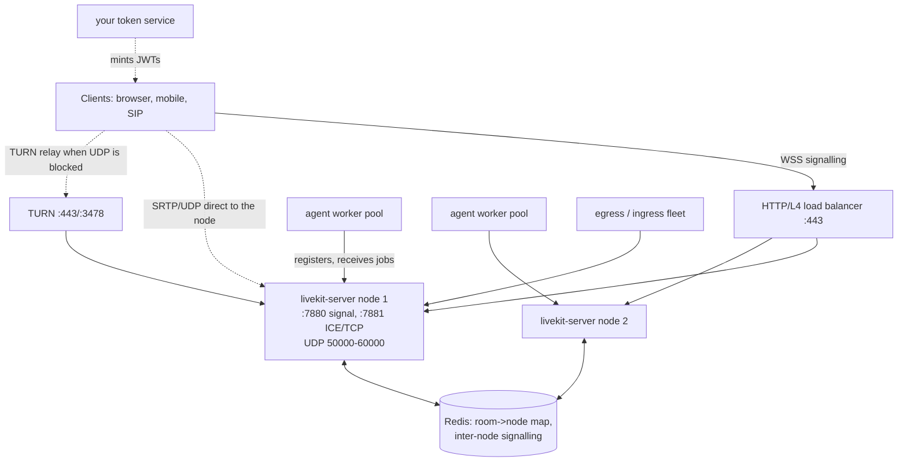

# Self-Hosting and Scale

**What you'll be able to do after this:** stand up a multi-node LiveKit deployment and explain
every setting you changed; say precisely why media cannot sit behind an HTTP load balancer and
what to do instead; size media and agent fleets from arithmetic rather than guesswork; drain
both fleets during a deploy without dropping calls; and compute the Cloud-versus-self-host
crossover for your own volume instead of arguing about it.

---

## 1. Intuition

A self-hosted LiveKit deployment is **three fleets with three different scaling laws**, plus a
coordination layer, and treating it as one service is the root of most operational surprises.

**Media servers scale with packets and ports.** They forward RTP without transcoding, so their
cost is per packet — SRTP crypto, syscalls, forwarding — and their hard limits are UDP ports and
network interrupts, not CPU-seconds of audio.

**Agent workers scale with sessions.** Each call is a job process holding models, buffers and
sockets ([`02-agents-framework.md`](02-agents-framework.md)). Their limits are RAM and event-loop
headroom.

**Egress scales with transcoding.** It decodes, mixes and re-encodes, so it is the only part of
the system whose cost resembles a video pipeline. Recording everything is a fleet, not a flag.

Binding them is **Redis**, which holds the room-to-node map and carries signalling between
nodes. And overhanging all of it is one constraint that shapes the whole topology: **a room lives
on exactly one node, and its media must reach that node directly.** No layer-7 load balancer, no
service mesh sidecar, no TLS terminator in the media path.

---

## 2. Rigour

### 2.1 Topology



The dashed lines are the ones people get wrong. Signalling is ordinary HTTPS/WebSocket traffic
and can be load balanced. **Media is not, and cannot be.**

### 2.2 The configuration that matters

From `livekit/livekit`, `config-sample.yaml` (master, retrieved 2026-08-22):

| Setting | Value in the sample | Why you care |
|---|---|---|
| `port` | 7880 | signalling + RoomService; "should be placed behind a load balancer with TLS" |
| `rtc.port_range_start/end` | 50000 / 60000 | 10 001 UDP ports per node — a concurrency ceiling |
| `rtc.tcp_port` | 7881 | ICE over TCP fallback; "*cannot* be behind load balancer or TLS" |
| `rtc.udp_port` | e.g. `7882-7892` | UDP mux: all traffic through a few ports, "greater or equal to the number of vCPUs" |
| `rtc.use_external_ip` | true | discover the public IP via STUN — required on any cloud VM |
| `rtc.use_ice_lite` | commented | faster connect, "might cause connect issue if server running behind NAT" |
| `redis.address` / `sentinel_*` / `cluster_addresses` | — | "when redis is set, LiveKit will automatically operate in a fully distributed fashion" |
| `keys` | `key1: secret1` | the API key/secret pairs that sign every token ([`01-architecture.md`](01-architecture.md)) |
| `room.empty_timeout` / `departure_timeout` | 300 / 20 | how long an empty room survives |
| `room.max_participants` | 0 (unlimited) | set it; an unbounded room is an unbounded node |
| `turn.udp_port` / `tls_port` | 3478 / 5349 | "only 53/80/443 are allowed if less than 1024"; 443 is what gets through firewalls |
| `turn.ttl_seconds` | 300, capped at 86400 | credential lifetime |
| `turn.per_user_relay_allocation_limit` | 12 | stops one participant exhausting the shared relay range |
| `prometheus_port` | 6789 | `/metrics` |
| `debug_handler_port.port` | 7070 | `/debug/pprof`, `/debug/rooms`, on a private port |
| `audio.active_level` / `min_percentile` / `update_interval` | 30 / 40 / 500 ms | active-speaker sensitivity |
| `rtc.batch_io.batch_size` | 128 | merges write syscalls — a packet-rate optimisation |
| `signal_relay.retry_timeout` | 30 s | inter-node signalling reliability |
| `webhook.urls` + `api_key` | — | signed room/participant lifecycle events |

Two are worth setting on day one and are easy to miss. `room.max_participants: 0` means
unlimited, which in a voice-agent deployment means a bug can put 500 participants on one node.
And `debug_handler_port` gives you `pprof` and a room dump on a port that is not the public one —
the difference between diagnosing a stuck room in production and guessing.

### 2.3 Why media cannot sit behind an HTTP load balancer

Three independent reasons, any one of which is fatal.

**ICE advertises node addresses, not the balancer's.** During negotiation the server offers
candidates containing *its own* reachable IP and port. A client that connects through a balancer
to node 2 and then sends media to the address in the candidate is bypassing the balancer by
design. If that address is unreachable, the connection fails; if the balancer rewrites it,
DTLS-SRTP breaks because the fingerprint was bound to the original path
([`../06-realtime-systems/02-webrtc-internals.md`](../06-realtime-systems/02-webrtc-internals.md)).

**Media is UDP, and an HTTP balancer is not.** A layer-7 balancer terminates TCP and parses
HTTP; it has nothing to say about a UDP flow on port 51234. Even a layer-4 UDP balancer breaks
the model, because it would have to hash consistently to the node holding the room, which it
cannot know.

**The config says so.** The `tcp_port` comment is explicit: this port "*cannot* be behind load
balancer or TLS, and must be exposed on the node. WebRTC transports are encrypted and do not
require additional encryption."

The correct pattern: put the **signalling** endpoint behind the balancer (TLS terminated there),
give every node a **publicly reachable address** with its UDP range open, let Redis route
signalling to whichever node owns the room, and use **TURN on 443** for clients whose network
blocks UDP entirely. In Kubernetes this usually means `hostNetwork` or a node-port range rather
than a `Service` of type LoadBalancer for the media ports.

### 2.4 TURN, and what it costs

TURN exists for the client that cannot send UDP at all — restrictive corporate firewalls, some
mobile carriers, hotel networks. When it is used, **both directions of media relay through your
infrastructure**, so a relayed call costs roughly twice the bandwidth of a direct one and adds a
hop of latency.

Three configuration facts matter. TLS on **443** is what actually gets through hostile networks,
so `tls_port: 5349` is the default and 443 is the deployment you want, optionally with
`external_tls: true` when an L4 balancer terminates TLS. `ttl_seconds` defaults to 300, capped at
86400 — short-lived credentials, like tokens. And `per_user_relay_allocation_limit: 12` caps
allocations per participant credential, because the relay port range is shared and one
authenticated participant should not be able to exhaust it.

Measure your relay fraction; do not assume it. It varies from ~5% on consumer traffic to well
over 30% inside enterprises, and it is the largest single uncertainty in a self-hosted bandwidth
budget (§3 assumes 15%).

### 2.5 Capacity arithmetic

**Media nodes.** Two-party audio calls at 20 ms frames are 50 packets/s per direction per
participant, so $N$ concurrent participants generate $100N$ packets/s through the node. Ports are
the other limit: the default range is 10 001 UDP ports, and UDP mux collapses that to a handful
of ports at the cost of some parallelism — the sample config suggests a mux range "greater or
equal to the number of vCPUs". Size by whichever binds first, and measure with
`prometheus_port` rather than trusting a number from a blog.

**Agent workers.** Capacity is `min(RAM / per-session RAM, sessions the event loop can serve)`.
Per-session RAM is dominated by whatever models you load in-process, multiplied by processes
rather than containers ([`03-writing-plugins.md`](03-writing-plugins.md) §5). The event-loop
number is measured by ramping one worker until `eou_to_ttfa` p95 breaches your SLO, and it is
what `load_fnc` should report.

**Peak versus mean.** Provision for the busy hour. A peak-to-mean ratio of 3 is a reasonable
starting assumption for business-hours traffic in one time zone and is what §3 uses; with a
global footprint it flattens, with a single market and an outbound campaign it gets much worse.

### 2.6 Autoscaling and draining

The two fleets scale on different signals and drain in different ways.

| | Media nodes | Agent workers |
|---|---|---|
| Scale signal | concurrent participants, packets/s, port usage | concurrent sessions or `load_fnc` |
| Bad signal | CPU alone | CPU alone (an I/O-bound agent looks idle) |
| Scale up | add nodes; new rooms land on them | add workers; they register and receive jobs |
| Scale down | stop accepting new rooms, wait for existing to empty | SIGTERM, worker stops accepting, finishes jobs |
| Drain duration | until the last room ends | up to `drain_timeout` = 3600 s |
| Hard failure | every room on the node dies | in-flight calls on that worker die |

Two operational rules follow. **A room cannot be moved**, so a media node drains by attrition:
mark it unschedulable and wait. Plan deploys around call length, deploy in the trough, and treat
"calls lost per deploy" as an SLI.

**Your container platform's grace period overrides the framework's.** `drain_timeout` defaults to
an hour; Kubernetes' `terminationGracePeriodSeconds` defaults to 30. Whichever is shorter wins,
and the default combination cuts live calls off mid-sentence. Set the grace period to at least
your p99 call duration on both fleets.

### 2.7 Observability

`prometheus_port: 6789` exposes server metrics; the agent worker exposes its own when
`prometheus_port` is set, and `prometheus_multiproc_dir` is required for job-process metrics to
appear at all ([`02-agents-framework.md`](02-agents-framework.md) §4). Webhooks
(`webhook.urls`, signed with one of your `keys`) deliver room and participant lifecycle events,
which is how you reconcile billing and detect rooms that never closed. `debug_handler_port`
exposes `pprof` and `/debug/rooms` privately.

The alerting set that catches real problems: participants per node against your measured
ceiling, UDP port utilisation, TURN relay fraction, Redis latency, agent worker load and job
rejection rate, and rooms whose age exceeds your longest plausible call
([`../06-realtime-systems/06-observability.md`](../06-realtime-systems/06-observability.md)).

---

## 3. From scratch

The crossover, computed on published Cloud prices and stated infrastructure assumptions.
Standalone, stdlib only.

```python
"""LiveKit Cloud vs self-hosted: the crossover, computed rather than asserted.

Three deployments priced on the same traffic:

  A. Cloud media + Cloud-hosted agents   (nothing to operate)
  B. Cloud media + self-hosted agents    (the common middle)
  C. Self-hosted media + self-hosted agents

Cloud prices are the published Scale-plan rates (livekit.com/pricing, retrieved
2026-08-22). Infrastructure rates and node capacities are stated assumptions --
change them to yours before believing the crossover.
"""

# ---- Cloud, Scale plan (published) ----------------------------------------
PLAN_FEE = 500.00              # $/month, "starting at"
WEBRTC_INCLUDED = 1_500_000    # participant-minutes included
WEBRTC_RATE = 0.0004           # $/participant-minute beyond that
AGENT_INCLUDED = 50_000        # agent session minutes included
AGENT_RATE = 0.01              # $/agent-session-minute beyond that
DATA_INCLUDED_GB = 3_000
DATA_RATE_GB = 0.10

# ---- Traffic model ---------------------------------------------------------
PARTICIPANTS_PER_CALL = 2      # the human and the agent; self-hosted agents
                               # still count as WebRTC participants
AUDIO_KBPS_WIRE = 40           # Opus + SRTP/UDP/IP, measured in 06-realtime-systems/01
PEAK_TO_MEAN = 3.0             # provision for the busy hour, not the average

# ---- Self-hosting assumptions (change these) -------------------------------
MEDIA_NODE_USD_HR = 0.20       # 8 vCPU, network-optimised
MEDIA_PARTICIPANTS_PER_NODE = 1000
AGENT_NODE_USD_HR = 0.30       # 8 vCPU, runs job processes
AGENT_SESSIONS_PER_NODE = 25
REDIS_USD_HR = 0.05            # small managed instance with failover
TURN_FRACTION = 0.15           # sessions that fail ICE and relay through you
EGRESS_USD_GB = 0.09           # cloud egress
OPS_USD_MONTH = 4_167.0        # 0.25 FTE at $200k/yr, fully loaded
HOURS_PER_MONTH = 730


def gb_per_1000_call_min(participants=PARTICIPANTS_PER_CALL):
    """Downstream bytes for 1000 call-minutes: each participant receives the others."""
    receiving_streams = participants * (participants - 1)
    mbit = AUDIO_KBPS_WIRE / 1000 * 60 * 1000 * receiving_streams
    return mbit / 8 / 1000                       # -> GB


def concurrent_sessions(monthly_call_min):
    """Peak concurrency implied by a monthly volume."""
    return monthly_call_min / (HOURS_PER_MONTH * 60) * PEAK_TO_MEAN


def cloud_cost(monthly_call_min, *, hosted_agents):
    part_min = monthly_call_min * PARTICIPANTS_PER_CALL
    webrtc = max(0.0, part_min - WEBRTC_INCLUDED) * WEBRTC_RATE
    agents = (max(0.0, monthly_call_min - AGENT_INCLUDED) * AGENT_RATE
              if hosted_agents else 0.0)
    gb = gb_per_1000_call_min() * monthly_call_min / 1000
    data = max(0.0, gb - DATA_INCLUDED_GB) * DATA_RATE_GB
    return {"plan": PLAN_FEE, "webrtc": webrtc, "agents": agents, "data": data,
            "infra": 0.0, "ops": 0.0}


def selfhost_agents(monthly_call_min):
    nodes = max(1.0, concurrent_sessions(monthly_call_min) / AGENT_SESSIONS_PER_NODE)
    return nodes * AGENT_NODE_USD_HR * HOURS_PER_MONTH


def selfhost_cost(monthly_call_min):
    conc = concurrent_sessions(monthly_call_min)
    media_nodes = max(2.0, conc * PARTICIPANTS_PER_CALL / MEDIA_PARTICIPANTS_PER_NODE)
    media = media_nodes * MEDIA_NODE_USD_HR * HOURS_PER_MONTH
    redis = 2 * REDIS_USD_HR * HOURS_PER_MONTH           # primary + replica
    gb = gb_per_1000_call_min() * monthly_call_min / 1000
    egress = gb * EGRESS_USD_GB
    turn = gb * TURN_FRACTION * EGRESS_USD_GB            # relayed twice, charged once more
    return {"plan": 0.0, "webrtc": 0.0, "agents": selfhost_agents(monthly_call_min),
            "data": egress + turn, "infra": media + redis, "ops": OPS_USD_MONTH}


def total(c):
    return sum(c.values())


DEPLOYMENTS = [
    ("A cloud + hosted agents", lambda m: cloud_cost(m, hosted_agents=True)),
    ("B cloud + own agents", lambda m: {
        **cloud_cost(m, hosted_agents=False),
        "agents": selfhost_agents(m),
        "ops": OPS_USD_MONTH * 0.5,        # agents only: no media plane to run
    }),
    ("C fully self-hosted", selfhost_cost),
]
VOLUMES = [10_000, 100_000, 1_000_000, 10_000_000]

if __name__ == "__main__":
    print(f"assumptions: {PARTICIPANTS_PER_CALL} participants/call, "
          f"{AUDIO_KBPS_WIRE} kbit/s wire, peak/mean {PEAK_TO_MEAN}, "
          f"ops ${OPS_USD_MONTH:,.0f}/mo\n")
    print(f"downstream data: {gb_per_1000_call_min():.2f} GB per 1000 call-minutes\n")

    for vol in VOLUMES:
        conc = concurrent_sessions(vol)
        print(f"{vol:,} call-minutes/month  (~{conc:.0f} concurrent calls at peak)")
        print(f"  {'deployment':24s} {'plan':>8} {'webrtc':>9} {'agents':>10} "
              f"{'data':>8} {'infra':>9} {'ops':>9} {'total':>11} {'$/1000min':>10}")
        for name, fn in DEPLOYMENTS:
            c = fn(vol)
            t = total(c)
            print(f"  {name:24s} {c['plan']:8.0f} {c['webrtc']:9.0f} {c['agents']:10.0f} "
                  f"{c['data']:8.0f} {c['infra']:9.0f} {c['ops']:9.0f} {t:11,.0f} "
                  f"{t / vol * 1000:10.2f}")
        print()

    # crossovers: smallest volume where each option becomes the cheapest
    print("crossover search (10k -> 20M call-minutes/month):")
    prev = None
    v = 10_000
    while v <= 20_000_000:
        costs = [(total(fn(v)), name) for name, fn in DEPLOYMENTS]
        best = min(costs)[1]
        if best != prev:
            print(f"  from ~{v:>12,} call-min/month the cheapest is: {best}")
            prev = best
        v = int(v * 1.05)

    print("\nsensitivity of the A->B crossover to the ops cost of running agents:")
    for ops in (1000, 2084, 4167, 8000, 16000):   # 2084 is the half-FTE used above
        v, found = 10_000, None
        while v <= 50_000_000:
            a = total(cloud_cost(v, hosted_agents=True))
            b = total({**cloud_cost(v, hosted_agents=False),
                       "agents": selfhost_agents(v), "ops": ops})
            if b < a:
                found = v
                break
            v = int(v * 1.05)
        print(f"  ops ${ops:>6,}/mo -> self-hosted agents win above "
              f"{found:,} call-min/month" if found else "  never")
```

Output `[MEASURED]` (Cloud rates published, infrastructure rates assumed):

```
assumptions: 2 participants/call, 40 kbit/s wire, peak/mean 3.0, ops $4,167/mo

downstream data: 0.60 GB per 1000 call-minutes

10,000 call-minutes/month  (~1 concurrent calls at peak)
  deployment                   plan    webrtc     agents     data     infra       ops       total  $/1000min
  A cloud + hosted agents       500         0          0        0         0         0         500      50.00
  B cloud + own agents          500         0        219        0         0      2084       2,802     280.25
  C fully self-hosted             0         0        219        1       365      4167       4,752     475.16

100,000 call-minutes/month  (~7 concurrent calls at peak)
  deployment                   plan    webrtc     agents     data     infra       ops       total  $/1000min
  A cloud + hosted agents       500         0        500        0         0         0       1,000      10.00
  B cloud + own agents          500         0        219        0         0      2084       2,802      28.03
  C fully self-hosted             0         0        219        6       365      4167       4,757      47.57

1,000,000 call-minutes/month  (~68 concurrent calls at peak)
  deployment                   plan    webrtc     agents     data     infra       ops       total  $/1000min
  A cloud + hosted agents       500       200       9500        0         0         0      10,200      10.20
  B cloud + own agents          500       200        600        0         0      2084       3,384       3.38
  C fully self-hosted             0         0        600       62       365      4167       5,194       5.19

10,000,000 call-minutes/month  (~685 concurrent calls at peak)
  deployment                   plan    webrtc     agents     data     infra       ops       total  $/1000min
  A cloud + hosted agents       500      7400      99500      300         0         0     107,700      10.77
  B cloud + own agents          500      7400       6000      300         0      2084      16,284       1.63
  C fully self-hosted             0         0       6000      621       365      4167      11,153       1.12

crossover search (10k -> 20M call-minutes/month):
  from ~      10,000 call-min/month the cheapest is: A cloud + hosted agents
  from ~     289,504 call-min/month the cheapest is: B cloud + own agents
  from ~   3,485,740 call-min/month the cheapest is: C fully self-hosted

sensitivity of the A->B crossover to the ops cost of running agents:
  ops $ 1,000/mo -> self-hosted agents win above 177,735 call-min/month
  ops $ 2,084/mo -> self-hosted agents win above 289,504 call-min/month
  ops $ 4,167/mo -> self-hosted agents win above 519,899 call-min/month
  ops $ 8,000/mo -> self-hosted agents win above 933,655 call-min/month
  ops $16,000/mo -> self-hosted agents win above 1,760,540 call-min/month
```

The structural finding survives changing the assumptions: **there are two crossovers, and they
are far apart.** Self-hosting the *agents* pays from a few hundred thousand call-minutes a month,
because hosted agent minutes are $0.01 while the compute underneath them is about $0.20 per
thousand minutes — a ~50× gap that a half-FTE of operations pays for quickly. Self-hosting the
*media* barely pays at all until millions of minutes, because Cloud WebRTC participant minutes
are $0.0004 and the whole media line is a rounding error next to the ops cost of running a
media plane, TURN and Redis yourself.

Three load-bearing details in the model. **Self-hosted agents still consume Cloud WebRTC
participant minutes** — the pricing page says so explicitly — so option B does not escape the
media bill, only the agent bill. **Nodes are sized from peak concurrency, not mean**, via
`PEAK_TO_MEAN`; sizing on the monthly average understates the media fleet by 3× and is the most
common error in this genre of spreadsheet. And **ops is modelled as a fixed monthly cost, which
is what makes the crossover exist at all**: every per-minute comparison favours self-hosting, and
every fixed-cost comparison favours Cloud, so the answer is entirely a function of volume.

---

## 4. How production does it

**The official Helm chart encodes the topology.** It is the fastest way to see which ports must
be exposed on the node rather than through a `Service`, how TURN certificates are wired
(`turn.secretName`, or `LIVEKIT_TURN_CERT` / `LIVEKIT_TURN_KEY`), and where Redis is configured.
Read it before hand-rolling manifests.

**On Kubernetes the UDP range is the design constraint.** A 10 001-port range cannot be expressed
as node ports, so real deployments either use `hostNetwork: true` or switch to
`rtc.udp_port` mux with a small range that *can* be exposed. UDP mux is usually the better trade
for containerised deployments, at some loss of parallelism — hence the sample's advice to use at
least as many mux ports as vCPUs.

**Keys are rotated by adding, not replacing.** The `keys` map holds multiple pairs, so the
rotation procedure is: add the new pair, restart nodes, switch your token service to the new key,
wait for the old tokens' TTL to expire, then remove the old pair. With a six-hour default TTL
([`01-architecture.md`](01-architecture.md) §2.2), that last wait is six hours — another reason
to issue short-lived tokens.

**Webhooks are how the rest of your system learns what happened.** `room_started`,
`participant_joined`, `track_published`, `room_finished` and friends, signed with one of your API
keys. Billing reconciliation and stuck-room detection should be driven by these rather than by
polling the API.

**Regions are a latency decision with a compliance rider.** Terminate media close to the user and
run models centrally
([`../06-realtime-systems/08-deployment.md`](../06-realtime-systems/08-deployment.md)). Note that
LiveKit Cloud puts region pinning and HIPAA on the Scale plan, so if data residency is a
requirement, that shifts the build-versus-buy calculation independently of cost.

---

## 5. At scale

**Redis is the availability floor of the whole cluster.** It maps rooms to nodes and carries
inter-node signalling; if it is slow, signalling is slow, and if it is down, the cluster cannot
route. Run it with Sentinel or Cluster (both supported in the config), keep it in the same
availability zone as the nodes, and alert on latency rather than on liveness.

**Port and mux exhaustion arrives before CPU does.** With the default range, a node supports at
most 10 001 concurrent UDP flows, and TURN allocations draw from a separate range with a
per-participant cap of 12. Graph port utilisation next to CPU; the first time they diverge, you
learn which one actually binds.

**Blast radius is measured in rooms.** A room cannot migrate, so losing a node loses every call
on it. Smaller nodes mean smaller blast radius and more nodes to operate; that trade should be
made deliberately rather than by picking the biggest instance available.

**The TURN fraction is the largest bandwidth uncertainty.** At 15% it is a minor line item; at
40% it doubles your egress and adds a hop to nearly half your calls. Measure it per customer
segment — enterprise traffic behaves very differently from consumer traffic — and provision TURN
on 443 where it will actually be reachable.

**Deploys dominate availability if you let them.** Two fleets, both draining by attrition, with a
container grace period that must exceed p99 call duration. A weekly deploy that kills 0.5% of
in-flight calls is a worse availability event than most incidents, and it will not appear in an
uptime dashboard.

**Revisit the crossover as your traffic mix changes.** The §3 model says self-host the agents
early and the media late, but a deployment with heavy recording (egress transcode at
$0.004–$0.005 per audio minute) or heavy telephony (third-party SIP at $0.003–$0.004 per minute)
has a different dominant term, and the answer moves.

---

## 6. Exercises

**E7.4.1** Run the §3 model with your own instance prices, measured per-node capacity and real
ops cost. Report both crossovers and state which decision your current volume implies.

**E7.4.2** Stand up a two-node cluster with Redis. Put participants for one room on both nodes
and confirm media flows. Then measure the extra signalling latency versus a single node.

**E7.4.3** Deliberately place a media node behind an HTTP load balancer and document the exact
failure: which ICE candidates are offered, where the connection stalls, and what the client logs
say.

**E7.4.4** Switch from a UDP port range to `rtc.udp_port` mux. Measure connection setup time and
per-node CPU at fixed load, and state which you would run in Kubernetes.

**E7.4.5** Force TURN by blocking UDP on a client. Measure the added latency and the bandwidth
through the TURN server, then compute what a 30% relay fraction would cost you monthly.

**E7.4.6** Drain a media node and an agent worker while calls are live. Record what each does to
in-flight and new calls, then set `terminationGracePeriodSeconds` correctly for both and repeat.

**E7.4.7** Scrape `prometheus_port` on both server and workers and build the six-alert set from
§2.7. Induce each condition and confirm the right alert fires.

**E7.4.8** Rotate an API key with zero downtime using the add-then-remove procedure, and verify
with a token minted under the old key before and after removal.

---

## 7. Interview drill

> "We put LiveKit behind our standard ingress — an HTTPS load balancer with TLS termination —
> and about a third of users cannot hear anything, mostly on corporate networks. What is wrong?"

The signalling works, so the token, the WebSocket and room join are all fine; what fails is
media, and that separates the two planes immediately. WebRTC negotiates a media path out of band
from signalling: the server offers ICE candidates containing its own reachable IP and UDP port,
and the client sends SRTP directly to that address. An HTTPS load balancer is not in that path
and cannot be — it terminates TCP and parses HTTP, and media is UDP on an ephemeral port. If the
node's UDP range is not reachable from the internet, every candidate the server offers is dead,
and the call connects at the signalling layer and then goes silent. LiveKit's own config says as
much about the ICE-over-TCP port: it cannot be behind a load balancer or TLS and must be exposed
on the node.

The "mostly on corporate networks" detail refines it. Users on permissive networks may still
succeed if UDP happens to be open and the node has a public address; users behind firewalls that
block outbound UDP need either ICE over TCP on 7881 or TURN on 443, and if neither is exposed
they have no path at all. So the third that fails is probably the third that cannot use UDP,
which is exactly the population TURN exists for.

The fix has three parts. Keep the load balancer for signalling only, with TLS terminated there.
Give each media node a publicly reachable address with its UDP range open — or switch to
`rtc.udp_port` mux with a small exposed range, which is usually what makes this workable on
Kubernetes, where a 10 001-port range cannot be expressed as node ports. Then deploy TURN with
TLS on 443, because 3478 and 5349 are themselves commonly blocked, and measure the resulting
relay fraction, since it drives both bandwidth cost and latency.

What distinguishes a senior answer is naming the consequences rather than stopping at the fix.
Relayed media crosses your infrastructure in both directions, so a high relay fraction is a real
bandwidth and latency cost that belongs in the capacity model — and `per_user_relay_allocation_limit`
exists precisely because relay ports are a shared, exhaustible resource. It is also worth
questioning the premise that self-hosting the media plane is the right call at this volume: the
crossover in §3 puts self-hosted media behind Cloud until millions of call-minutes a month,
while self-hosted *agents* pay off ten times sooner, so a team fighting ICE for a few hundred
thousand minutes may be solving a problem it did not need to own.

---

## Sources

- `livekit/livekit`, `config-sample.yaml` (master, retrieved 2026-08-22) — every value in §2.2, including the quoted comments on `port` ("should be placed behind a load balancer with TLS"), `rtc.tcp_port` ("*cannot* be behind load balancer or TLS, and must be exposed on the node"), the Redis distributed-mode note, UDP mux sizing advice, `turn.per_user_relay_allocation_limit: 12`, `turn.ttl_seconds` default 300 capped at 86400, `prometheus_port: 6789`, `debug_handler_port.port: 7070`, `room.empty_timeout: 300` / `departure_timeout: 20` / `max_participants: 0`, `audio.active_level: 30` / `min_percentile: 40` / `update_interval: 500`, `rtc.batch_io.batch_size: 128`, and `signal_relay.retry_timeout: 30s`.
- LiveKit Cloud pricing, `https://livekit.com/pricing`, retrieved 2026-08-22 — Scale plan $500/mo; WebRTC participant minutes 1.5M included then $0.0004/min with the note that "self-hosted agents count against WebRTC participant minutes"; agent session minutes 50 000 included then $0.01/min; downstream data 3 TB included then $0.10/GB; track egress $0.001/min; audio-only transcode $0.004/min; third-party SIP $0.003/min; region pinning and HIPAA on Scale.
- `livekit-agents` 1.7.0 — `drain_timeout = DRAIN_TIMEOUT = 3600`, `prometheus_port`, `prometheus_multiproc_dir`, verified in [`02-agents-framework.md`](02-agents-framework.md).
- Wire-bandwidth figure of 40 kbit/s for Opus over SRTP/UDP/IP: measured in [`../06-realtime-systems/01-transports.md`](../06-realtime-systems/01-transports.md) §2.4.
- `[MEASURED]`: the §3 tables are the output of the §3 listing on Apple M5 / macOS 26.5.2, CPython 3.12, stdlib only. Cloud rates are published prices; instance prices, per-node capacities, the 15% TURN fraction, the 3× peak-to-mean ratio and the ops cost are **stated assumptions**, not measurements — the crossover moves with them, which is why the listing prints a sensitivity sweep rather than a single number.
