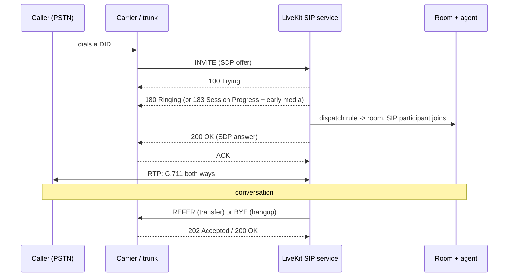

# Telephony and SIP

**What you'll be able to do after this:** read a SIP call flow and an SDP offer/answer without a
telecoms background; configure LiveKit trunks and dispatch rules deliberately; choose a DTMF
transport and know why the wrong one destroys your transcripts; implement blind and attended
transfer; and recognise the PSTN failure modes that produce a call which "connects" and has no
audio.

---

## 1. Intuition

The phone network is not the internet with a different address format. It is a separate system
with its own assumptions, and four of them shape everything a voice agent does on it.

**Signalling and media are different protocols.** SIP sets up, modifies and tears down calls; it
carries no audio. Audio is RTP, negotiated inside SIP bodies via SDP, flowing directly between
whatever endpoints the SDP named. A call can be perfectly signalled and completely silent, and
that is the single most common telephony bug.

**Everything is 8 kHz.** G.711 µ-law at 64 kbit/s, band-limited to roughly 300–3400 Hz. Your
models were trained on 16 kHz wideband speech; on a phone call they see half the spectrum, and
the half they lose is where fricatives live
([`../01-foundations/01-sound-and-sampling.md`](../01-foundations/01-sound-and-sampling.md)).

**The digits are not in the audio — usually.** DTMF has three possible transports and the choice
is not yours; the carrier decides. One of the three puts loud dual tones straight into the audio
your recogniser is listening to.

**The failure modes are a hundred years old and extremely well documented, just not to you.**
One-way audio, early media, codec mismatch, silence suppression, RTP timeout: each has a
standard cause, a standard diagnostic and a standard fix, and none of them appear in a WebRTC
tutorial.

---

## 2. Rigour

### 2.1 The call flow



Three details in that diagram cost people days.

**`183 Session Progress` with early media** means audio flows *before* the call is answered. It
is how carriers deliver ringback and network announcements ("this number is not in service"). An
agent that starts speaking on 183 is talking to a phone that has not been picked up; an agent
that ignores early media misses the announcement telling it the call already failed.

**The ACK is a separate transaction.** A 200 OK that is never ACKed is retransmitted and then
the call is torn down, which surfaces as calls that connect for exactly a few seconds and drop.

**`BYE` can arrive from either side at any time**, including in the middle of a transfer, and
your session cleanup must be idempotent
([`../05-llm-layer/03-tools-and-agentic.md`](../05-llm-layer/03-tools-and-agentic.md) §2.6).

### 2.2 SDP offer/answer

SDP (RFC 8866) inside SIP, negotiated by the offer/answer model (RFC 3264). The offer in §3 is
typical of a carrier:

```
m=audio 40376 RTP/AVP 0 8 101
a=rtpmap:0 PCMU/8000
a=rtpmap:8 PCMA/8000
a=rtpmap:101 telephone-event/8000
a=fmtp:101 0-16
a=ptime:20
```

The `m=` line lists payload types **in preference order**: 0 is PCMU (µ-law, North America), 8 is
PCMA (A-law, most of the rest of the world), 101 is the dynamic type carrying DTMF events.
`a=fmtp:101 0-16` says which events are supported — 0–15 are the keypad, 16 is "flash".
`a=ptime:20` requests 20 ms packets, which is the same framing as everything else in this
curriculum ([`../00-setup/03-canonical-formats.md`](../00-setup/03-canonical-formats.md)).

The answer must select **one** codec, echo the payload type numbers the offerer used, and supply
its own address and port. Two rules people break: you may not renumber the offerer's dynamic
payload types in your answer, and if you drop `telephone-event` from the answer you have just
told the carrier to send DTMF as in-band tones (§2.5). A mismatch here produces `488 Not
Acceptable Here`, which at least fails loudly; silently dropping 101 fails quietly.

### 2.3 Trunks, dispatch rules and outbound calls

LiveKit models telephony with three objects, verified in `livekit/protocol`,
`protobufs/livekit_sip.proto` (retrieved 2026-08-22).

**Trunks.** `SIPInboundTrunkInfo` and `SIPOutboundTrunkInfo` describe the relationship with a
carrier: numbers, allowed source addresses, authentication, `media_encryption`,
`krisp_enabled` for carrier-grade noise suppression, `ringing_timeout` and `max_call_duration`.
`SIPMediaConfig` carries `only_listed_codecs`, an explicit `codecs` list of `SIPCodec{name, rate}`,
and a `media_timeout` — the last being the RTP-silence watchdog that ends a call whose audio has
stopped even though signalling looks healthy.

**Dispatch rules** decide which room an inbound call lands in:

| Rule | Behaviour | Use for |
|---|---|---|
| `SIPDispatchRuleDirect{room_name, pin}` | everyone into one existing room | a conference bridge, a hotline |
| `SIPDispatchRuleIndividual{room_prefix, pin, no_randomness}` | a new room per caller | **the normal voice-agent case** |
| `SIPDispatchRuleCallee{room_prefix, pin, randomize}` | a new room per callee | outbound campaigns |

`pin` is a gate before room entry and is collected by DTMF, which is why §2.5 is not optional.

**Outbound.** `CreateSIPParticipantRequest` carries `sip_call_to`, `sip_number` (the From),
`room_name`, `participant_identity`/`name`/`metadata`/`attributes`, and a set of behavioural
flags that matter: `dtmf` (digits to send after answer, with `w` for a 0.5 s pause — how you
navigate someone else's IVR), `play_dialtone`, `wait_until_answered`, `hide_phone_number`,
`ringing_timeout`, `max_call_duration`, and `krisp_enabled`. `SIPOutboundConfig` adds
`destination_country` for routing, `headers_to_attributes` and `attributes_to_headers` for
mapping custom `X-*` SIP headers onto participant attributes in both directions — the supported
way to pass CRM context through the carrier.

**Diagnostics.** `SIPCallInfo` is unusually complete: `sip_call_id`, `from_uri`/`to_uri`,
`audio_codec`, `media_encryption`, `call_status`, `sip_status`, `disconnect_reason`, timestamps
in nanoseconds — and **`pcap_file_link`**. When a call has no audio, a packet capture is the only
thing that settles the argument with the carrier, and it is a field on the call record.

### 2.4 The 8 kHz tax

G.711 samples at 8 kHz and quantises logarithmically to 8 bits, giving 64 kbit/s and a passband
of about 300–3400 Hz. Two distinct losses follow.

**Bandwidth loss.** Everything above 4 kHz is gone, and by Nyquist that is the ceiling
([`../01-foundations/01-sound-and-sampling.md`](../01-foundations/01-sound-and-sampling.md)).
The energy that distinguishes /s/ from /f/ and /θ/ sits largely above 4 kHz, so the confusions
are systematic rather than random: sibilants, plosive bursts, and the ends of words. Spelled
letters and alphanumeric identifiers suffer most, which is exactly the content phone agents
collect.

**Quantisation.** µ-law's companding gives roughly 12–13 bits of effective dynamic range near
zero at the cost of coarser steps at high amplitude — good for speech, still lossy.

`[INFERENCE]` The practical consequence is that a model's published WER, measured on 16 kHz
corpora, does not apply to your phone traffic, and the gap is large enough to change product
decisions. Do not take a number from a chapter — including this one — for it. Measure your own
WER on 8 kHz audio of your own domain
([`../02-asr/07-evaluation.md`](../02-asr/07-evaluation.md)), and prefer models with a telephony
variant. Upsampling 8 kHz to 16 kHz before the model restores the sample rate and none of the
information; it is necessary for the interface, not helpful for accuracy.

### 2.5 DTMF: three transports, one right answer

| Transport | How | Reaches your recogniser? | Reliability |
|---|---|---|---|
| **In-band tones** | dual sine tones mixed into the audio | **yes — as loud noise** | degraded by codecs, AGC, packet loss |
| **RFC 4733 telephone-event** | RTP events on a separate payload type | no | good; the standard |
| **SIP INFO** | a signalling request per digit | no | works, but out of the media path and easily reordered |

RFC 4733's payload is four bytes: `event` (8 bits), `E` end bit, `R` reserved, `volume`
(6 bits, dBm0 with the sign dropped), and `duration` (16 bits, in RTP timestamp units). The
semantics that matter for a decoder: **the duration accumulates** across update packets while the
key is held, and **the final packet is sent three times** with `E=1` for redundancy, so a naive
decoder emits each digit three times. Deduplicate on `(rtp_timestamp, event)` — the timestamp of
every packet for one keypress is the timestamp of the *start* of the event, which makes it a
natural key. In §3 that turns 24 packets into exactly `[('4', 100), ('1', 100), ('5', 100)]`
`[MEASURED]`.

In-band is the case you cannot always avoid, because the carrier may simply send tones. Two
consequences. You must detect them yourself — Goertzel over the eight DTMF frequencies is the
standard method, measured in §3 at purity 0.930–0.993 for real digits. And you must **gate on
purity**, because a voice-like signal in §3 produced a confident false digit at purity 0.421;
without the gate, callers "press keys" by talking. Beyond detection, the tones are still in the
audio going to your recogniser, where they transcribe as garbage and can trigger the VAD, so an
in-band deployment needs the tone notched or the transcript suppressed while a tone is present.

### 2.6 Transfer

Blind transfer is `REFER` (RFC 3515): you send `REFER` with a `Refer-To` header naming the new
destination, the far end returns `202 Accepted`, and the transferee places a new call. You are
then out of the path — you learn nothing about whether the transfer succeeded except through
`NOTIFY`.

LiveKit exposes it as `TransferSIPParticipantRequest{participant_identity, room_name,
transfer_to, play_dialtone, headers, ringing_timeout}`, with a response carrying `transfer_id`,
`status`, `reason` and the underlying `sip_status`. Two fields are there because of real
failures: `play_dialtone` gives the caller an audible cue that something is happening during the
silent gap, and `ringing_timeout` bounds the wait when the destination never answers.

Three things go wrong routinely. **Not every carrier supports REFER**, and LiveKit models this
explicitly — `ProviderInfo` has a `prevent_transfer` flag. When REFER is unavailable the fallback
is to bridge: place a second outbound call and join both legs, which doubles your minutes and
keeps you in the media path forever. **Attended transfer** — where you talk to the destination
before handing over — is a multi-leg dance that most agent deployments should not attempt;
bridging is simpler and more reliable. And **the caller must be told**, both because it is
courteous and because dropping someone into silence during a REFER is indistinguishable from a
dropped call.

Whatever the mechanism, hand over the context packet from
[`../05-llm-layer/03-tools-and-agentic.md`](../05-llm-layer/03-tools-and-agentic.md) §2.9 out of
band, via your CRM or `attributes_to_headers`. A human who has to ask the caller to repeat
everything is the experience people remember.

### 2.7 Answering machine detection

On outbound calls, roughly half the answers are voicemail, and an agent that delivers its opening
line to a greeting has wasted the call. AMD combines weak signals: early-media analysis, greeting
length (a human says "hello?" in under a second, a machine talks for several), the beep, and
whether the far end pauses for you. None is reliable alone.

The costs are asymmetric and you must choose which error to make. Treating a human as a machine
means the caller hears a recorded voicemail message and hangs up — bad, and invisible in your
metrics unless you look. Treating a machine as a human means the agent has a conversation with a
greeting and leaves nothing. `[INFERENCE]` For most use cases the second error is cheaper, so
bias towards "human" and detect the beep as a fallback for leaving a message.

Outbound telephony also carries a legal overlay that engineering decisions cannot ignore:
consent and calling-time rules, mandatory disclosure that the caller is speaking to an AI in a
growing number of jurisdictions, and recording consent
([`../08-eval-safety/03-safety-and-privacy.md`](../08-eval-safety/03-safety-and-privacy.md)).

### 2.8 The failure modes nobody warns you about

| Symptom | Usual cause | Diagnostic |
|---|---|---|
| Call connects, **no audio either way** | RTP going to an unreachable address; NAT or SBC rewriting | `pcap_file_link`; check the `c=` line and whether RTP arrives at all |
| **One-way audio** | asymmetric NAT/firewall, or a media path only one side can reach | packet capture on both legs; compare RTP source addresses |
| Audio only after the caller speaks | far end waiting for RTP before sending (symmetric RTP) | send comfort noise or a packet immediately |
| Call drops after ~30 s | 200 OK never ACKed, or session timer expiry | look for retransmitted 200 OKs |
| Call drops mid-conversation, silently | `media_timeout` fired because RTP stopped | correlate `disconnect_reason` with the last RTP timestamp |
| VAD never fires / never stops | carrier silence suppression and comfort noise, or the whole channel is CN | check for a codec change to CN payload type 13 |
| DTMF digits duplicated | RFC 4733 end packets not deduplicated | count packets with `E=1` per timestamp (§2.5) |
| Random "digits" pressed | in-band detection without a purity gate | measured false positive at purity 0.421 in §3 |
| `488 Not Acceptable Here` | no codec in common, or a mangled answer | compare offer and answer `m=` lines |
| Transfer silently fails | carrier does not support REFER | `ProviderInfo.prevent_transfer`; fall back to bridging |
| Great audio in testing, poor WER in production | carrier transcoded through a low-bitrate codec | `SIPCallInfo.audio_codec` on real calls, not on your test calls |

The through-line: **signalling success tells you nothing about media.** Every one of the first
five rows is a call that SIP considers established. Build the RTP-level checks — packets
received, packets sent, first-audio timestamp — into your call records from day one, because you
cannot reconstruct them afterwards.

---

## 3. From scratch

The telephony edge, implemented: SIP offer/answer, RFC 4733 DTMF, and in-band detection.
Standalone, stdlib only, deterministic.

```python
"""The telephony edge: a SIP offer/answer, RFC 4733 DTMF, and why in-band is worse.

Part A parses an INVITE with an SDP offer and builds the 200 OK answer, choosing a
codec the way a gateway does.

Part B encodes and decodes RFC 4733 "telephone-event" DTMF -- digits carried as RTP
events, out of band from the audio.

Part C generates the same digits as in-band tones and detects them with Goertzel,
which is what you are forced to do when the carrier sends DTMF as audio -- and that
audio also reaches your recogniser.
"""

import math
import struct

SR = 8000                    # telephony sample rate
FRAME_MS = 20
FRAME_SAMPLES = SR * FRAME_MS // 1000        # 160

# ------------------------------------------------------------------ Part A
INVITE = """INVITE sip:+15551234567@sip.example.com SIP/2.0\r
Via: SIP/2.0/UDP 203.0.113.9:5060;branch=z9hG4bK7d8f2a;rport\r
Max-Forwards: 70\r
From: "Jane Doe" <sip:+14155550001@carrier.example>;tag=8a1f2c\r
To: <sip:+15551234567@sip.example.com>\r
Call-ID: 3f9c2a71-4b6e-4c0a-9a1d-2f7c5e8b1234@carrier.example\r
CSeq: 1 INVITE\r
Contact: <sip:+14155550001@203.0.113.9:5060>\r
Content-Type: application/sdp\r
Content-Length: 271\r
\r
v=0\r
o=carrier 2890844526 2890844526 IN IP4 203.0.113.9\r
s=-\r
c=IN IP4 203.0.113.9\r
t=0 0\r
m=audio 40376 RTP/AVP 0 8 101\r
a=rtpmap:0 PCMU/8000\r
a=rtpmap:8 PCMA/8000\r
a=rtpmap:101 telephone-event/8000\r
a=fmtp:101 0-16\r
a=ptime:20\r
a=sendrecv\r
"""

OUR_CODECS = ["PCMU/8000", "PCMA/8000"]      # what our gateway will accept


def parse_sip(msg):
    head, _, body = msg.partition("\r\n\r\n")
    lines = head.split("\r\n")
    start = lines[0]
    headers = {}
    for line in lines[1:]:
        k, _, v = line.partition(":")
        headers.setdefault(k.strip().lower(), []).append(v.strip())
    return start, headers, body


def parse_sdp(body):
    sdp = {"media": [], "rtpmap": {}, "fmtp": {}, "attrs": []}
    for line in body.strip().split("\r\n"):
        if not line:
            continue
        typ, _, val = line.partition("=")
        if typ == "c":
            sdp["conn"] = val
        elif typ == "m":
            parts = val.split()
            sdp["media"].append({"kind": parts[0], "port": int(parts[1]),
                                 "proto": parts[2], "pts": [int(p) for p in parts[3:]]})
        elif typ == "a":
            if val.startswith("rtpmap:"):
                pt, name = val[len("rtpmap:"):].split(None, 1)
                sdp["rtpmap"][int(pt)] = name
            elif val.startswith("fmtp:"):
                pt, params = val[len("fmtp:"):].split(None, 1)
                sdp["fmtp"][int(pt)] = params
            else:
                sdp["attrs"].append(val)
    return sdp


def negotiate(sdp):
    """Pick the first offered codec we support, and keep telephone-event if offered."""
    audio = next(m for m in sdp["media"] if m["kind"] == "audio")
    chosen = next((pt for pt in audio["pts"]
                   if sdp["rtpmap"].get(pt, "").upper() in
                   [c.upper() for c in OUR_CODECS]), None)
    tel_ev = next((pt for pt in audio["pts"]
                   if sdp["rtpmap"].get(pt, "").lower().startswith("telephone-event")),
                  None)
    return chosen, tel_ev


def build_answer(start, headers, sdp, chosen, tel_ev, *, our_ip="198.51.100.4",
                 our_port=30122):
    pts = [str(chosen)] + ([str(tel_ev)] if tel_ev is not None else [])
    body_lines = [
        "v=0",
        f"o=livekit 0 0 IN IP4 {our_ip}",
        "s=-",
        f"c=IN IP4 {our_ip}",
        "t=0 0",
        f"m=audio {our_port} RTP/AVP {' '.join(pts)}",
        f"a=rtpmap:{chosen} {sdp['rtpmap'][chosen]}",
    ]
    if tel_ev is not None:
        body_lines += [f"a=rtpmap:{tel_ev} {sdp['rtpmap'][tel_ev]}",
                       f"a=fmtp:{tel_ev} {sdp['fmtp'].get(tel_ev, '0-16')}"]
    body_lines += ["a=ptime:20", "a=sendrecv", ""]
    body = "\r\n".join(body_lines)
    head = [
        "SIP/2.0 200 OK",
        f"Via: {headers['via'][0]}",
        f"From: {headers['from'][0]}",
        f"To: {headers['to'][0]};tag=lk9f31",       # our tag completes the dialog
        f"Call-ID: {headers['call-id'][0]}",
        f"CSeq: {headers['cseq'][0]}",
        f"Contact: <sip:lk@{our_ip}:5060>",
        "Content-Type: application/sdp",
        f"Content-Length: {len(body)}",
        "", "",
    ]
    return "\r\n".join(head) + body


# ------------------------------------------------------------------ Part B
DTMF_EVENTS = {c: i for i, c in enumerate("0123456789*#ABCD")}
EVENT_DIGITS = {v: k for k, v in DTMF_EVENTS.items()}


def rfc4733_pack(event, end, volume, duration):
    """4 bytes: event | E R volume | duration (RFC 4733 Figure 1)."""
    return struct.pack("!BBH", event, (0x80 if end else 0) | (volume & 0x3F), duration)


def rfc4733_unpack(payload):
    event, b1, duration = struct.unpack("!BBH", payload[:4])
    return {"event": event, "end": bool(b1 & 0x80), "volume": b1 & 0x3F,
            "duration": duration}


def dtmf_stream(digits, *, press_ms=100, ts0=0):
    """Emit (rtp_timestamp, payload) for each digit: updates, then 3 end packets."""
    out, ts = [], ts0
    for d in digits:
        ev = DTMF_EVENTS[d]
        n = press_ms // FRAME_MS
        for i in range(1, n + 1):
            out.append((ts, rfc4733_pack(ev, False, 10, i * FRAME_SAMPLES)))
        for _ in range(3):                     # end packets are sent three times
            out.append((ts, rfc4733_pack(ev, True, 10, n * FRAME_SAMPLES)))
        ts += n * FRAME_SAMPLES + FRAME_SAMPLES * 2      # inter-digit gap
    return out


def dtmf_decode(packets):
    """Digits with press durations. Dedup on (timestamp, event): ends repeat."""
    seen, digits = set(), []
    for ts, payload in packets:
        p = rfc4733_unpack(payload)
        if not p["end"]:
            continue
        key = (ts, p["event"])
        if key in seen:
            continue
        seen.add(key)
        digits.append((EVENT_DIGITS[p["event"]], p["duration"] * 1000 // SR))
    return digits


# ------------------------------------------------------------------ Part C
ROWS = [697, 770, 852, 941]
COLS = [1209, 1336, 1477, 1633]
KEYPAD = ["123A", "456B", "789C", "*0#D"]


def tone(digit, ms):
    r = next(i for i, row in enumerate(KEYPAD) if digit in row)
    c = KEYPAD[r].index(digit)
    n = SR * ms // 1000
    return [int(8000 * (math.sin(2 * math.pi * ROWS[r] * i / SR)
                        + math.sin(2 * math.pi * COLS[c] * i / SR)) / 2)
            for i in range(n)]


def goertzel(samples, freq):
    """Power at one frequency. The classic single-bin DFT used by every DTMF decoder."""
    n = len(samples)
    k = int(0.5 + n * freq / SR)
    w = 2 * math.pi * k / n
    coeff = 2 * math.cos(w)
    s1 = s2 = 0.0
    for x in samples:
        s0 = x + coeff * s1 - s2
        s2, s1 = s1, s0
    return s1 * s1 + s2 * s2 - coeff * s1 * s2


def detect_inband(samples):
    """Detect a digit from one block of audio, plus the twist ratio used to reject speech."""
    rp = [goertzel(samples, f) for f in ROWS]
    cp = [goertzel(samples, f) for f in COLS]
    r, c = rp.index(max(rp)), cp.index(max(cp))
    total = sum(rp) + sum(cp)
    purity = (rp[r] + cp[c]) / total if total else 0.0
    return KEYPAD[r][c], purity


if __name__ == "__main__":
    print("PART A -- SIP offer/answer\n")
    start, headers, body = parse_sip(INVITE)
    sdp = parse_sdp(body)
    print(f"  request      {start}")
    print(f"  from         {headers['from'][0]}")
    print(f"  call-id      {headers['call-id'][0]}")
    audio = sdp["media"][0]
    print(f"  offered      pts {audio['pts']} -> "
          f"{[sdp['rtpmap'][p] for p in audio['pts']]}")
    chosen, tel_ev = negotiate(sdp)
    print(f"  chosen       pt {chosen} ({sdp['rtpmap'][chosen]}), "
          f"telephone-event pt {tel_ev} fmtp '{sdp['fmtp'][tel_ev]}'")
    answer = build_answer(start, headers, sdp, chosen, tel_ev)
    print("  --- 200 OK ---")
    for line in answer.split("\r\n"):
        print(f"  {line}")

    print("\nPART B -- RFC 4733 DTMF (out of band)\n")
    pkts = dtmf_stream("415")
    print(f"  {len(pkts)} RTP packets for 3 digits at 100 ms each")
    for ts, payload in pkts[:3] + pkts[4:5] + pkts[6:8]:
        p = rfc4733_unpack(payload)
        print(f"    ts={ts:6d} bytes={payload.hex()}  event={p['event']} "
              f"({EVENT_DIGITS[p['event']]}) end={int(p['end'])} "
              f"vol={p['volume']} dur={p['duration']}")
    print(f"  decoded: {dtmf_decode(pkts)}")

    print("\nPART C -- the same digits in band, detected with Goertzel\n")
    print(f"  {'digit':>6} {'detected':>9} {'purity':>8}   block = {FRAME_SAMPLES} samples")
    for d in "415":
        samples = tone(d, FRAME_MS)
        got, purity = detect_inband(samples)
        print(f"  {d:>6} {got:>9} {purity:>8.3f}")
    speech_like = [int(6000 * math.sin(2 * math.pi * 300 * i / SR)
                       * math.sin(2 * math.pi * 17 * i / SR)) for i in range(FRAME_SAMPLES)]
    got, purity = detect_inband(speech_like)
    print(f"  {'voice':>6} {got:>9} {purity:>8.3f}   <- a false digit if you do not "
          f"gate on purity")
```

Output `[MEASURED]`:

```
PART A -- SIP offer/answer

  request      INVITE sip:+15551234567@sip.example.com SIP/2.0
  from         "Jane Doe" <sip:+14155550001@carrier.example>;tag=8a1f2c
  call-id      3f9c2a71-4b6e-4c0a-9a1d-2f7c5e8b1234@carrier.example
  offered      pts [0, 8, 101] -> ['PCMU/8000', 'PCMA/8000', 'telephone-event/8000']
  chosen       pt 0 (PCMU/8000), telephone-event pt 101 fmtp '0-16'
  --- 200 OK ---
  SIP/2.0 200 OK
  Via: SIP/2.0/UDP 203.0.113.9:5060;branch=z9hG4bK7d8f2a;rport
  From: "Jane Doe" <sip:+14155550001@carrier.example>;tag=8a1f2c
  To: <sip:+15551234567@sip.example.com>;tag=lk9f31
  Call-ID: 3f9c2a71-4b6e-4c0a-9a1d-2f7c5e8b1234@carrier.example
  CSeq: 1 INVITE
  Contact: <sip:lk@198.51.100.4:5060>
  Content-Type: application/sdp
  Content-Length: 202
  
  v=0
  o=livekit 0 0 IN IP4 198.51.100.4
  s=-
  c=IN IP4 198.51.100.4
  t=0 0
  m=audio 30122 RTP/AVP 0 101
  a=rtpmap:0 PCMU/8000
  a=rtpmap:101 telephone-event/8000
  a=fmtp:101 0-16
  a=ptime:20
  a=sendrecv
  

PART B -- RFC 4733 DTMF (out of band)

  24 RTP packets for 3 digits at 100 ms each
    ts=     0 bytes=040a00a0  event=4 (4) end=0 vol=10 dur=160
    ts=     0 bytes=040a0140  event=4 (4) end=0 vol=10 dur=320
    ts=     0 bytes=040a01e0  event=4 (4) end=0 vol=10 dur=480
    ts=     0 bytes=040a0320  event=4 (4) end=0 vol=10 dur=800
    ts=     0 bytes=048a0320  event=4 (4) end=1 vol=10 dur=800
    ts=     0 bytes=048a0320  event=4 (4) end=1 vol=10 dur=800
  decoded: [('4', 100), ('1', 100), ('5', 100)]

PART C -- the same digits in band, detected with Goertzel

   digit  detected   purity   block = 160 samples
       4         4    0.936
       1         1    0.993
       5         5    0.930
   voice         1    0.421   <- a false digit if you do not gate on purity
```

Three load-bearing details. **The answer echoes the offerer's dynamic payload type**, 101, rather
than choosing its own; renumbering is legal in a fresh offer and wrong in an answer, and it
produces DTMF that silently stops working. **The decoder deduplicates on
`(rtp_timestamp, event)`**, which works because every packet for one keypress carries the
timestamp of the event's *start* — 24 packets become 3 digits, and a decoder that keys on
sequence number instead reports each digit three times. And **the purity gate is the whole
difference between a DTMF detector and a random digit generator**: the voice-like block was
confidently classified as "1" at 0.421, so a detector without a threshold — typically 0.8 or
higher, plus a minimum duration — will have callers pressing keys with their voice.

---

## 4. How production does it

**LiveKit's SIP service is a separate process that bridges RTP to a room.** From the agent's
point of view a phone caller is a participant of kind `SIP`
([`01-architecture.md`](01-architecture.md) §2.1), which is what lets one agent serve both web
and phone. From `JobContext` you get `ctx.add_sip_participant(...)` to dial out mid-call and
`ctx.transfer_sip_participant(...)` for REFER, both verified in `livekit-agents` 1.7.0 `job.py`.

**The `sip` grant is separate from the room grants.** `SIPGrant{admin, call}` gates outbound
dialling, and a token with `sip.call` and no `video.roomJoin` is exactly what an outbound service
should hold ([`01-architecture.md`](01-architecture.md) §3).

**Carriers are interchangeable and not identical.** Twilio, Telnyx and the rest all terminate SIP
trunks, and the differences that bite are DTMF transport, REFER support, codec offers, and
whether they transcode. `SIPCallInfo.audio_codec` and `ProviderInfo.prevent_transfer` exist
because those differences are worth recording per call.

**Turn on the packet capture before you need it.** `SIPCallInfo.pcap_file_link` and
`SIPMediaConfig.media_timeout` are the two fields that turn "the carrier says it is our problem"
into a resolvable ticket.

**Noise suppression on the carrier leg is a real setting.** `krisp_enabled` on inbound and
outbound trunks addresses the fact that phone callers are in cars and cafés, and that 8 kHz noisy
audio is the worst input your ASR will ever see
([`../02-asr/07-evaluation.md`](../02-asr/07-evaluation.md)).

---

## 5. At scale

**Trunk capacity is a concurrency limit, not a rate limit.** Carriers sell simultaneous channels,
so you size with Erlang-B against your busy-hour offered load rather than with monthly minutes;
the full derivation is in
[`../06-realtime-systems/05-scale-and-orchestration.md`](../06-realtime-systems/05-scale-and-orchestration.md).
The failure mode when you undersize is `503 Service Unavailable` on new calls, which is a
customer-visible outage that never touches your servers.

**Per-minute costs are the dominant line item once volume is real.** LiveKit's published rates
(retrieved 2026-08-22) are $0.01/min for US local inbound, $0.02/min toll-free inbound,
$0.003–$0.004/min for third-party SIP, and $1/month per number. At a million call-minutes a month
that is thousands of dollars of pure telephony, comparable to the entire self-hosting decision in
[`04-self-hosting-and-scale.md`](04-self-hosting-and-scale.md) §3 — so bring-your-own-carrier is
usually worth the integration work at that volume.

**DID inventory is an operational asset.** Numbers have provisioning lead times, geographic
rules, and reputation: a number that gets marked as spam stops connecting, and you cannot fix it
by redeploying. Keep spares, rotate outbound numbers, and register for STIR/SHAKEN attestation
where it applies.

**Failover between carriers must be tested, not assumed.** Two trunks with different providers is
the standard arrangement, but the failure it protects against — a carrier degrading rather than
disappearing — needs health checks on *call success rate* rather than on SIP OPTIONS pings
([`../06-realtime-systems/07-reliability.md`](../06-realtime-systems/07-reliability.md)).

**8 kHz audio is at least cheap.** G.711 at 64 kbit/s plus RTP/UDP/IP overhead is 80 kbit/s on
the wire ([`../06-realtime-systems/01-transports.md`](../06-realtime-systems/01-transports.md)
§2.4), and telephony legs terminate at the carrier rather than crossing your egress, so bandwidth
is rarely the constraint. Concurrency and per-minute rates are.

**Record the call-quality fields on every call.** Codec actually used, RTP packets in and out,
first-audio latency, disconnect reason, SIP status. Aggregated, they are how you notice that one
carrier started transcoding, which shows up as a WER regression with no software change.

---

## 6. Exercises

**E7.5.1** Run the §3 listing. Modify the offer to advertise only PCMA and confirm the answer
changes; then remove payload type 101 and state what the carrier will now do with DTMF.

**E7.5.2** Break the decoder deliberately: dedupe on packet index rather than
`(timestamp, event)` and report how many digits a 3-digit sequence produces.

**E7.5.3** Sweep the purity threshold in Part C from 0.3 to 0.95 against both real tones and the
voice-like block. Report the threshold you would ship and the detection latency it implies.

**E7.5.4** Measure your own 8 kHz WER tax: take 50 utterances of your domain, evaluate at 16 kHz,
downsample to 8 kHz through µ-law and re-evaluate. Report overall WER and entity WER separately
([`../02-asr/07-evaluation.md`](../02-asr/07-evaluation.md)).

**E7.5.5** Configure all three dispatch rule types against a test trunk. For each, describe what
happens when two callers dial the same number simultaneously.

**E7.5.6** Implement transfer with `play_dialtone` and a `ringing_timeout`, then test the failure
path where the destination never answers. Describe exactly what the caller hears.

**E7.5.7** Capture a real call with `pcap_file_link` and identify, from the packets alone, the
codec, the ptime, whether DTMF was in band, and the time between INVITE and first RTP.

**E7.5.8** Build the call-quality record from §5 for your deployment and run 100 calls through
two different carriers. Report any difference in codec, DTMF transport or first-audio latency.

---

## 7. Interview drill

> "Callers say our phone agent sometimes just doesn't respond — they talk and nothing happens.
> Our logs show the calls connected fine and the agent joined the room. Where do you look?"

The logs are telling you about signalling, and the complaint is about media, so start by refusing
to treat "connected" as evidence. A SIP call is established when the 200 OK is ACKed; that says
nothing about whether RTP is flowing, and one-way audio is the single most common telephony
failure. The first question is whether RTP packets arrived from the caller at all on the affected
calls: packet counts per direction, first-audio timestamp, and if the platform provides one, the
packet capture — LiveKit puts a `pcap_file_link` on the call record precisely for this argument.
If inbound RTP is zero or stops, the cause is in the network path, typically NAT or an SBC
rewriting addresses so the media goes somewhere unreachable, and no amount of agent debugging
will find it.

If the audio is arriving, the next candidates are all VAD-adjacent and specific to telephony.
Carrier silence suppression sends comfort noise instead of audio during pauses, which changes
what your VAD sees; some carriers transcode, so the codec on the wire is not the one you
negotiated and the audio is worse than in testing; and if DTMF is being sent in band, the tones
themselves land in the recogniser and can hold the VAD open. Each of those is checkable from the
call record — codec actually used, disconnect reason, RTP continuity — which is why those fields
belong in every call record from day one.

Then the endpointing hypothesis, which is where I would expect the answer to end up if the media
is clean. Phone audio is 8 kHz and noisy, so VAD and ASR both behave differently than in the
office test; if the endpointing thresholds were tuned on wideband microphone audio, the agent may
be waiting for a silence that the carrier's comfort noise never delivers. That is a measurable
thing: `endpoint_f1` on phone traffic versus web traffic
([`../03-turn-taking/02-endpointing.md`](../03-turn-taking/02-endpointing.md)).

What distinguishes a senior answer is separating the two populations before theorising. "Sometimes"
almost always means a subset — one carrier, one region, one number, mobile versus landline — and
the fastest path is to group failures by trunk, codec and caller network and look for the
concentration. It is also worth challenging the premise that the agent is silent at all: if the
agent is speaking but the audio is not reaching the caller, the caller experiences exactly the
same thing and reports it the same way, and the fix is in the opposite direction.

---

## Sources

- Rosenberg et al., "SIP: Session Initiation Protocol", RFC 3261 — the request/response model and dialog rules in §2.1.
- Rosenberg & Schulzrinne, "An Offer/Answer Model with SDP", RFC 3264, and "SDP: Session Description Protocol", RFC 8866 — the negotiation implemented in §3 Part A.
- Sparks, "The Session Initiation Protocol (SIP) Refer Method", RFC 3515 — transfer semantics in §2.6.
- Schulzrinne & Taylor, "RTP Payload for DTMF Digits, Telephony Tones, and Telephony Signals", RFC 4733, December 2006 — the four-byte payload format (Figure 1: `event`, `E`, `R`, `volume`, `duration`), the E-bit semantics ("only the final packet for the final segment will have the E bit set"), and the volume field in dBm0, all implemented in §3 Part B.
- Schulzrinne et al., "RTP: A Transport Protocol for Real-Time Applications", RFC 3550 — the RTP timestamp semantics used by the DTMF decoder.
- `livekit/protocol`, `protobufs/livekit_sip.proto` (main, retrieved 2026-08-22) — `SIPInboundTrunkInfo`, `SIPOutboundTrunkInfo`, `SIPMediaConfig{only_listed_codecs, codecs, encryption, media_timeout}`, `SIPCodec{name, rate}`, `SIPDispatchRuleDirect` / `Individual` / `Callee`, `CreateSIPParticipantRequest` (`sip_call_to`, `sip_number`, `dtmf` with the `w` pause, `play_dialtone`, `wait_until_answered`, `hide_phone_number`, `ringing_timeout`, `max_call_duration`, `krisp_enabled`, `to_user_override`), `SIPOutboundConfig{destination_country, headers_to_attributes, attributes_to_headers, from_host}`, `TransferSIPParticipantRequest/Response`, `SIPCallInfo` including `audio_codec`, `disconnect_reason` and `pcap_file_link`, and `ProviderInfo.prevent_transfer`.
- `livekit-agents` 1.7.0, `livekit/agents/job.py` — `JobContext.add_sip_participant` and `transfer_sip_participant`.
- LiveKit Cloud pricing, `https://livekit.com/pricing`, retrieved 2026-08-22 — US local inbound $0.01/min, toll-free $0.02/min, third-party SIP $0.003–$0.004/min, numbers $1–$2/month.
- `[MEASURED]`: the §3 output is the listing's own run on Apple M5 / macOS 26.5.2, CPython 3.12, stdlib only. Part A is a parse and re-serialisation of a synthetic but realistic INVITE, Part B is an exact implementation of the RFC 4733 payload, and Part C is Goertzel detection over synthesised tones — the purity figures are properties of those synthetic signals, so measure your own thresholds on carrier audio before shipping them. The 8 kHz WER claim in §2.4 is explicitly `[INFERENCE]` and is left as exercise E7.5.4.
