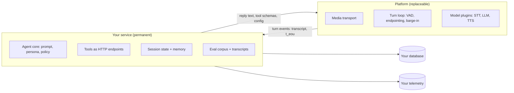
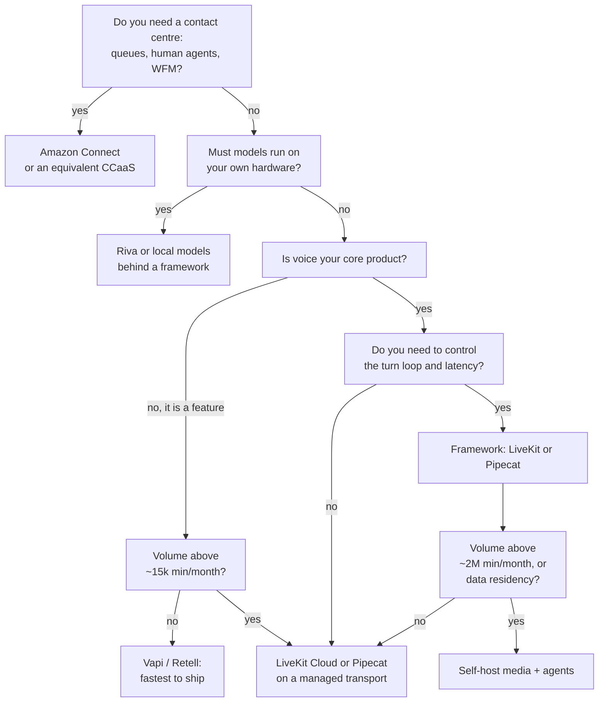

# Alternatives, and How to Stay Portable

**What you'll be able to do after this:** place every voice-agent platform on the same four
axes instead of comparing marketing pages; compute the volume at which each one becomes the
cheapest for your traffic; name precisely what binds you to a vendor and what does not; and
structure a codebase so that changing platform is a week of work rather than a rewrite.

---

## 1. Intuition

Every voice-agent platform is an answer to the same three questions, and almost all of the
apparent variety is which of them the vendor answers for you.

**Who owns the media plane?** Getting audio from a browser or a phone to a server, with echo
cancellation, jitter buffering and a transport that survives packet loss
([`../06-realtime-systems/01-transports.md`](../06-realtime-systems/01-transports.md)).

**Who owns the turn loop?** VAD, endpointing, barge-in, the interruption policy, the
token-to-clause aggregator — the machinery of [`../03-turn-taking/`](../03-turn-taking/) and
[`../04-tts/03-streaming-tts.md`](../04-tts/03-streaming-tts.md).

**Who owns the models?** STT, LLM and TTS: whether you pick them, whether you can swap them, and
whether you pay a markup.

A fourth question is yours no matter what: **who owns the business logic** — the tools, the
state machine, the data. That is the only layer that is genuinely yours, and the entire
portability strategy in §2.6 is about keeping it that way.

The cost consequence is measured in §3 and worth stating up front: the model layer is identical
across platforms at about **$0.0157 per call-minute**, of which the **LLM is 0.6%**. Voice is an
STT/TTS workload with an LLM attached, and platform fees range from $0 to $0.055 per minute —
three and a half times the entire model bill.

---

## 2. Rigour

### 2.1 The layer cake

| Layer | LiveKit | Pipecat | Vapi / Retell | Amazon Connect | Azure Voice Live | Riva | Direct S2S |
|---|---|---|---|---|---|---|---|
| Media plane | own SFU or Cloud | pluggable (Daily, WS, Twilio) | vendor | AWS | Azure | none | vendor WS/WebRTC |
| Turn loop | `AgentSession` | frame pipeline | vendor, configurable | Lex/Connect flows | vendor | none | model-internal |
| Models | any, via plugins | any, via services | any (BYO key) | AWS-first | Azure-first | **is** the models | vendor's only |
| Business logic | yours | yours | webhooks/tools | Lambda | your code | n/a | yours |
| Licence | Apache-2.0 | BSD-2 | proprietary | proprietary | proprietary | proprietary, self-hosted | proprietary |

Read the table by column and the strategy of each product is obvious. Riva is not a competitor
to LiveKit — it is a *model backend* that sits behind any of the first three columns. Direct
speech-to-speech is not a platform either; it is a model that happens to include the turn loop,
and it still needs a media plane
([`../06-realtime-systems/04-speech-to-speech.md`](../06-realtime-systems/04-speech-to-speech.md)).

### 2.2 The contenders

**LiveKit.** Apache-2.0 SFU plus an Apache-2.0 agents framework, with a managed Cloud. You get
the whole stack as source, can self-host any part, and can run local models by writing plugins
([`03-writing-plugins.md`](03-writing-plugins.md)). The cost is that the media plane is real
infrastructure with real operations
([`04-self-hosting-and-scale.md`](04-self-hosting-and-scale.md)).

**Pipecat.** BSD-2-licensed, version 1.7.0, Python. It is a *frame pipeline* rather than a media
server: transports are pluggable (WebRTC via Daily, plain WebSocket, Twilio), and the value is
the processor graph and its aggregators. Compared honestly with LiveKit's `AgentSession` in
[`../06-realtime-systems/03-pipeline-architecture.md`](../06-realtime-systems/03-pipeline-architecture.md);
the practical difference is that Pipecat gives you an explicit, inspectable graph and no media
infrastructure of its own, while LiveKit gives you both a runtime and a media plane with less
graph surface exposed.

**Vapi.** Managed, $0.05 per minute of hosting with model costs passed through at cost — or zero
if you bring your own API keys. Concurrency is a purchased resource: 10 lines included, $10 per
additional line per month. Call history is retained 14 days by default; HIPAA is a $2 000/month
add-on and zero data retention $1 000/month (prices retrieved 2026-08-22).

**Retell.** Managed, quoted at $0.07–$0.31 per minute all-in, with their own calculator
decomposing a typical configuration into $0.055/min of voice infrastructure plus model costs. 20
concurrent calls included on pay-as-you-go; dedicated servers and higher caps on Enterprise.

**Raw WebSocket.** You write the transport, the turn loop and the orchestration. It is the
correct answer for exactly one situation — a server-to-server integration where you already own
both ends and the network is a datacentre
([`../06-realtime-systems/01-transports.md`](../06-realtime-systems/01-transports.md) §2.6) —
and it is never the cheapest option in §3 because the engineering is a fixed cost that never
amortises against the alternatives' near-zero platform fees.

**Amazon Connect.** A contact centre first and a voice-agent platform second, which is the right
framing. If the requirement includes queues, human agents, workforce management, IVR migration
and AWS-native compliance, its integration depth is unmatched and no framework competes. If the
requirement is a single AI agent on a phone number, you are buying a call centre to get a
bot.

**Azure Voice Live.** Microsoft's realtime speech stack — Azure Speech plus realtime models
behind one API. It is compelling where the organisation is already Azure-committed, where Azure's
compliance posture is the deciding factor, or where the speech models themselves are the reason
you chose it. The trade is the usual one for a single-cloud stack: less model choice, and lock-in
to a specific realtime protocol.

**NVIDIA Riva.** Self-hosted GPU speech models — ASR, TTS, translation — packaged for
deployment. It is the answer to "we must run speech models on our own hardware", typically for
data residency or air-gapped environments, and it slots behind any runtime as a plugin or an
internal service. It needs CUDA GPUs and the expertise to operate them, which is a different
skill set from operating a media plane.

**Direct speech-to-speech APIs.** OpenAI Realtime, Gemini Live. Lower latency and better prosody,
at the cost of no text intermediate to inspect or filter, weaker control over turn-taking, and
total dependence on one vendor's model. Best used *inside* a framework as one implementation of
the model layer — which is exactly how LiveKit and Pipecat both expose them — so that switching
back to a cascade is a configuration change.

### 2.3 The axes that actually differentiate

| Axis | Managed (Vapi, Retell) | Framework + Cloud (LiveKit, Pipecat) | Self-hosted OSS | Cloud contact centre |
|---|---|---|---|---|
| Time to first demo | hours | days | weeks | weeks |
| Control of the turn loop | config only | full source | full source | flow builder |
| Model choice | any, via keys | any | any, including local | vendor-first |
| Latency floor | vendor's | yours to optimise | yours | vendor's |
| Ops burden | none | low | high | none |
| Debuggability | dashboards | source + traces | everything | dashboards |
| Compliance | paid add-on | your posture | your posture | strongest |
| Cost shape | per minute, no fixed | small fixed + small per-minute | fixed-dominated | per minute + seats |
| Lock-in | high | low | none | very high |

The row that decides most real arguments is **debuggability**. When `eou_to_ttfa` p95 doubles,
a managed platform gives you a dashboard and a support ticket; a framework gives you the
`MetricsReport` per turn plus the source of the component you suspect
([`02-agents-framework.md`](02-agents-framework.md) §2.9). Teams that ship voice as their core
product almost always end up wanting the second, and the volume argument in §2.4 tends to arrive
at the same answer independently.

### 2.4 The cost, computed

From §3, using published prices and the traffic model measured earlier in this curriculum
`[MEASURED]`:

| Platform | Platform/min | Telephony/min | Models/min | $/min at 500k | $/min at 5M |
|---|---|---|---|---|---|
| Vapi | 0.0500 | 0.0040 | 0.0157 | 0.0697 | 0.0697 |
| Retell | 0.0550 | 0.0040 | 0.0157 | 0.0747 | 0.0747 |
| LiveKit Cloud | 0.0108 | 0.0100 | 0.0157 | 0.0375 | 0.0366 |
| LiveKit + own agents | 0.0008 | 0.0040 | 0.0157 | **0.0257** | 0.0210 |
| Self-hosted OSS | 0.0000 | 0.0040 | 0.0157 | 0.0280 | **0.0205** |
| Raw WebSocket | 0.0000 | 0.0040 | 0.0157 | 0.0364 | 0.0214 |

And the crossovers `[MEASURED]`:

| Volume | Cheapest |
|---|---|
| below ~15 500 call-min/month | Vapi |
| ~15 500 – 133 000 | LiveKit Cloud |
| ~133 000 – 2 040 000 | LiveKit Cloud media + your own agent workers |
| above ~2 040 000 | fully self-hosted OSS |

Three things to take from it. **The managed premium is 2.7–3.6×**, and it is a flat per-minute
fee, so it never improves with scale — that is the whole argument for moving, and the whole
reason the move is worth planning for before you need it. **Raw WebSocket is never cheapest**,
because the platform fee it saves is smaller than the engineering it costs. And **at every
volume the model layer is the same $0.0157**, so a platform argument conducted in terms of model
quality is usually a proxy for something else.

Where the money goes at 500 000 call-minutes/month `[MEASURED]`: platform fees are 72–74% of the
bill on Vapi and Retell, 29% on LiveKit Cloud, and once you self-host the agents the largest
single line becomes **TTS at ~40%** — which points straight at the local-TTS breakeven of
~56 000 audio-minutes/month from
[`../04-tts/05-engine-selection.md`](../04-tts/05-engine-selection.md).

### 2.5 What actually locks you in

Lock-in is not one thing, and the components have very different costs to unwind:

| Asset | Portable? | Why |
|---|---|---|
| System prompt and persona | yes | text; the linter in [`05-persona-design.md`](../05-llm-layer/05-persona-design.md) travels |
| Tool implementations | yes, **if** they are HTTP services you own | the schema is portable; an in-platform code block is not |
| Conversation state and memory | yes, if it is in your database | not if it lives in the platform's session store |
| Turn-taking configuration | **no** | every platform's knobs are named and shaped differently ([`02-agents-framework.md`](02-agents-framework.md) §2.7) |
| Observability and dashboards | **no** | the span model and metric names are platform-specific |
| Transcripts and recordings | partially | exportable, but formats and retention differ — Vapi's default call history is 14 days |
| Phone numbers | yes | number portability is a regulatory right, though it takes days |
| Cloned or custom voices | **no** | voice identity is tied to the TTS vendor, and re-cloning changes how your brand sounds |
| Evaluation datasets | yes, if you own the audio | the most valuable asset you can accumulate and the easiest to lose |

The two that hurt most in practice are the ones people do not plan for: **custom voices**, because
changing them is user-visible, and **evaluation data**, because without it you cannot prove the
new platform is as good as the old one, which turns a migration into a leap of faith.

### 2.6 The portability architecture

Keep the platform on one side of a boundary and everything you actually own on the other.



Four rules make it real. **Tools are HTTP endpoints in your own service**, never code blocks in
the platform's editor; the platform gets a schema and a URL. **Session state lives in your
database** from turn one, with the platform's store treated as a cache
([`../05-llm-layer/02-context-and-memory.md`](../05-llm-layer/02-context-and-memory.md) §2.6).
**Emit your own telemetry** with your own metric names — the ones in this curriculum — in
parallel with whatever the platform reports, so a migration does not reset your dashboards
([`../06-realtime-systems/06-observability.md`](../06-realtime-systems/06-observability.md)).
And **keep every transcript and a sample of audio in your own storage**, subject to consent,
because that corpus is what lets you evaluate the next platform against the current one
([`../08-eval-safety/02-simulation-and-load.md`](../08-eval-safety/02-simulation-and-load.md)).

The cost of this discipline is one network hop per turn to your own service, which is tens of
milliseconds if it is colocated and is the cheapest insurance in the stack.

### 2.7 Choosing



Two branches deserve their reasoning stated. "Is voice your core product?" is the honest version
of "do we need control", because a team whose product *is* the agent will eventually need to fix
something inside the turn loop, and a team for whom voice is one feature among ten will not.
And the volume thresholds come from §3 rather than from taste — they will move with your traffic
shape, which is why the model is a program you can re-run.

### 2.8 What a migration actually costs

The portable fraction in §3 is a planning number, not a measurement: roughly 45–55% of a managed
deployment survives a move, against 85–95% of a framework deployment. What has to be rewritten is
the same list every time: transport wiring, turn-taking configuration, tool registration glue,
telemetry, and the test harness. What survives is prompts, tool bodies, business logic, data,
and — if you followed §2.6 — the entire agent core.

Budget the migration in evaluation rather than in code. Rewriting the glue is days; proving that
`endpoint_f1`, `eou_to_ttfa` p95 and task success are no worse on the new platform is weeks, and
it is impossible without the corpus from §2.5.

---

## 3. From scratch

The same agent priced on six stacks, with the model layer held constant. Standalone, stdlib
only.

```python
"""Platform choice, priced: the same voice agent on six stacks.

Every per-unit price below is published and dated (see the chapter's Sources).
The traffic model -- talk ratio, characters per audio minute, tokens per call
minute -- comes from measurements earlier in this curriculum, so the model
costs are identical across platforms and only the platform layer differs.

The last column is the one people forget: how much of the monthly bill you can
still change without changing platform.
"""

# ---- traffic model (measured earlier in this curriculum) -------------------
AGENT_TALK_RATIO = 0.40          # fraction of call time the agent speaks (04-tts/05)
CHARS_PER_AUDIO_MIN = 900        # 04-tts/05
LLM_INPUT_TOK_PER_CALL_MIN = 450   # effective, with prefix caching (05-llm-layer/02)
LLM_OUTPUT_TOK_PER_CALL_MIN = 200  # 05-llm-layer/02
PARTICIPANTS_PER_CALL = 2

# ---- published model prices ($/unit), LiveKit Inference table 2026-08-22 ---
STT_USD_PER_MIN = 0.0048         # Deepgram Nova-3 monolingual
TTS_USD_PER_M_CHARS = 30.0       # Deepgram Aura-2
LLM_IN_USD_PER_M = 0.10          # Gemini 2.5 Flash-Lite input
LLM_CACHED_USD_PER_M = 0.01
LLM_OUT_USD_PER_M = 0.40
CACHE_HIT = 0.90                 # share of input tokens served from the prefix cache

# ---- telephony -------------------------------------------------------------
TEL_MANAGED = 0.010              # LiveKit US local inbound, $/min
TEL_BYO = 0.004                  # third-party SIP trunk, $/min

OPS_FTE_MONTH = 4167.0           # 0.25 FTE fully loaded, as in 07-livekit/04


def model_cost_per_min():
    tts = CHARS_PER_AUDIO_MIN * AGENT_TALK_RATIO * TTS_USD_PER_M_CHARS / 1e6
    llm_in = LLM_INPUT_TOK_PER_CALL_MIN * (
        CACHE_HIT * LLM_CACHED_USD_PER_M + (1 - CACHE_HIT) * LLM_IN_USD_PER_M) / 1e6
    llm_out = LLM_OUTPUT_TOK_PER_CALL_MIN * LLM_OUT_USD_PER_M / 1e6
    return {"stt": STT_USD_PER_MIN, "tts": tts, "llm": llm_in + llm_out}


# platform: (name, $/call-min platform fee, $/month fixed, telephony $/min,
#            models are yours to choose?, portable fraction of the stack)
PLATFORMS = [
    # Vapi: $0.05/min hosting, models at cost or free with your own API key.
    ("Vapi",            0.050, 0.0,             TEL_BYO,     True,  0.55),
    # Retell: $0.055/min voice infra from their own cost calculator.
    ("Retell",          0.055, 0.0,             TEL_BYO,     True,  0.45),
    # LiveKit Cloud: $0.01/agent-session-min + 2 x $0.0004 participant-min.
    ("LiveKit Cloud",   0.010 + PARTICIPANTS_PER_CALL * 0.0004, 500.0,
                                                TEL_MANAGED, True,  0.85),
    # LiveKit Cloud media, your own agent workers (07-livekit/04 option B).
    ("LiveKit + own agents", PARTICIPANTS_PER_CALL * 0.0004, 500.0 + OPS_FTE_MONTH * 0.5,
                                                TEL_BYO,     True,  0.90),
    # Pipecat or LiveKit, entirely self-hosted.
    ("Self-hosted OSS", 0.0,   OPS_FTE_MONTH,   TEL_BYO,     True,  0.95),
    # Raw WebSocket stack you wrote yourself: no platform fee, more people.
    ("Raw WebSocket",   0.0,   OPS_FTE_MONTH * 2, TEL_BYO,   True,  0.95),
]

VOLUMES = [50_000, 500_000, 5_000_000]


def compute(name, per_min, fixed, tel, _own_models, portable, volume):
    m = model_cost_per_min()
    variable = per_min + tel + m["stt"] + m["tts"] + m["llm"]
    total = variable * volume + fixed
    return {"name": name, "platform": per_min, "tel": tel, **m,
            "fixed_per_min": fixed / volume, "total_per_min": total / volume,
            "total": total, "portable": portable}


if __name__ == "__main__":
    m = model_cost_per_min()
    print("model layer, identical on every platform ($/call-minute):")
    print(f"  STT {m['stt']:.5f}   TTS {m['tts']:.5f}   LLM {m['llm']:.5f}"
          f"   sum {sum(m.values()):.5f}")
    print(f"  the LLM is {m['llm']/sum(m.values()):.1%} of the model layer: voice is an "
          f"STT/TTS workload, not an LLM one\n")

    for vol in VOLUMES:
        print(f"{vol:,} call-minutes/month")
        print(f"  {'platform':22s} {'plat/min':>9} {'tel/min':>8} {'models/min':>11} "
              f"{'fixed/min':>10} {'total/min':>10} {'monthly':>12} {'portable':>9}")
        rows = [compute(*p, vol) for p in PLATFORMS]
        for r in rows:
            models = r["stt"] + r["tts"] + r["llm"]
            print(f"  {r['name']:22s} {r['platform']:9.4f} {r['tel']:8.4f} "
                  f"{models:11.4f} {r['fixed_per_min']:10.4f} {r['total_per_min']:10.4f} "
                  f"{r['total']:11,.0f} {r['portable']:8.0%}")
        best = min(rows, key=lambda r: r["total"])
        worst = max(rows, key=lambda r: r["total"])
        print(f"  cheapest: {best['name']} at ${best['total_per_min']:.4f}/min; "
              f"most expensive {worst['name']} at ${worst['total_per_min']:.4f}/min "
              f"({worst['total']/best['total']:.1f}x)\n")

    print("where the money goes at 500,000 call-minutes/month:")
    for r in [compute(*p, 500_000) for p in PLATFORMS]:
        parts = {"platform": r["platform"], "telephony": r["tel"], "stt": r["stt"],
                 "tts": r["tts"], "llm": r["llm"], "ops/fixed": r["fixed_per_min"]}
        top = max(parts, key=parts.get)
        print(f"  {r['name']:22s} largest line: {top:10s} "
              f"({parts[top]/r['total_per_min']:.0%} of the bill)")

    print("\ncrossover: volume at which each option becomes cheapest")
    prev, v = None, 10_000
    while v <= 20_000_000:
        rows = [compute(*p, v) for p in PLATFORMS]
        best = min(rows, key=lambda r: r["total"])["name"]
        if best != prev:
            print(f"  from ~{v:>12,} call-min/month: {best}")
            prev = best
        v = int(v * 1.05)
```

Output `[MEASURED]` (published prices, stated traffic model):

```
model layer, identical on every platform ($/call-minute):
  STT 0.00480   TTS 0.01080   LLM 0.00009   sum 0.01569
  the LLM is 0.6% of the model layer: voice is an STT/TTS workload, not an LLM one

50,000 call-minutes/month
  platform                plat/min  tel/min  models/min  fixed/min  total/min      monthly  portable
  Vapi                      0.0500   0.0040      0.0157     0.0000     0.0697       3,484      55%
  Retell                    0.0550   0.0040      0.0157     0.0000     0.0747       3,734      45%
  LiveKit Cloud             0.0108   0.0100      0.0157     0.0100     0.0465       2,324      85%
  LiveKit + own agents      0.0008   0.0040      0.0157     0.0517     0.0722       3,608      90%
  Self-hosted OSS           0.0000   0.0040      0.0157     0.0833     0.1030       5,151      95%
  Raw WebSocket             0.0000   0.0040      0.0157     0.1667     0.1864       9,318      95%
  cheapest: LiveKit Cloud at $0.0465/min; most expensive Raw WebSocket at $0.1864/min (4.0x)

500,000 call-minutes/month
  platform                plat/min  tel/min  models/min  fixed/min  total/min      monthly  portable
  Vapi                      0.0500   0.0040      0.0157     0.0000     0.0697      34,844      55%
  Retell                    0.0550   0.0040      0.0157     0.0000     0.0747      37,344      45%
  LiveKit Cloud             0.0108   0.0100      0.0157     0.0010     0.0375      18,744      85%
  LiveKit + own agents      0.0008   0.0040      0.0157     0.0052     0.0257      12,828      90%
  Self-hosted OSS           0.0000   0.0040      0.0157     0.0083     0.0280      14,011      95%
  Raw WebSocket             0.0000   0.0040      0.0157     0.0167     0.0364      18,178      95%
  cheapest: LiveKit + own agents at $0.0257/min; most expensive Retell at $0.0747/min (2.9x)

5,000,000 call-minutes/month
  platform                plat/min  tel/min  models/min  fixed/min  total/min      monthly  portable
  Vapi                      0.0500   0.0040      0.0157     0.0000     0.0697     348,443      55%
  Retell                    0.0550   0.0040      0.0157     0.0000     0.0747     373,443      45%
  LiveKit Cloud             0.0108   0.0100      0.0157     0.0001     0.0366     182,943      85%
  LiveKit + own agents      0.0008   0.0040      0.0157     0.0005     0.0210     105,026      90%
  Self-hosted OSS           0.0000   0.0040      0.0157     0.0008     0.0205     102,610      95%
  Raw WebSocket             0.0000   0.0040      0.0157     0.0017     0.0214     106,777      95%
  cheapest: Self-hosted OSS at $0.0205/min; most expensive Retell at $0.0747/min (3.6x)

where the money goes at 500,000 call-minutes/month:
  Vapi                   largest line: platform   (72% of the bill)
  Retell                 largest line: platform   (74% of the bill)
  LiveKit Cloud          largest line: platform   (29% of the bill)
  LiveKit + own agents   largest line: tts        (42% of the bill)
  Self-hosted OSS        largest line: tts        (39% of the bill)
  Raw WebSocket          largest line: ops/fixed  (46% of the bill)

crossover: volume at which each option becomes cheapest
  from ~      10,000 call-min/month: Vapi
  from ~      15,509 call-min/month: LiveKit Cloud
  from ~     132,631 call-min/month: LiveKit + own agents
  from ~   2,038,044 call-min/month: Self-hosted OSS
```

Three load-bearing details. **The model layer is held identical on purpose** — the same STT, TTS
and LLM prices on every row — because otherwise a platform comparison silently becomes a model
comparison, which is the most common way these spreadsheets mislead. **Ops is a fixed monthly
cost and platform fees are per-minute**, which is the entire shape of the result: fixed costs
lose at low volume and win at high volume, and every crossover in the table is that one
mechanism. And **the LLM line is 0.6% of the model layer**, which is worth checking against your
own numbers before optimising it — a long system prompt without prefix caching moves this
materially ([`../05-llm-layer/02-context-and-memory.md`](../05-llm-layer/02-context-and-memory.md)).

---

## 4. How production does it

**The common trajectory is deliberate, not accidental.** Prototype on a managed platform to
validate the product; move to a framework when you first need to change something the platform
does not expose — usually the interruption policy or the endpointing delay; self-host the agent
workers when the per-minute fee exceeds the operations cost, which §3 puts near 133 000
call-minutes a month; and self-host the media plane only if volume or data residency demands it.
Each step is a different problem, and teams that jump straight to the end spend their first
quarter on ICE rather than on the product.

**The hybrid in the middle is under-appreciated.** LiveKit Cloud for media plus your own agent
workers was the cheapest option across a 15× volume range in §3, and it is also the best split of
responsibilities: you keep the part that contains your logic and the part you need to debug, and
you rent the part that is pure infrastructure.

**Riva and local models are orthogonal to the platform choice.** Both LiveKit and Pipecat take a
custom STT or TTS as a plugin ([`03-writing-plugins.md`](03-writing-plugins.md)), so
"self-hosted models" and "managed media" is a coherent and common combination — and given that
TTS is ~40% of the bill once platform fees are gone, it is often the highest-value change
available.

**Speech-to-speech should be a plugin, not a platform decision.** Both frameworks expose realtime
models as one implementation of the model layer, which means an A/B between cascaded and native
S2S is a configuration change rather than a rewrite. Treat it that way and the architecture
question becomes an experiment
([`../06-realtime-systems/04-speech-to-speech.md`](../06-realtime-systems/04-speech-to-speech.md)).

---

## 5. At scale

**Concurrency caps are the constraint nobody reads.** Vapi includes 10 lines and charges $10 per
line per month beyond that; Retell includes 20 concurrent calls on pay-as-you-go; LiveKit Cloud's
Scale plan starts at 50 concurrent agent sessions and goes up to 600 by request, with 5 000
concurrent connections (all retrieved 2026-08-22). A campaign that dials 800 numbers at once
fails on every one of those defaults, and the failure looks like your bug.

**Compliance is priced separately and can dominate at low volume.** HIPAA at $2 000/month and
zero data retention at $1 000/month on Vapi is $36 000 a year before a single minute; at 50 000
call-minutes a month those add-ons are larger than the entire platform bill. On the framework
side the equivalent cost is your own posture and audit work, which is lumpy rather than monthly
([`../08-eval-safety/03-safety-and-privacy.md`](../08-eval-safety/03-safety-and-privacy.md)).

**Data retention defaults are a migration hazard.** A 14-day call-history window means that if
you have not been exporting, you have two weeks of evaluation data and no more. Export from day
one, to your own storage, with consent recorded.

**Vendor risk is concentration risk.** A managed platform is a single point of failure for your
entire product, and its incidents are not on your status page but are on your customers' calls.
Frameworks let you run two model providers behind a fallback adapter
([`03-writing-plugins.md`](03-writing-plugins.md) §4) and, if you self-host, two media regions —
which is a real availability difference, not a philosophical one.

**Re-run the model when your traffic shape changes.** The crossovers in §3 assume a 40% agent
talk ratio and a 90% prefix-cache hit. A verbose persona
([`../05-llm-layer/05-persona-design.md`](../05-llm-layer/05-persona-design.md)) raises the TTS
line and moves the local-TTS decision; a long uncached system prompt raises the LLM line from
0.6% to something that matters. The point of a program rather than a table is that you can check.

---

## 6. Exercises

**E7.6.1** Run the §3 model with your own volume, talk ratio and provider prices. Report your
three crossovers and which platform your current volume implies.

**E7.6.2** Replace the TTS price with a local-synthesis cost from
[`../04-tts/05-engine-selection.md`](../04-tts/05-engine-selection.md) §3 and re-run. State how
much the platform choice still matters once TTS is nearly free.

**E7.6.3** Audit your codebase against §2.6: list every piece of business logic that lives inside
the platform rather than in your own service, and estimate the hours to move each one out.

**E7.6.4** Build the same trivial agent — greeting, one tool call, one transfer — on two
platforms. Time both, and record what you could not do on each.

**E7.6.5** Measure `eou_to_ttfa` p50 and p95 on a managed platform and on a framework with the
same models. Report the difference and attribute it to a layer.

**E7.6.6** Take the lock-in table in §2.5 and fill in, for your deployment, what each row would
actually cost to move. Identify the single most expensive row and what would make it cheaper.

**E7.6.7** Export a week of transcripts and audio from your current platform into your own
storage. Time it, note what the export omits, and write the retention policy that keeps it legal.

**E7.6.8** Write the one-page decision memo for your team using §2.7 and your §3 numbers, with
the volume trigger that would change the answer stated explicitly.

---

## 7. Interview drill

> "We are on a managed voice platform at about 400 000 minutes a month. Our CFO wants the bill
> cut in half and our CTO wants to move to open source. Are they the same project?"

Not quite, and separating them is the whole answer. At that volume a managed platform's fee is
the dominant line — in the model in §3, platform fees are 72–74% of the bill on the two managed
options — so cutting the bill in half almost certainly does mean moving off the per-minute
platform fee. But "move to open source" implies self-hosting the media plane too, and that is a
separate decision with a much higher volume threshold: the crossover for fully self-hosted lands
near two million call-minutes a month, five times where they are, because the ops cost is fixed
and does not amortise yet.

The option that satisfies both is the hybrid: a managed media plane with self-hosted agent
workers. In the model it was the cheapest option from about 133 000 minutes up to two million,
at roughly $0.0257 per minute against $0.0697 on the managed platform — a 2.7× reduction, which
is more than the CFO asked for — and it moves the part the CTO actually cares about, the agent
runtime, into open source under their control. It also has the better operational property: they
inherit the code they need to debug and rent the infrastructure they do not want to run.

Before committing I would check three things. What the *other* half of the bill is: once
platform fees go, TTS becomes the largest line at around 40%, so a local TTS engine may be worth
more than the migration itself, at a much lower risk. Whether the concurrency and compliance
add-ons on the current platform are hiding fixed costs that will disappear or reappear. And
whether they have an evaluation corpus, because the migration risk is not the code — that is
days of glue — it is proving that endpointing, barge-in and task success are no worse, which is
impossible without their own transcripts and audio, and a 14-day default retention window means
that data may not exist yet.

What distinguishes a senior answer is sequencing the work by risk rather than by savings.
Start exporting data today, since it gates everything else. Then move the tools out of the
platform into HTTP services you own, which is valuable regardless of the outcome and makes the
platform swap mechanical. Then run the new stack in shadow on a fraction of traffic and compare
the metrics you already track. The premise worth questioning is the target itself: if the goal
is unit economics rather than a smaller invoice, the fastest lever is often shorter agent turns
— verbosity drives TTS, TTS drives the bill, and a persona change is a day of work with no
migration risk at all.

---

## Sources

- LiveKit Cloud pricing, `https://livekit.com/pricing`, retrieved 2026-08-22 — Scale plan $500/mo, agent session minutes $0.01/min, WebRTC participant minutes $0.0004/min, US local inbound $0.01/min, third-party SIP $0.003–$0.004/min, concurrency limits (5/20/up to 600 agent sessions; 100/1 000/5 000 connections), and the LiveKit Inference model prices used in §3 (Deepgram Nova-3 $0.0048/min, Deepgram Aura-2 $30/M characters, Gemini 2.5 Flash-Lite $0.10 input / $0.01 cached / $0.40 output per M tokens).
- Vapi pricing, `https://vapi.ai/pricing`, retrieved 2026-08-22 — $0.05/min hosting excluding model provider costs, models "at cost ($0 if you bring your own API key)", 10 call concurrency included then $10/line/month, call history 14 days, HIPAA $2 000/month, zero data retention $1 000/month.
- Retell AI pricing, `https://www.retellai.com/pricing`, retrieved 2026-08-22 — $0.07–$0.31/min for voice agents, 20 concurrent calls included on pay-as-you-go, and the cost calculator's decomposition of $0.055/min Retell voice infrastructure plus model costs.
- `pipecat-ai/pipecat` 1.7.0 (PyPI metadata, retrieved 2026-08-22) — BSD-2 licence, Python `>=3.11`, pluggable transports.
- `livekit/livekit` and `livekit/agents` — Apache-2.0, verified in [`01-architecture.md`](01-architecture.md) and [`02-agents-framework.md`](02-agents-framework.md).
- Traffic-model inputs are measurements from earlier chapters: 40% agent talk ratio and 900 characters per audio-minute from [`../04-tts/05-engine-selection.md`](../04-tts/05-engine-selection.md); 450 effective input and 200 output tokens per call-minute from [`../05-llm-layer/02-context-and-memory.md`](../05-llm-layer/02-context-and-memory.md); the ops-cost assumption and the self-hosting crossover shape from [`04-self-hosting-and-scale.md`](04-self-hosting-and-scale.md).
- `[MEASURED]`: the §3 tables are the output of the §3 listing on Apple M5 / macOS 26.5.2, CPython 3.12, stdlib only. Unit prices are published and dated; the ops cost, the portable fractions and the traffic model are stated assumptions, and the crossovers move with them.
